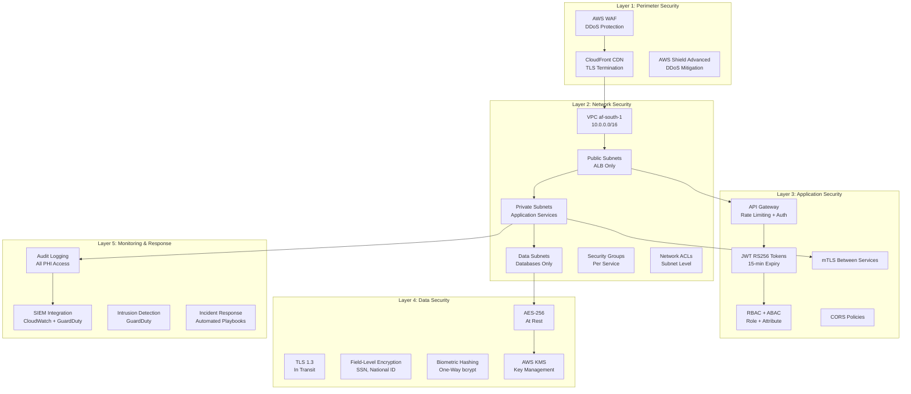
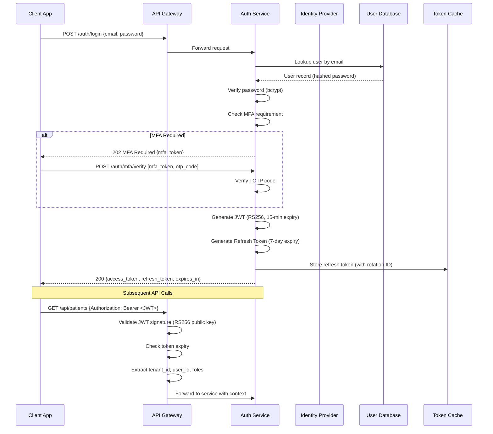
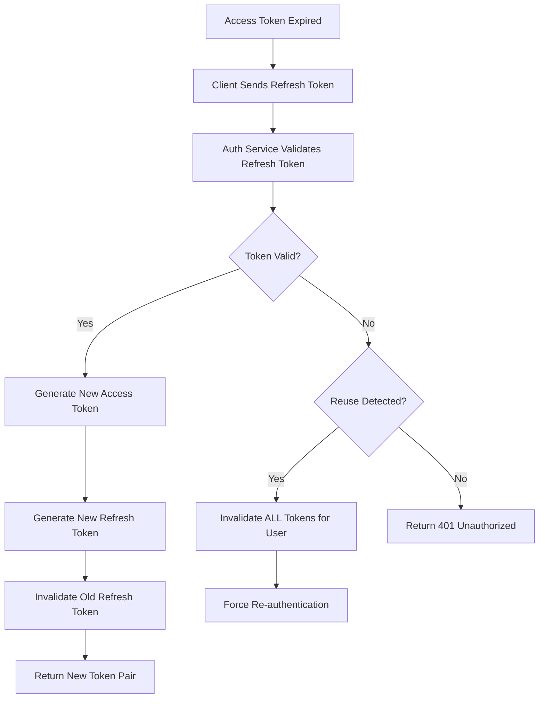
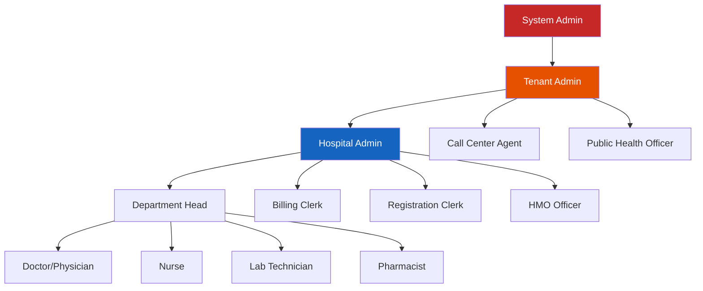
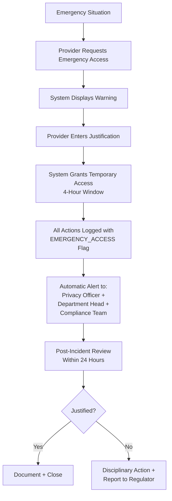
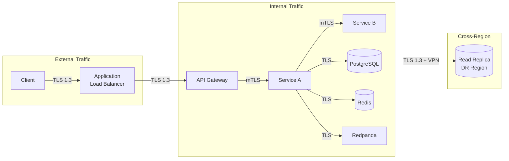
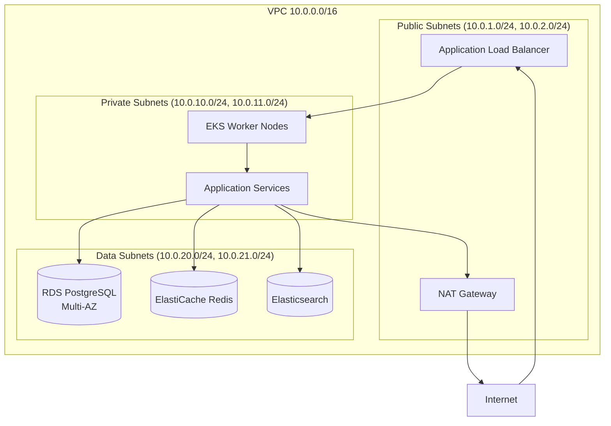
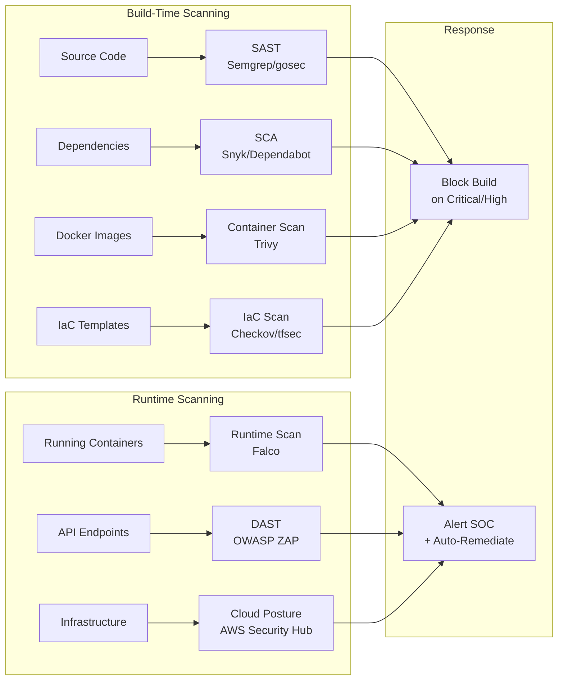
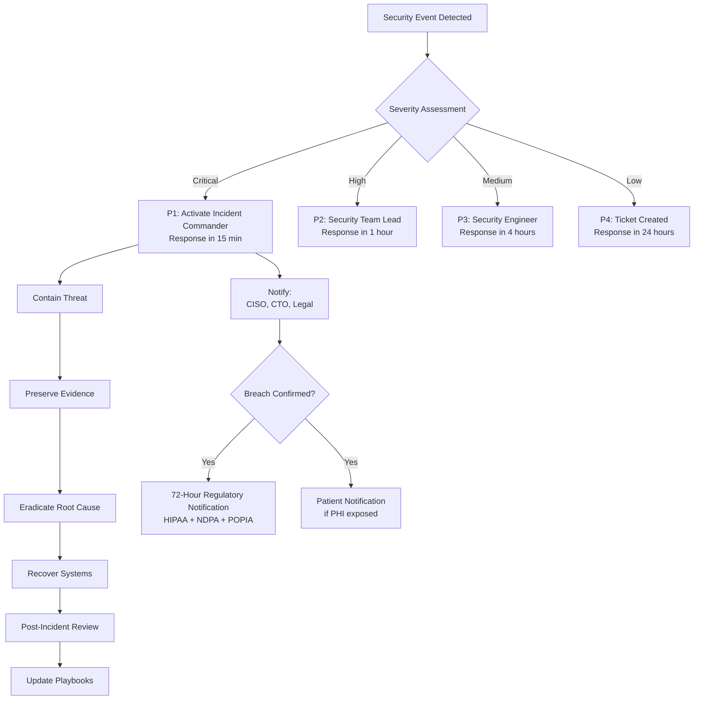

# Security Architecture - AfriHealth ERP-Healthcare

## 1. Overview

AfriHealth implements a defense-in-depth security architecture protecting sensitive healthcare data (PHI/PII) across all layers. The security model addresses HIPAA, GDPR, NDPA, and POPIA requirements through encryption, access control, audit logging, and network segmentation.

---

## 2. Security Architecture Layers



---

## 3. Authentication Architecture

### 3.1 Authentication Flow



### 3.2 JWT Token Structure

```json
{
  "header": {
    "alg": "RS256",
    "typ": "JWT",
    "kid": "afrihealth-prod-2024-key-1"
  },
  "payload": {
    "sub": "user-uuid-here",
    "iss": "afrihealth.com",
    "aud": "afrihealth-api",
    "exp": 1708000000,
    "iat": 1707999100,
    "tenant_id": "tenant-uuid-here",
    "roles": ["doctor", "department_head"],
    "department_id": "dept-uuid",
    "facility_id": "facility-uuid",
    "permissions": [
      "patient:read",
      "patient:write",
      "prescription:create",
      "lab:order"
    ]
  }
}
```

### 3.3 Token Refresh and Rotation



---

## 4. Authorization Model (RBAC + ABAC)

### 4.1 Role Hierarchy



### 4.2 Permission Matrix

| Resource | System Admin | Tenant Admin | Doctor | Nurse | Lab Tech | Pharmacist | Patient |
|----------|-------------|-------------|--------|-------|----------|------------|---------|
| Patient Demographics | CRUD | CRUD | Read | Read | Read | Read | Own |
| Clinical Notes | CRUD | Read | CRUD (own dept) | Read | - | - | Own (read) |
| Lab Orders | CRUD | Read | Create/Read | Read | CRUD | Read | Own (read) |
| Prescriptions | CRUD | Read | Create/Read | Read | - | CRUD | Own (read) |
| Billing | CRUD | CRUD | Read | - | - | - | Own |
| Audit Logs | Read | Read | - | - | - | - | - |
| System Config | CRUD | Read | - | - | - | - | - |
| AI Results | CRUD | Read | Read/Override | Read | Read | - | Own (read) |

### 4.3 Attribute-Based Access Control (ABAC)

```go
// ABAC Policy Evaluation
type AccessPolicy struct {
    Subject    SubjectAttributes    // Who is requesting
    Resource   ResourceAttributes   // What is being accessed
    Action     string               // CRUD operation
    Environment EnvironmentAttributes // When/where
}

type SubjectAttributes struct {
    UserID       string
    TenantID     string
    Roles        []string
    DepartmentID string
    FacilityID   string
    Clearance    string // standard, elevated, emergency
}

type ResourceAttributes struct {
    ResourceType string   // patient, encounter, lab_result
    OwnerID      string   // patient who owns this data
    TenantID     string   // tenant this belongs to
    Department   string   // department context
    Sensitivity  string   // normal, restricted, confidential
}

// Policy rules examples:
// 1. Doctor can only access patients in their department
// 2. Lab tech can only see lab results, not full patient chart
// 3. Emergency override requires justification logging
// 4. Cross-tenant access is never allowed
// 5. Mental health records require explicit consent check
```

---

## 5. Break-the-Glass Emergency Access



---

## 6. Encryption Architecture

### 6.1 Encryption at Rest

| Data Type | Encryption Method | Key Management |
|-----------|------------------|----------------|
| RDS Database | AES-256 (RDS encryption) | AWS KMS (CMK) |
| S3 Objects (images, documents) | AES-256 (SSE-KMS) | AWS KMS (CMK) |
| EBS Volumes | AES-256 (EBS encryption) | AWS KMS (CMK) |
| Redis Cache | TLS + at-rest encryption | ElastiCache encryption |
| National ID / SSN fields | AES-256-GCM (field-level) | Application-managed via KMS |
| Biometric data | bcrypt hash (one-way) | N/A (irreversible) |
| Blockchain ledger | Fabric channel encryption | Fabric MSP certificates |

### 6.2 Encryption in Transit



### 6.3 Key Rotation Policy

| Key Type | Rotation Period | Mechanism |
|----------|----------------|-----------|
| KMS Master Key | Annual (automatic) | AWS KMS auto-rotation |
| JWT Signing Key (RSA) | Quarterly | Key ID in JWT header (kid) |
| Database Encryption Key | Annual | RDS re-encryption |
| TLS Certificates | 90 days | ACM auto-renewal |
| Service mTLS Certificates | 30 days | cert-manager auto-renewal |
| API Keys | 90 days | Force rotation via API |
| Refresh Tokens | 7 days | Token rotation on use |

---

## 7. Network Security

### 7.1 VPC Architecture



### 7.2 Security Group Rules

| Security Group | Inbound | Outbound |
|---------------|---------|----------|
| ALB-SG | 443 from 0.0.0.0/0 | 8080 to EKS-SG |
| EKS-SG | 8080 from ALB-SG | 5432 to RDS-SG, 6379 to Redis-SG |
| RDS-SG | 5432 from EKS-SG | None |
| Redis-SG | 6379 from EKS-SG | None |
| Bastion-SG | 22 from VPN CIDR | All to VPC CIDR |

---

## 8. API Security

### 8.1 Rate Limiting

| Endpoint Category | Rate Limit | Window |
|-------------------|-----------|--------|
| Authentication | 10 requests | per minute per IP |
| Patient API | 100 requests | per minute per user |
| Lab API | 200 requests | per minute per user |
| AI Inference | 20 requests | per minute per user |
| Bulk Operations | 5 requests | per minute per user |
| Webhook Callbacks | 50 requests | per minute per tenant |

### 8.2 Input Validation and Sanitization

```go
// Input validation middleware
func ValidateRequest(c *gin.Context) {
    // 1. Content-Type validation
    if c.ContentType() != "application/json" {
        c.AbortWithStatusJSON(415, gin.H{"error": "Unsupported media type"})
        return
    }

    // 2. Request body size limit (1MB for standard, 50MB for image uploads)
    c.Request.Body = http.MaxBytesReader(c.Writer, c.Request.Body, maxBodySize)

    // 3. SQL injection prevention (parameterized queries via GORM)
    // 4. XSS prevention (HTML escaping in responses)
    // 5. Path traversal prevention (whitelist allowed paths)
    // 6. SSRF prevention (whitelist allowed external URLs)

    c.Next()
}
```

### 8.3 CORS Configuration

```go
corsConfig := cors.Config{
    AllowOrigins:     []string{"https://app.afrihealth.com", "https://admin.afrihealth.com"},
    AllowMethods:     []string{"GET", "POST", "PUT", "PATCH", "DELETE"},
    AllowHeaders:     []string{"Authorization", "Content-Type", "X-Tenant-ID", "X-Request-ID"},
    ExposeHeaders:    []string{"X-Request-ID", "X-RateLimit-Remaining"},
    AllowCredentials: true,
    MaxAge:           12 * time.Hour,
}
```

---

## 9. Audit and Compliance Logging

### 9.1 Audit Log Schema

```sql
CREATE TABLE audit_log (
    id              UUID PRIMARY KEY DEFAULT gen_random_uuid(),
    tenant_id       UUID NOT NULL,
    event_type      VARCHAR(50) NOT NULL,  -- CREATE, READ, UPDATE, DELETE
    table_name      VARCHAR(100) NOT NULL,
    record_id       UUID,
    user_id         UUID NOT NULL,
    user_role       VARCHAR(50),
    old_values      JSONB,
    new_values      JSONB,
    ip_address      INET,
    user_agent      TEXT,
    session_id      VARCHAR(100),
    access_type     VARCHAR(20),  -- NORMAL, EMERGENCY, SYSTEM
    justification   TEXT,         -- Required for emergency access
    created_at      TIMESTAMPTZ DEFAULT NOW()
);

-- Indexed for compliance queries
CREATE INDEX idx_audit_log_tenant_date ON audit_log (tenant_id, created_at);
CREATE INDEX idx_audit_log_user ON audit_log (user_id, created_at);
CREATE INDEX idx_audit_log_record ON audit_log (table_name, record_id);
CREATE INDEX idx_audit_log_type ON audit_log (event_type, created_at);
```

### 9.2 Audited Operations

| Operation | Audit Level | Data Captured |
|-----------|-------------|---------------|
| Patient record access | Full | User, record, timestamp, IP |
| Clinical note creation/edit | Full | Old values, new values, user |
| Lab result viewing | Full | User, result ID, timestamp |
| Prescription creation | Full | Full prescription details |
| Login/logout | Full | User, IP, device, success/failure |
| Permission change | Full | Old roles, new roles, approver |
| Data export/download | Full | Export type, record count, user |
| Emergency access | Enhanced | Justification, duration, all actions |
| Failed access attempts | Full | User, resource, reason for denial |
| System configuration changes | Full | Setting, old value, new value |

---

## 10. Vulnerability Management

### 10.1 Scanning Pipeline



### 10.2 Vulnerability SLA

| Severity | Detection to Patch SLA | Scope |
|----------|----------------------|-------|
| Critical (CVSS 9.0+) | 24 hours | Immediate hotfix |
| High (CVSS 7.0-8.9) | 7 days | Next sprint |
| Medium (CVSS 4.0-6.9) | 30 days | Planned release |
| Low (CVSS 0.1-3.9) | 90 days | Backlog |

---

## 11. Data Loss Prevention (DLP)

### 11.1 PHI Detection Patterns

| Data Type | Pattern | Action |
|-----------|---------|--------|
| National ID (Nigeria) | `[0-9]{11}` (NIN) | Encrypt at field level |
| Phone Number | `+234[0-9]{10}` | Mask in logs |
| Medical Record Number | `MRN-[A-Z0-9]+` | Never log |
| Credit Card | `[0-9]{13,19}` | Block from storage |
| Email Address | Standard email regex | Mask in non-auth contexts |
| Date of Birth | Date fields in patient context | Restrict access |

### 11.2 Log Sanitization

```go
// Sanitize sensitive fields before logging
func SanitizeForLogging(data map[string]interface{}) map[string]interface{} {
    sensitiveFields := []string{
        "password", "ssn", "national_id", "biometric_hash",
        "credit_card", "bank_account", "jwt_token",
    }
    for _, field := range sensitiveFields {
        if _, exists := data[field]; exists {
            data[field] = "[REDACTED]"
        }
    }
    // Mask phone numbers: +234801****567
    if phone, ok := data["phone"].(string); ok && len(phone) > 6 {
        data["phone"] = phone[:6] + "****" + phone[len(phone)-3:]
    }
    return data
}
```

---

## 12. Incident Response Plan

### 12.1 Response Workflow



### 12.2 Contact Escalation

| Level | Role | Response Time | Contact |
|-------|------|--------------|---------|
| P1 | Incident Commander / CISO | 15 minutes | Phone + SMS |
| P2 | Security Team Lead | 1 hour | Phone + Email |
| P3 | On-call Security Engineer | 4 hours | PagerDuty |
| P4 | Security Team Queue | Next business day | Jira ticket |
