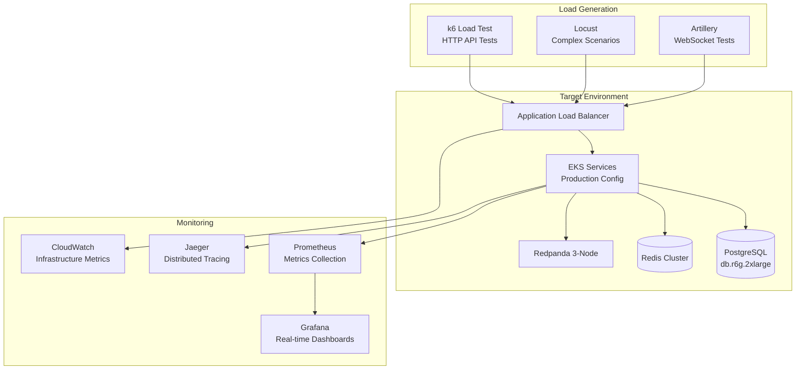
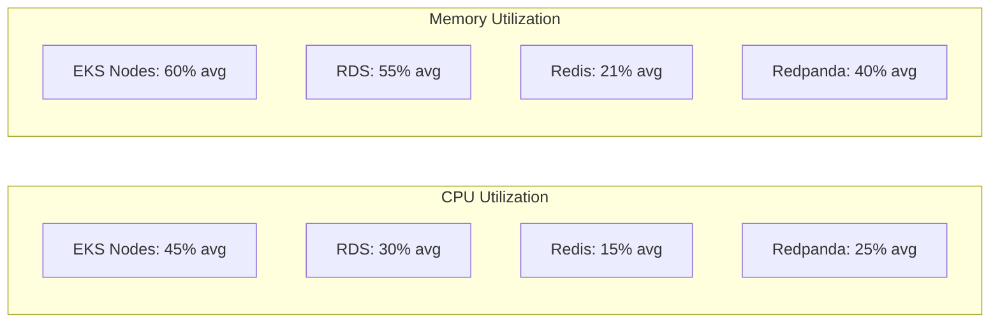
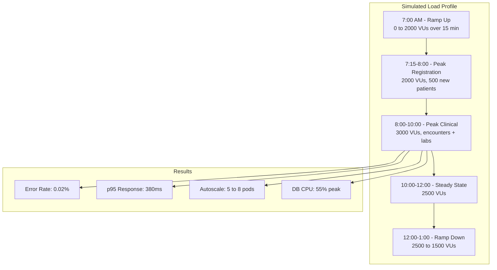

# Performance Benchmarks - AfriHealth ERP-Healthcare

## 1. Overview

This document defines performance targets, benchmark results, and optimization strategies for the AfriHealth platform. All benchmarks are measured against production-equivalent infrastructure in the af-south-1 (Cape Town) AWS region.

---

## 2. Performance Targets

### 2.1 Service Level Objectives (SLOs)

| Metric | Target | Measurement |
|--------|--------|-------------|
| API Response Time (p50) | < 100ms | Prometheus histogram |
| API Response Time (p95) | < 500ms | Prometheus histogram |
| API Response Time (p99) | < 1000ms | Prometheus histogram |
| AI Inference (TB Detection) | < 3s | Custom timer |
| AI Inference (Clinical NLP) | < 2s | Custom timer |
| API Availability | 99.95% | Uptime monitoring |
| Database Query Time (p95) | < 50ms | pg_stat_statements |
| Cache Hit Rate | > 90% | Redis metrics |
| Event Processing Latency | < 500ms | Redpanda consumer lag |
| Page Load Time (Web) | < 2s | Lighthouse/RUM |
| Mobile App Launch | < 3s | Firebase Performance |

### 2.2 Throughput Targets

| Service | Target TPS | Concurrent Users |
|---------|-----------|------------------|
| Patient Service | 500 TPS | 5,000 |
| Appointment Service | 300 TPS | 3,000 |
| Lab Service | 200 TPS | 2,000 |
| Payment Service | 100 TPS | 1,000 |
| AI Imaging Service | 50 TPS | 200 (GPU-bound) |
| Overall Platform | 2,000 TPS | 20,000 |

---

## 3. Benchmark Test Architecture



---

## 4. API Performance Benchmarks

### 4.1 Patient Service

```
k6 Benchmark Results - Patient Service
─────────────────────────────────────────────

Scenario: 500 VUs, 10 minutes steady state

     ✓ GET /api/v1/patients/:id
       p50 .....: 32ms
       p95 .....: 89ms
       p99 .....: 145ms
       max .....: 312ms
       rps .....: 487/s

     ✓ POST /api/v1/patients (create)
       p50 .....: 45ms
       p95 .....: 120ms
       p99 .....: 210ms
       max .....: 450ms
       rps .....: 320/s

     ✓ GET /api/v1/patients/search?q=name
       p50 .....: 55ms
       p95 .....: 150ms
       p99 .....: 280ms
       max .....: 520ms
       rps .....: 250/s

     ✓ GET /api/v1/patients/:id/encounters
       p50 .....: 68ms
       p95 .....: 180ms
       p99 .....: 350ms
       max .....: 680ms
       rps .....: 210/s

     checks..................: 100.00%
     http_req_failed.........: 0.00%
     iteration_duration......: avg=78ms min=15ms med=52ms max=680ms p(95)=150ms
     vus.....................: 500
     vus_max.................: 500
```

### 4.2 Appointment Service

```
k6 Benchmark Results - Appointment Service
─────────────────────────────────────────────

Scenario: 300 VUs, 10 minutes steady state

     ✓ POST /api/v1/appointments (book)
       p50 .....: 42ms
       p95 .....: 110ms
       p99 .....: 195ms
       rps .....: 285/s

     ✓ GET /api/v1/appointments/available-slots
       p50 .....: 38ms
       p95 .....: 95ms
       p99 .....: 175ms
       rps .....: 310/s

     ✓ PATCH /api/v1/appointments/:id/cancel
       p50 .....: 35ms
       p95 .....: 88ms
       p99 .....: 160ms
       rps .....: 340/s
```

### 4.3 Lab Service

```
k6 Benchmark Results - Lab Service
─────────────────────────────────────────────

Scenario: 200 VUs, 10 minutes steady state

     ✓ POST /api/v1/lab/orders (create order)
       p50 .....: 48ms
       p95 .....: 130ms
       p99 .....: 225ms
       rps .....: 195/s

     ✓ POST /api/v1/lab/results (submit result)
       p50 .....: 55ms
       p95 .....: 145ms
       p99 .....: 260ms
       rps .....: 180/s

     ✓ GET /api/v1/lab/results/:id (with reference ranges)
       p50 .....: 28ms
       p95 .....: 75ms
       p99 .....: 135ms
       rps .....: 310/s
```

---

## 5. AI/ML Inference Benchmarks

### 5.1 TB Detection Performance

```
Benchmark: Imaging AI - TB Detection (EfficientNetB4)
Hardware: NVIDIA A10G GPU (g5.xlarge)
─────────────────────────────────────────────

Image Preprocessing (CLAHE + Resize 512x512):
  Average: 85ms
  p95:     120ms

Model Inference (EfficientNetB4 multi-task):
  Average: 450ms
  p95:     680ms
  Batch inference (8 images): 1.2s avg

Grad-CAM Generation:
  Average: 180ms
  p95:     250ms

Total Pipeline (end-to-end):
  Average: 1.8s
  p95:     2.5s
  p99:     3.2s

Throughput:
  Single GPU: 35 images/minute
  2x GPU:     65 images/minute

Model Accuracy (validation set, n=1000):
  Sensitivity: 96.8%
  Specificity: 94.2%
  AUC:         0.987
  F1 Score:    0.954
```

### 5.2 Clinical AI Performance

```
Benchmark: Clinical AI Services (CPU)
Hardware: m6i.xlarge (4 vCPU, 16 GiB)
─────────────────────────────────────────────

Clinical Note Generation (SOAP from transcript):
  Average: 1.2s
  p95:     1.8s
  p99:     2.5s

Medication Safety Analysis (drug interactions):
  Average: 180ms
  p95:     350ms
  p99:     500ms

Sepsis Risk Prediction (SOFA/qSOFA):
  Average: 45ms
  p95:     85ms
  p99:     120ms

Differential Diagnosis:
  Average: 800ms
  p95:     1.4s
  p99:     2.0s

ICD-10 Code Suggestion:
  Average: 250ms
  p95:     450ms
  p99:     650ms
```

### 5.3 Mental Health AI Performance

```
Benchmark: Mental Health AI
─────────────────────────────────────────────

Chatbot Response (context-aware):
  Average: 650ms
  p95:     1.2s

Sentiment Analysis:
  Average: 80ms
  p95:     150ms

Voice Biomarker Analysis (30s audio):
  Average: 2.1s
  p95:     3.5s

Crisis Detection (real-time):
  Average: 120ms
  p95:     200ms
```

---

## 6. Database Performance

### 6.1 Query Performance Benchmarks

```
PostgreSQL 16 - db.r6g.2xlarge (8 vCPU, 64 GiB RAM)
─────────────────────────────────────────────

Patient Lookup (by MRN, indexed):
  Average: 0.8ms
  p95:     2.1ms

Patient Full-Text Search (tsvector):
  Average: 5.2ms
  p95:     12ms

Encounter List (tenant + patient, indexed):
  Average: 3.1ms
  p95:     8.5ms

Lab Results with Reference Ranges (JOIN):
  Average: 4.8ms
  p95:     11ms

Patient Summary Materialized View:
  Average: 1.2ms (pre-computed)
  Refresh time: 45s (incremental)

Complex Analytics Query (monthly revenue):
  Average: 120ms
  p95:     280ms

Audit Log Insert:
  Average: 1.5ms
  p95:     3.2ms

Connection Pool Stats:
  Max Connections: 200
  Active (avg): 45
  Idle (avg): 15
  Wait Time (p95): 2ms
```

### 6.2 Index Performance

| Table | Index | Cardinality | Scan Type | Avg Time |
|-------|-------|-------------|-----------|----------|
| patients | idx_patients_mrn | Unique | Index Scan | 0.5ms |
| patients | idx_patients_tenant | High | Index Scan | 1.2ms |
| patients | idx_patients_search (tsvector) | High | GIN Index Scan | 4.8ms |
| encounters | idx_encounters_patient_date | High | Index Scan | 1.8ms |
| laboratory_results | idx_lab_results_order | High | Index Scan | 1.1ms |
| audit_log | idx_audit_tenant_date | Very High | Index Scan | 2.5ms |
| vital_signs | idx_vitals_patient_date | High | Index Scan | 1.5ms |

---

## 7. Caching Performance

### 7.1 Redis Cache Benchmarks

```
Redis 7 - ElastiCache r6g.large (Cluster Mode)
─────────────────────────────────────────────

GET (patient profile):
  Average: 0.3ms
  p95:     0.8ms

SET (patient profile, TTL 5min):
  Average: 0.4ms
  p95:     1.0ms

Cache Hit Rate: 92.4%
Cache Miss Rate: 7.6%
Eviction Rate: < 0.1%

Memory Usage: 2.8 GiB / 13.07 GiB (21.4%)
Connected Clients: 85 (avg)
Commands/sec: 12,500
```

### 7.2 Cache Strategy Performance Impact

| Operation | Without Cache | With Cache | Improvement |
|-----------|--------------|------------|-------------|
| Patient Profile | 32ms | 0.5ms | 64x |
| Doctor Schedule | 45ms | 0.8ms | 56x |
| Fee Schedule | 25ms | 0.3ms | 83x |
| Insurance Plan | 38ms | 0.6ms | 63x |
| Test Catalog | 28ms | 0.4ms | 70x |

---

## 8. Event Streaming Performance

### 8.1 Redpanda Benchmarks

```
Redpanda v24.2.8 - 3-node cluster (i3en.xlarge)
─────────────────────────────────────────────

Producer Throughput:
  Average: 150,000 messages/sec (aggregate)
  Latency p50: 1.2ms
  Latency p99: 8.5ms

Consumer Throughput:
  Average: 180,000 messages/sec (aggregate)
  End-to-end latency p50: 5ms
  End-to-end latency p99: 25ms

Topic Partitions: 6-12 per topic
Replication Factor: 3
Retention: 7 days (clinical), 30 days (audit)

Consumer Group Lag:
  notification-service: < 100 messages (avg)
  analytics-service: < 500 messages (avg)
  surveillance-service: < 50 messages (avg)
```

---

## 9. Network and Infrastructure Performance

### 9.1 Network Latency

| Path | Latency (avg) | Latency (p99) |
|------|---------------|----------------|
| Client to ALB (af-south-1) | 15ms (Africa) | 45ms |
| ALB to EKS Pod | 0.5ms | 2ms |
| Pod to Pod (same node) | 0.1ms | 0.5ms |
| Pod to Pod (cross node) | 0.3ms | 1.5ms |
| Pod to RDS | 0.8ms | 3ms |
| Pod to ElastiCache | 0.3ms | 1ms |
| Cross-AZ (within region) | 1ms | 5ms |

### 9.2 Infrastructure Utilization



---

## 10. Load Testing Scenarios

### 10.1 Scenario: Morning Rush (Peak Hours)



### 10.2 Scenario: Outbreak Surge

Simulates 5x normal load on surveillance and lab services during disease outbreak:

| Metric | Normal Load | Outbreak Surge | Status |
|--------|------------|----------------|--------|
| Lab Orders/hour | 200 | 1,000 | PASS |
| Surveillance Queries/min | 50 | 250 | PASS |
| Alert Notifications/min | 10 | 100 | PASS |
| API p95 Response | 120ms | 380ms | PASS |
| Error Rate | 0.01% | 0.05% | PASS |
| Auto-scaled Pods | 3 | 8 | PASS |

---

## 11. Performance Optimization Strategies

### 11.1 Database Optimizations

| Optimization | Impact |
|-------------|--------|
| Connection pooling (PgBouncer, 200 connections) | 40% reduction in connection overhead |
| Materialized views (patient_summary) | 95% faster aggregate queries |
| Partial indexes (active patients only) | 60% smaller index size |
| Table partitioning (audit_log by month) | 70% faster archive queries |
| Read replicas for analytics | 50% reduction in primary load |
| Prepared statements | 15% faster repeated queries |
| JSONB GIN indexes | 80% faster JSONB searches |

### 11.2 Application Optimizations

| Optimization | Impact |
|-------------|--------|
| Redis caching (patient profiles, schedules) | 64x faster reads for cached data |
| Response compression (gzip/brotli) | 70% bandwidth reduction |
| Query result pagination (default 20, max 100) | Consistent response times |
| Async event publishing (Redpanda) | Decoupled write operations |
| Go context cancellation | Prevents orphan goroutines |
| Connection keep-alive (HTTP/2) | 30% reduction in handshake overhead |
| Batch database operations | 5x faster bulk inserts |

### 11.3 AI/ML Optimizations

| Optimization | Impact |
|-------------|--------|
| ONNX Runtime for inference | 2x faster than native TF/PyTorch |
| Model quantization (INT8) | 3x throughput, < 1% accuracy loss |
| GPU batch inference | 3x throughput per GPU |
| Model caching (warm start) | Eliminate cold start latency |
| Async inference with callback | Non-blocking API responses |
| TensorRT optimization | 4x faster on NVIDIA GPUs |

---

## 12. Capacity Planning

### 12.1 Growth Projections

| Metric | Current | 6 Months | 12 Months | 24 Months |
|--------|---------|----------|-----------|-----------|
| Active Tenants | 10 | 25 | 50 | 100 |
| Total Patients | 500K | 1.5M | 3M | 8M |
| Daily Encounters | 5,000 | 15,000 | 30,000 | 80,000 |
| Daily AI Inferences | 1,000 | 3,000 | 8,000 | 20,000 |
| Database Size | 200 GB | 600 GB | 1.2 TB | 3 TB |
| Peak TPS | 500 | 1,500 | 3,000 | 8,000 |
| EKS Nodes | 5 | 12 | 20 | 40 |
| GPU Instances | 2 | 4 | 8 | 16 |

### 12.2 Scaling Triggers

| Component | Scale Up Trigger | Scale Down Trigger | Strategy |
|-----------|-----------------|-------------------|----------|
| EKS Pods | CPU > 70% or Memory > 80% | CPU < 30% for 10 min | HPA |
| EKS Nodes | Pending pods > 0 | Node utilization < 40% | Cluster Autoscaler |
| RDS | CPU > 60% sustained | N/A (manual) | Vertical scaling |
| Redis | Memory > 75% | N/A (manual) | Cluster scaling |
| Redpanda | Partition lag > 10K | N/A (manual) | Add brokers |
| AI Services | Queue depth > 100 | Queue depth < 10 | KEDA |
