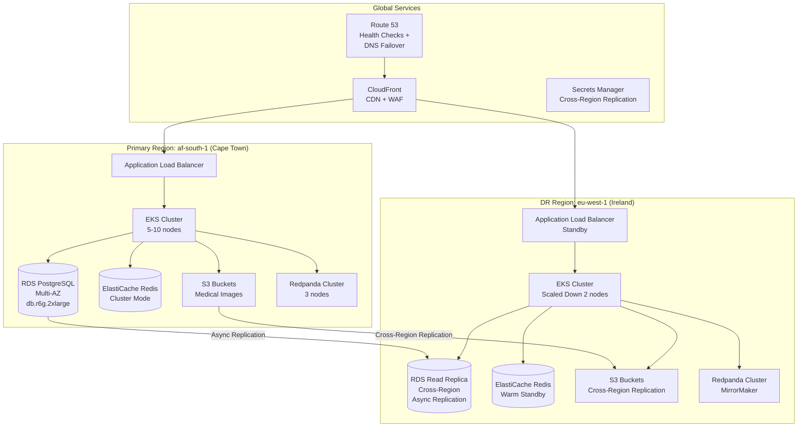
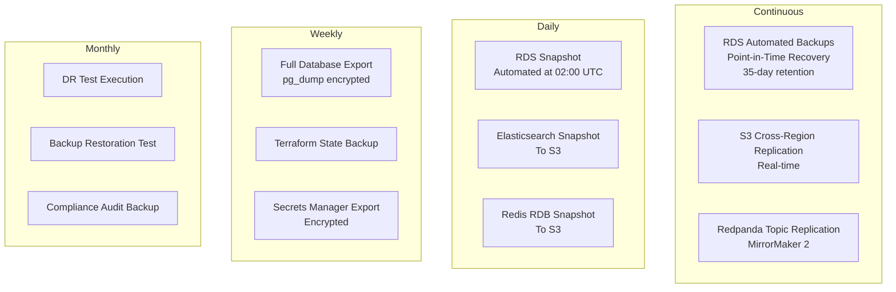
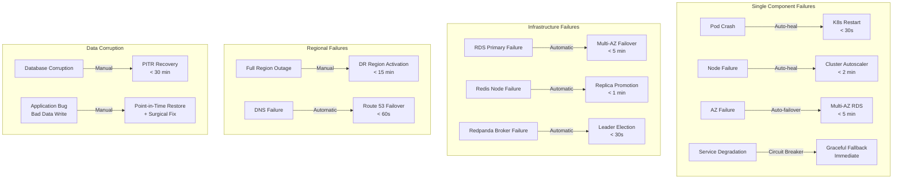
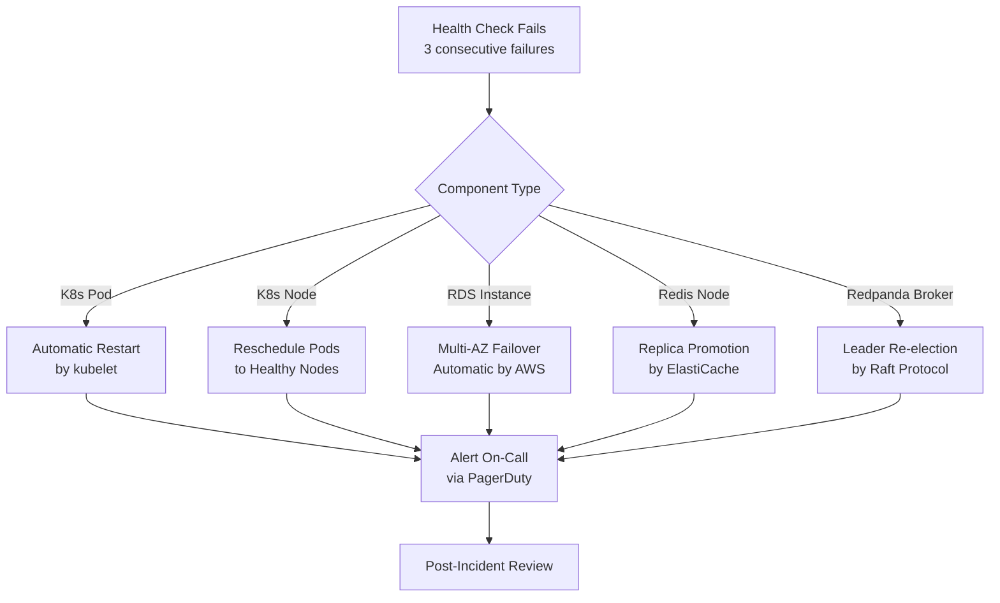
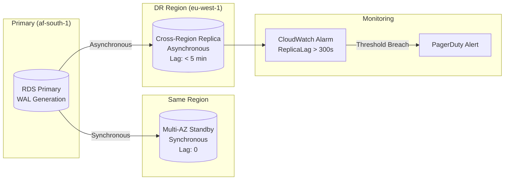

# Disaster Recovery Plan - AfriHealth ERP-Healthcare

## 1. Overview

This document defines the disaster recovery (DR) strategy for AfriHealth, ensuring business continuity for healthcare operations. As a healthcare platform, AfriHealth treats system availability as a patient safety concern, with recovery objectives aligned to clinical workflow criticality.

---

## 2. Recovery Objectives

### 2.1 Recovery Time and Point Objectives

| Tier | System | RTO | RPO | Priority |
|------|--------|-----|-----|----------|
| Tier 1 (Critical) | Patient Service, Lab Service, Pharmacy Service | 15 min | 0 (synchronous replication) | Highest |
| Tier 1 (Critical) | Payment Service, HMO Service | 15 min | 0 | Highest |
| Tier 2 (Essential) | Appointment Service, Hospital Service | 30 min | 5 min | High |
| Tier 2 (Essential) | Clinical AI, Imaging AI | 30 min | N/A (stateless) | High |
| Tier 3 (Important) | Notification Service, Analytics | 1 hour | 15 min | Medium |
| Tier 3 (Important) | Supply Chain, Mental Health AI | 1 hour | 15 min | Medium |
| Tier 4 (Deferrable) | Reporting, Compliance Dashboards | 4 hours | 1 hour | Low |
| Tier 4 (Deferrable) | Blockchain Sync, Data Warehouse | 4 hours | 1 hour | Low |

### 2.2 Availability Targets

| Component | Target Uptime | Max Downtime/Month |
|-----------|--------------|-------------------|
| Core Clinical Services | 99.95% | 21.9 min |
| Database (RDS Multi-AZ) | 99.95% | 21.9 min |
| AI Inference Services | 99.9% | 43.8 min |
| Web Portal | 99.9% | 43.8 min |
| Mobile App (API) | 99.9% | 43.8 min |
| Event Streaming (Redpanda) | 99.9% | 43.8 min |

---

## 3. DR Architecture



---

## 4. Backup Strategy

### 4.1 Backup Schedule



### 4.2 Backup Retention

| Backup Type | Retention | Storage | Encryption |
|------------|-----------|---------|------------|
| RDS Automated (PITR) | 35 days | RDS Managed | AES-256 (KMS) |
| RDS Manual Snapshots | 90 days | RDS Managed | AES-256 (KMS) |
| Daily pg_dump | 30 days | S3 Glacier | AES-256 (KMS) |
| Weekly pg_dump | 12 weeks | S3 Glacier | AES-256 (KMS) |
| Monthly pg_dump | 12 months | S3 Glacier Deep Archive | AES-256 (KMS) |
| S3 Objects (images) | Lifecycle: 90 days IA, 365 days Glacier | S3 | SSE-KMS |
| Elasticsearch Snapshots | 30 days | S3 | SSE-KMS |
| Redis Snapshots | 7 days | S3 | SSE-KMS |
| Audit Logs | 7 years | S3 Glacier | SSE-KMS |
| Blockchain Ledger | Permanent | Hyperledger Peers | Channel Encryption |

### 4.3 Backup Verification

```bash
# Automated daily backup verification
# Runs as a Kubernetes CronJob at 04:00 UTC

# 1. Verify RDS snapshot exists and is complete
aws rds describe-db-snapshots \
  --db-instance-identifier afrihealth-production \
  --query 'DBSnapshots[-1].[Status,SnapshotCreateTime]'

# 2. Restore to temporary instance and validate
aws rds restore-db-instance-from-db-snapshot \
  --db-instance-identifier afrihealth-backup-test \
  --db-snapshot-identifier latest-snapshot

# 3. Run data integrity checks
psql -h backup-test-instance -U validator -d afrihealth \
  -c "SELECT COUNT(*) FROM patients WHERE tenant_id IS NOT NULL;"

# 4. Verify row counts match production (within tolerance)
# 5. Drop test instance
aws rds delete-db-instance \
  --db-instance-identifier afrihealth-backup-test \
  --skip-final-snapshot
```

---

## 5. Failure Scenarios and Response

### 5.1 Scenario Matrix



### 5.2 Scenario 1: Single Service Failure

**Trigger:** Patient Service pod crashes due to OOM
**Detection:** Kubernetes liveness probe fails (15s check interval)
**Response:**
1. Kubernetes automatically restarts pod (< 30 seconds)
2. If restart fails 3 times, pod goes CrashLoopBackOff
3. PagerDuty alert sent to on-call engineer
4. Other healthy pods continue serving traffic (3 replicas minimum)
5. HPA may scale up additional pods if load increases
**Impact:** Zero downtime due to redundant pods

### 5.3 Scenario 2: Database AZ Failure

**Trigger:** Primary RDS instance AZ becomes unavailable
**Detection:** RDS Multi-AZ health monitoring
**Response:**
1. RDS automatically promotes standby in different AZ (< 5 min)
2. DNS endpoint updated automatically (same connection string)
3. Application connections reconnect via PgBouncer retry logic
4. No data loss (synchronous replication within Multi-AZ)
**Impact:** Brief connectivity interruption (< 5 minutes)

### 5.4 Scenario 3: Full Region Outage

**Trigger:** af-south-1 region completely unavailable
**Detection:** Route 53 health checks fail (3 consecutive, 30s interval)
**Response:**
1. Route 53 DNS failover to eu-west-1 (automatic, < 60s)
2. Incident Commander activates DR runbook
3. Promote RDS read replica to standalone primary in eu-west-1
4. Scale up EKS cluster in DR region (2 nodes to 5+ nodes)
5. Verify all services healthy in DR region
6. Update external integrations (payment providers, HMO APIs)
7. Communicate to affected tenants
**Impact:** 15-minute RTO, potential data loss up to RPO (async replication lag)

### 5.5 Scenario 4: Ransomware / Data Corruption

**Trigger:** Malicious or accidental data corruption detected
**Detection:** Data integrity monitoring, anomaly detection
**Response:**
1. Immediately isolate affected systems (network segmentation)
2. Assess scope of corruption using audit logs
3. Identify last known good state from audit trail
4. Restore database from PITR to just before corruption
5. Replay or manually reconcile transactions from corruption point
6. Blockchain records provide immutable consent/audit trail
7. Report to regulators if PHI compromised (72-hour window)
**Impact:** 30-minute to 4-hour recovery depending on scope

---

## 6. DR Failover Procedure

### 6.1 Automated Failover (Service Level)



### 6.2 Manual Regional Failover Runbook

```
REGIONAL FAILOVER PROCEDURE
═══════════════════════════════════════

SEVERITY: P1 - Critical
ESTIMATED TIME: 15 minutes
AUTHORIZED BY: Incident Commander + CTO

Step 1: CONFIRM OUTAGE (2 min)
  □ Verify af-south-1 is genuinely unavailable
  □ Check AWS Health Dashboard
  □ Confirm not a transient issue (wait 2 min)
  □ Incident Commander declares regional failover

Step 2: DNS FAILOVER (1 min - usually automatic)
  □ Verify Route 53 has switched to eu-west-1
  □ If not automatic: manually update Route 53 records
  □ Verify DNS propagation

Step 3: DATABASE PROMOTION (5 min)
  □ Promote RDS read replica to primary in eu-west-1
    aws rds promote-read-replica \
      --db-instance-identifier afrihealth-dr-replica
  □ Update connection strings in Secrets Manager
  □ Verify database is accepting writes
  □ Note: data since last replication lag may be lost

Step 4: SCALE DR CLUSTER (3 min)
  □ Scale EKS node group to production capacity
    kubectl scale nodegroup general \
      --replicas=5 --cluster=afrihealth-dr
  □ Scale application deployments
    kubectl scale deployment --all --replicas=3 \
      -n afrihealth-services
  □ Wait for pods to reach Ready state

Step 5: VERIFY SERVICES (3 min)
  □ Run smoke test suite against DR environment
    ./scripts/smoke-test.sh --env=dr
  □ Verify all health endpoints return 200
  □ Test critical paths: patient lookup, lab results, payments
  □ Verify AI services are operational

Step 6: COMMUNICATION (1 min)
  □ Update status page: https://status.afrihealth.com
  □ Notify tenant administrators via SMS
  □ Notify integration partners (payment providers, HMOs)

Step 7: MONITOR
  □ Continuous monitoring via Grafana DR dashboard
  □ Watch for increased error rates
  □ Monitor database performance in new region
```

---

## 7. Data Integrity Measures

### 7.1 Data Verification

| Check | Frequency | Method |
|-------|-----------|--------|
| Row count comparison (primary vs replica) | Hourly | Automated script |
| Checksum verification on critical tables | Daily | pg_checksums |
| Backup restoration test | Monthly | Full restore to test instance |
| Cross-region data consistency | Hourly | Replication lag monitoring |
| Blockchain ledger integrity | Continuous | Fabric peer validation |
| S3 object integrity | Continuous | S3 checksums |
| Audit log completeness | Daily | Gap detection query |

### 7.2 Replication Monitoring



---

## 8. DR Testing Schedule

### 8.1 Test Calendar

| Test Type | Frequency | Scope | Duration |
|-----------|-----------|-------|----------|
| Tabletop Exercise | Quarterly | All stakeholders review DR plan | 2 hours |
| Component Failover Test | Monthly | Single component (RDS, Redis, etc.) | 1 hour |
| Backup Restoration Test | Monthly | Restore to test environment | 2 hours |
| Partial Regional Failover | Quarterly | Failover non-critical services to DR | 4 hours |
| Full Regional Failover | Annually | Complete failover to DR region | 8 hours |
| Chaos Engineering | Weekly | Random pod/node termination (Litmus) | Continuous |

### 8.2 DR Test Checklist

- [ ] RDS failover completes within 5 minutes
- [ ] Application reconnects to new RDS endpoint
- [ ] Zero data loss during Multi-AZ failover
- [ ] Cross-region replica promotion succeeds
- [ ] All services start in DR region
- [ ] AI models load and serve predictions
- [ ] Payment processing works in DR region
- [ ] Notification service sends alerts
- [ ] Monitoring and alerting functions in DR
- [ ] Failback to primary region succeeds

---

## 9. Business Continuity

### 9.1 Communication Plan

| Audience | Channel | Timing | Message |
|----------|---------|--------|---------|
| On-Call Engineers | PagerDuty | Immediate | Technical details + runbook link |
| Engineering Team | Slack #incident | < 5 min | Situation summary |
| Tenant Admins | SMS + Email | < 15 min | Service status + ETA |
| End Users (Patients) | Status page | < 15 min | Service impact statement |
| Regulatory Bodies | Email | < 72 hours | If data breach involved |
| Media | PR team | As needed | Prepared statement |

### 9.2 Degraded Mode Operations

When operating in DR mode or during partial outages, the following degraded capabilities are available:

| Feature | Normal Mode | Degraded Mode |
|---------|------------|---------------|
| Patient Registration | Full electronic | Paper-based fallback with later sync |
| Lab Ordering | Electronic with AI | Electronic without AI analysis |
| Prescriptions | Electronic with drug safety AI | Electronic without AI, manual review |
| Payments | Card + Mobile Money + Cash | Cash only (if payment provider down) |
| Imaging AI | Real-time TB detection | Queue for later processing |
| Notifications | SMS + Email + Push | Email only (SMS backup) |
| Reporting | Real-time dashboards | Delayed (batch processing) |
| Blockchain | Real-time consent verification | Cached consent + post-sync |

---

## 10. Recovery Validation

### Post-Recovery Checklist

- [ ] All services reporting healthy
- [ ] Database replication re-established
- [ ] No data loss confirmed (or loss quantified)
- [ ] All tenant data accessible
- [ ] Payment reconciliation complete
- [ ] Audit trail continuous (no gaps)
- [ ] AI models serving correct results
- [ ] Monitoring and alerting fully operational
- [ ] Incident report drafted
- [ ] Lessons learned scheduled (within 48 hours)
- [ ] DR plan updated based on findings
