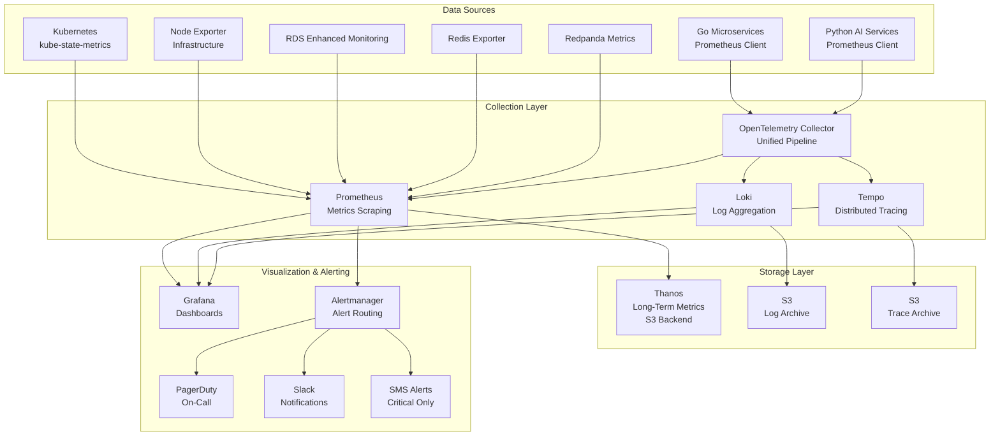
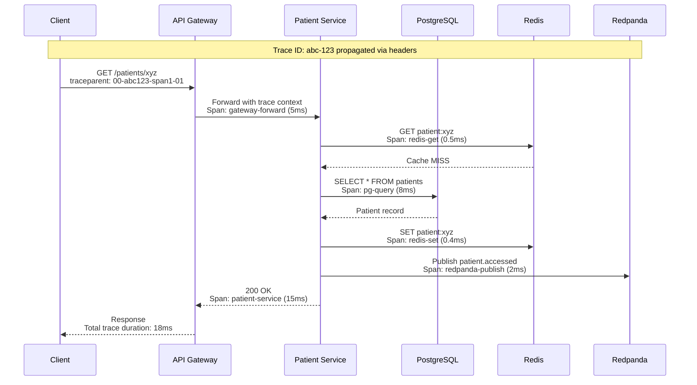
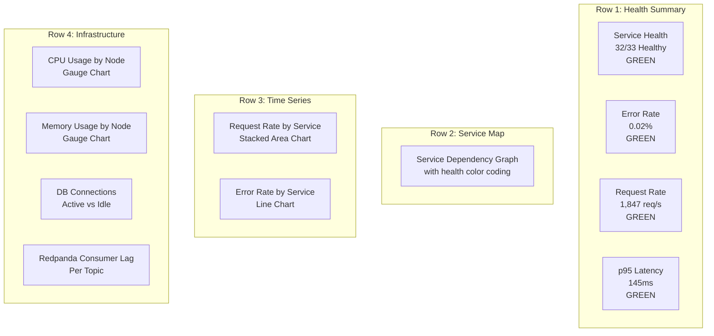

# Monitoring and Observability - AfriHealth ERP-Healthcare

## 1. Overview

AfriHealth implements a comprehensive observability stack covering metrics, logs, traces, and alerts across all 33 Go microservices, 11 Python AI services, and supporting infrastructure. The monitoring architecture follows the three pillars of observability: metrics, logs, and traces.

---

## 2. Observability Architecture



---

## 3. Metrics (Prometheus)

### 3.1 Service Metrics

```go
// Standard metrics exported by every Go microservice
var (
    httpRequestsTotal = prometheus.NewCounterVec(
        prometheus.CounterOpts{
            Name: "http_requests_total",
            Help: "Total HTTP requests",
        },
        []string{"method", "path", "status", "tenant_id"},
    )

    httpRequestDuration = prometheus.NewHistogramVec(
        prometheus.HistogramOpts{
            Name:    "http_request_duration_seconds",
            Help:    "HTTP request duration",
            Buckets: []float64{.005, .01, .025, .05, .1, .25, .5, 1, 2.5, 5, 10},
        },
        []string{"method", "path"},
    )

    dbQueryDuration = prometheus.NewHistogramVec(
        prometheus.HistogramOpts{
            Name:    "db_query_duration_seconds",
            Help:    "Database query duration",
            Buckets: []float64{.001, .005, .01, .025, .05, .1, .25, .5, 1},
        },
        []string{"operation", "table"},
    )

    activeConnections = prometheus.NewGaugeVec(
        prometheus.GaugeOpts{
            Name: "db_connections_active",
            Help: "Active database connections",
        },
        []string{"pool"},
    )

    cacheHitRate = prometheus.NewCounterVec(
        prometheus.CounterOpts{
            Name: "cache_operations_total",
            Help: "Cache operations",
        },
        []string{"operation", "result"}, // operation=get, result=hit|miss
    )

    eventPublished = prometheus.NewCounterVec(
        prometheus.CounterOpts{
            Name: "events_published_total",
            Help: "Events published to Redpanda",
        },
        []string{"topic", "status"},
    )
)
```

### 3.2 AI Service Metrics

```python
# Python AI service metrics
from prometheus_client import Counter, Histogram, Gauge

inference_requests = Counter(
    'ai_inference_requests_total',
    'Total AI inference requests',
    ['model', 'version', 'result']
)

inference_duration = Histogram(
    'ai_inference_duration_seconds',
    'AI inference duration',
    ['model'],
    buckets=[0.1, 0.25, 0.5, 1, 2, 5, 10, 30]
)

model_confidence = Histogram(
    'ai_model_confidence',
    'AI model confidence scores',
    ['model', 'prediction'],
    buckets=[0.1, 0.2, 0.3, 0.4, 0.5, 0.6, 0.7, 0.8, 0.9, 0.95, 0.99]
)

gpu_utilization = Gauge(
    'gpu_utilization_percent',
    'GPU utilization percentage',
    ['gpu_id']
)

model_accuracy = Gauge(
    'ai_model_accuracy',
    'Model accuracy on validation set',
    ['model', 'metric']  # metric=sensitivity|specificity|auc|f1
)
```

### 3.3 Business Metrics

| Metric | Type | Labels | Purpose |
|--------|------|--------|---------|
| `patients_registered_total` | Counter | tenant_id | Track registration volume |
| `encounters_completed_total` | Counter | tenant_id, type | Track clinical throughput |
| `appointments_booked_total` | Counter | tenant_id, channel | Track booking channels |
| `appointments_noshow_total` | Counter | tenant_id | Track no-show rates |
| `lab_orders_placed_total` | Counter | tenant_id, priority | Track lab utilization |
| `lab_results_critical_total` | Counter | tenant_id | Track critical findings |
| `prescriptions_created_total` | Counter | tenant_id | Track prescription volume |
| `drug_interactions_detected_total` | Counter | severity | Track safety alerts |
| `payments_processed_total` | Counter | tenant_id, method | Track revenue collection |
| `payments_amount_total` | Counter | tenant_id, currency | Track revenue amount |
| `claims_submitted_total` | Counter | tenant_id, status | Track claims processing |
| `tb_detections_total` | Counter | severity | Track TB screening results |
| `sepsis_alerts_total` | Counter | risk_level | Track sepsis early warnings |
| `telemedicine_sessions_total` | Counter | tenant_id | Track telehealth usage |
| `bed_occupancy_ratio` | Gauge | ward_type | Track bed utilization |

---

## 4. Logging (Loki)

### 4.1 Structured Logging Format

```go
// All services use structured JSON logging
type LogEntry struct {
    Timestamp   string `json:"timestamp"`
    Level       string `json:"level"`       // debug, info, warn, error
    Service     string `json:"service"`
    TraceID     string `json:"trace_id"`
    SpanID      string `json:"span_id"`
    TenantID    string `json:"tenant_id"`
    UserID      string `json:"user_id,omitempty"`
    RequestID   string `json:"request_id"`
    Method      string `json:"method,omitempty"`
    Path        string `json:"path,omitempty"`
    StatusCode  int    `json:"status_code,omitempty"`
    Duration    float64 `json:"duration_ms,omitempty"`
    Message     string `json:"message"`
    Error       string `json:"error,omitempty"`
    Stack       string `json:"stack,omitempty"`
}

// Example log output:
// {"timestamp":"2024-01-15T10:23:45Z","level":"info","service":"patient-service",
//  "trace_id":"abc123","tenant_id":"tenant-uuid","request_id":"req-456",
//  "method":"GET","path":"/api/v1/patients/xyz","status_code":200,
//  "duration_ms":32.5,"message":"Patient retrieved successfully"}
```

### 4.2 Log Levels and Retention

| Level | Use Case | Volume | Retention |
|-------|----------|--------|-----------|
| ERROR | Unrecoverable failures, exceptions | Low | 90 days |
| WARN | Recoverable issues, degraded performance | Medium | 30 days |
| INFO | Request/response, business events | High | 14 days |
| DEBUG | Detailed execution flow | Very High (dev only) | 3 days |

### 4.3 PHI Log Sanitization

```go
// CRITICAL: Never log PHI (Protected Health Information)
// Sanitization applied before logging
func sanitizeLogFields(fields map[string]interface{}) {
    redactFields := []string{
        "patient_name", "date_of_birth", "national_id",
        "phone_number", "email", "address", "diagnosis",
        "lab_result", "medication", "biometric_hash",
    }
    for _, field := range redactFields {
        if _, ok := fields[field]; ok {
            fields[field] = "[PHI_REDACTED]"
        }
    }
}
```

---

## 5. Distributed Tracing (Tempo)

### 5.1 Trace Propagation



### 5.2 OpenTelemetry Integration

```go
// OpenTelemetry setup in each Go service
func initTracer(serviceName string) (*sdktrace.TracerProvider, error) {
    exporter, err := otlptracegrpc.New(ctx,
        otlptracegrpc.WithEndpoint("otel-collector:4317"),
        otlptracegrpc.WithInsecure(),
    )

    tp := sdktrace.NewTracerProvider(
        sdktrace.WithBatcher(exporter),
        sdktrace.WithResource(resource.NewWithAttributes(
            semconv.SchemaURL,
            semconv.ServiceName(serviceName),
            semconv.DeploymentEnvironment("production"),
            attribute.String("service.region", "af-south-1"),
        )),
        sdktrace.WithSampler(sdktrace.ParentBased(
            sdktrace.TraceIDRatioBased(0.1), // Sample 10% in production
        )),
    )
    return tp, nil
}
```

---

## 6. Dashboards

### 6.1 Dashboard Catalog

| Dashboard | Audience | Refresh Rate | Key Panels |
|-----------|----------|-------------|------------|
| Platform Overview | SRE Team | 30s | Service health, error rates, throughput |
| Service Detail | Developers | 15s | Per-service metrics, latency, errors |
| Database Performance | DBA | 30s | Query times, connections, replication lag |
| AI Model Monitoring | ML Engineers | 1m | Inference times, confidence, accuracy |
| Business Metrics | Product/Admin | 5m | Registrations, encounters, revenue |
| Infrastructure | DevOps | 30s | CPU, memory, disk, network |
| Security | Security Team | 1m | Auth failures, rate limits, anomalies |
| Tenant Health | Support | 1m | Per-tenant service health |

### 6.2 Platform Overview Dashboard



---

## 7. Alerting

### 7.1 Alert Rules

```yaml
# Prometheus alerting rules
groups:
  - name: service-health
    rules:
      - alert: ServiceDown
        expr: up{job=~"afrihealth-.*"} == 0
        for: 1m
        labels:
          severity: critical
        annotations:
          summary: "Service {{ $labels.job }} is down"

      - alert: HighErrorRate
        expr: |
          sum(rate(http_requests_total{status=~"5.."}[5m])) by (job)
          / sum(rate(http_requests_total[5m])) by (job)
          > 0.05
        for: 5m
        labels:
          severity: critical
        annotations:
          summary: "Error rate > 5% for {{ $labels.job }}"

      - alert: HighLatency
        expr: |
          histogram_quantile(0.95, rate(http_request_duration_seconds_bucket[5m]))
          > 1.0
        for: 5m
        labels:
          severity: warning
        annotations:
          summary: "p95 latency > 1s for {{ $labels.job }}"

  - name: database
    rules:
      - alert: DatabaseConnectionPoolExhausted
        expr: db_connections_active / db_connections_max > 0.85
        for: 5m
        labels:
          severity: warning

      - alert: ReplicationLagHigh
        expr: pg_replication_lag_seconds > 300
        for: 5m
        labels:
          severity: critical
        annotations:
          summary: "Database replication lag > 5 minutes"

      - alert: SlowQueries
        expr: |
          histogram_quantile(0.95, rate(db_query_duration_seconds_bucket[5m]))
          > 0.5
        for: 10m
        labels:
          severity: warning

  - name: ai-services
    rules:
      - alert: AIInferenceSlowdown
        expr: |
          histogram_quantile(0.95, rate(ai_inference_duration_seconds_bucket[5m]))
          > 5.0
        for: 5m
        labels:
          severity: warning
        annotations:
          summary: "AI inference p95 > 5s"

      - alert: AIModelAccuracyDrift
        expr: ai_model_accuracy{metric="sensitivity"} < 0.95
        for: 30m
        labels:
          severity: critical
        annotations:
          summary: "TB detection sensitivity dropped below 95%"

      - alert: GPUUtilizationHigh
        expr: gpu_utilization_percent > 90
        for: 15m
        labels:
          severity: warning

  - name: business-critical
    rules:
      - alert: CriticalLabResultUnacknowledged
        expr: |
          time() - lab_result_critical_created_timestamp > 1800
        labels:
          severity: critical
        annotations:
          summary: "Critical lab result unacknowledged for > 30 min"

      - alert: SepsisAlertUnacknowledged
        expr: |
          time() - sepsis_alert_created_timestamp > 900
        labels:
          severity: critical

      - alert: PaymentProcessingDown
        expr: rate(payments_processed_total[5m]) == 0
        for: 10m
        labels:
          severity: critical

  - name: security
    rules:
      - alert: BruteForceDetected
        expr: |
          sum(rate(auth_login_failures_total[5m])) by (ip_address) > 10
        for: 2m
        labels:
          severity: critical
        annotations:
          summary: "Possible brute force from {{ $labels.ip_address }}"

      - alert: EmergencyAccessUsed
        expr: increase(emergency_access_total[1h]) > 0
        labels:
          severity: warning
        annotations:
          summary: "Emergency (break-the-glass) access triggered"
```

### 7.2 Alert Routing

```yaml
# Alertmanager configuration
route:
  receiver: default-slack
  group_by: ['alertname', 'job']
  group_wait: 30s
  group_interval: 5m
  repeat_interval: 4h

  routes:
    - match:
        severity: critical
      receiver: pagerduty-critical
      repeat_interval: 15m

    - match:
        severity: warning
      receiver: slack-warning
      repeat_interval: 1h

    - match_re:
        alertname: (SepsisAlert|CriticalLabResult).*
      receiver: pagerduty-clinical
      repeat_interval: 5m

receivers:
  - name: pagerduty-critical
    pagerduty_configs:
      - service_key: <pagerduty-service-key>
        severity: critical

  - name: pagerduty-clinical
    pagerduty_configs:
      - service_key: <pagerduty-clinical-key>
        severity: critical

  - name: slack-warning
    slack_configs:
      - api_url: <slack-webhook>
        channel: '#afrihealth-alerts'

  - name: default-slack
    slack_configs:
      - api_url: <slack-webhook>
        channel: '#afrihealth-monitoring'
```

---

## 8. SLA Monitoring

### 8.1 SLA Dashboard Queries

```promql
# Overall API Availability (target: 99.95%)
1 - (
  sum(rate(http_requests_total{status=~"5.."}[30d]))
  / sum(rate(http_requests_total[30d]))
)

# Error Budget Remaining
(1 - 0.9995) - (
  sum(increase(http_requests_total{status=~"5.."}[30d]))
  / sum(increase(http_requests_total[30d]))
)

# p95 Latency SLI (target: < 500ms)
histogram_quantile(0.95,
  sum(rate(http_request_duration_seconds_bucket[1h])) by (le)
)

# AI Inference SLI (target: < 3s for TB detection)
histogram_quantile(0.95,
  sum(rate(ai_inference_duration_seconds_bucket{model="tb_detection"}[1h])) by (le)
)
```

---

## 9. On-Call Operations

### 9.1 On-Call Rotation

| Team | Rotation | Escalation Path | Tools |
|------|----------|-----------------|-------|
| Platform SRE | Weekly, 2 engineers | SRE Lead -> Engineering Manager -> CTO | PagerDuty, Grafana, kubectl |
| Clinical AI | Weekly, 1 ML engineer | ML Lead -> AI Director | PagerDuty, Model Dashboard |
| Database | Weekly, 1 DBA | DBA Lead -> Platform Lead | PagerDuty, pgAdmin, CloudWatch |
| Security | Weekly, 1 security engineer | Security Lead -> CISO | PagerDuty, GuardDuty, WAF |

### 9.2 Incident Severity Classification

| Severity | Description | Response Time | Example |
|----------|-------------|---------------|---------|
| P1 - Critical | Complete service outage affecting patient care | 15 min | All services down, data loss |
| P2 - High | Major feature unavailable, workaround exists | 30 min | Payment processing down, lab ordering down |
| P3 - Medium | Degraded performance or minor feature broken | 4 hours | Slow queries, non-critical alert |
| P4 - Low | Cosmetic issue, documentation, minor bug | Next business day | UI glitch, typo in notification |
