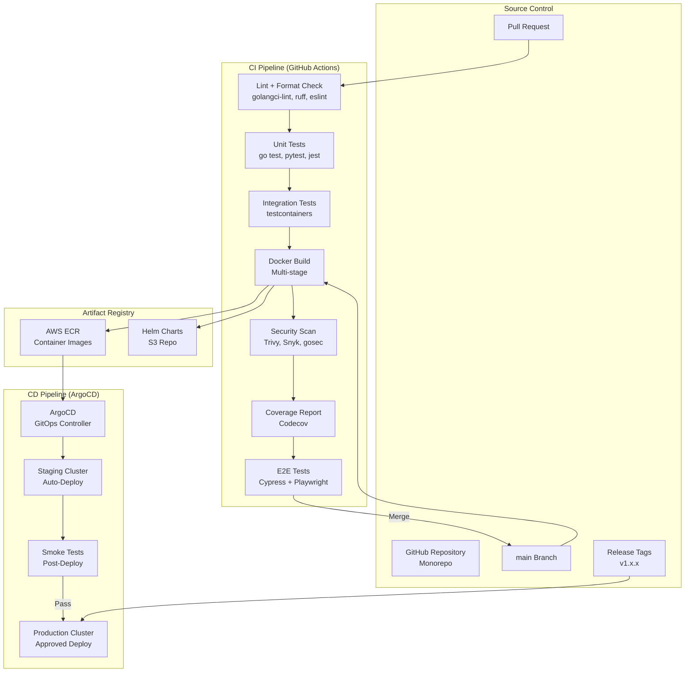
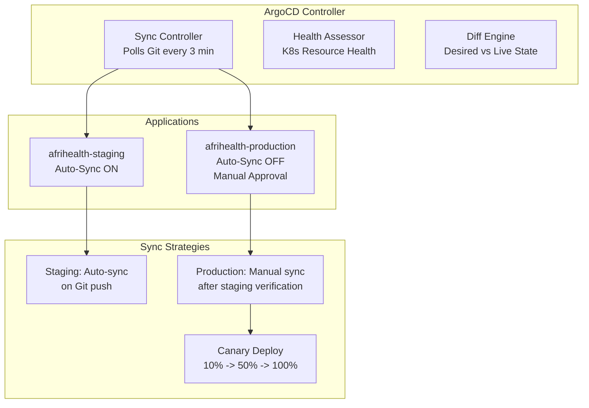
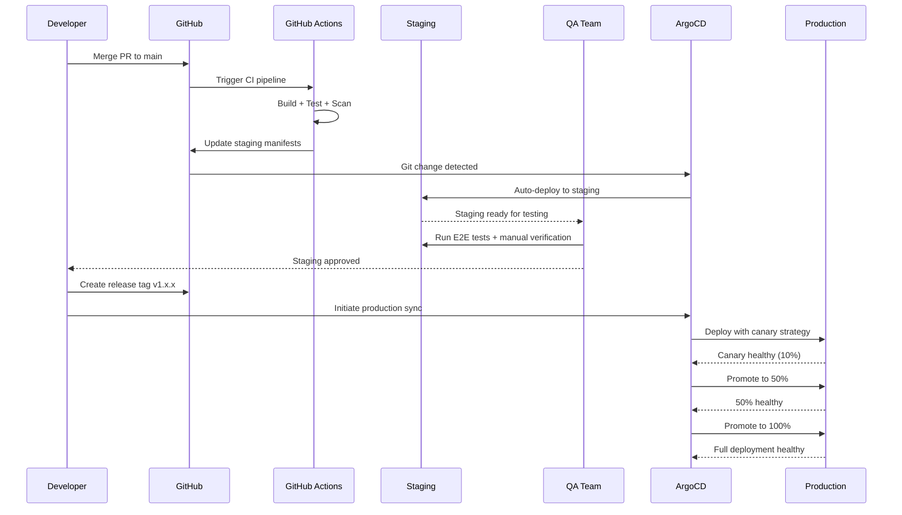
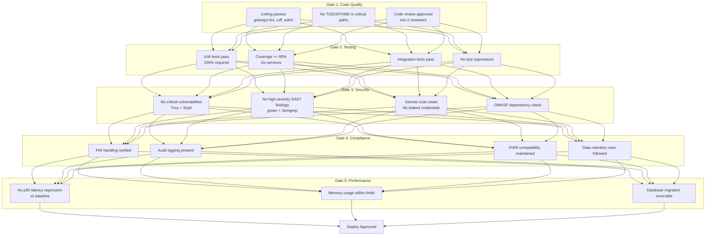
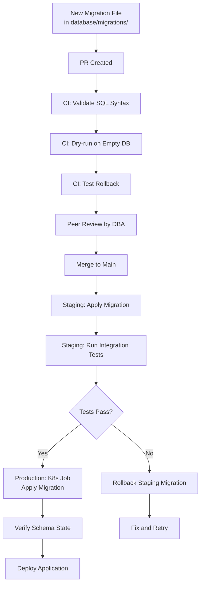
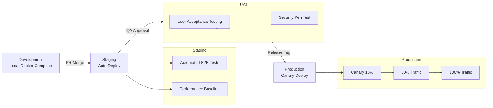

# CI/CD Pipeline - AfriHealth ERP-Healthcare

## 1. Overview

AfriHealth uses a GitOps-based CI/CD pipeline built on GitHub Actions for continuous integration and ArgoCD for continuous delivery. The pipeline enforces quality gates including automated testing, security scanning, and compliance checks before any code reaches production.

---

## 2. Pipeline Architecture



---

## 3. CI Pipeline Details

### 3.1 Pull Request Pipeline

```yaml
# .github/workflows/ci-pr.yml
name: PR Pipeline
on:
  pull_request:
    branches: [main, develop]

jobs:
  detect-changes:
    runs-on: ubuntu-latest
    outputs:
      go-services: ${{ steps.changes.outputs.go-services }}
      python-ai: ${{ steps.changes.outputs.python-ai }}
      frontend: ${{ steps.changes.outputs.frontend }}
      database: ${{ steps.changes.outputs.database }}
    steps:
      - uses: actions/checkout@v4
      - uses: dorny/paths-filter@v3
        id: changes
        with:
          filters: |
            go-services:
              - 'services/**'
            python-ai:
              - 'ai/**'
            frontend:
              - 'frontend/**'
            database:
              - 'database/**'

  lint-go:
    needs: detect-changes
    if: needs.detect-changes.outputs.go-services == 'true'
    runs-on: ubuntu-latest
    steps:
      - uses: actions/checkout@v4
      - uses: actions/setup-go@v5
        with:
          go-version: '1.22'
      - name: Run golangci-lint
        uses: golangci/golangci-lint-action@v4
        with:
          version: v1.57
          args: --timeout=5m

  test-go:
    needs: lint-go
    runs-on: ubuntu-latest
    services:
      postgres:
        image: postgres:16
        env:
          POSTGRES_DB: afrihealth_test
          POSTGRES_USER: test
          POSTGRES_PASSWORD: test
        ports: ['5432:5432']
      redis:
        image: redis:7-alpine
        ports: ['6379:6379']
    steps:
      - uses: actions/checkout@v4
      - uses: actions/setup-go@v5
        with:
          go-version: '1.22'
      - name: Run tests with coverage
        run: |
          go test ./services/... -v -race -coverprofile=coverage.out -covermode=atomic
          go tool cover -func=coverage.out
      - name: Upload coverage
        uses: codecov/codecov-action@v4
        with:
          file: coverage.out
          flags: go-services

  test-python:
    needs: detect-changes
    if: needs.detect-changes.outputs.python-ai == 'true'
    runs-on: ubuntu-latest
    steps:
      - uses: actions/checkout@v4
      - uses: actions/setup-python@v5
        with:
          python-version: '3.11'
      - name: Install dependencies
        run: pip install -r ai/requirements.txt -r ai/requirements-dev.txt
      - name: Lint with ruff
        run: ruff check ai/
      - name: Run tests
        run: pytest ai/ -v --cov=ai --cov-report=xml
      - name: Upload coverage
        uses: codecov/codecov-action@v4

  security-scan:
    needs: [test-go, test-python]
    runs-on: ubuntu-latest
    steps:
      - uses: actions/checkout@v4
      - name: Go security scan
        run: |
          go install github.com/securego/gosec/v2/cmd/gosec@latest
          gosec -fmt json -out gosec-report.json ./services/...
      - name: Dependency vulnerability scan
        uses: snyk/actions/golang@master
        with:
          args: --severity-threshold=high
      - name: Upload SARIF
        uses: github/codeql-action/upload-sarif@v3
        with:
          sarif_file: gosec-report.json

  integration-tests:
    needs: security-scan
    runs-on: ubuntu-latest
    steps:
      - uses: actions/checkout@v4
      - uses: actions/setup-go@v5
        with:
          go-version: '1.22'
      - name: Run integration tests with testcontainers
        run: go test ./tests/integration/... -v -tags=integration -timeout=10m
```

### 3.2 Main Branch Pipeline (Build + Deploy to Staging)

```yaml
# .github/workflows/ci-main.yml
name: Main Pipeline
on:
  push:
    branches: [main]

jobs:
  build-and-push:
    runs-on: ubuntu-latest
    strategy:
      matrix:
        service:
          - patient-service
          - appointment-service
          - lab-service
          - pharmacy-service
          - hmo-service
          - payment-service
          - hospital-service
          - telemedicine-service
          - notification-service
          - supply-chain-service
    steps:
      - uses: actions/checkout@v4
      - uses: aws-actions/configure-aws-credentials@v4
        with:
          aws-access-key-id: ${{ secrets.AWS_ACCESS_KEY_ID }}
          aws-secret-access-key: ${{ secrets.AWS_SECRET_ACCESS_KEY }}
          aws-region: af-south-1
      - uses: aws-actions/amazon-ecr-login@v2
      - name: Build and push
        run: |
          IMAGE_TAG="${{ github.sha }}"
          docker build \
            -f services/${{ matrix.service }}/Dockerfile \
            -t ${{ secrets.ECR_REGISTRY }}/${{ matrix.service }}:${IMAGE_TAG} \
            -t ${{ secrets.ECR_REGISTRY }}/${{ matrix.service }}:latest \
            --build-arg VERSION=${IMAGE_TAG} \
            services/${{ matrix.service }}
          docker push ${{ secrets.ECR_REGISTRY }}/${{ matrix.service }}:${IMAGE_TAG}
          docker push ${{ secrets.ECR_REGISTRY }}/${{ matrix.service }}:latest

  build-ai-services:
    runs-on: ubuntu-latest
    strategy:
      matrix:
        service:
          - imaging-ai
          - clinical-ai
          - mental-health-ai
          - climate-health-ai
          - voice-analysis-ai
    steps:
      - uses: actions/checkout@v4
      - uses: aws-actions/configure-aws-credentials@v4
        with:
          aws-access-key-id: ${{ secrets.AWS_ACCESS_KEY_ID }}
          aws-secret-access-key: ${{ secrets.AWS_SECRET_ACCESS_KEY }}
          aws-region: af-south-1
      - uses: aws-actions/amazon-ecr-login@v2
      - name: Build and push AI service
        run: |
          IMAGE_TAG="${{ github.sha }}"
          docker build \
            -f ai/${{ matrix.service }}/Dockerfile \
            -t ${{ secrets.ECR_REGISTRY }}/${{ matrix.service }}:${IMAGE_TAG} \
            ai/${{ matrix.service }}
          docker push ${{ secrets.ECR_REGISTRY }}/${{ matrix.service }}:${IMAGE_TAG}

  container-scan:
    needs: [build-and-push, build-ai-services]
    runs-on: ubuntu-latest
    steps:
      - name: Run Trivy vulnerability scanner
        uses: aquasecurity/trivy-action@master
        with:
          image-ref: ${{ secrets.ECR_REGISTRY }}/patient-service:${{ github.sha }}
          format: 'sarif'
          output: 'trivy-results.sarif'
          severity: 'CRITICAL,HIGH'
          exit-code: '1'

  update-manifests:
    needs: container-scan
    runs-on: ubuntu-latest
    steps:
      - uses: actions/checkout@v4
      - name: Update image tags in Kustomize
        run: |
          cd k8s/overlays/staging
          kustomize edit set image \
            patient-service=${{ secrets.ECR_REGISTRY }}/patient-service:${{ github.sha }}
          # Repeat for all services...
      - name: Commit and push
        run: |
          git config user.name "CI Bot"
          git config user.email "ci@afrihealth.com"
          git add k8s/
          git commit -m "chore: update staging images to ${{ github.sha }}"
          git push
```

---

## 4. CD Pipeline (ArgoCD)

### 4.1 ArgoCD Configuration



### 4.2 Production Deployment Process



---

## 5. Quality Gates

### 5.1 Gate Requirements



---

## 6. Database Migration Pipeline



---

## 7. Release Management

### 7.1 Versioning Strategy

| Component | Versioning | Example |
|-----------|-----------|---------|
| Backend Services | Semantic Versioning | v1.2.3 |
| AI Models | Model Version + Data Version | tb-v2.1-data20240115 |
| Database Schema | Migration Number | 0008_02 |
| API | URL Versioning | /api/v1/ |
| Frontend | Semantic Versioning | v2.0.1 |
| Mobile App | Store Versioning | 1.5.0 (build 42) |

### 7.2 Release Cadence

| Release Type | Frequency | Scope |
|-------------|-----------|-------|
| Hotfix | As needed | Critical bug/security fix |
| Patch Release | Weekly | Bug fixes, minor improvements |
| Minor Release | Bi-weekly | New features, enhancements |
| Major Release | Quarterly | Breaking changes, major features |
| AI Model Update | Monthly | Retrained models with new data |

### 7.3 Feature Flags

```go
// Feature flag configuration per tenant
type FeatureFlags struct {
    AITBDetection        bool `json:"ai_tb_detection"`
    AIMentalHealth       bool `json:"ai_mental_health"`
    BlockchainConsent    bool `json:"blockchain_consent"`
    DrugSupplyChain      bool `json:"drug_supply_chain"`
    TelemedicineVideo    bool `json:"telemedicine_video"`
    IoTIntegration       bool `json:"iot_integration"`
    AdvancedAnalytics    bool `json:"advanced_analytics"`
    MultiLanguageSupport bool `json:"multi_language_support"`
}

// Feature flags checked at runtime
func (s *Service) HandleTBScreening(ctx context.Context, req *TBRequest) (*TBResult, error) {
    tenant := ctx.Value("tenant").(Tenant)
    if !tenant.Features.AITBDetection {
        return nil, ErrFeatureNotEnabled
    }
    // Process TB screening...
}
```

---

## 8. Rollback Strategy

### 8.1 Automated Rollback Triggers

| Trigger | Threshold | Action |
|---------|-----------|--------|
| Error rate spike | > 5% for 5 min post-deploy | Auto-rollback |
| p95 latency increase | > 2x baseline for 5 min | Auto-rollback |
| Health check failures | > 3 consecutive failures | Pod restart then rollback |
| Memory leak detection | > 90% memory for 10 min | Alert + manual decision |
| Database migration failure | Any error | Immediate rollback |

### 8.2 Rollback Commands

```bash
# ArgoCD rollback to previous sync
argocd app rollback afrihealth-production

# Kubernetes rollback
kubectl rollout undo deployment/patient-service \
  -n afrihealth-services

# Database rollback (run down migration)
kubectl create job db-rollback-$(date +%s) \
  --from=cronjob/db-migration \
  -n afrihealth-services \
  -- migrate -path /migrations -database $DB_URL down 1

# Feature flag rollback (disable feature)
curl -X PATCH https://api.afrihealth.com/admin/features \
  -H "Authorization: Bearer $ADMIN_TOKEN" \
  -d '{"ai_tb_detection": false}'
```

---

## 9. Environment Promotion Flow


