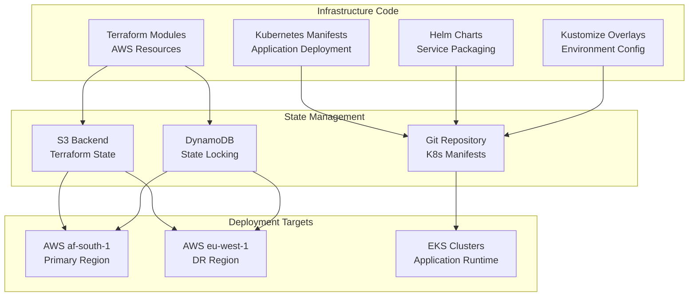

# Infrastructure as Code - AfriHealth ERP-Healthcare

## 1. Overview

AfriHealth's infrastructure is fully codified using Terraform for AWS resource provisioning, Kubernetes manifests for application deployment, and Helm charts for packaging. All infrastructure changes follow GitOps principles with peer review and automated validation.

---

## 2. IaC Architecture



---

## 3. Terraform Module Structure

```
infra/terraform/
├── environments/
│   ├── staging/
│   │   ├── main.tf              # Module composition
│   │   ├── variables.tf         # Environment variables
│   │   ├── terraform.tfvars     # Values
│   │   ├── outputs.tf           # Output values
│   │   └── backend.hcl          # S3 backend config
│   ├── production/
│   │   ├── main.tf
│   │   ├── variables.tf
│   │   ├── terraform.tfvars
│   │   ├── outputs.tf
│   │   └── backend.hcl
│   └── dr/
│       ├── main.tf
│       ├── variables.tf
│       ├── terraform.tfvars
│       └── backend.hcl
├── modules/
│   ├── networking/
│   │   ├── main.tf              # VPC, subnets, NAT, IGW
│   │   ├── security_groups.tf   # Security group rules
│   │   ├── variables.tf
│   │   └── outputs.tf
│   ├── compute/
│   │   ├── kubernetes/
│   │   │   ├── main.tf          # EKS cluster
│   │   │   ├── node_groups.tf   # Managed node groups
│   │   │   ├── addons.tf        # EKS add-ons
│   │   │   ├── iam.tf           # IRSA roles
│   │   │   ├── variables.tf
│   │   │   └── outputs.tf
│   │   └── instances/
│   │       ├── main.tf          # Bastion hosts
│   │       └── variables.tf
│   ├── database/
│   │   ├── postgresql/
│   │   │   ├── main.tf          # RDS PostgreSQL
│   │   │   ├── parameters.tf    # Parameter groups
│   │   │   ├── variables.tf
│   │   │   └── outputs.tf
│   │   ├── redis/
│   │   │   ├── main.tf          # ElastiCache Redis
│   │   │   └── variables.tf
│   │   └── timescaledb/
│   │       ├── main.tf          # TimescaleDB for IoT
│   │       └── variables.tf
│   ├── security/
│   │   ├── kms/
│   │   │   ├── main.tf          # KMS keys
│   │   │   └── variables.tf
│   │   ├── secrets/
│   │   │   ├── main.tf          # Secrets Manager
│   │   │   └── variables.tf
│   │   └── iam/
│   │       ├── main.tf          # IAM roles + policies
│   │       ├── eks_roles.tf     # EKS service account roles
│   │       └── variables.tf
│   ├── monitoring/
│   │   ├── main.tf              # CloudWatch dashboards + alarms
│   │   ├── prometheus.tf        # Prometheus workspace (AMP)
│   │   └── variables.tf
│   ├── storage/
│   │   ├── main.tf              # S3 buckets
│   │   ├── lifecycle.tf         # Lifecycle policies
│   │   └── variables.tf
│   └── backup/
│       ├── main.tf              # AWS Backup plans
│       └── variables.tf
```

---

## 4. Core Terraform Modules

### 4.1 Networking Module

```hcl
# modules/networking/main.tf
resource "aws_vpc" "main" {
  cidr_block           = var.vpc_cidr  # 10.0.0.0/16
  enable_dns_support   = true
  enable_dns_hostnames = true

  tags = merge(var.common_tags, {
    Name = "${var.project}-${var.environment}-vpc"
  })
}

# Public subnets (ALB only)
resource "aws_subnet" "public" {
  count             = length(var.availability_zones)
  vpc_id            = aws_vpc.main.id
  cidr_block        = cidrsubnet(var.vpc_cidr, 8, count.index)
  availability_zone = var.availability_zones[count.index]

  tags = merge(var.common_tags, {
    Name                                           = "${var.project}-public-${count.index}"
    "kubernetes.io/role/elb"                       = "1"
    "kubernetes.io/cluster/${var.cluster_name}"    = "shared"
  })
}

# Private subnets (application services)
resource "aws_subnet" "private" {
  count             = length(var.availability_zones)
  vpc_id            = aws_vpc.main.id
  cidr_block        = cidrsubnet(var.vpc_cidr, 8, count.index + 10)
  availability_zone = var.availability_zones[count.index]

  tags = merge(var.common_tags, {
    Name                                           = "${var.project}-private-${count.index}"
    "kubernetes.io/role/internal-elb"              = "1"
    "kubernetes.io/cluster/${var.cluster_name}"    = "shared"
  })
}

# Data subnets (databases, caches)
resource "aws_subnet" "data" {
  count             = length(var.availability_zones)
  vpc_id            = aws_vpc.main.id
  cidr_block        = cidrsubnet(var.vpc_cidr, 8, count.index + 20)
  availability_zone = var.availability_zones[count.index]

  tags = merge(var.common_tags, {
    Name = "${var.project}-data-${count.index}"
  })
}

# NAT Gateway for private subnet outbound
resource "aws_nat_gateway" "main" {
  count         = length(var.availability_zones)
  allocation_id = aws_eip.nat[count.index].id
  subnet_id     = aws_subnet.public[count.index].id

  tags = merge(var.common_tags, {
    Name = "${var.project}-nat-${count.index}"
  })
}

# VPC Flow Logs for security auditing
resource "aws_flow_log" "main" {
  iam_role_arn    = aws_iam_role.flow_log.arn
  log_destination = aws_cloudwatch_log_group.flow_log.arn
  traffic_type    = "ALL"
  vpc_id          = aws_vpc.main.id
}
```

### 4.2 EKS Module

```hcl
# modules/compute/kubernetes/main.tf
resource "aws_eks_cluster" "main" {
  name     = var.cluster_name
  version  = var.cluster_version  # "1.29"
  role_arn = aws_iam_role.cluster.arn

  vpc_config {
    subnet_ids              = var.private_subnet_ids
    endpoint_private_access = true
    endpoint_public_access  = true  # Restricted by CIDR
    public_access_cidrs     = var.allowed_cidrs
    security_group_ids      = [aws_security_group.cluster.id]
  }

  encryption_config {
    provider {
      key_arn = var.kms_key_arn
    }
    resources = ["secrets"]
  }

  enabled_cluster_log_types = [
    "api", "audit", "authenticator", "controllerManager", "scheduler"
  ]
}

# General workload node group
resource "aws_eks_node_group" "general" {
  cluster_name    = aws_eks_cluster.main.name
  node_group_name = "general"
  node_role_arn   = aws_iam_role.node.arn
  subnet_ids      = var.private_subnet_ids
  instance_types  = ["m6i.xlarge"]

  scaling_config {
    min_size     = var.general_min_nodes     # 3
    max_size     = var.general_max_nodes     # 10
    desired_size = var.general_desired_nodes # 5
  }

  labels = {
    "workload-type" = "general"
  }

  tags = var.common_tags
}

# GPU node group for AI inference
resource "aws_eks_node_group" "gpu" {
  cluster_name    = aws_eks_cluster.main.name
  node_group_name = "gpu-inference"
  node_role_arn   = aws_iam_role.node.arn
  subnet_ids      = var.private_subnet_ids
  instance_types  = ["g5.xlarge"]
  ami_type        = "AL2_x86_64_GPU"

  scaling_config {
    min_size     = 1
    max_size     = 4
    desired_size = 2
  }

  labels = {
    "workload-type" = "ai-inference"
  }

  taint {
    key    = "nvidia.com/gpu"
    value  = "true"
    effect = "NO_SCHEDULE"
  }
}

# EKS Add-ons
resource "aws_eks_addon" "vpc_cni" {
  cluster_name = aws_eks_cluster.main.name
  addon_name   = "vpc-cni"
}

resource "aws_eks_addon" "coredns" {
  cluster_name = aws_eks_cluster.main.name
  addon_name   = "coredns"
}

resource "aws_eks_addon" "ebs_csi" {
  cluster_name             = aws_eks_cluster.main.name
  addon_name               = "aws-ebs-csi-driver"
  service_account_role_arn = aws_iam_role.ebs_csi.arn
}
```

### 4.3 Database Module

```hcl
# modules/database/postgresql/main.tf
resource "aws_db_instance" "main" {
  identifier     = "${var.project}-${var.environment}"
  engine         = "postgres"
  engine_version = var.engine_version  # "16.2"
  instance_class = var.instance_class  # "db.r6g.2xlarge"

  allocated_storage     = var.allocated_storage  # 500
  max_allocated_storage = var.max_storage        # 2000
  storage_type          = "gp3"
  storage_encrypted     = true
  kms_key_id           = var.kms_key_arn

  db_name  = var.db_name
  username = var.db_username
  password = var.db_password
  port     = 5432

  multi_az               = true
  db_subnet_group_name   = aws_db_subnet_group.main.name
  vpc_security_group_ids = [var.db_security_group_id]
  parameter_group_name   = aws_db_parameter_group.main.name

  backup_retention_period = 35
  backup_window          = "02:00-03:00"
  maintenance_window     = "sun:04:00-sun:05:00"

  performance_insights_enabled    = true
  performance_insights_kms_key_id = var.kms_key_arn

  deletion_protection = true
  skip_final_snapshot = false
  final_snapshot_identifier = "${var.project}-${var.environment}-final"

  tags = var.common_tags
}

# Custom parameter group for healthcare workload
resource "aws_db_parameter_group" "main" {
  family = "postgres16"
  name   = "${var.project}-${var.environment}-pg16"

  parameter {
    name  = "shared_preload_libraries"
    value = "pg_stat_statements,pgaudit"
  }

  parameter {
    name  = "pgaudit.log"
    value = "ddl,role,write"
  }

  parameter {
    name  = "log_min_duration_statement"
    value = "1000"  # Log queries > 1 second
  }

  parameter {
    name  = "max_connections"
    value = "200"
  }

  parameter {
    name  = "shared_buffers"
    value = "{DBInstanceClassMemory/4}"
  }

  parameter {
    name  = "effective_cache_size"
    value = "{DBInstanceClassMemory*3/4}"
  }
}

# Cross-region read replica for DR
resource "aws_db_instance" "replica" {
  count = var.create_dr_replica ? 1 : 0

  identifier          = "${var.project}-${var.environment}-dr"
  replicate_source_db = aws_db_instance.main.arn
  instance_class      = var.replica_instance_class
  storage_encrypted   = true
  kms_key_id         = var.dr_kms_key_arn

  provider = aws.dr_region  # eu-west-1

  tags = merge(var.common_tags, {
    Purpose = "disaster-recovery"
  })
}
```

### 4.4 Security Module

```hcl
# modules/security/kms/main.tf
resource "aws_kms_key" "database" {
  description             = "AfriHealth database encryption key"
  deletion_window_in_days = 30
  enable_key_rotation     = true
  policy                  = data.aws_iam_policy_document.kms_policy.json

  tags = merge(var.common_tags, {
    Purpose = "database-encryption"
  })
}

resource "aws_kms_key" "application" {
  description             = "AfriHealth application-level encryption"
  deletion_window_in_days = 30
  enable_key_rotation     = true

  tags = merge(var.common_tags, {
    Purpose = "field-level-encryption"
  })
}

# modules/security/secrets/main.tf
resource "aws_secretsmanager_secret" "database" {
  name       = "${var.project}/${var.environment}/database"
  kms_key_id = var.kms_key_arn

  tags = var.common_tags
}

resource "aws_secretsmanager_secret" "jwt" {
  name       = "${var.project}/${var.environment}/jwt-signing-key"
  kms_key_id = var.kms_key_arn
}

resource "aws_secretsmanager_secret" "paystack" {
  name       = "${var.project}/${var.environment}/paystack-api-key"
  kms_key_id = var.kms_key_arn
}

resource "aws_secretsmanager_secret" "flutterwave" {
  name       = "${var.project}/${var.environment}/flutterwave-api-key"
  kms_key_id = var.kms_key_arn
}
```

---

## 5. Production Environment Composition

```hcl
# environments/production/main.tf
terraform {
  required_version = ">= 1.7"
  required_providers {
    aws = {
      source  = "hashicorp/aws"
      version = "~> 5.40"
    }
  }
  backend "s3" {}
}

provider "aws" {
  region = "af-south-1"
  default_tags {
    tags = {
      Project     = "afrihealth"
      Environment = "production"
      ManagedBy   = "terraform"
      CostCenter  = "healthcare-platform"
    }
  }
}

provider "aws" {
  alias  = "dr_region"
  region = "eu-west-1"
}

module "networking" {
  source             = "../../modules/networking"
  project            = "afrihealth"
  environment        = "production"
  vpc_cidr           = "10.0.0.0/16"
  availability_zones = ["af-south-1a", "af-south-1b", "af-south-1c"]
  cluster_name       = "afrihealth-production"
  common_tags        = local.common_tags
}

module "kms" {
  source      = "../../modules/security/kms"
  project     = "afrihealth"
  environment = "production"
  common_tags = local.common_tags
}

module "eks" {
  source                = "../../modules/compute/kubernetes"
  cluster_name          = "afrihealth-production"
  cluster_version       = "1.29"
  vpc_id                = module.networking.vpc_id
  private_subnet_ids    = module.networking.private_subnet_ids
  kms_key_arn          = module.kms.cluster_key_arn
  general_min_nodes     = 3
  general_max_nodes     = 10
  general_desired_nodes = 5
  allowed_cidrs         = var.allowed_cidrs
  common_tags           = local.common_tags
}

module "postgresql" {
  source              = "../../modules/database/postgresql"
  project             = "afrihealth"
  environment         = "production"
  engine_version      = "16.2"
  instance_class      = "db.r6g.2xlarge"
  allocated_storage   = 500
  max_storage         = 2000
  db_name             = "afrihealth"
  db_username         = var.db_username
  db_password         = var.db_password
  kms_key_arn        = module.kms.database_key_arn
  db_security_group_id = module.networking.rds_security_group_id
  create_dr_replica   = true
  common_tags         = local.common_tags

  providers = {
    aws           = aws
    aws.dr_region = aws.dr_region
  }
}

module "redis" {
  source           = "../../modules/database/redis"
  project          = "afrihealth"
  environment      = "production"
  node_type        = "cache.r6g.large"
  num_cache_nodes  = 3
  subnet_ids       = module.networking.data_subnet_ids
  security_group_id = module.networking.redis_security_group_id
  common_tags      = local.common_tags
}

module "storage" {
  source      = "../../modules/storage"
  project     = "afrihealth"
  environment = "production"
  kms_key_arn = module.kms.storage_key_arn
  common_tags = local.common_tags
}

module "monitoring" {
  source      = "../../modules/monitoring"
  project     = "afrihealth"
  environment = "production"
  cluster_name = module.eks.cluster_name
  common_tags = local.common_tags
}

module "backup" {
  source             = "../../modules/backup"
  project            = "afrihealth"
  environment        = "production"
  rds_arn           = module.postgresql.db_arn
  backup_vault_name = "afrihealth-production-vault"
  common_tags       = local.common_tags
}
```

---

## 6. Kubernetes Manifest Organization

```
k8s/
├── base/                           # Base manifests
│   ├── namespaces.yaml
│   ├── services/
│   │   ├── patient-service/
│   │   │   ├── deployment.yaml
│   │   │   ├── service.yaml
│   │   │   ├── hpa.yaml
│   │   │   └── pdb.yaml
│   │   ├── appointment-service/
│   │   ├── lab-service/
│   │   └── ...
│   ├── ai-services/
│   │   ├── imaging-ai/
│   │   ├── clinical-ai/
│   │   └── ...
│   ├── infrastructure/
│   │   ├── redpanda/
│   │   ├── prometheus/
│   │   └── argocd/
│   └── kustomization.yaml
├── overlays/
│   ├── development/
│   │   ├── kustomization.yaml     # Lower resources
│   │   └── patches/
│   ├── staging/
│   │   ├── kustomization.yaml
│   │   ├── configmaps/
│   │   └── patches/
│   └── production/
│       ├── kustomization.yaml     # Full resources
│       ├── configmaps/
│       ├── secrets/               # Sealed secrets
│       └── patches/
│           ├── replicas.yaml
│           ├── resources.yaml
│           └── node-affinity.yaml
```

---

## 7. Infrastructure Validation

### 7.1 Pre-Apply Checks

```bash
# Terraform validation pipeline
cd infra/terraform/environments/production

# Format check
terraform fmt -check -recursive

# Validate configuration
terraform validate

# Security scan with tfsec
tfsec . --minimum-severity HIGH

# Policy check with Checkov
checkov -d . --framework terraform

# Cost estimation with Infracost
infracost breakdown --path .

# Plan with detailed output
terraform plan -out=plan.tfplan -detailed-exitcode
```

### 7.2 Post-Apply Verification

```bash
# Verify infrastructure state
terraform output

# Verify EKS cluster
aws eks describe-cluster --name afrihealth-production \
  --query 'cluster.status'

# Verify RDS
aws rds describe-db-instances \
  --db-instance-identifier afrihealth-production \
  --query 'DBInstances[0].DBInstanceStatus'

# Verify networking
aws ec2 describe-vpcs --filters "Name=tag:Name,Values=afrihealth-*" \
  --query 'Vpcs[].{VpcId:VpcId,State:State,CIDR:CidrBlock}'
```

---

## 8. Cost Management

### 8.1 Resource Tagging Strategy

| Tag Key | Purpose | Example |
|---------|---------|---------|
| Project | Cost allocation | afrihealth |
| Environment | Environment identification | production |
| Service | Service-level cost tracking | patient-service |
| ManagedBy | Automation source | terraform |
| CostCenter | Business cost center | healthcare-platform |
| Owner | Responsible team | platform-engineering |
| DataClassification | Security classification | phi-protected |

### 8.2 Cost Optimization

| Strategy | Implementation | Estimated Savings |
|----------|---------------|-------------------|
| Reserved Instances (RDS) | 1-year all-upfront | 40% on database |
| Savings Plans (EKS) | 1-year compute plan | 30% on compute |
| Spot Instances | Non-critical batch jobs | 60% on batch compute |
| S3 Lifecycle Policies | IA after 90 days, Glacier after 365 | 50% on storage |
| Right-sizing | Monthly review of utilization | 15% overall |
| Auto-scaling | Scale down during off-hours | 25% on non-prod |
