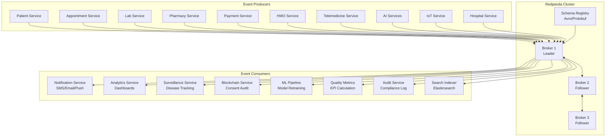
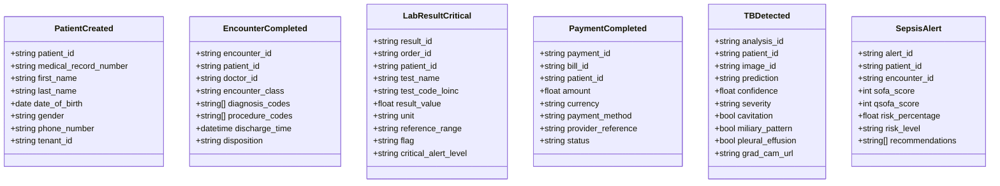
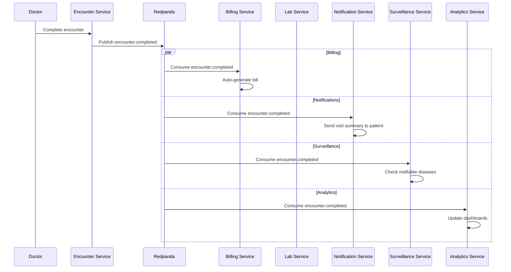
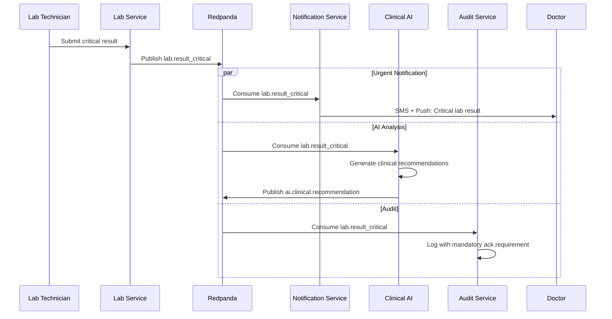
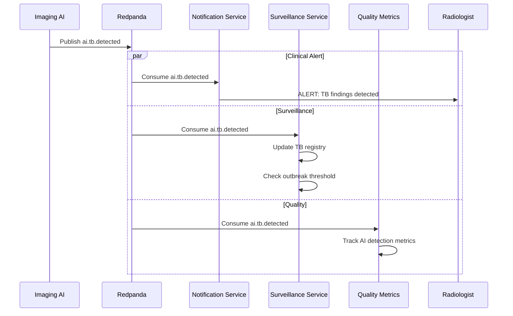
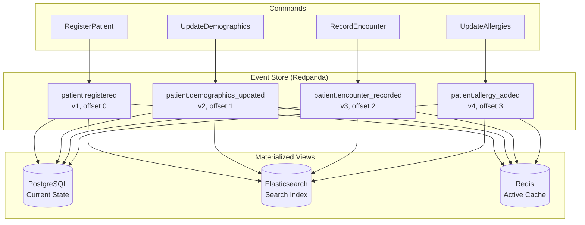

# Event Streaming Architecture - AfriHealth ERP-Healthcare

## 1. Overview

AfriHealth uses Redpanda (Kafka-compatible) as its event streaming backbone, enabling asynchronous, decoupled communication between 33 microservices. The event-driven architecture supports real-time clinical alerts, analytics pipelines, audit logging, and cross-service data synchronization.

---

## 2. Streaming Architecture



---

## 3. Topic Architecture

### 3.1 Topic Naming Convention

```
{domain}.{entity}.{event_type}

Examples:
  clinical.patient.created
  clinical.patient.updated
  clinical.encounter.completed
  clinical.lab.order_created
  clinical.lab.result_critical
  clinical.pharmacy.prescription_created
  clinical.pharmacy.drug_dispensed
  clinical.telemedicine.consultation_started
  clinical.telemedicine.consultation_completed
  financial.payment.completed
  financial.payment.failed
  financial.claims.submitted
  financial.claims.adjudicated
  iot.device.reading
  iot.vital.abnormal
  ai.tb.detected
  ai.sepsis.alert
  ai.crisis.detected
  ai.drug_interaction.warning
  system.audit.event
  system.notification.sent
```

### 3.2 Topic Configuration

| Topic Pattern | Partitions | Replication | Retention | Compaction |
|--------------|-----------|-------------|-----------|------------|
| clinical.patient.* | 12 | 3 | 30 days | Log + Compact |
| clinical.encounter.* | 12 | 3 | 30 days | Log |
| clinical.lab.* | 6 | 3 | 30 days | Log |
| clinical.pharmacy.* | 6 | 3 | 30 days | Log |
| clinical.telemedicine.* | 6 | 3 | 14 days | Log |
| financial.payment.* | 6 | 3 | 90 days | Log |
| financial.claims.* | 6 | 3 | 90 days | Log |
| iot.device.* | 24 | 3 | 7 days | Log |
| iot.vital.* | 12 | 3 | 7 days | Log |
| ai.*.* | 6 | 3 | 30 days | Log |
| system.audit.* | 12 | 3 | 365 days | Log |
| system.notification.* | 6 | 3 | 7 days | Log |

---

## 4. Event Schema

### 4.1 Cloud Events Standard Envelope

```json
{
  "specversion": "1.0",
  "id": "evt-uuid-12345",
  "source": "afrihealth/patient-service",
  "type": "clinical.patient.created",
  "datacontenttype": "application/json",
  "time": "2024-01-15T10:23:45.123Z",
  "subject": "patient/patient-uuid-67890",
  "afrihealth": {
    "tenant_id": "tenant-uuid",
    "user_id": "user-uuid",
    "trace_id": "trace-abc-123",
    "version": "1.0",
    "environment": "production"
  },
  "data": {
    "patient_id": "patient-uuid-67890",
    "medical_record_number": "MRN-10001",
    "first_name": "Amara",
    "last_name": "Okafor",
    "date_of_birth": "1990-05-15"
  }
}
```

### 4.2 Key Event Schemas



---

## 5. Producer Implementation

### 5.1 Go Event Publisher

```go
// Shared event publisher used by all Go microservices
type EventPublisher struct {
    producer *kafka.Producer
    registry *SchemaRegistry
}

type CloudEvent struct {
    SpecVersion     string                 `json:"specversion"`
    ID              string                 `json:"id"`
    Source           string                 `json:"source"`
    Type            string                 `json:"type"`
    DataContentType string                 `json:"datacontenttype"`
    Time            time.Time              `json:"time"`
    Subject         string                 `json:"subject"`
    AfriHealth      AfriHealthMetadata     `json:"afrihealth"`
    Data            interface{}            `json:"data"`
}

type AfriHealthMetadata struct {
    TenantID    string `json:"tenant_id"`
    UserID      string `json:"user_id"`
    TraceID     string `json:"trace_id"`
    Version     string `json:"version"`
    Environment string `json:"environment"`
}

func (p *EventPublisher) Publish(ctx context.Context, topic string, event CloudEvent) error {
    // Set standard fields
    event.SpecVersion = "1.0"
    event.ID = uuid.New().String()
    event.Time = time.Now().UTC()
    event.DataContentType = "application/json"

    // Extract metadata from context
    event.AfriHealth.TenantID = ctx.Value("tenant_id").(string)
    event.AfriHealth.UserID = ctx.Value("user_id").(string)
    event.AfriHealth.TraceID = ctx.Value("trace_id").(string)

    data, err := json.Marshal(event)
    if err != nil {
        return fmt.Errorf("failed to marshal event: %w", err)
    }

    msg := &kafka.Message{
        TopicPartition: kafka.TopicPartition{
            Topic:     &topic,
            Partition: kafka.PartitionAny,
        },
        Key:   []byte(event.AfriHealth.TenantID),  // Partition by tenant
        Value: data,
        Headers: []kafka.Header{
            {Key: "ce-type", Value: []byte(event.Type)},
            {Key: "ce-source", Value: []byte(event.Source)},
            {Key: "tenant-id", Value: []byte(event.AfriHealth.TenantID)},
        },
    }

    deliveryChan := make(chan kafka.Event, 1)
    err = p.producer.Produce(msg, deliveryChan)
    if err != nil {
        return fmt.Errorf("failed to produce message: %w", err)
    }

    // Wait for delivery confirmation
    e := <-deliveryChan
    m := e.(*kafka.Message)
    if m.TopicPartition.Error != nil {
        return fmt.Errorf("delivery failed: %w", m.TopicPartition.Error)
    }

    eventPublishedTotal.WithLabelValues(topic, "success").Inc()
    return nil
}

// Usage in Patient Service
func (s *PatientService) CreatePatient(ctx context.Context, req CreatePatientRequest) (*Patient, error) {
    patient, err := s.repo.Create(ctx, req)
    if err != nil {
        return nil, err
    }

    // Publish event asynchronously
    go func() {
        event := CloudEvent{
            Source:  "afrihealth/patient-service",
            Type:    "clinical.patient.created",
            Subject: fmt.Sprintf("patient/%s", patient.ID),
            Data:    patient,
        }
        if err := s.publisher.Publish(ctx, "clinical.patient.created", event); err != nil {
            log.Error("failed to publish patient.created event", "error", err)
        }
    }()

    return patient, nil
}
```

---

## 6. Consumer Implementation

### 6.1 Consumer Group Pattern

```go
// Notification Service consumer
type NotificationConsumer struct {
    consumer      *kafka.Consumer
    notifier      NotificationSender
    topics        []string
    consumerGroup string
}

func NewNotificationConsumer(brokers string) *NotificationConsumer {
    consumer, _ := kafka.NewConsumer(&kafka.ConfigMap{
        "bootstrap.servers":  brokers,
        "group.id":           "notification-service",
        "auto.offset.reset":  "earliest",
        "enable.auto.commit": false,
        "max.poll.interval.ms": 300000,
        "session.timeout.ms":   30000,
    })

    return &NotificationConsumer{
        consumer: consumer,
        topics: []string{
            "clinical.patient.created",
            "clinical.lab.result_critical",
            "clinical.pharmacy.drug_dispensed",
            "iot.vital.abnormal",
            "ai.tb.detected",
            "ai.sepsis.alert",
            "ai.crisis.detected",
        },
        consumerGroup: "notification-service",
    }
}

func (c *NotificationConsumer) Start(ctx context.Context) error {
    c.consumer.SubscribeTopics(c.topics, nil)

    for {
        select {
        case <-ctx.Done():
            return ctx.Err()
        default:
            msg, err := c.consumer.ReadMessage(time.Second * 5)
            if err != nil {
                continue
            }

            if err := c.handleMessage(ctx, msg); err != nil {
                log.Error("failed to handle message",
                    "topic", *msg.TopicPartition.Topic,
                    "error", err)
                // Dead letter queue for failed messages
                c.sendToDeadLetter(msg, err)
            } else {
                c.consumer.CommitMessage(msg)
            }
        }
    }
}

func (c *NotificationConsumer) handleMessage(ctx context.Context, msg *kafka.Message) error {
    var event CloudEvent
    if err := json.Unmarshal(msg.Value, &event); err != nil {
        return err
    }

    switch event.Type {
    case "clinical.lab.result_critical":
        return c.handleCriticalLabResult(ctx, event)
    case "ai.sepsis.alert":
        return c.handleSepsisAlert(ctx, event)
    case "ai.crisis.detected":
        return c.handleCrisisDetected(ctx, event)
    case "ai.tb.detected":
        return c.handleTBDetected(ctx, event)
    default:
        return c.handleGenericNotification(ctx, event)
    }
}
```

---

## 7. Event Flow Diagrams

### 7.1 Clinical Encounter Event Flow



### 7.2 Critical Lab Result Event Flow



### 7.3 AI Alert Event Flow



---

## 8. Dead Letter Queue (DLQ)

### 8.1 DLQ Architecture

```mermaid
flowchart TB
    A[Consumer Reads Message] --> B{Process Successfully?}
    B -->|Yes| C[Commit Offset]
    B -->|No| D{Retry Count < 3?}
    D -->|Yes| E[Retry with Backoff<br/>1s, 5s, 30s]
    E --> B
    D -->|No| F[Send to DLQ Topic<br/>dlq.{original-topic}]
    F --> G[Alert Operations Team]
    G --> H[Manual Review + Replay]
```

### 8.2 DLQ Configuration

```go
type DLQConfig struct {
    MaxRetries     int           // 3
    RetryBackoffs  []time.Duration // {1s, 5s, 30s}
    DLQTopicPrefix string        // "dlq."
    AlertOnDLQ     bool          // true
}

func (c *Consumer) sendToDeadLetter(msg *kafka.Message, processErr error) {
    dlqTopic := "dlq." + *msg.TopicPartition.Topic

    dlqMessage := DLQMessage{
        OriginalTopic:     *msg.TopicPartition.Topic,
        OriginalPartition: msg.TopicPartition.Partition,
        OriginalOffset:    int64(msg.TopicPartition.Offset),
        OriginalKey:       string(msg.Key),
        OriginalValue:     string(msg.Value),
        OriginalHeaders:   msg.Headers,
        Error:             processErr.Error(),
        RetryCount:        getRetryCount(msg),
        FailedAt:          time.Now().UTC(),
        ConsumerGroup:     c.consumerGroup,
    }

    data, _ := json.Marshal(dlqMessage)
    c.producer.Produce(&kafka.Message{
        TopicPartition: kafka.TopicPartition{Topic: &dlqTopic},
        Value:          data,
    }, nil)

    dlqMessagesTotal.WithLabelValues(*msg.TopicPartition.Topic).Inc()
}
```

---

## 9. Event Sourcing Patterns

### 9.1 Patient Event Store



---

## 10. Monitoring and Operations

### 10.1 Key Metrics

| Metric | Warning | Critical |
|--------|---------|----------|
| Consumer Group Lag | > 1,000 messages | > 10,000 messages |
| Producer Error Rate | > 1% | > 5% |
| Broker Disk Usage | > 70% | > 85% |
| Under-Replicated Partitions | > 0 | > 0 for 5 min |
| Consumer Rebalance Rate | > 5/hour | > 20/hour |
| DLQ Message Rate | > 10/hour | > 100/hour |
| End-to-End Latency (p99) | > 100ms | > 500ms |

### 10.2 Operational Commands

```bash
# Check topic list
rpk topic list

# Describe consumer group lag
rpk group describe notification-service

# Check cluster health
rpk cluster health

# Create new topic
rpk topic create clinical.new_event \
  --partitions 6 \
  --replicas 3 \
  --config retention.ms=2592000000  # 30 days

# View recent messages on a topic
rpk topic consume clinical.patient.created \
  --num 5 \
  --offset end-5

# Reset consumer group offset
rpk group seek notification-service \
  --to end \
  --topics clinical.patient.created
```
