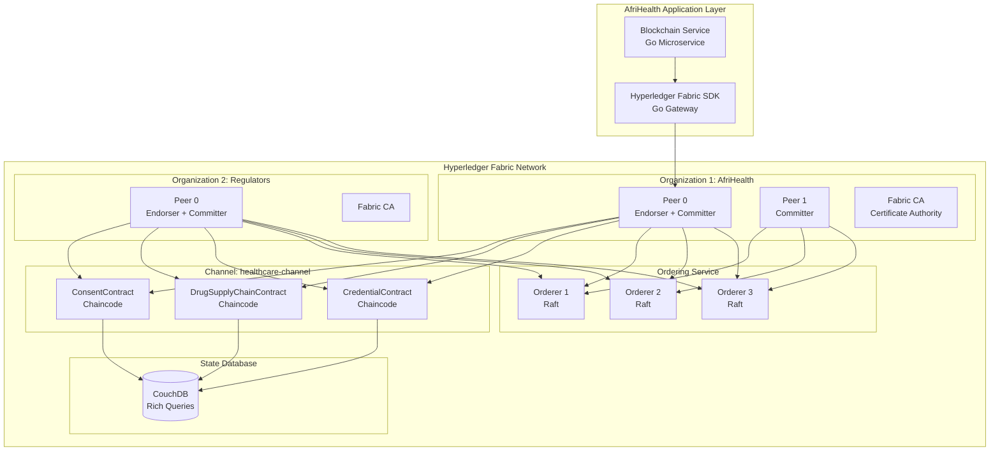
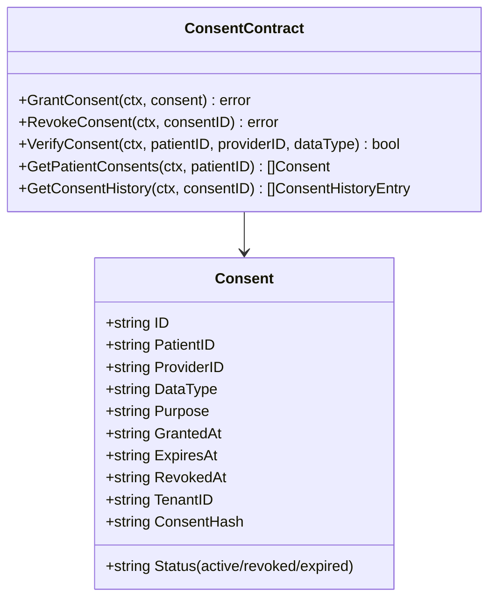
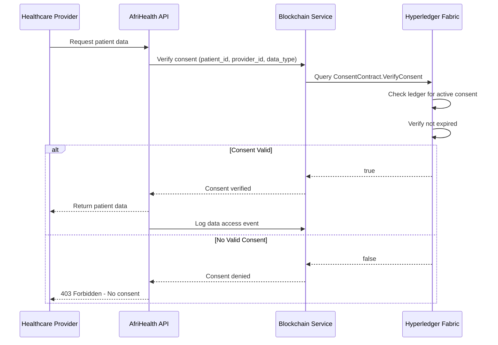
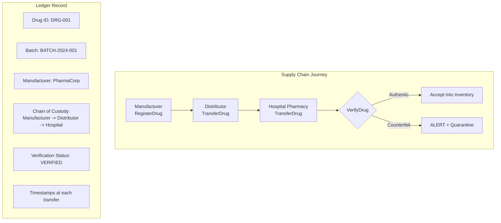
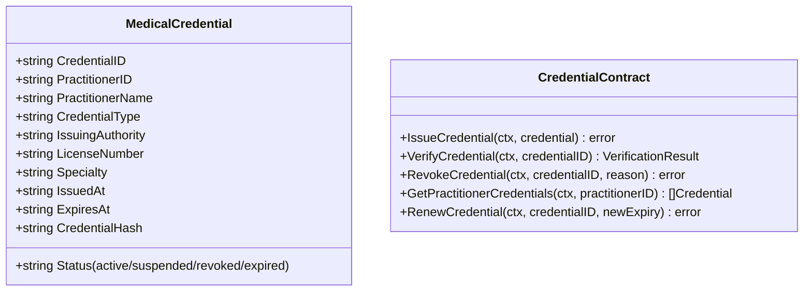
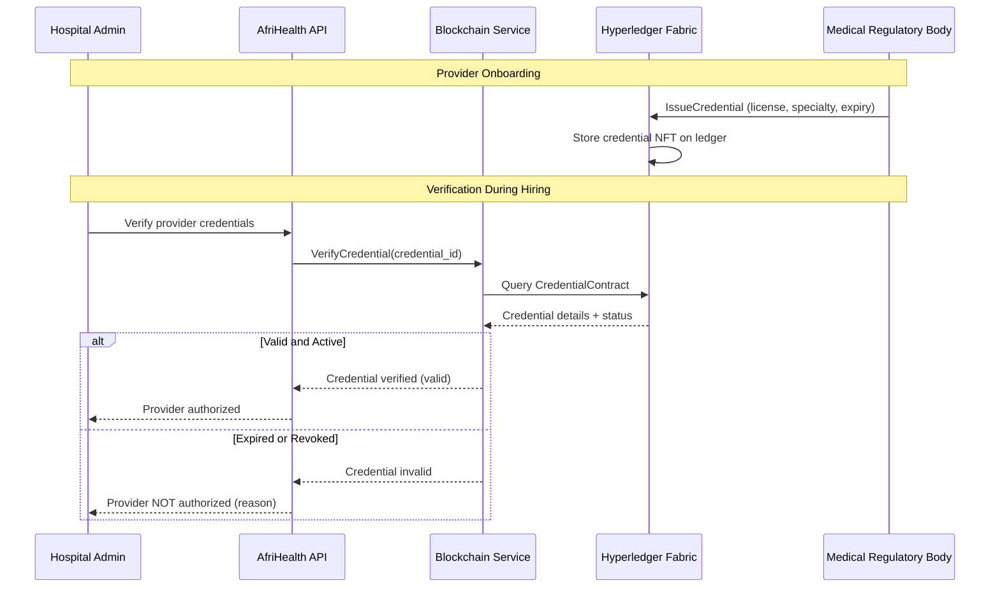
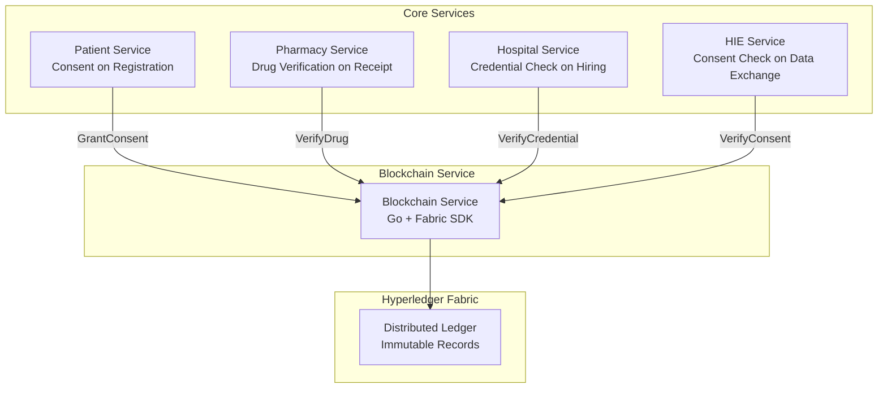
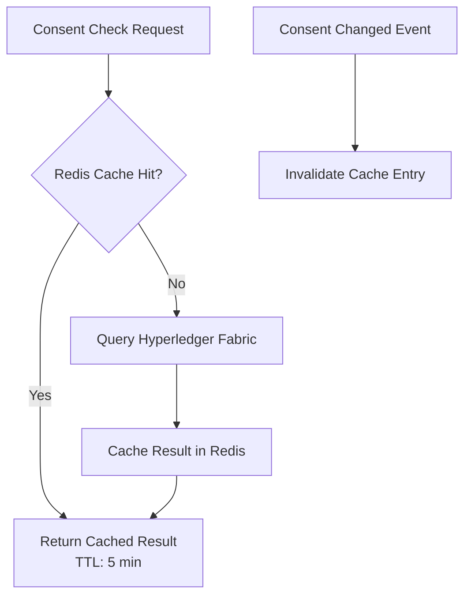

# Blockchain Integration - AfriHealth ERP-Healthcare

## 1. Overview

AfriHealth integrates Hyperledger Fabric blockchain for three critical healthcare use cases: patient consent management, pharmaceutical supply chain verification, and medical credential authentication. The blockchain layer provides immutable audit trails, non-repudiation, and decentralized trust for sensitive healthcare operations.

---

## 2. Blockchain Architecture



---

## 3. Smart Contract: Consent Management

### 3.1 Consent Data Model



### 3.2 Consent Chaincode Implementation

```go
// blockchain/chaincode/consent/consent.go
type ConsentContract struct {
    contractapi.Contract
}

type Consent struct {
    ID          string `json:"id"`
    PatientID   string `json:"patient_id"`
    ProviderID  string `json:"provider_id"`
    DataType    string `json:"data_type"`
    Purpose     string `json:"purpose"`
    Status      string `json:"status"`
    GrantedAt   string `json:"granted_at"`
    ExpiresAt   string `json:"expires_at"`
    RevokedAt   string `json:"revoked_at"`
    TenantID    string `json:"tenant_id"`
    ConsentHash string `json:"consent_hash"`
}

func (c *ConsentContract) GrantConsent(
    ctx contractapi.TransactionContextInterface,
    id, patientID, providerID, dataType, purpose, expiresAt, tenantID string,
) error {
    // Check if consent already exists
    existing, err := ctx.GetStub().GetState(id)
    if err != nil {
        return fmt.Errorf("failed to read state: %v", err)
    }
    if existing != nil {
        return fmt.Errorf("consent %s already exists", id)
    }

    consent := Consent{
        ID:         id,
        PatientID:  patientID,
        ProviderID: providerID,
        DataType:   dataType,
        Purpose:    purpose,
        Status:     "active",
        GrantedAt:  time.Now().UTC().Format(time.RFC3339),
        ExpiresAt:  expiresAt,
        TenantID:   tenantID,
    }

    // Generate consent hash for integrity
    consent.ConsentHash = generateHash(consent)

    data, err := json.Marshal(consent)
    if err != nil {
        return fmt.Errorf("failed to marshal consent: %v", err)
    }

    // Store on ledger
    if err := ctx.GetStub().PutState(id, data); err != nil {
        return fmt.Errorf("failed to put state: %v", err)
    }

    // Emit event for off-chain processing
    ctx.GetStub().SetEvent("ConsentGranted", data)

    return nil
}

func (c *ConsentContract) VerifyConsent(
    ctx contractapi.TransactionContextInterface,
    patientID, providerID, dataType string,
) (bool, error) {
    // Rich query using CouchDB
    queryString := fmt.Sprintf(
        `{"selector":{"patient_id":"%s","provider_id":"%s","data_type":"%s","status":"active"}}`,
        patientID, providerID, dataType,
    )

    iterator, err := ctx.GetStub().GetQueryResult(queryString)
    if err != nil {
        return false, err
    }
    defer iterator.Close()

    for iterator.HasNext() {
        result, _ := iterator.Next()
        var consent Consent
        json.Unmarshal(result.Value, &consent)

        // Check expiry
        expiresAt, _ := time.Parse(time.RFC3339, consent.ExpiresAt)
        if time.Now().Before(expiresAt) {
            return true, nil
        }
    }

    return false, nil
}

func (c *ConsentContract) RevokeConsent(
    ctx contractapi.TransactionContextInterface,
    consentID string,
) error {
    data, err := ctx.GetStub().GetState(consentID)
    if err != nil || data == nil {
        return fmt.Errorf("consent %s not found", consentID)
    }

    var consent Consent
    json.Unmarshal(data, &consent)

    consent.Status = "revoked"
    consent.RevokedAt = time.Now().UTC().Format(time.RFC3339)

    updated, _ := json.Marshal(consent)
    ctx.GetStub().PutState(consentID, updated)
    ctx.GetStub().SetEvent("ConsentRevoked", updated)

    return nil
}
```

### 3.3 Consent Verification Flow



---

## 4. Smart Contract: Drug Supply Chain

### 4.1 Drug Supply Chain Model



### 4.2 Drug Supply Chain Chaincode

```go
type DrugRecord struct {
    DrugID         string       `json:"drug_id"`
    DrugName       string       `json:"drug_name"`
    BatchNumber    string       `json:"batch_number"`
    Manufacturer   string       `json:"manufacturer"`
    ManufactureDate string      `json:"manufacture_date"`
    ExpiryDate     string       `json:"expiry_date"`
    CurrentHolder  string       `json:"current_holder"`
    Status         string       `json:"status"` // manufactured, in_transit, delivered, verified, dispensed
    SupplyChain    []ChainEntry `json:"supply_chain"`
}

type ChainEntry struct {
    From      string `json:"from"`
    To        string `json:"to"`
    Timestamp string `json:"timestamp"`
    Location  string `json:"location"`
    Verified  bool   `json:"verified"`
}

func (c *ConsentContract) RegisterDrug(
    ctx contractapi.TransactionContextInterface,
    drugID, drugName, batchNumber, manufacturer, manufactureDate, expiryDate string,
) error {
    drug := DrugRecord{
        DrugID:          drugID,
        DrugName:        drugName,
        BatchNumber:     batchNumber,
        Manufacturer:    manufacturer,
        ManufactureDate: manufactureDate,
        ExpiryDate:      expiryDate,
        CurrentHolder:   manufacturer,
        Status:          "manufactured",
        SupplyChain: []ChainEntry{
            {
                From:      "origin",
                To:        manufacturer,
                Timestamp: time.Now().UTC().Format(time.RFC3339),
                Location:  "Manufacturing Facility",
                Verified:  true,
            },
        },
    }

    data, _ := json.Marshal(drug)
    return ctx.GetStub().PutState(drugID, data)
}

func (c *ConsentContract) TransferDrug(
    ctx contractapi.TransactionContextInterface,
    drugID, fromHolder, toHolder, location string,
) error {
    data, err := ctx.GetStub().GetState(drugID)
    if err != nil || data == nil {
        return fmt.Errorf("drug %s not found", drugID)
    }

    var drug DrugRecord
    json.Unmarshal(data, &drug)

    if drug.CurrentHolder != fromHolder {
        return fmt.Errorf("drug not held by %s", fromHolder)
    }

    drug.CurrentHolder = toHolder
    drug.Status = "in_transit"
    drug.SupplyChain = append(drug.SupplyChain, ChainEntry{
        From:      fromHolder,
        To:        toHolder,
        Timestamp: time.Now().UTC().Format(time.RFC3339),
        Location:  location,
        Verified:  true,
    })

    updated, _ := json.Marshal(drug)
    ctx.GetStub().PutState(drugID, updated)
    ctx.GetStub().SetEvent("DrugTransferred", updated)
    return nil
}

func (c *ConsentContract) VerifyDrug(
    ctx contractapi.TransactionContextInterface,
    drugID string,
) (*DrugVerificationResult, error) {
    data, err := ctx.GetStub().GetState(drugID)
    if err != nil || data == nil {
        return &DrugVerificationResult{
            IsAuthentic:   false,
            Reason:        "Drug not found in blockchain registry",
        }, nil
    }

    var drug DrugRecord
    json.Unmarshal(data, &drug)

    // Verify chain integrity
    result := &DrugVerificationResult{
        IsAuthentic:    true,
        DrugName:       drug.DrugName,
        BatchNumber:    drug.BatchNumber,
        Manufacturer:   drug.Manufacturer,
        ExpiryDate:     drug.ExpiryDate,
        ChainLength:    len(drug.SupplyChain),
        CurrentHolder:  drug.CurrentHolder,
    }

    // Check expiry
    expiry, _ := time.Parse(time.RFC3339, drug.ExpiryDate)
    if time.Now().After(expiry) {
        result.IsAuthentic = false
        result.Reason = "Drug batch has expired"
    }

    return result, nil
}
```

---

## 5. Smart Contract: Medical Credentials

### 5.1 Credential Model



### 5.2 Credential Verification Flow



---

## 6. Blockchain Service API

### 6.1 REST Endpoints

| Method | Endpoint | Description |
|--------|----------|-------------|
| POST | /api/v1/blockchain/consent | Grant patient consent |
| DELETE | /api/v1/blockchain/consent/:id | Revoke consent |
| GET | /api/v1/blockchain/consent/verify | Verify consent for data access |
| GET | /api/v1/blockchain/consent/patient/:id | Get all consents for patient |
| GET | /api/v1/blockchain/consent/:id/history | Get consent change history |
| POST | /api/v1/blockchain/drugs/register | Register new drug batch |
| POST | /api/v1/blockchain/drugs/transfer | Transfer drug in supply chain |
| GET | /api/v1/blockchain/drugs/:id/verify | Verify drug authenticity |
| GET | /api/v1/blockchain/drugs/:id/chain | Get full supply chain trace |
| POST | /api/v1/blockchain/credentials/issue | Issue medical credential |
| GET | /api/v1/blockchain/credentials/:id/verify | Verify credential |
| POST | /api/v1/blockchain/credentials/:id/revoke | Revoke credential |

### 6.2 Integration with Core Services



---

## 7. Network Configuration

### 7.1 Fabric Network Topology

```yaml
# network-config.yaml
organizations:
  - name: AfriHealth
    mspID: AfriHealthMSP
    peers:
      - peer0.afrihealth.com
      - peer1.afrihealth.com
    certificateAuthorities:
      - ca.afrihealth.com

  - name: Regulators
    mspID: RegulatorsMSP
    peers:
      - peer0.regulators.afrihealth.com
    certificateAuthorities:
      - ca.regulators.afrihealth.com

channels:
  - name: healthcare-channel
    organizations: [AfriHealth, Regulators]
    chaincodes:
      - name: consent
        version: "1.0"
        endorsement_policy: "OR('AfriHealthMSP.peer')"
      - name: drug-supply-chain
        version: "1.0"
        endorsement_policy: "AND('AfriHealthMSP.peer', 'RegulatorsMSP.peer')"
      - name: credentials
        version: "1.0"
        endorsement_policy: "OR('RegulatorsMSP.peer')"

orderers:
  - orderer0.afrihealth.com
  - orderer1.afrihealth.com
  - orderer2.afrihealth.com
  consensus: etcdraft
```

### 7.2 Endorsement Policies

| Chaincode | Policy | Rationale |
|-----------|--------|-----------|
| Consent | OR(AfriHealth) | Any AfriHealth peer can endorse consent operations |
| Drug Supply Chain | AND(AfriHealth, Regulators) | Both organizations must endorse for drug verification |
| Credentials | OR(Regulators) | Only regulatory bodies can issue/revoke credentials |

---

## 8. Performance and Scaling

### 8.1 Blockchain Performance

| Operation | Avg Latency | Throughput |
|-----------|-------------|------------|
| GrantConsent | 150ms | 200 TPS |
| VerifyConsent (query) | 25ms | 1,000 TPS |
| RevokeConsent | 120ms | 200 TPS |
| RegisterDrug | 180ms | 150 TPS |
| VerifyDrug (query) | 30ms | 1,000 TPS |
| TransferDrug | 160ms | 150 TPS |
| VerifyCredential (query) | 20ms | 1,200 TPS |

### 8.2 Caching Strategy



For high-frequency verification operations (such as consent checks during data access), results are cached in Redis with a 5-minute TTL. Blockchain change events trigger cache invalidation to maintain consistency.
