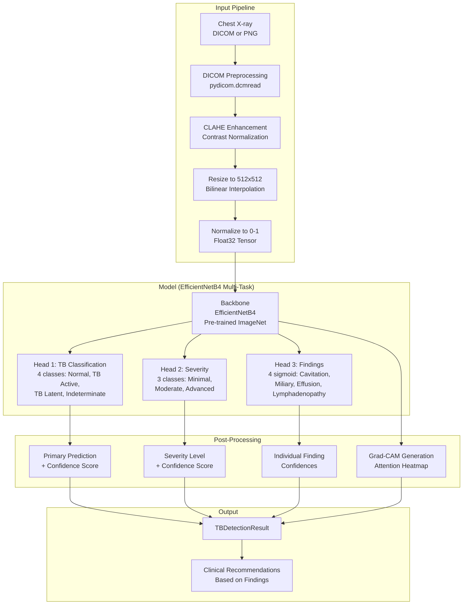
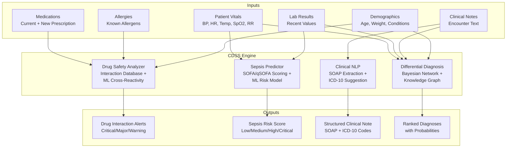
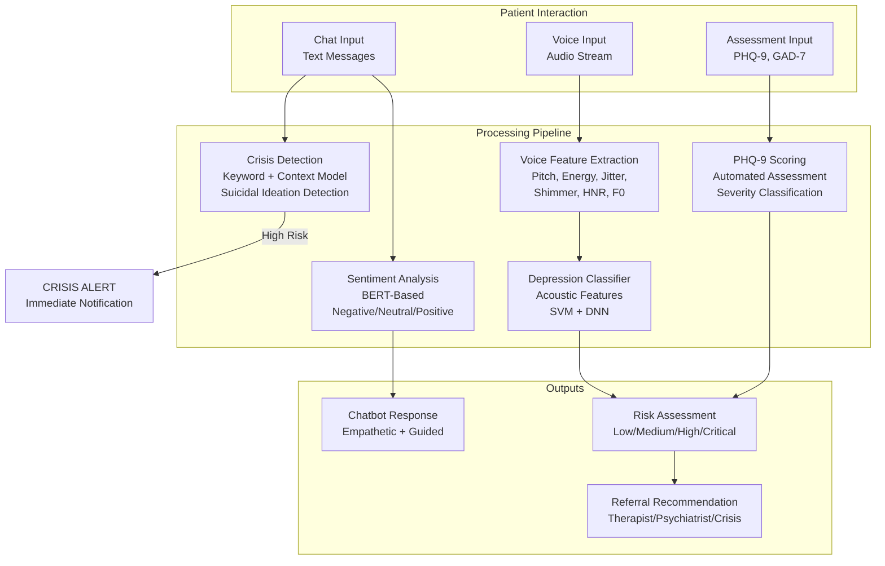
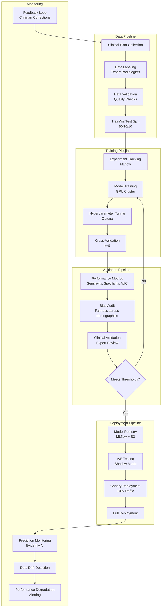
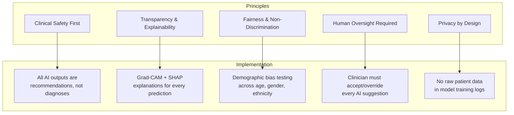

# AI/ML Architecture - AfriHealth ERP-Healthcare

## 1. Overview

AfriHealth deploys 11 Python-based AI/ML services addressing critical healthcare challenges across Africa: TB detection from chest X-rays, clinical decision support, mental health screening, drug safety analysis, sepsis prediction, disease outbreak forecasting, and clinical note generation. All AI outputs include confidence scores and require human verification per regulatory requirements.

---

## 2. AI Service Architecture

```mermaid
graph TB
    subgraph "AI/ML Services"
        subgraph "Medical Imaging"
            TB[TB Detection<br/>EfficientNetB4<br/>FastAPI]
            RETINA[Retinal Screening<br/>DenseNet121<br/>Diabetic Retinopathy]
        end

        subgraph "Clinical Decision Support"
            CDSS[Clinical AI<br/>CDSS Engine<br/>Drug Safety + Sepsis]
            NLP[Clinical NLP<br/>Note Generation<br/>ICD-10 Extraction]
            DIFF[Differential Diagnosis<br/>Knowledge Graph + ML]
        end

        subgraph "Mental Health"
            CHAT[MindCare Chatbot<br/>Transformer-Based<br/>Crisis Detection]
            VOICE[Voice Biomarkers<br/>Acoustic Analysis<br/>Depression Detection]
            MOOD[Mood Analytics<br/>PHQ-9/GAD-7 Scoring]
        end

        subgraph "Public Health"
            CLIMATE[Climate-Health AI<br/>Outbreak Prediction]
            SURV[Surveillance AI<br/>Anomaly Detection]
        end

        subgraph "Operational"
            RISK[Patient Risk<br/>Stratification]
        end
    end

    subgraph "Shared Infrastructure"
        GPU[GPU Pool<br/>NVIDIA A10G<br/>g5.xlarge]
        MODEL[Model Registry<br/>MLflow + S3]
        FEAT[Feature Store<br/>Redis + PostgreSQL]
        MONITOR[Model Monitoring<br/>Evidently AI]
    end

    TB & RETINA --> GPU
    CDSS & NLP & DIFF --> FEAT
    CHAT & VOICE --> GPU
    CLIMATE & SURV --> FEAT
    TB & CDSS & CHAT & CLIMATE & RISK --> MODEL
    TB & CDSS & CHAT & CLIMATE & RISK --> MONITOR
```



---

## 3. TB Detection Service (Imaging AI)

### 3.1 Model Architecture



### 3.2 Model Performance Targets

| Metric | Target | Current | WHO Recommendation |
|--------|--------|---------|-------------------|
| Sensitivity | >= 96.8% | 96.8% | >= 90% |
| Specificity | >= 94.2% | 94.2% | >= 70% |
| AUC-ROC | >= 0.987 | 0.987 | >= 0.90 |
| F1 Score | >= 0.95 | 0.954 | N/A |
| Inference Time | < 3s | 1.8s | N/A |

### 3.3 TB Detection Implementation

```python
# ai/imaging-ai/tb_detection.py
class ChestXRayTBDetector:
    def __init__(self, model_path: str = "models/tb_efficientnetb4.h5"):
        self.model = self._build_model()
        self.model.load_weights(model_path)
        self.target_size = (512, 512)

    def _build_model(self):
        base_model = EfficientNetB4(
            weights='imagenet',
            include_top=False,
            input_shape=(512, 512, 3)
        )

        x = base_model.output
        x = GlobalAveragePooling2D()(x)
        x = Dropout(0.3)(x)
        shared = Dense(256, activation='relu')(x)

        # Multi-task heads
        tb_classification = Dense(4, activation='softmax', name='tb_class')(shared)
        severity = Dense(3, activation='softmax', name='severity')(shared)
        findings = Dense(4, activation='sigmoid', name='findings')(shared)

        return Model(inputs=base_model.input,
                     outputs=[tb_classification, severity, findings])

    def preprocess(self, image_path: str) -> np.ndarray:
        if image_path.endswith('.dcm'):
            dcm = pydicom.dcmread(image_path)
            image = dcm.pixel_array.astype(np.float32)
            image = self._apply_windowing(image, dcm)
        else:
            image = cv2.imread(image_path, cv2.IMREAD_GRAYSCALE)

        # CLAHE enhancement
        clahe = cv2.createCLAHE(clipLimit=2.0, tileGridSize=(8, 8))
        image = clahe.apply(image.astype(np.uint8))

        image = cv2.resize(image, self.target_size)
        image = np.stack([image] * 3, axis=-1)  # Grayscale to RGB
        image = image.astype(np.float32) / 255.0
        return np.expand_dims(image, axis=0)

    def detect_tb(self, image_path: str) -> TBDetectionResult:
        preprocessed = self.preprocess(image_path)

        # Inference
        tb_probs, severity_probs, finding_probs = self.model.predict(preprocessed)

        # Parse results
        tb_classes = ['normal', 'tb_active', 'tb_latent', 'indeterminate']
        severity_classes = ['minimal', 'moderate', 'advanced']
        finding_names = ['cavitation', 'miliary_pattern',
                         'pleural_effusion', 'lymphadenopathy']

        prediction_idx = np.argmax(tb_probs[0])
        result = TBDetectionResult(
            prediction=tb_classes[prediction_idx],
            confidence=float(tb_probs[0][prediction_idx]),
            tb_probability=float(tb_probs[0][1] + tb_probs[0][2]),
            severity=severity_classes[np.argmax(severity_probs[0])],
            severity_confidence=float(np.max(severity_probs[0])),
            findings={name: float(prob)
                      for name, prob in zip(finding_names, finding_probs[0])},
        )

        # Generate Grad-CAM
        result.grad_cam = self.generate_grad_cam(preprocessed)

        # Clinical recommendations
        result.recommendations = self._generate_recommendations(result)

        return result

    def generate_grad_cam(self, image: np.ndarray) -> np.ndarray:
        """Generate Grad-CAM heatmap showing model attention regions."""
        grad_model = Model(
            inputs=self.model.input,
            outputs=[self.model.get_layer('top_conv').output,
                     self.model.output[0]]
        )

        with tf.GradientTape() as tape:
            conv_outputs, predictions = grad_model(image)
            loss = predictions[:, 1]  # TB Active class

        grads = tape.gradient(loss, conv_outputs)
        weights = tf.reduce_mean(grads, axis=(1, 2))
        cam = tf.reduce_sum(conv_outputs * weights[..., tf.newaxis, :], axis=-1)
        cam = tf.nn.relu(cam)
        cam = cam / tf.reduce_max(cam)

        return cam.numpy()[0]
```

---

## 4. Clinical Decision Support (CDSS)

### 4.1 CDSS Architecture



### 4.2 Drug Safety Analysis

```python
# ai/clinical-ai/main.py - Drug Safety Analyzer
class MedicationSafetyAnalyzer:
    def analyze(self, request: MedicationSafetyRequest) -> MedicationSafetyResult:
        alerts = []

        # 1. Drug-Drug Interactions
        for existing_med in request.current_medications:
            interaction = self.check_interaction(
                request.new_medication, existing_med
            )
            if interaction:
                alerts.append(interaction)

        # 2. Drug-Allergy Cross-Reactivity
        for allergy in request.patient_allergies:
            cross_reactivity = self.check_allergy_cross_reactivity(
                request.new_medication, allergy
            )
            if cross_reactivity:
                alerts.append(AlertInfo(
                    severity="critical",
                    type="allergy_cross_reactivity",
                    message=f"Cross-reactivity risk between {request.new_medication} "
                            f"and known allergy to {allergy}",
                ))

        # 3. Age Appropriateness (Beers Criteria for elderly)
        if request.patient_age >= 65:
            beers_alert = self.check_beers_criteria(
                request.new_medication, request.patient_age
            )
            if beers_alert:
                alerts.append(beers_alert)

        # 4. Weight-Based Dosing
        if request.patient_weight:
            dose_alert = self.check_weight_based_dosing(
                request.new_medication,
                request.dosage,
                request.patient_weight,
            )
            if dose_alert:
                alerts.append(dose_alert)

        # 5. Disease Contraindications
        for condition in request.active_conditions:
            contra = self.check_contraindication(
                request.new_medication, condition
            )
            if contra:
                alerts.append(contra)

        # Generate safer alternatives if issues found
        alternatives = []
        if any(a.severity in ["critical", "major"] for a in alerts):
            alternatives = self.suggest_alternatives(
                request.new_medication,
                request.indication,
                request.current_medications,
                request.patient_allergies,
            )

        return MedicationSafetyResult(
            is_safe=not any(a.severity == "critical" for a in alerts),
            alerts=alerts,
            alternatives=alternatives,
        )
```

### 4.3 Sepsis Prediction

```python
class SepsisPredictor:
    def predict(self, vitals: PatientVitals, labs: LabValues) -> SepsisRisk:
        # qSOFA Score (Quick Sepsis-related Organ Failure Assessment)
        qsofa = 0
        if vitals.respiratory_rate >= 22:
            qsofa += 1
        if vitals.systolic_bp <= 100:
            qsofa += 1
        if vitals.mental_status == "altered":
            qsofa += 1

        # SOFA Score (if lab values available)
        sofa = self._calculate_sofa(vitals, labs)

        # ML-based risk prediction (trained on clinical data)
        features = self._extract_features(vitals, labs)
        ml_risk = self.model.predict_proba(features)[0][1]

        # Combine clinical scores with ML prediction
        combined_risk = (0.4 * ml_risk +
                         0.3 * (qsofa / 3.0) +
                         0.3 * min(sofa / 24.0, 1.0))

        risk_level = self._classify_risk(combined_risk)

        recommendations = []
        if combined_risk >= 0.7:
            recommendations = [
                "Obtain blood cultures before antibiotics",
                "Administer broad-spectrum antibiotics within 1 hour",
                "Measure serum lactate level",
                "Begin rapid IV fluid resuscitation (30 mL/kg)",
                "Consider ICU transfer",
            ]

        return SepsisRisk(
            risk_score=combined_risk,
            risk_level=risk_level,
            qsofa_score=qsofa,
            sofa_score=sofa,
            recommendations=recommendations,
        )
```

---

## 5. Mental Health AI

### 5.1 Mental Health Service Architecture



### 5.2 Voice Biomarker Analysis

```python
class VoiceBiomarkerAnalyzer:
    """Analyze voice recordings for mental health biomarkers."""

    def analyze(self, audio_path: str) -> VoiceBiomarkerResult:
        # Extract acoustic features
        y, sr = librosa.load(audio_path, sr=16000)

        features = {
            "pitch_mean": np.mean(librosa.yin(y, fmin=50, fmax=500)),
            "pitch_std": np.std(librosa.yin(y, fmin=50, fmax=500)),
            "energy_mean": np.mean(librosa.feature.rms(y=y)),
            "energy_std": np.std(librosa.feature.rms(y=y)),
            "speech_rate": self._calculate_speech_rate(y, sr),
            "pause_ratio": self._calculate_pause_ratio(y, sr),
            "jitter": self._calculate_jitter(y, sr),
            "shimmer": self._calculate_shimmer(y, sr),
            "hnr": self._calculate_hnr(y, sr),
            "mfcc_mean": np.mean(librosa.feature.mfcc(y=y, sr=sr, n_mfcc=13), axis=1),
        }

        # Depression prediction from acoustic features
        feature_vector = self._vectorize(features)
        depression_score = self.depression_model.predict_proba(feature_vector)[0][1]
        anxiety_score = self.anxiety_model.predict_proba(feature_vector)[0][1]

        return VoiceBiomarkerResult(
            depression_probability=depression_score,
            anxiety_probability=anxiety_score,
            acoustic_features=features,
            risk_level=self._classify_risk(depression_score, anxiety_score),
        )
```

---

## 6. Model Lifecycle Management

### 6.1 MLOps Pipeline



### 6.2 Model Registry

| Model | Version | Framework | Size | Accuracy | Status |
|-------|---------|-----------|------|----------|--------|
| TB Detection | v2.1 | TensorFlow 2.15 | 78 MB | 96.8% sensitivity | Production |
| Sepsis Prediction | v1.3 | Scikit-learn | 12 MB | 89% AUC | Production |
| Drug Interaction | v1.5 | PyTorch | 45 MB | 94% precision | Production |
| Depression Detection (Voice) | v1.1 | Scikit-learn + PyTorch | 35 MB | 82% AUC | Production |
| Clinical NLP | v2.0 | Transformers (BERT) | 420 MB | 91% F1 | Production |
| Outbreak Prediction | v1.2 | Prophet + XGBoost | 25 MB | 85% accuracy | Production |
| Differential Diagnosis | v1.0 | Knowledge Graph + BERT | 280 MB | 78% top-3 accuracy | Beta |

---

## 7. AI Ethics and Governance

### 7.1 Responsible AI Framework



### 7.2 Clinical Disclaimer

Every AI-generated result includes the following disclaimer:

> "This AI analysis is provided as a clinical decision support tool and does not constitute a medical diagnosis. All findings must be reviewed and confirmed by a qualified healthcare professional. The AI model has been validated with a sensitivity of X% and specificity of Y%. False positives and false negatives are possible. Clinical judgment should always take precedence."

### 7.3 Bias Monitoring

| Demographic | TB Detection Sensitivity | TB Detection Specificity | Status |
|-------------|-------------------------|--------------------------|--------|
| Male | 97.1% | 94.5% | Within tolerance |
| Female | 96.4% | 93.8% | Within tolerance |
| Age 18-40 | 97.3% | 94.8% | Within tolerance |
| Age 41-65 | 96.5% | 94.0% | Within tolerance |
| Age 65+ | 95.9% | 93.2% | Monitor |
| HIV+ Patients | 95.2% | 92.8% | Enhanced monitoring |

---

## 8. GPU Resource Management

### 8.1 GPU Allocation

```yaml
# Kubernetes GPU scheduling for AI services
apiVersion: apps/v1
kind: Deployment
metadata:
  name: imaging-ai
  namespace: afrihealth-ai
spec:
  replicas: 2
  template:
    spec:
      nodeSelector:
        workload-type: ai-inference
      tolerations:
        - key: nvidia.com/gpu
          operator: Exists
          effect: NoSchedule
      containers:
        - name: imaging-ai
          image: afrihealth/imaging-ai:v2.1
          resources:
            requests:
              cpu: "2"
              memory: 4Gi
              nvidia.com/gpu: 1
            limits:
              cpu: "4"
              memory: 8Gi
              nvidia.com/gpu: 1
          env:
            - name: CUDA_VISIBLE_DEVICES
              value: "0"
            - name: TF_GPU_MEMORY_GROWTH
              value: "true"
```

### 8.2 Model Serving Optimization

| Optimization | Implementation | Impact |
|-------------|---------------|--------|
| ONNX Runtime | Convert models to ONNX format | 2x inference speedup |
| TensorRT | NVIDIA TensorRT for GPU optimization | 4x throughput |
| Model Quantization | INT8 quantization | 3x throughput, <1% accuracy loss |
| Batch Inference | Process multiple images per GPU call | 3x throughput |
| Model Caching | Warm model loading in memory | Eliminate cold start |
| Async Queue | FastAPI background tasks + Celery | Non-blocking API |
