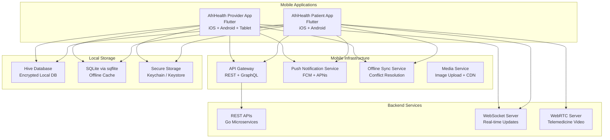
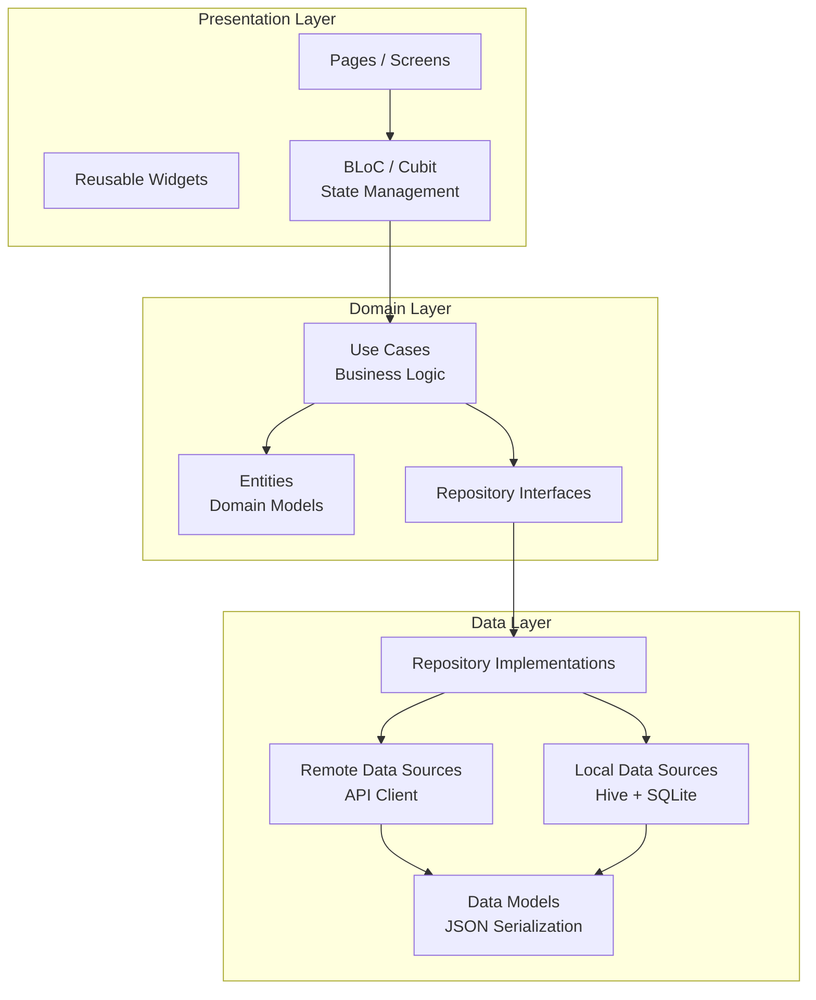
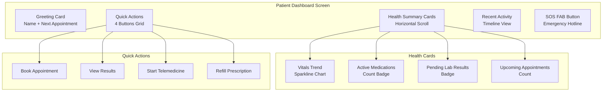
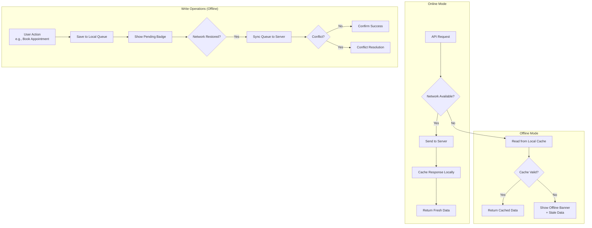
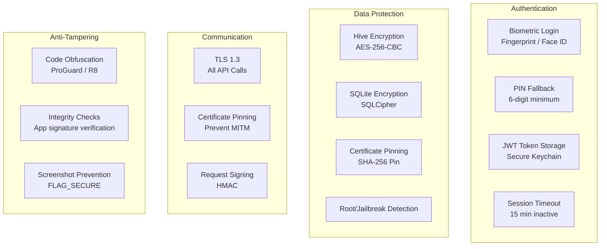

# Mobile Architecture - AfriHealth ERP-Healthcare

## 1. Overview

AfriHealth provides cross-platform mobile applications built with Flutter for patient-facing experiences and provider-facing clinical tools. The mobile architecture is designed for Africa's diverse connectivity landscape, supporting offline-first operations, low-bandwidth optimization, and multi-language support.

---

## 2. Mobile Architecture Overview



---

## 3. Flutter Application Architecture

### 3.1 Clean Architecture Layers



### 3.2 Project Structure

```
mobile/
├── lib/
│   ├── main.dart
│   ├── app/
│   │   ├── app.dart                    # Root MaterialApp
│   │   ├── routes.dart                 # Route definitions
│   │   └── theme.dart                  # AfriHealth theme
│   ├── core/
│   │   ├── network/
│   │   │   ├── api_client.dart         # Dio HTTP client
│   │   │   ├── interceptors.dart       # Auth, logging, retry
│   │   │   └── connectivity.dart       # Network status
│   │   ├── storage/
│   │   │   ├── secure_storage.dart     # Biometric-protected
│   │   │   ├── hive_storage.dart       # Local database
│   │   │   └── sync_manager.dart       # Offline sync
│   │   ├── auth/
│   │   │   ├── auth_bloc.dart
│   │   │   ├── biometric_auth.dart     # Fingerprint/Face ID
│   │   │   └── token_manager.dart      # JWT management
│   │   ├── localization/
│   │   │   ├── l10n.dart
│   │   │   └── translations/           # EN, FR, SW, HA, YO
│   │   └── utils/
│   │       ├── validators.dart
│   │       └── formatters.dart
│   ├── features/
│   │   ├── dashboard/
│   │   │   ├── presentation/
│   │   │   │   ├── pages/
│   │   │   │   ├── widgets/
│   │   │   │   └── bloc/
│   │   │   ├── domain/
│   │   │   │   ├── entities/
│   │   │   │   ├── usecases/
│   │   │   │   └── repositories/
│   │   │   └── data/
│   │   │       ├── models/
│   │   │       ├── datasources/
│   │   │       └── repositories/
│   │   ├── appointments/
│   │   ├── lab_results/
│   │   ├── medications/
│   │   ├── telemedicine/
│   │   ├── payments/
│   │   ├── profile/
│   │   ├── mental_health/
│   │   └── emergency/
│   └── shared/
│       ├── widgets/
│       │   ├── vital_sign_card.dart
│       │   ├── appointment_card.dart
│       │   ├── medication_card.dart
│       │   └── loading_shimmer.dart
│       └── models/
│           ├── patient.dart
│           └── appointment.dart
├── test/
├── android/
├── ios/
├── pubspec.yaml
└── l10n/
    ├── intl_en.arb                     # English
    ├── intl_fr.arb                     # French
    ├── intl_sw.arb                     # Swahili
    ├── intl_ha.arb                     # Hausa
    └── intl_yo.arb                     # Yoruba
```

---

## 4. Key Mobile Features

### 4.1 Patient Dashboard



### 4.2 Telemedicine Video Call

```dart
// Simplified WebRTC integration for telemedicine
class TelemedicineCallPage extends StatefulWidget {
  final String roomId;
  final String sessionToken;

  // WebRTC connection management
  late RTCPeerConnection _peerConnection;
  late MediaStream _localStream;
  MediaStream? _remoteStream;

  Future<void> _initializeCall() async {
    // Request camera and microphone permissions
    _localStream = await navigator.mediaDevices.getUserMedia({
      'audio': true,
      'video': {
        'facingMode': 'user',
        'width': {'ideal': 640},
        'height': {'ideal': 480},
      },
    });

    // Create peer connection with TURN servers
    _peerConnection = await createPeerConnection({
      'iceServers': [
        {'urls': 'stun:stun.afrihealth.com:3478'},
        {
          'urls': 'turn:turn.afrihealth.com:3478',
          'username': widget.sessionToken,
          'credential': turnCredential,
        },
      ],
    });

    // Handle incoming remote stream
    _peerConnection.onTrack = (RTCTrackEvent event) {
      setState(() => _remoteStream = event.streams.first);
    };

    // Add local tracks
    _localStream.getTracks().forEach((track) {
      _peerConnection.addTrack(track, _localStream);
    });
  }
}
```

---

## 5. Offline-First Architecture

### 5.1 Offline Strategy



### 5.2 Data Sync Manager

```dart
class SyncManager {
  final HiveDatabase _localDb;
  final ApiClient _apiClient;
  final ConnectivityService _connectivity;

  // Sync queue for offline operations
  Future<void> queueOperation(SyncOperation operation) async {
    final syncItem = SyncItem(
      id: Uuid().v4(),
      operation: operation.type,     // CREATE, UPDATE, DELETE
      entity: operation.entity,      // appointment, vital_sign
      payload: operation.payload,
      createdAt: DateTime.now(),
      status: SyncStatus.pending,
      retryCount: 0,
    );

    await _localDb.syncQueue.add(syncItem);
  }

  // Process sync queue when online
  Future<void> processQueue() async {
    if (!await _connectivity.isConnected) return;

    final pendingItems = await _localDb.syncQueue
        .where((item) => item.status == SyncStatus.pending)
        .sortBy('createdAt')
        .findAll();

    for (final item in pendingItems) {
      try {
        await _syncItem(item);
        item.status = SyncStatus.synced;
        await _localDb.syncQueue.update(item);
      } catch (e) {
        item.retryCount++;
        if (item.retryCount >= 3) {
          item.status = SyncStatus.failed;
          // Notify user of sync failure
        }
        await _localDb.syncQueue.update(item);
      }
    }
  }

  // Conflict resolution strategy
  Future<void> _resolveConflict(SyncItem local, ServerData server) async {
    // Strategy: Server wins for clinical data, client wins for preferences
    if (local.entity.isClinical) {
      // Server data takes precedence for clinical records
      await _localDb.update(local.entity, server.data);
    } else {
      // Last-write-wins for non-clinical data
      if (local.createdAt.isAfter(server.updatedAt)) {
        await _apiClient.update(local.entity, local.payload);
      } else {
        await _localDb.update(local.entity, server.data);
      }
    }
  }
}
```

### 5.3 Offline Data Availability

| Feature | Offline Read | Offline Write | Sync Priority |
|---------|-------------|---------------|---------------|
| Patient Profile | Yes (cached) | No | High |
| Appointments | Yes (next 7 days) | Book (queued) | High |
| Lab Results | Yes (last 30 days) | No | Medium |
| Medications | Yes (active list) | Refill request (queued) | High |
| Vital Signs | Yes (last 10) | Record new (queued) | Critical |
| Chat Messages | Yes (cached) | Send (queued) | Medium |
| Payments | No (real-time only) | No | N/A |
| Telemedicine | No (requires internet) | No | N/A |
| Emergency SOS | Yes (calls emergency number) | N/A | Critical |

---

## 6. Security on Mobile

### 6.1 Mobile Security Architecture



### 6.2 Biometric Authentication

```dart
class BiometricAuthService {
  final LocalAuthentication _auth = LocalAuthentication();

  Future<bool> authenticate() async {
    final canAuthenticate = await _auth.canCheckBiometrics;
    if (!canAuthenticate) return false;

    final availableBiometrics = await _auth.getAvailableBiometrics();

    return await _auth.authenticate(
      localizedReason: 'Authenticate to access AfriHealth',
      options: const AuthenticationOptions(
        stickyAuth: true,
        biometricOnly: false, // Allow PIN fallback
        useErrorDialogs: true,
      ),
    );
  }
}
```

---

## 7. Push Notifications

### 7.1 Notification Categories

| Category | Priority | Channel | Example |
|----------|----------|---------|---------|
| Critical Lab Result | High | FCM High Priority | "URGENT: Critical lab result requires review" |
| Appointment Reminder | Normal | FCM Normal | "Reminder: Appointment with Dr. X tomorrow at 10:00 AM" |
| Medication Reminder | Normal | Scheduled Local | "Time to take your medication: Amoxicillin 500mg" |
| Telemedicine Ready | High | FCM High Priority | "Dr. X is ready for your video consultation" |
| Payment Confirmation | Normal | FCM Normal | "Payment of NGN 5,000 confirmed" |
| Mental Health Check-in | Low | Scheduled Local | "How are you feeling today? Take a quick mood check" |
| Emergency Alert | Critical | FCM High Priority + SMS | "Crisis support: Call 0800-CRISIS or tap to connect" |

### 7.2 Notification Handling

```dart
class NotificationService {
  final FirebaseMessaging _fcm = FirebaseMessaging.instance;

  Future<void> initialize() async {
    // Request permission
    await _fcm.requestPermission(
      alert: true,
      badge: true,
      sound: true,
      criticalAlert: true, // For critical lab results
    );

    // Get FCM token and register with backend
    final token = await _fcm.getToken();
    await _registerToken(token!);

    // Handle foreground messages
    FirebaseMessaging.onMessage.listen(_handleForegroundMessage);

    // Handle background messages
    FirebaseMessaging.onBackgroundMessage(_handleBackgroundMessage);

    // Handle notification tap
    FirebaseMessaging.onMessageOpenedApp.listen(_handleNotificationTap);
  }

  void _handleForegroundMessage(RemoteMessage message) {
    final type = message.data['type'];

    switch (type) {
      case 'critical_lab_result':
        _showCriticalAlert(message);
        break;
      case 'telemedicine_ready':
        _navigateToTelemedicine(message.data['room_id']);
        break;
      case 'crisis_detected':
        _showCrisisAlert(message);
        break;
      default:
        _showStandardNotification(message);
    }
  }
}
```

---

## 8. Low-Bandwidth Optimization

### 8.1 Network Optimization Strategies

| Strategy | Implementation | Bandwidth Savings |
|----------|---------------|-------------------|
| Image Compression | WebP format, progressive JPEG | 60% vs PNG |
| API Response Compression | gzip encoding | 70% payload reduction |
| Pagination | Default 20 items, lazy loading | Reduces initial load |
| Selective Sync | Only sync changed records | 80% reduction |
| Data Deduplication | ETag-based caching | Eliminates redundant transfers |
| GraphQL (selective fields) | Request only needed fields | 40% payload reduction |
| Image Thumbnails | 150x150 thumbnails for lists | 90% vs full resolution |
| Delta Sync | Send only changed fields | 70% update reduction |

### 8.2 Adaptive Quality

```dart
class AdaptiveNetworkManager {
  NetworkQuality _quality = NetworkQuality.good;

  void updateQuality(ConnectivityResult result, double speedMbps) {
    if (speedMbps > 5) {
      _quality = NetworkQuality.good;
    } else if (speedMbps > 1) {
      _quality = NetworkQuality.moderate;
    } else {
      _quality = NetworkQuality.poor;
    }
  }

  ImageQuality getImageQuality() {
    switch (_quality) {
      case NetworkQuality.good:
        return ImageQuality.high;     // Full resolution
      case NetworkQuality.moderate:
        return ImageQuality.medium;   // 50% resolution
      case NetworkQuality.poor:
        return ImageQuality.low;      // Thumbnail only
    }
  }

  bool shouldAutoPlayVideo() => _quality == NetworkQuality.good;
  bool shouldPreloadContent() => _quality != NetworkQuality.poor;
}
```

---

## 9. Accessibility

### 9.1 Mobile Accessibility Standards

| Requirement | Implementation |
|-------------|---------------|
| Touch Target Size | Minimum 44x44 dp for all interactive elements |
| Color Contrast | WCAG AA (4.5:1 for text, 3:1 for large text) |
| Screen Reader | Semantic labels on all widgets (Semantics widget) |
| Font Scaling | Support system font size up to 200% |
| Dark Mode | Full dark theme matching system preference |
| RTL Support | Layout mirroring for RTL languages |
| Motion Reduction | Respect reduce motion system setting |
| High Contrast | High contrast mode option in accessibility settings |

---

## 10. App Distribution

### 10.1 Release Channels

| Channel | Purpose | Update Frequency |
|---------|---------|-----------------|
| Internal Testing | Development builds | Daily |
| Alpha | QA testing | Weekly |
| Beta | Selected healthcare facilities | Bi-weekly |
| Production | All users | Monthly |
| Hotfix | Critical bug fixes | As needed |

### 10.2 Over-the-Air Updates

```dart
// CodePush-style updates for non-native code
class OTAUpdateService {
  Future<void> checkForUpdates() async {
    final currentVersion = await PackageInfo.fromPlatform();
    final latestVersion = await _apiClient.getLatestVersion();

    if (latestVersion.isGreaterThan(currentVersion)) {
      if (latestVersion.isCritical) {
        // Force update - block app usage
        _showForceUpdateDialog(latestVersion);
      } else {
        // Optional update - show banner
        _showUpdateBanner(latestVersion);
      }
    }
  }
}
```
