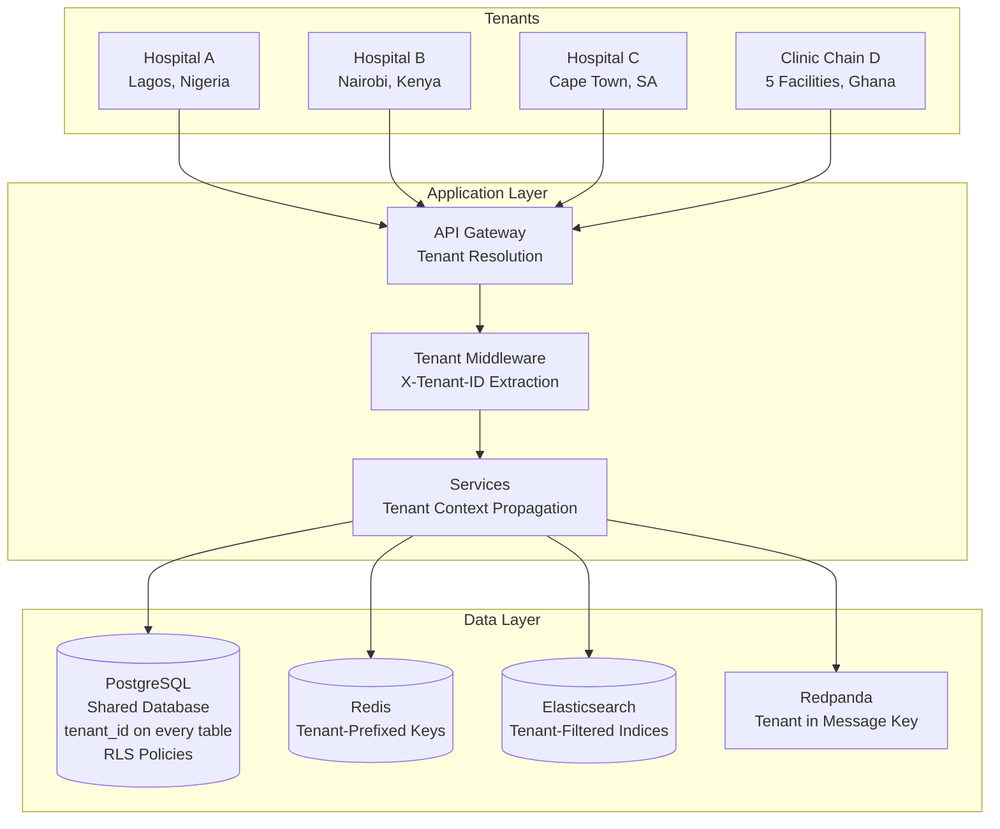
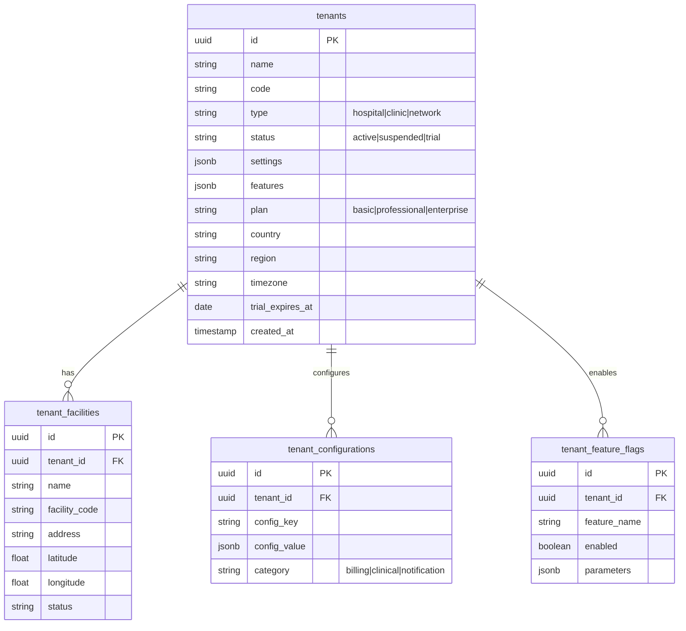
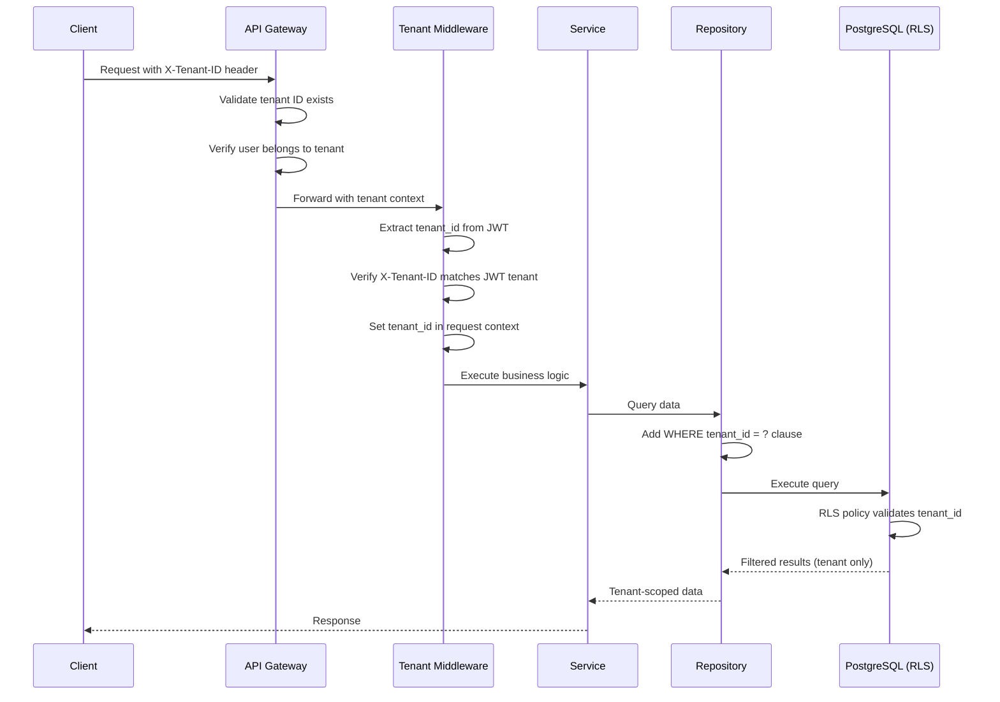
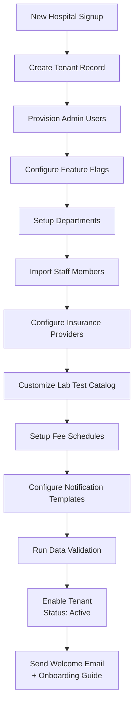
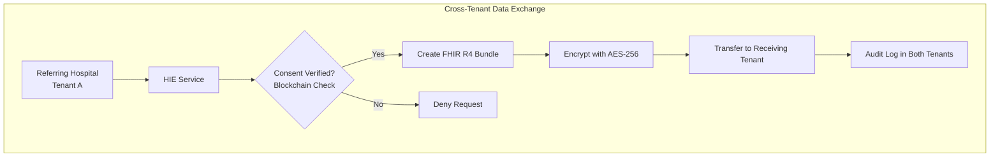

# Multi-Tenancy Architecture - AfriHealth ERP-Healthcare

## 1. Overview

AfriHealth implements a shared-database, shared-schema multi-tenancy model where all healthcare organizations (tenants) share the same PostgreSQL database with logical isolation enforced through tenant_id columns, Row-Level Security (RLS) policies, and application-level middleware. This enables cost-effective scaling while maintaining strict data isolation required by healthcare regulations.

---

## 2. Multi-Tenancy Architecture



---

## 3. Tenant Data Model

### 3.1 Tenant Schema



### 3.2 Tenant-Scoped Tables

Every data table in AfriHealth includes a `tenant_id` column:

```sql
-- Example: patients table with tenant_id
CREATE TABLE patients (
    id            UUID PRIMARY KEY DEFAULT gen_random_uuid(),
    tenant_id     UUID NOT NULL REFERENCES tenants(id),
    medical_record_number VARCHAR(50) NOT NULL,
    first_name    VARCHAR(100) NOT NULL,
    last_name     VARCHAR(100) NOT NULL,
    -- ... other columns ...
    created_at    TIMESTAMPTZ DEFAULT NOW(),

    -- Composite unique constraint includes tenant_id
    CONSTRAINT uq_patient_mrn_tenant UNIQUE (tenant_id, medical_record_number)
);

-- Index for tenant-scoped queries
CREATE INDEX idx_patients_tenant ON patients (tenant_id);
CREATE INDEX idx_patients_tenant_mrn ON patients (tenant_id, medical_record_number);
```

---

## 4. Tenant Isolation Mechanisms

### 4.1 Request Flow



### 4.2 Application-Level Isolation (Go Middleware)

```go
// Tenant middleware - applied to every request
func TenantMiddleware() gin.HandlerFunc {
    return func(c *gin.Context) {
        // 1. Extract tenant_id from header
        tenantID := c.GetHeader("X-Tenant-ID")
        if tenantID == "" {
            c.AbortWithStatusJSON(400, gin.H{
                "error": "X-Tenant-ID header is required",
            })
            return
        }

        // 2. Validate tenant_id format (UUID)
        if _, err := uuid.Parse(tenantID); err != nil {
            c.AbortWithStatusJSON(400, gin.H{
                "error": "Invalid tenant ID format",
            })
            return
        }

        // 3. Verify tenant exists and is active
        tenant, err := tenantService.GetTenant(tenantID)
        if err != nil || tenant.Status != "active" {
            c.AbortWithStatusJSON(403, gin.H{
                "error": "Tenant not found or inactive",
            })
            return
        }

        // 4. Verify JWT user belongs to this tenant
        jwtTenantID := c.GetString("jwt_tenant_id")
        if jwtTenantID != tenantID {
            c.AbortWithStatusJSON(403, gin.H{
                "error": "User does not belong to this tenant",
            })
            return
        }

        // 5. Set tenant context for downstream use
        c.Set("tenant_id", tenantID)
        c.Set("tenant", tenant)

        c.Next()
    }
}
```

### 4.3 Repository-Level Isolation (GORM Scopes)

```go
// TenantScope automatically adds tenant_id filter to all queries
func TenantScope(tenantID string) func(db *gorm.DB) *gorm.DB {
    return func(db *gorm.DB) *gorm.DB {
        return db.Where("tenant_id = ?", tenantID)
    }
}

// Usage in repository
type PatientRepository struct {
    db *gorm.DB
}

func (r *PatientRepository) FindByID(ctx context.Context, id string) (*Patient, error) {
    tenantID := ctx.Value("tenant_id").(string)

    var patient Patient
    err := r.db.
        Scopes(TenantScope(tenantID)).
        Where("id = ?", id).
        First(&patient).Error

    return &patient, err
}

func (r *PatientRepository) Create(ctx context.Context, patient *Patient) error {
    tenantID := ctx.Value("tenant_id").(string)
    patient.TenantID = tenantID  // Always set tenant_id

    return r.db.Create(patient).Error
}

func (r *PatientRepository) List(ctx context.Context, filter PatientFilter) ([]Patient, error) {
    tenantID := ctx.Value("tenant_id").(string)

    var patients []Patient
    query := r.db.Scopes(TenantScope(tenantID))

    if filter.Name != "" {
        query = query.Where("search_vector @@ plainto_tsquery(?)", filter.Name)
    }

    err := query.
        Order("created_at DESC").
        Limit(filter.Limit).
        Offset(filter.Offset).
        Find(&patients).Error

    return patients, err
}
```

### 4.4 Database-Level Isolation (Row-Level Security)

```sql
-- Enable RLS on critical tables
ALTER TABLE patients ENABLE ROW LEVEL SECURITY;

-- RLS Policy: Users can only access data for their tenant
CREATE POLICY tenant_isolation_policy ON patients
    USING (tenant_id = current_setting('app.current_tenant_id')::uuid);

-- Application sets the tenant context before queries
-- SET LOCAL app.current_tenant_id = 'tenant-uuid';

-- Force RLS even for table owners
ALTER TABLE patients FORCE ROW LEVEL SECURITY;

-- Apply to all clinical tables
DO $$
DECLARE
    tbl TEXT;
BEGIN
    FOR tbl IN
        SELECT table_name FROM information_schema.columns
        WHERE column_name = 'tenant_id'
        AND table_schema = 'public'
    LOOP
        EXECUTE format('ALTER TABLE %I ENABLE ROW LEVEL SECURITY', tbl);
        EXECUTE format('ALTER TABLE %I FORCE ROW LEVEL SECURITY', tbl);
        EXECUTE format(
            'CREATE POLICY tenant_policy ON %I
             USING (tenant_id = current_setting(''app.current_tenant_id'')::uuid)',
            tbl
        );
    END LOOP;
END $$;
```

---

## 5. Cache Isolation (Redis)

### 5.1 Tenant-Prefixed Keys

```go
// Redis key strategy: tenant:{tenant_id}:{entity}:{entity_id}
type TenantCache struct {
    client *redis.Client
}

func (c *TenantCache) GetPatient(tenantID, patientID string) (*Patient, error) {
    key := fmt.Sprintf("tenant:%s:patient:%s", tenantID, patientID)
    data, err := c.client.Get(ctx, key).Result()
    if err == redis.Nil {
        return nil, ErrCacheMiss
    }
    var patient Patient
    json.Unmarshal([]byte(data), &patient)
    return &patient, nil
}

func (c *TenantCache) SetPatient(tenantID string, patient *Patient, ttl time.Duration) error {
    key := fmt.Sprintf("tenant:%s:patient:%s", tenantID, patient.ID)
    data, _ := json.Marshal(patient)
    return c.client.Set(ctx, key, data, ttl).Err()
}

// Invalidate all cache for a tenant
func (c *TenantCache) InvalidateTenant(tenantID string) error {
    pattern := fmt.Sprintf("tenant:%s:*", tenantID)
    iter := c.client.Scan(ctx, 0, pattern, 100).Iterator()
    for iter.Next(ctx) {
        c.client.Del(ctx, iter.Val())
    }
    return iter.Err()
}
```

---

## 6. Event Streaming Isolation

### 6.1 Tenant in Event Messages

```go
// All events include tenant_id in the message key for partition affinity
func (p *EventPublisher) Publish(ctx context.Context, topic string, event CloudEvent) error {
    tenantID := ctx.Value("tenant_id").(string)
    event.AfriHealth.TenantID = tenantID

    msg := &kafka.Message{
        TopicPartition: kafka.TopicPartition{Topic: &topic},
        Key:            []byte(tenantID), // Partition by tenant_id
        Value:          marshaledEvent,
        Headers: []kafka.Header{
            {Key: "tenant-id", Value: []byte(tenantID)},
        },
    }

    return p.producer.Produce(msg, nil)
}

// Consumer filters by tenant if needed
func (c *Consumer) handleMessage(msg *kafka.Message) {
    tenantID := getHeader(msg.Headers, "tenant-id")
    // Process within tenant context
    ctx := context.WithValue(context.Background(), "tenant_id", tenantID)
    c.process(ctx, msg)
}
```

---

## 7. Tenant Configuration

### 7.1 Feature Flags per Tenant

```go
type TenantFeatures struct {
    AITBDetection        bool `json:"ai_tb_detection"`
    AIMentalHealth       bool `json:"ai_mental_health"`
    BlockchainConsent    bool `json:"blockchain_consent"`
    DrugSupplyChain      bool `json:"drug_supply_chain"`
    TelemedicineVideo    bool `json:"telemedicine_video"`
    IoTIntegration       bool `json:"iot_integration"`
    AdvancedAnalytics    bool `json:"advanced_analytics"`
    MultiLanguageSupport bool `json:"multi_language_support"`
    FHIRExport           bool `json:"fhir_export"`
    HIEIntegration       bool `json:"hie_integration"`
}

// Feature access control
func (s *Service) CheckFeature(ctx context.Context, feature string) error {
    tenant := ctx.Value("tenant").(*Tenant)
    if !tenant.HasFeature(feature) {
        return ErrFeatureNotEnabled
    }
    return nil
}
```

### 7.2 Tenant Configuration Table

| Config Key | Category | Description | Example Value |
|-----------|----------|-------------|---------------|
| `currency` | billing | Default currency | `NGN`, `KES`, `ZAR` |
| `timezone` | general | Facility timezone | `Africa/Lagos` |
| `appointment_duration` | clinical | Default slot duration | `30` (minutes) |
| `lab_result_notification` | notification | Notify patient of lab results | `true` |
| `sms_provider` | notification | SMS provider preference | `africastalking` |
| `payment_providers` | billing | Enabled payment methods | `["paystack","flutterwave"]` |
| `insurance_required` | billing | Require insurance before encounter | `false` |
| `auto_bill` | billing | Auto-generate bill on encounter close | `true` |
| `clinical_coding` | clinical | Default coding system | `ICD-10` |
| `pharmacy_chain_verify` | pharmacy | Require blockchain drug verification | `true` |

---

## 8. Tenant Onboarding

### 8.1 Onboarding Flow



### 8.2 Onboarding API

```go
// Tenant onboarding endpoint
func (h *TenantHandler) Onboard(c *gin.Context) {
    var req OnboardTenantRequest
    if err := c.ShouldBindJSON(&req); err != nil {
        c.JSON(400, gin.H{"error": err.Error()})
        return
    }

    // 1. Create tenant
    tenant := &Tenant{
        Name:     req.OrganizationName,
        Code:     generateTenantCode(req.OrganizationName),
        Type:     req.OrganizationType,
        Country:  req.Country,
        Region:   req.Region,
        Timezone: req.Timezone,
        Plan:     req.SubscriptionPlan,
        Status:   "trial",
        Settings: defaultSettings(req.Country),
        Features: planFeatures(req.SubscriptionPlan),
        TrialExpiresAt: time.Now().AddDate(0, 0, 30), // 30-day trial
    }

    if err := h.tenantService.Create(ctx, tenant); err != nil {
        c.JSON(500, gin.H{"error": "Failed to create tenant"})
        return
    }

    // 2. Create admin user
    admin := &User{
        TenantID: tenant.ID,
        Email:    req.AdminEmail,
        Role:     "tenant_admin",
    }
    h.userService.Create(ctx, admin)

    // 3. Setup default configurations
    h.configService.SetupDefaults(ctx, tenant.ID, req.Country)

    // 4. Publish tenant.created event
    h.publisher.Publish(ctx, "system.tenant.created", tenant)

    c.JSON(201, tenant)
}
```

---

## 9. Tenant Monitoring and Quotas

### 9.1 Per-Tenant Metrics

| Metric | Purpose | Alert Threshold |
|--------|---------|----------------|
| API requests/minute | Usage tracking | Plan limit |
| Active users | License compliance | Plan limit |
| Storage used (GB) | Capacity planning | 80% of quota |
| AI inferences/month | Usage billing | Plan limit |
| Database rows | Growth tracking | N/A |
| Concurrent sessions | Infrastructure sizing | Plan limit |

### 9.2 Rate Limiting per Tenant

```go
type TenantRateLimiter struct {
    limits map[string]RateLimit  // plan -> limits
}

type RateLimit struct {
    RequestsPerMinute  int
    AIInferencesPerDay int
    StorageGB          int
    ActiveUsers        int
}

var planLimits = map[string]RateLimit{
    "basic":        {RequestsPerMinute: 100, AIInferencesPerDay: 50, StorageGB: 10, ActiveUsers: 50},
    "professional": {RequestsPerMinute: 500, AIInferencesPerDay: 500, StorageGB: 100, ActiveUsers: 500},
    "enterprise":   {RequestsPerMinute: 2000, AIInferencesPerDay: 5000, StorageGB: 1000, ActiveUsers: 5000},
}
```

---

## 10. Cross-Tenant Operations

### 10.1 Strictly Prohibited

- Direct database access across tenants
- Sharing patient data between tenants without consent
- Cross-tenant API calls without explicit authorization

### 10.2 Allowed with Authorization



Cross-tenant data exchange is only permitted through the Health Information Exchange (HIE) service, which requires:
1. Active data exchange agreement between organizations
2. Patient consent verified on blockchain
3. FHIR R4 standard format for data portability
4. End-to-end encryption during transfer
5. Comprehensive audit logging in both tenants
