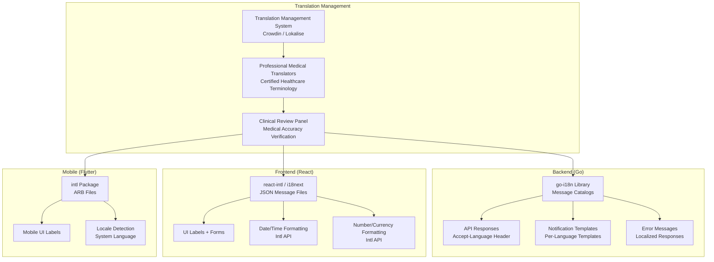

# Internationalization (i18n) - AfriHealth ERP-Healthcare

## 1. Overview

AfriHealth supports multiple languages, currencies, date/time formats, and cultural conventions across African markets. The internationalization strategy covers the full stack: backend API responses, frontend web interfaces, and mobile applications, ensuring healthcare access across linguistic boundaries.

---

## 2. Supported Languages

| Language | Code | Region | Status | Coverage |
|----------|------|--------|--------|----------|
| English | en | Pan-African | Production | 100% |
| French | fr | West/Central Africa | Production | 95% |
| Swahili | sw | East Africa | Production | 90% |
| Hausa | ha | West Africa (Nigeria) | Production | 85% |
| Yoruba | yo | West Africa (Nigeria) | Production | 85% |
| Igbo | ig | West Africa (Nigeria) | Beta | 70% |
| Amharic | am | Ethiopia | Planned | 0% |
| Zulu | zu | South Africa | Planned | 0% |
| Portuguese | pt | Lusophone Africa | Planned | 0% |
| Arabic | ar | North Africa | Planned | 0% |

---

## 3. i18n Architecture



---

## 4. Backend Internationalization

### 4.1 Language Detection

```go
// Language detection middleware
func LanguageMiddleware() gin.HandlerFunc {
    return func(c *gin.Context) {
        // Priority: 1. Query param, 2. Accept-Language header, 3. User preference, 4. Tenant default
        lang := c.Query("lang")
        if lang == "" {
            lang = parseAcceptLanguage(c.GetHeader("Accept-Language"))
        }
        if lang == "" {
            if user, ok := c.Get("user"); ok {
                lang = user.(*User).PreferredLanguage
            }
        }
        if lang == "" {
            if tenant, ok := c.Get("tenant"); ok {
                lang = tenant.(*Tenant).DefaultLanguage
            }
        }
        if lang == "" {
            lang = "en"
        }

        c.Set("language", lang)
        c.Next()
    }
}
```

### 4.2 Localized Error Messages

```go
// Error message translations
var errorMessages = map[string]map[string]string{
    "patient_not_found": {
        "en": "Patient not found",
        "fr": "Patient introuvable",
        "sw": "Mgonjwa hakupatikana",
        "ha": "Ba a sami majiyyaci ba",
        "yo": "A ko ri alaisan",
    },
    "appointment_conflict": {
        "en": "This time slot is already booked",
        "fr": "Ce créneau horaire est déjà réservé",
        "sw": "Muda huu tayari umeshachukuliwa",
        "ha": "An riga an yi amfani da wannan lokaci",
        "yo": "Akoko yii ti di mimọ tẹlẹ",
    },
    "prescription_drug_interaction": {
        "en": "Drug interaction detected: {{drug1}} and {{drug2}}",
        "fr": "Interaction médicamenteuse détectée: {{drug1}} et {{drug2}}",
        "sw": "Mwingiliano wa dawa umegunduliwa: {{drug1}} na {{drug2}}",
        "ha": "An gano mu'amalar magani: {{drug1}} da {{drug2}}",
        "yo": "Ibaraṣepọ oogun ti a rii: {{drug1}} ati {{drug2}}",
    },
}

func GetLocalizedMessage(key, lang string, params map[string]string) string {
    messages, ok := errorMessages[key]
    if !ok {
        return key
    }
    msg, ok := messages[lang]
    if !ok {
        msg = messages["en"] // Fallback to English
    }
    for k, v := range params {
        msg = strings.ReplaceAll(msg, "{{"+k+"}}", v)
    }
    return msg
}
```

### 4.3 Notification Templates

```go
// SMS notification templates per language
var smsTemplates = map[string]map[string]string{
    "appointment_reminder": {
        "en": "AfriHealth: Reminder - Your appointment with Dr. {{doctor}} is tomorrow at {{time}}. Facility: {{facility}}",
        "fr": "AfriHealth: Rappel - Votre rendez-vous avec Dr. {{doctor}} est demain à {{time}}. Établissement: {{facility}}",
        "sw": "AfriHealth: Ukumbusho - Miadi yako na Dkt. {{doctor}} ni kesho saa {{time}}. Kituo: {{facility}}",
        "ha": "AfriHealth: Tunatarwa - Alƙawarinku da Dr. {{doctor}} gobe ne da karfe {{time}}. Asibiti: {{facility}}",
        "yo": "AfriHealth: Oluranti - Ipade rẹ pẹlu Dr. {{doctor}} ni ọla ni aago {{time}}. Ile-iwosan: {{facility}}",
    },
    "critical_lab_result": {
        "en": "URGENT: A critical lab result requires immediate attention. Please contact your healthcare provider.",
        "fr": "URGENT: Un résultat de laboratoire critique nécessite une attention immédiate. Veuillez contacter votre médecin.",
        "sw": "DHARURA: Matokeo muhimu ya maabara yanahitaji usikivu wa haraka. Tafadhali wasiliana na daktari wako.",
        "ha": "GAGGAWA: Sakamakon dakin gwaje-gwaje na bukatar kulawa kai tsaye. Da fatan za a tuntuɓi likitanku.",
        "yo": "PAJAWIRI: Abajade yàrá pataki nilo akiyesi lẹsẹkẹsẹ. Jọwọ kan si olupese ilera rẹ.",
    },
}
```

---

## 5. Currency and Payment Localization

### 5.1 Supported Currencies

| Currency | Code | Symbol | Region | Payment Providers |
|----------|------|--------|--------|-------------------|
| Nigerian Naira | NGN | ₦ | Nigeria | Paystack, Flutterwave |
| Kenyan Shilling | KES | KSh | Kenya | M-Pesa, Flutterwave |
| South African Rand | ZAR | R | South Africa | Paystack, Stripe |
| Ghanaian Cedi | GHS | GH₵ | Ghana | Flutterwave |
| Tanzanian Shilling | TZS | TSh | Tanzania | M-Pesa |
| US Dollar | USD | $ | International | Stripe |

### 5.2 Currency Formatting

```go
// Currency formatting per locale
type CurrencyFormatter struct {
    locale string
}

func (f *CurrencyFormatter) Format(amount float64, currency string) string {
    switch currency {
    case "NGN":
        return fmt.Sprintf("₦%s", formatNumber(amount, 2, ",", "."))
    case "KES":
        return fmt.Sprintf("KSh %s", formatNumber(amount, 2, ",", "."))
    case "ZAR":
        return fmt.Sprintf("R %s", formatNumber(amount, 2, " ", ","))
    case "GHS":
        return fmt.Sprintf("GH₵%s", formatNumber(amount, 2, ",", "."))
    case "USD":
        return fmt.Sprintf("$%s", formatNumber(amount, 2, ",", "."))
    default:
        return fmt.Sprintf("%s %s", currency, formatNumber(amount, 2, ",", "."))
    }
}
```

---

## 6. Date, Time, and Calendar

### 6.1 Date/Time Formats per Locale

| Locale | Date Format | Time Format | Example |
|--------|-------------|-------------|---------|
| en-NG | DD/MM/YYYY | 12-hour (AM/PM) | 15/01/2024 2:30 PM |
| en-KE | DD/MM/YYYY | 24-hour | 15/01/2024 14:30 |
| en-ZA | YYYY/MM/DD | 24-hour | 2024/01/15 14:30 |
| fr-CI | DD/MM/YYYY | 24-hour | 15/01/2024 14h30 |
| sw-TZ | DD/MM/YYYY | 24-hour | 15/01/2024 14:30 |

### 6.2 Timezone Handling

```go
// Timezone-aware date formatting
func FormatAppointmentTime(t time.Time, tenantTimezone string) string {
    loc, err := time.LoadLocation(tenantTimezone)
    if err != nil {
        loc = time.UTC
    }
    localTime := t.In(loc)

    // All internal storage is UTC; display in tenant timezone
    return localTime.Format("Monday, 02 January 2006 at 15:04")
}

// Common African timezones
var africanTimezones = map[string]string{
    "NG": "Africa/Lagos",      // WAT (UTC+1)
    "KE": "Africa/Nairobi",    // EAT (UTC+3)
    "ZA": "Africa/Johannesburg", // SAST (UTC+2)
    "GH": "Africa/Accra",      // GMT (UTC+0)
    "ET": "Africa/Addis_Ababa", // EAT (UTC+3)
    "TZ": "Africa/Dar_es_Salaam", // EAT (UTC+3)
    "EG": "Africa/Cairo",      // EET (UTC+2)
}
```

---

## 7. Frontend Internationalization (React)

### 7.1 Translation File Structure

```json
// locales/en.json
{
  "dashboard": {
    "welcome": "Welcome, {name}",
    "next_appointment": "Next Appointment",
    "health_summary": "Health Summary",
    "quick_actions": "Quick Actions",
    "book_appointment": "Book Appointment",
    "view_results": "View Results",
    "start_telemedicine": "Start Telemedicine",
    "refill_prescription": "Refill Prescription"
  },
  "vitals": {
    "blood_pressure": "Blood Pressure",
    "heart_rate": "Heart Rate",
    "temperature": "Temperature",
    "oxygen_saturation": "Oxygen Saturation",
    "respiratory_rate": "Respiratory Rate",
    "normal": "Normal",
    "borderline": "Borderline",
    "abnormal": "Abnormal"
  },
  "lab_results": {
    "title": "Lab Results",
    "pending": "Pending",
    "completed": "Completed",
    "critical": "Critical",
    "reference_range": "Reference Range",
    "abnormal_high": "High",
    "abnormal_low": "Low"
  }
}
```

```json
// locales/sw.json (Swahili)
{
  "dashboard": {
    "welcome": "Karibu, {name}",
    "next_appointment": "Miadi Ijayo",
    "health_summary": "Muhtasari wa Afya",
    "quick_actions": "Hatua za Haraka",
    "book_appointment": "Weka Miadi",
    "view_results": "Angalia Matokeo",
    "start_telemedicine": "Anza Telemedicine",
    "refill_prescription": "Ongeza Dawa"
  },
  "vitals": {
    "blood_pressure": "Shinikizo la Damu",
    "heart_rate": "Mapigo ya Moyo",
    "temperature": "Joto la Mwili",
    "oxygen_saturation": "Kiwango cha Oksijeni",
    "respiratory_rate": "Kiwango cha Kupumua",
    "normal": "Kawaida",
    "borderline": "Ukingoni",
    "abnormal": "Si kawaida"
  }
}
```

---

## 8. Medical Terminology Localization

### 8.1 Clinical Term Translation Standards

Medical terminology requires specialized translation by certified medical translators. AfriHealth maintains a curated medical terminology database for each supported language.

| English Term | French | Swahili | Hausa | Yoruba |
|-------------|--------|---------|-------|--------|
| Blood Pressure | Tension artérielle | Shinikizo la damu | Matsi na jini | Tẹtẹ ẹjẹ |
| Diabetes | Diabète | Kisukari | Ciwon suga | Atọgbẹ |
| Malaria | Paludisme | Malaria | Zazzabin cizon sauro | Iba |
| Tuberculosis | Tuberculose | Kifua kikuu | Tarin fuka | Ikọ̀ ẹ̀gbẹ |
| Pregnancy | Grossesse | Ujauzito | Ciki | Oyun |
| Prescription | Ordonnance | Agizo la dawa | Takardar magani | Ilana oogun |

### 8.2 Important Considerations

- ICD-10 codes remain in standard format regardless of language
- Drug names use both international (INN) names and local brand names
- Lab test names are displayed in both local language and standard LOINC codes
- Clinical notes may be entered in any language but are tagged with their language
- AI-generated content (TB detection reports, clinical notes) defaults to English with translated summaries

---

## 9. Right-to-Left (RTL) Support

For future Arabic language support, the platform architecture supports RTL text direction:

```css
/* RTL support in CSS */
[dir="rtl"] {
  text-align: right;
}

[dir="rtl"] .sidebar {
  right: 0;
  left: auto;
}

[dir="rtl"] .breadcrumb .separator::before {
  content: "\\";
}
```

```dart
// Flutter RTL support
MaterialApp(
  localizationsDelegates: [
    AppLocalizations.delegate,
    GlobalMaterialLocalizations.delegate,
    GlobalWidgetsLocalizations.delegate,
    GlobalCupertinoLocalizations.delegate,
  ],
  supportedLocales: [
    Locale('en'),
    Locale('fr'),
    Locale('sw'),
    Locale('ar'), // RTL support
  ],
  builder: (context, child) {
    return Directionality(
      textDirection: Localizations.localeOf(context).languageCode == 'ar'
          ? TextDirection.rtl
          : TextDirection.ltr,
      child: child!,
    );
  },
)
```

---

## 10. Translation Quality Assurance

| Check | Method | Frequency |
|-------|--------|-----------|
| Completeness | Automated missing key detection | Every build |
| Medical accuracy | Expert medical translator review | Per release |
| Character encoding | UTF-8 validation | Every build |
| String interpolation | Template variable verification | Every build |
| UI overflow | Visual regression testing per language | Per release |
| Cultural appropriateness | Regional cultural review | Quarterly |
| Accessibility | Screen reader testing per language | Per release |
