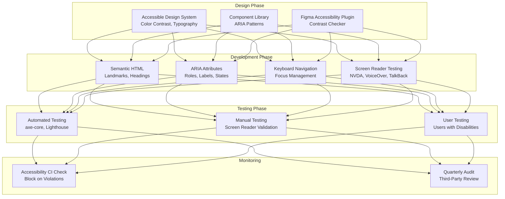
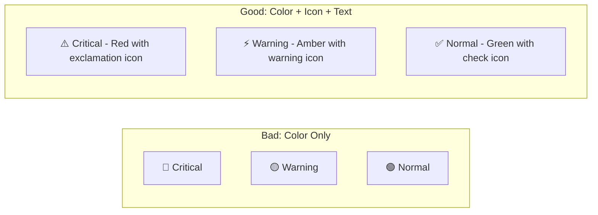

# Accessibility Standards - AfriHealth ERP-Healthcare

## 1. Overview

AfriHealth adheres to WCAG 2.1 Level AA accessibility standards across all interfaces, ensuring that healthcare services are accessible to users with disabilities. Given the critical nature of healthcare applications, accessibility is treated as a patient safety concern.

---

## 2. Accessibility Standards Compliance

| Standard | Level | Status | Scope |
|----------|-------|--------|-------|
| WCAG 2.1 Level A | Mandatory | Compliant | All interfaces |
| WCAG 2.1 Level AA | Target | Compliant | All interfaces |
| WCAG 2.1 Level AAA | Aspirational | Partial | Critical paths only |
| Section 508 | Required for US tenants | Compliant | Web + Mobile |
| EN 301 549 | EU standard | Compliant | Web + Mobile |
| ADA Title III | US compliance | Compliant | Public-facing |

---

## 3. Accessibility Architecture



---

## 4. Visual Accessibility

### 4.1 Color Contrast Requirements

| Element | Minimum Ratio | AfriHealth | Status |
|---------|--------------|------------|--------|
| Normal text (< 18px) | 4.5:1 | 7.2:1 (Primary green on white) | Pass |
| Large text (>= 18px bold) | 3:1 | 5.1:1 | Pass |
| UI Components (buttons, inputs) | 3:1 | 4.5:1 | Pass |
| Focus indicators | 3:1 | 4.5:1 (blue outline) | Pass |
| Status badges (critical) | 4.5:1 | 7.8:1 (red on white) | Pass |
| Data visualizations | 3:1 between adjacent colors | Verified | Pass |

### 4.2 Color-Independent Information



All status indicators in AfriHealth use:
- Color coding (visual cue)
- Icons (shape differentiation)
- Text labels (explicit status)
- Patterns/textures in charts (for color-blind users)

### 4.3 High Contrast Mode

```css
/* High contrast mode styles */
@media (prefers-contrast: high) {
  :root {
    --text-primary: #000000;
    --text-secondary: #1a1a1a;
    --background: #ffffff;
    --border: #000000;
    --focus-ring: #0000ff;
    --link: #0000cc;
    --error: #cc0000;
    --success: #006600;
    --warning: #cc6600;
  }

  .card {
    border: 2px solid var(--border);
  }

  .badge {
    border: 1px solid currentColor;
  }

  /* Increase focus indicator visibility */
  *:focus-visible {
    outline: 3px solid var(--focus-ring);
    outline-offset: 2px;
  }
}
```

### 4.4 Text Sizing and Readability

| Element | Min Size | Line Height | Font |
|---------|----------|-------------|------|
| Body text | 16px | 1.5 | Inter 400 |
| Small text | 14px | 1.4 | Inter 400 |
| Headings H1 | 32px | 1.2 | Inter 700 |
| Headings H2 | 24px | 1.3 | Inter 600 |
| Lab result values | 16px | 1.4 | JetBrains Mono 500 |
| Buttons | 16px | 1.0 | Inter 600 |
| All text supports 200% zoom without horizontal scrolling |

---

## 5. Keyboard Navigation

### 5.1 Keyboard Shortcuts

| Shortcut | Action | Context |
|----------|--------|---------|
| Tab | Move to next interactive element | Global |
| Shift+Tab | Move to previous element | Global |
| Enter/Space | Activate button/link | Global |
| Escape | Close modal/dialog | Modal context |
| ? | Show keyboard shortcuts overlay | Clinical Portal |
| Alt+1 | Go to Dashboard | Navigation |
| Alt+2 | Go to Patient Search | Navigation |
| Alt+3 | Go to Appointments | Navigation |
| Alt+N | New patient registration | Clinical Portal |
| Alt+S | Save current form | Form context |
| Arrow Keys | Navigate within tables/menus | Table/menu context |

### 5.2 Focus Management

```jsx
// React component with proper focus management
function PatientSearchDialog({ isOpen, onClose }) {
  const searchInputRef = useRef(null);
  const previousFocusRef = useRef(null);

  useEffect(() => {
    if (isOpen) {
      // Store previous focus
      previousFocusRef.current = document.activeElement;
      // Move focus to search input
      searchInputRef.current?.focus();
    } else {
      // Restore focus when closing
      previousFocusRef.current?.focus();
    }
  }, [isOpen]);

  return (
    <Dialog
      open={isOpen}
      onClose={onClose}
      aria-labelledby="search-dialog-title"
      aria-describedby="search-dialog-description"
    >
      <DialogTitle id="search-dialog-title">Search Patients</DialogTitle>
      <DialogContent>
        <p id="search-dialog-description">
          Search by name, MRN, or phone number
        </p>
        <TextField
          ref={searchInputRef}
          label="Search"
          aria-label="Search patients by name, MRN, or phone number"
          autoFocus
        />
      </DialogContent>
    </Dialog>
  );
}
```

### 5.3 Skip Navigation Links

```html
<!-- Skip navigation for screen readers -->
<body>
  <a href="#main-content" class="skip-link">
    Skip to main content
  </a>
  <a href="#patient-search" class="skip-link">
    Skip to patient search
  </a>

  <nav aria-label="Main navigation">
    <!-- Navigation items -->
  </nav>

  <main id="main-content" role="main" tabindex="-1">
    <!-- Page content -->
  </main>
</body>

<style>
.skip-link {
  position: absolute;
  left: -9999px;
  top: auto;
  width: 1px;
  height: 1px;
  overflow: hidden;
}
.skip-link:focus {
  position: fixed;
  top: 10px;
  left: 10px;
  width: auto;
  height: auto;
  padding: 16px;
  background: #1B5E20;
  color: white;
  z-index: 9999;
  font-size: 16px;
}
</style>
```

---

## 6. Screen Reader Support

### 6.1 ARIA Landmarks

```html
<body>
  <header role="banner">
    <nav role="navigation" aria-label="Main navigation">...</nav>
  </header>

  <aside role="complementary" aria-label="Patient list sidebar">
    <!-- Patient list -->
  </aside>

  <main role="main" aria-label="Patient chart">
    <!-- Clinical content -->
  </main>

  <aside role="complementary" aria-label="AI assistant panel">
    <!-- CDSS alerts -->
  </aside>

  <footer role="contentinfo">...</footer>
</body>
```

### 6.2 Semantic ARIA for Healthcare Components

```jsx
// Vital signs display with screen reader support
function VitalSignCard({ vital }) {
  const statusLabel = vital.isAbnormal ? 'abnormal' : 'normal';

  return (
    <article
      role="article"
      aria-label={`${vital.name}: ${vital.value} ${vital.unit}, ${statusLabel}`}
    >
      <h3>{vital.name}</h3>
      <p aria-live="polite">
        <span className="value">{vital.value}</span>
        <span className="unit">{vital.unit}</span>
      </p>
      <span
        role="status"
        aria-label={`Status: ${statusLabel}`}
        className={`badge ${vital.isAbnormal ? 'badge-danger' : 'badge-success'}`}
      >
        {vital.isAbnormal ? '⚠️ Abnormal' : '✓ Normal'}
      </span>
      {vital.referenceRange && (
        <p aria-label={`Reference range: ${vital.referenceRange}`}>
          Ref: {vital.referenceRange}
        </p>
      )}
    </article>
  );
}

// Lab results table with screen reader support
function LabResultsTable({ results }) {
  return (
    <table
      role="table"
      aria-label="Laboratory test results"
      aria-describedby="lab-results-description"
    >
      <caption id="lab-results-description">
        Laboratory results sorted by date, most recent first.
        Abnormal values are flagged.
      </caption>
      <thead>
        <tr>
          <th scope="col" aria-sort="descending">Date</th>
          <th scope="col">Test Name</th>
          <th scope="col">Result</th>
          <th scope="col">Reference Range</th>
          <th scope="col">Status</th>
        </tr>
      </thead>
      <tbody>
        {results.map(result => (
          <tr
            key={result.id}
            aria-label={`${result.testName}: ${result.value} ${result.unit},
                         ${result.isCritical ? 'CRITICAL' : result.isAbnormal ? 'abnormal' : 'normal'}`}
          >
            <td>{formatDate(result.date)}</td>
            <td>{result.testName}</td>
            <td>
              {result.value} {result.unit}
              {result.isAbnormal && (
                <span aria-label={`Flag: ${result.flag}`} className="flag">
                  {result.flag}
                </span>
              )}
            </td>
            <td>{result.referenceRange}</td>
            <td>
              {result.isCritical && (
                <span role="alert" className="critical-badge">
                  CRITICAL - Requires immediate attention
                </span>
              )}
            </td>
          </tr>
        ))}
      </tbody>
    </table>
  );
}
```

### 6.3 Live Regions for Dynamic Content

```jsx
// Real-time CDSS alerts announced to screen readers
function CDSSAlertPanel({ alerts }) {
  return (
    <div
      role="log"
      aria-label="Clinical decision support alerts"
      aria-live="assertive"  // Critical alerts interrupt
      aria-relevant="additions"
    >
      {alerts.map(alert => (
        <div
          key={alert.id}
          role="alert"
          aria-label={`${alert.severity} alert: ${alert.message}`}
        >
          <span className={`severity-${alert.severity}`}>
            {alert.severity.toUpperCase()}
          </span>
          <p>{alert.message}</p>
        </div>
      ))}
    </div>
  );
}
```

---

## 7. Mobile Accessibility (Flutter)

### 7.1 Flutter Semantics

```dart
// Accessible vital sign widget
class VitalSignWidget extends StatelessWidget {
  final String name;
  final double value;
  final String unit;
  final bool isAbnormal;

  @override
  Widget build(BuildContext context) {
    return Semantics(
      label: '$name: $value $unit, ${isAbnormal ? "abnormal" : "normal"}',
      child: Card(
        child: Column(
          children: [
            Text(name, style: Theme.of(context).textTheme.titleMedium),
            Text(
              '$value $unit',
              style: TextStyle(
                fontSize: 24,
                color: isAbnormal ? Colors.red : Colors.green,
              ),
            ),
            if (isAbnormal)
              Semantics(
                liveRegion: true,
                child: Icon(Icons.warning, color: Colors.red,
                  semanticLabel: 'Warning: abnormal value'),
              ),
          ],
        ),
      ),
    );
  }
}

// Accessible touch targets (minimum 44x44)
class AccessibleButton extends StatelessWidget {
  @override
  Widget build(BuildContext context) {
    return SizedBox(
      width: 44,   // Minimum touch target
      height: 44,  // Minimum touch target
      child: InkWell(
        onTap: onPressed,
        child: Semantics(
          button: true,
          label: semanticLabel,
          child: child,
        ),
      ),
    );
  }
}
```

### 7.2 Touch Target Sizes

| Element | Minimum Size | AfriHealth Standard |
|---------|-------------|-------------------|
| Buttons | 44x44 dp | 48x48 dp |
| Icons (interactive) | 44x44 dp | 48x48 dp |
| List items | 44dp height | 56dp height |
| Form inputs | 44dp height | 48dp height |
| Tab bar items | 44x44 dp | 48x48 dp |
| FAB (Emergency SOS) | 56x56 dp | 64x64 dp |

---

## 8. Automated Accessibility Testing

### 8.1 CI/CD Integration

```yaml
# .github/workflows/accessibility.yml
name: Accessibility Tests
on: [pull_request]

jobs:
  axe-scan:
    runs-on: ubuntu-latest
    steps:
      - uses: actions/checkout@v4
      - name: Build frontend
        run: npm run build --prefix frontend/provider-portal
      - name: Run axe-core scan
        run: |
          npx @axe-core/cli http://localhost:3000 \
            --tags wcag2a,wcag2aa \
            --exit
      - name: Lighthouse accessibility audit
        uses: treosh/lighthouse-ci-action@v11
        with:
          urls: http://localhost:3000
          budgetPath: ./lighthouse-budget.json

  # Fail build if accessibility score drops
  lighthouse-budget.json:
    accessibility: 95  # Minimum score
```

### 8.2 Testing Checklist

| Category | Test | Tool | Pass Criteria |
|----------|------|------|---------------|
| Color Contrast | All text meets 4.5:1 ratio | axe-core | Zero violations |
| Keyboard Navigation | All features keyboard-accessible | Manual + axe | Complete navigation |
| Screen Reader | All content announced correctly | NVDA/VoiceOver | Accurate announcements |
| Focus Indicators | Visible focus on all interactive elements | Visual inspection | 3:1 contrast ratio |
| Form Labels | All inputs have associated labels | axe-core | Zero violations |
| Image Alt Text | All images have meaningful alt text | axe-core | Zero violations |
| Heading Hierarchy | Logical heading structure (no skipped levels) | axe-core | Zero violations |
| ARIA Usage | Valid ARIA attributes and roles | axe-core | Zero violations |
| Touch Targets | All targets >= 44x44 dp | Automated measurement | Zero violations |
| Motion | Respect prefers-reduced-motion | Manual | Animations disabled |
| Zoom | Content readable at 200% zoom | Manual | No horizontal scroll |
| Language | Page language declared | axe-core | lang attribute present |
