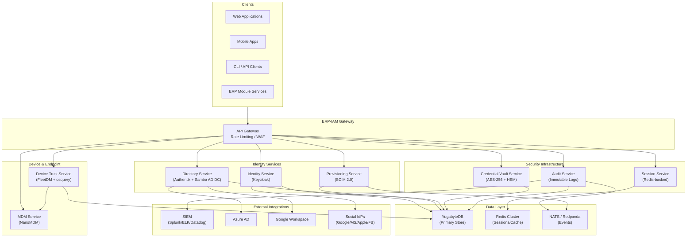

# ERP-IAM Product Requirements Document (PRD)

> **Document ID:** ERP-IAM-PRD-001
> **Version:** 1.0.0
> **Last Updated:** 2026-02-23
> **Status:** Approved
> **Related Documents:** [02-Release-Notes.md](./02-Release-Notes.md), [04-Software-Architecture.md](./04-Software-Architecture.md), [14-Technical-Specifications.md](./14-Technical-Specifications.md)

---

## 1. Executive Summary

ERP-IAM (Identity and Access Management) is the security backbone of the ERP suite, providing a unified identity platform that consolidates the previously separate ERP-IDaaS2 and ERP-Directory modules into a single, cohesive solution. ERP-IAM delivers enterprise-grade identity provider services, directory management, automated user provisioning, device trust assessment, mobile device management, credential vaulting, session governance, and comprehensive audit logging.

The module is benchmarked against industry leaders -- Okta, Microsoft Entra ID, JumpCloud, and Auth0 -- and is designed to match or exceed their capabilities while providing deeper integration with the ERP suite ecosystem. ERP-IAM operates in `standalone_plus_suite` mode, meaning it functions as a fully independent identity platform while seamlessly integrating with the ERP-Platform control plane for entitlement-based access control across all 20 ERP modules.

---

## 2. Problem Statement

### 2.1 Market Gap

Enterprise organizations face fragmented identity management across their tool stacks. Current market solutions require customers to choose between:

- **Okta**: Excellent SSO/MFA but limited directory services, no built-in MDM, no device trust without third-party integrations, premium pricing per user
- **Microsoft Entra ID**: Strong AD integration but vendor lock-in to Microsoft ecosystem, limited cross-platform MDM, complex conditional access setup
- **JumpCloud**: Good directory-as-a-service but weaker SSO protocol coverage, limited SCIM support, fewer social login options
- **Auth0**: Developer-friendly authentication but no directory services, no MDM, no device trust, primarily a B2C/B2B authentication service

### 2.2 Competitive Analysis Matrix

| Capability | ERP-IAM | Okta | Entra ID | JumpCloud | Auth0 |
|---|---|---|---|---|---|
| **SSO (OIDC/OAuth2/SAML2)** | Full | Full | Full | Partial | Full |
| **LDAP Directory** | Native (Samba AD DC) | Cloud LDAP (add-on) | Native AD | Cloud LDAP | None |
| **Active Directory** | Samba AD DC native | Requires AD agent | Native | Limited | None |
| **Social Login** | Google/Microsoft/Apple/Facebook | 7+ providers | Microsoft only | Google/Microsoft | 30+ providers |
| **Passwordless (FIDO2/WebAuthn)** | Full | Full | Full | Partial | Full |
| **Magic Links** | Native | Via workflows | None | None | Native |
| **MFA (TOTP/SMS/Push/HW Keys)** | All four | All four | All four | TOTP + Push | TOTP + SMS + Push |
| **Adaptive Risk-Based Auth** | Native ML pipeline | Okta ThreatInsight | Identity Protection | Limited | Attack Protection |
| **Brute Force Protection** | Built-in with progressive delays | Built-in | Smart Lockout | Basic | Bot Detection |
| **SCIM 2.0 Provisioning** | Server + Client | Server only | Server + limited client | Limited | Limited |
| **Joiner-Mover-Leaver Lifecycle** | Full automation | Via Workflows (add-on) | Via Lifecycle Workflows | Manual | None |
| **Device Trust / Zero Trust** | FleetDM + osquery native | Requires Okta Device Trust + CrowdStrike | Requires Intune | Native agent | None |
| **MDM** | NanoMDM (Apple/Android/Windows) | None (requires integration) | Intune (separate license) | Native | None |
| **Credential Vault** | AES-256 + HSM + auto-rotation | None | Azure Key Vault (separate) | None | None |
| **Session Management** | Full (concurrent limits, geo, forced logout) | Limited | CAE (Continuous Access Evaluation) | Basic | Limited |
| **SIEM Integration** | Splunk/ELK/Datadog native | Splunk/SIEM (add-on) | Sentinel native | Limited | Log Streams |
| **Compliance Reports** | SOC 2 / ISO 27001 built-in | SOC 2 certified | SOC 2 / ISO 27001 | SOC 2 | SOC 2 |
| **On-Prem Directory Sync** | Azure AD / Google / on-prem AD | AD agent | Azure AD Connect | AD Bridge | None |
| **Multi-Tenant** | Native Keycloak realms | Native | Native | Org-based | Native |
| **Pricing Model** | Per-module ERP subscription | Per-user ($6-15/mo) | Per-user ($6-12/mo) | Per-user ($7-24/mo) | Per-user ($23-240/mo) |

### 2.3 Key Differentiators

1. **Unified IAM + MDM + Device Trust**: No competitor offers all three in a single product. Okta requires CrowdStrike/Jamf, Entra ID requires Intune (separate license), JumpCloud has MDM but limited device trust policies.

2. **Credential Vault with Auto-Rotation**: Built-in secrets management with AES-256 encryption and HSM support -- a capability none of the four competitors offer natively.

3. **Full SCIM Server + Client**: ERP-IAM can both receive SCIM provisioning requests (server) and push provisioning to downstream systems (client), enabling bidirectional lifecycle management.

4. **ERP-Suite Deep Integration**: Native entitlement enforcement across all 20 ERP modules through ERP-Platform, enabling single-pane-of-glass identity governance.

5. **Cost Efficiency**: Included in the ERP subscription rather than per-user pricing, which saves enterprises 40-60% at scale versus Okta/Entra ID per-user models.

---

## 3. Target Users

### 3.1 Primary Personas

| Persona | Role | Key Needs |
|---|---|---|
| **IT Administrator** | Manages identity infrastructure | SSO configuration, directory management, provisioning rules, device policies |
| **Security Officer (CISO)** | Enforces security policies | Conditional access, MFA enforcement, audit logs, compliance reports, risk assessment |
| **Help Desk Operator** | Handles user support | Password resets, account unlocks, session management, device enrollment |
| **End User / Employee** | Consumes identity services | Self-service password reset, MFA enrollment, device registration, SSO login |
| **DevOps Engineer** | Integrates identity into pipelines | API keys, service accounts, credential vault, OIDC tokens for CI/CD |
| **Compliance Auditor** | Reviews security posture | Audit trails, access reports, SOC 2 evidence collection |

### 3.2 Deployment Models

- **Standalone**: ERP-IAM operates as an independent identity platform for organizations not using the full ERP suite
- **Suite-Integrated**: ERP-IAM provides identity services to all ERP modules, with entitlements managed through ERP-Platform

---

## 4. Functional Requirements

### 4.1 Identity Provider (FR-IDP)

| ID | Requirement | Priority |
|---|---|---|
| FR-IDP-001 | Keycloak-based multi-tenant identity provider with realm-per-tenant isolation | P0 |
| FR-IDP-002 | OIDC/OAuth 2.0 authorization server with PKCE, device flow, client credentials | P0 |
| FR-IDP-003 | SAML 2.0 service provider and identity provider with metadata exchange | P0 |
| FR-IDP-004 | LDAP authentication backend via Samba AD DC | P0 |
| FR-IDP-005 | Social login: Google, Microsoft, Apple, Facebook with configurable scopes | P1 |
| FR-IDP-006 | Passwordless FIDO2/WebAuthn registration and authentication | P1 |
| FR-IDP-007 | Magic link authentication via email with configurable TTL | P1 |
| FR-IDP-008 | OTP via SMS/email with rate limiting | P1 |
| FR-IDP-009 | MFA enforcement: TOTP, SMS, push notification, hardware security keys | P0 |
| FR-IDP-010 | Adaptive risk-based authentication with IP reputation, device fingerprint, behavioral analysis | P1 |
| FR-IDP-011 | Brute force protection with progressive delays and account lockout | P0 |
| FR-IDP-012 | Custom authentication flows via Keycloak SPI extensions | P2 |

### 4.2 Directory Service (FR-DIR)

| ID | Requirement | Priority |
|---|---|---|
| FR-DIR-001 | Authentik-based user directory with organizational unit (OU) hierarchy | P0 |
| FR-DIR-002 | Samba AD DC providing full Active Directory Domain Controller functionality | P0 |
| FR-DIR-003 | Group policy objects (GPOs) for Windows, macOS, and Linux endpoints | P1 |
| FR-DIR-004 | Computer object management for domain-joined devices | P1 |
| FR-DIR-005 | Domain join support for Windows (native AD join), macOS (directory binding), Linux (SSSD/Winbind) | P1 |
| FR-DIR-006 | LDAP query interface with search filters, pagination, and referral support | P0 |
| FR-DIR-007 | Directory sync with Azure AD, Google Workspace, and on-premises AD | P1 |
| FR-DIR-008 | Dynamic group membership based on user attributes | P2 |

### 4.3 Provisioning (FR-PROV)

| ID | Requirement | Priority |
|---|---|---|
| FR-PROV-001 | SCIM 2.0 server accepting inbound provisioning requests | P0 |
| FR-PROV-002 | SCIM 2.0 client pushing provisioning to downstream applications | P1 |
| FR-PROV-003 | Joiner-Mover-Leaver lifecycle automation with configurable rules | P1 |
| FR-PROV-004 | Attribute mapping engine with transformation expressions | P1 |
| FR-PROV-005 | Sync scheduling with configurable intervals and delta sync | P1 |
| FR-PROV-006 | Automated deprovisioning with license reclamation and data retention policies | P1 |

### 4.4 Device Trust (FR-DT)

| ID | Requirement | Priority |
|---|---|---|
| FR-DT-001 | FleetDM + osquery integration for endpoint telemetry | P0 |
| FR-DT-002 | Zero-trust posture assessment: OS version, encryption status, firewall state | P0 |
| FR-DT-003 | Malware protection verification and patch level compliance | P1 |
| FR-DT-004 | Jailbreak/root detection for mobile endpoints | P1 |
| FR-DT-005 | Conditional access policies blocking non-compliant devices | P0 |
| FR-DT-006 | Device trust score computation with configurable weight factors | P2 |

### 4.5 Mobile Device Management (FR-MDM)

| ID | Requirement | Priority |
|---|---|---|
| FR-MDM-001 | Apple MDM via NanoMDM with DEP/ADE enrollment | P0 |
| FR-MDM-002 | Android Enterprise managed device and work profile support | P1 |
| FR-MDM-003 | Windows MDM enrollment via Azure AD join or manual | P1 |
| FR-MDM-004 | App deployment and managed configuration distribution | P1 |
| FR-MDM-005 | Remote wipe, lock, and passcode reset commands | P0 |
| FR-MDM-006 | Certificate distribution via SCEP/EST protocols | P2 |

### 4.6 Credential Vault (FR-CV)

| ID | Requirement | Priority |
|---|---|---|
| FR-CV-001 | Secure storage for OAuth2 tokens, API keys, database credentials | P0 |
| FR-CV-002 | AES-256-GCM encryption at rest with envelope encryption | P0 |
| FR-CV-003 | Automatic credential rotation with configurable schedules | P1 |
| FR-CV-004 | HSM integration for master key management (PKCS#11) | P1 |
| FR-CV-005 | Access audit trail for every credential read/write operation | P0 |

### 4.7 Session Management (FR-SM)

| ID | Requirement | Priority |
|---|---|---|
| FR-SM-001 | Concurrent session limits per user with configurable max | P0 |
| FR-SM-002 | Configurable session timeout with idle and absolute expiry | P0 |
| FR-SM-003 | Forced logout (single session or all sessions) via admin or API | P0 |
| FR-SM-004 | Geolocation-based session restrictions | P1 |
| FR-SM-005 | Session token binding to device fingerprint | P2 |

### 4.8 Audit and Compliance (FR-AUD)

| ID | Requirement | Priority |
|---|---|---|
| FR-AUD-001 | Comprehensive authentication event logging (success, failure, MFA challenge) | P0 |
| FR-AUD-002 | SIEM integration: Splunk HEC, Elasticsearch, Datadog Logs | P1 |
| FR-AUD-003 | SOC 2 Type II evidence report generation | P1 |
| FR-AUD-004 | ISO 27001 controls mapping and compliance dashboard | P1 |
| FR-AUD-005 | Immutable audit log with cryptographic chain verification | P0 |
| FR-AUD-006 | Real-time alerting on suspicious authentication patterns | P2 |

---

## 5. Non-Functional Requirements

### 5.1 Performance

| Metric | Target |
|---|---|
| Authentication latency (p99) | < 200ms |
| OIDC token issuance (p99) | < 150ms |
| LDAP query response (p99) | < 100ms |
| SCIM provisioning throughput | 1,000 users/minute |
| Concurrent sessions supported | 1,000,000+ |
| Device trust evaluation (p99) | < 500ms |

### 5.2 Availability

- 99.99% uptime SLA for authentication services
- Active-active multi-region deployment
- Zero-downtime rolling upgrades
- Automated failover with < 30 second RTO

### 5.3 Security

- All data encrypted at rest (AES-256) and in transit (TLS 1.3)
- SOC 2 Type II and ISO 27001 certified operations
- Zero-trust architecture with continuous verification
- FIPS 140-2 Level 3 HSM for cryptographic key management

### 5.4 Scalability

- Horizontal scaling of all eight microservices independently
- YugabyteDB distributed SQL for global data replication
- Redis cluster for session state with 10M+ concurrent sessions
- Event-driven architecture via NATS/Redpanda for decoupled processing

---

## 6. System Architecture Overview

---

## 7. Success Metrics

| KPI | Target | Measurement |
|---|---|---|
| SSO adoption rate | > 95% of active users | Monthly active SSO sessions / total users |
| MFA enrollment rate | > 90% within 30 days | Users with MFA / total users |
| Mean Time to Provision (MTTP) | < 5 minutes | SCIM event to access grant elapsed time |
| Mean Time to Deprovision (MTTD) | < 15 minutes | Termination event to full access revocation |
| Device compliance rate | > 85% | Compliant devices / total registered devices |
| Authentication failure rate | < 2% | Failed auth / total auth attempts |
| Audit log coverage | 100% | Events logged / events generated |

---

## 8. Milestones and Phases

### Phase 1: Foundation (Weeks 1-8)
- Keycloak multi-tenant identity provider
- OIDC/OAuth 2.0/SAML 2.0 protocol support
- Basic MFA (TOTP + SMS)
- Session management with concurrent limits
- Audit logging foundation

### Phase 2: Directory & Provisioning (Weeks 9-16)
- Authentik + Samba AD DC directory service
- SCIM 2.0 server and client
- Joiner-Mover-Leaver lifecycle automation
- Directory sync (Azure AD, Google Workspace, on-prem AD)
- LDAP query interface

### Phase 3: Device Trust & MDM (Weeks 17-24)
- FleetDM + osquery integration
- Device trust policies and conditional access
- NanoMDM Apple MDM enrollment
- Android Enterprise and Windows MDM
- Remote wipe and lock commands

### Phase 4: Advanced Security (Weeks 25-32)
- Credential vault with HSM integration
- Adaptive risk-based authentication
- FIDO2/WebAuthn passwordless
- SOC 2/ISO 27001 compliance reporting
- SIEM integrations (Splunk/ELK/Datadog)

---

## 9. Risks and Mitigations

| Risk | Impact | Probability | Mitigation |
|---|---|---|---|
| Keycloak version upgrade breaks custom SPIs | High | Medium | Pin Keycloak version, maintain SPI test suite, staged rollouts |
| Samba AD DC scalability limits at 100K+ objects | Medium | Low | Partition directories by tenant, horizontal replication |
| FIDO2 browser compatibility gaps | Low | Medium | Fallback to TOTP/SMS, progressive enhancement |
| HSM vendor lock-in | Medium | Low | Abstract HSM interface via PKCS#11, multi-vendor support |
| SCIM interoperability with non-standard implementations | Medium | High | Extensive conformance testing, custom attribute mapping |

---

## 10. Appendix: Competitive Pricing Analysis

| Vendor | 1,000 Users/mo | 10,000 Users/mo | 50,000 Users/mo |
|---|---|---|---|
| **ERP-IAM** (suite included) | $0 (included) | $0 (included) | $0 (included) |
| **ERP-IAM** (standalone) | $2,500/mo | $15,000/mo | $50,000/mo |
| **Okta** (Workforce Identity) | $8,000/mo | $80,000/mo | $375,000/mo |
| **Microsoft Entra ID P2** | $9,000/mo | $90,000/mo | $450,000/mo |
| **JumpCloud** (Platform Plus) | $15,000/mo | $130,000/mo | $500,000/mo |
| **Auth0** (Enterprise) | $23,000/mo | Custom | Custom |

*Note: Pricing estimates based on publicly available pricing as of 2026. Actual pricing varies by contract terms and volume commitments.*
