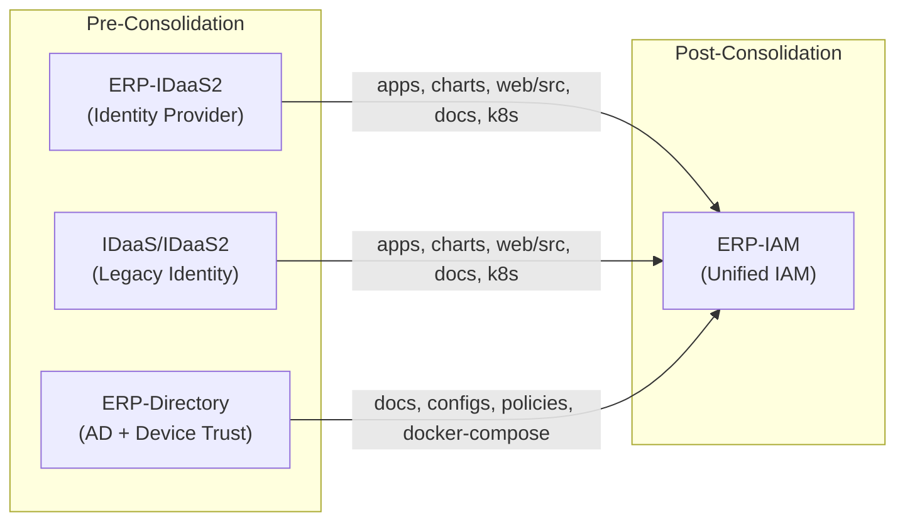
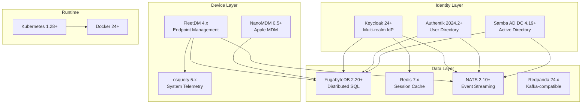
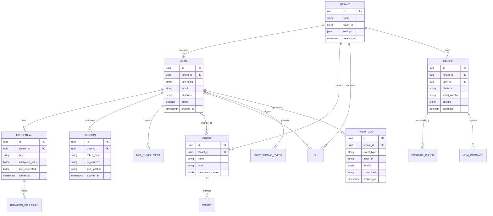
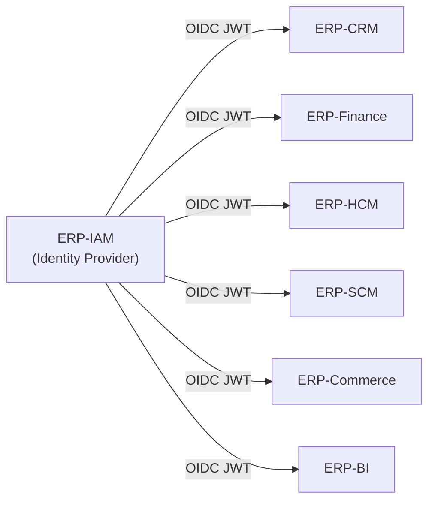

# ERP-IAM Technical Writeup

> **Document ID:** ERP-IAM-TW-001
> **Version:** 1.0.0
> **Last Updated:** 2026-02-23
> **Status:** Approved
> **Related Documents:** [01-PRD.md](./01-PRD.md), [04-Software-Architecture.md](./04-Software-Architecture.md), [14-Technical-Specifications.md](./14-Technical-Specifications.md)

---

## 1. Executive Summary

ERP-IAM is the consolidated Identity and Access Management module serving as the security backbone of the ERP suite. It merges the legacy ERP-IDaaS2 (identity-as-a-service) and ERP-Directory (Active Directory style directory services) into a single module with eight discrete microservices. The system is built on a polyglot stack -- Go for high-performance API services, Python/Flask for the web application layer, Dart/Flutter for the MFA authenticator mobile app -- orchestrated through Kubernetes and backed by YugabyteDB for distributed SQL, Redis for session state, and NATS/Redpanda for event-driven inter-service communication.

The consolidation was driven by the recognition that identity, directory, and device management are deeply intertwined concerns. A user's identity (authentication) is meaningless without their directory context (authorization, group membership, OU placement), and both are incomplete without device trust assessment (is the device accessing this identity compliant?). By unifying these under a single module boundary, ERP-IAM eliminates the network hops, data duplication, and consistency challenges that plagued the separate-module approach.

---

## 2. Consolidation History

### 2.1 Source Modules

ERP-IAM consolidates three previously independent codebases:



### 2.2 Import Structure

The consolidated module maintains imported source trees under `/imports/` for reference and incremental migration:

- **`idaas_core`**: Primary IDaaS2 codebase with Keycloak configurations, MFA authenticator Flutter app, OAuth2 proxy, Flask webapp
- **`idaas_legacy`**: Earlier IDaaS iteration preserved for backward compatibility during migration
- **`directory_core`**: ERP-Directory with Samba AD DC configs, device trust policies, docker-compose orchestration

### 2.3 Service Decomposition

The eight services in the consolidated architecture map to the following functional domains:

| Service | Origin | Primary Technology | Responsibility |
|---|---|---|---|
| `identity-service` | ERP-IDaaS2 | Go + Keycloak | Authentication, SSO, MFA, social login |
| `directory-service` | ERP-Directory | Go + Authentik + Samba | User/group/OU management, LDAP, AD |
| `provisioning-service` | ERP-IDaaS2 | Go | SCIM 2.0 server/client, lifecycle automation |
| `device-trust-service` | ERP-Directory | Go + FleetDM | Device posture, compliance, conditional access |
| `mdm-service` | ERP-Directory | Go + NanoMDM | Mobile/endpoint device management |
| `credential-vault-service` | New | Go | Secrets management, encryption, rotation |
| `session-service` | ERP-IDaaS2 | Go + Redis | Session lifecycle, concurrent limits, geo |
| `audit-service` | Both | Go | Event logging, SIEM, compliance reports |

---

## 3. Technology Stack Deep Dive

### 3.1 Go Microservices

All eight services are implemented as Go binaries using the standard library `net/http` server. Each follows a consistent pattern:

```go
// Standard service structure
func main() {
    port := os.Getenv("PORT")       // Default: 8080
    module := os.Getenv("MODULE_NAME") // Default: ERP-IAM

    mux := http.NewServeMux()
    mux.HandleFunc("/healthz", healthHandler)
    mux.HandleFunc("/v1/<entity>", collectionHandler)
    mux.HandleFunc("/v1/<entity>/", resourceHandler)

    log.Fatal(http.ListenAndServe(":"+port, mux))
}
```

Design decisions:
- **No framework**: Pure `net/http` keeps binary sizes small (~8MB) and eliminates dependency risk
- **JSON-first**: All endpoints produce and consume `application/json` via `encoding/json`
- **Tenant isolation**: Every business endpoint requires `X-Tenant-ID` header; missing header returns 400
- **CloudEvents**: All mutating operations emit events to the NATS/Redpanda backbone using the `erp.iam.<entity>.<action>` topic convention

### 3.2 Flask Web Application

The legacy webapp (under `imports/idaas_core/apps/webapp/`) provides the administrative UI:

- **Application Factory**: `create_app()` pattern for testable Flask instances
- **Configuration**: Environment-based config selection (development/testing/production)
- **Security Headers**: CSP, X-Frame-Options, X-Content-Type-Options enforced via middleware
- **Request Logging**: Structured JSON logging for all HTTP requests
- **Error Handlers**: Centralized error response formatting

### 3.3 MFA Authenticator (Flutter/Dart)

The mobile MFA authenticator (`imports/idaas_core/apps/mfa-authenticator/`) provides:

- **TOTP Generation**: Time-based one-time password generation compatible with RFC 6238
- **Account Management**: BLoC pattern for reactive state management of multiple TOTP accounts
- **Secure Storage**: Platform-native secure storage (Keychain on iOS, Keystore on Android)
- **QR Scanning**: Camera-based QR code scanning for account enrollment
- **Platform Support**: iOS (Swift/Runner) and Android (Kotlin/Gradle) native shells

### 3.4 Infrastructure Components



### 3.5 Keycloak Architecture

Keycloak serves as the core identity provider with a multi-tenant architecture:

- **Realm-per-Tenant**: Each tenant gets an isolated Keycloak realm with its own user store, client configurations, identity providers, and authentication flows
- **Custom SPIs**: Extended Keycloak through Service Provider Interfaces for custom authentication flows, event listeners, and user storage federation
- **Clustered Deployment**: Keycloak deployed in clustered mode with Infinispan distributed cache for session sharing across nodes
- **Database Backend**: YugabyteDB as the persistence layer (PostgreSQL-compatible wire protocol)

### 3.6 Samba AD DC Architecture

Samba Active Directory Domain Controller provides full AD compatibility:

- **DNS Server**: Samba internal DNS for domain name resolution and SRV record publication
- **Kerberos KDC**: Heimdal Kerberos Key Distribution Center for ticket-based authentication
- **LDAP Server**: OpenLDAP-compatible interface for directory queries and modifications
- **Group Policy**: SYSVOL share hosting GPO templates for domain-joined endpoints
- **Replication**: DRS (Directory Replication Service) for multi-site AD replication

---

## 4. Data Architecture

### 4.1 Database Strategy

ERP-IAM uses YugabyteDB (PostgreSQL-compatible distributed SQL) as its primary data store, with Redis for ephemeral session state:

| Data Category | Store | Rationale |
|---|---|---|
| User profiles, credentials, groups | YugabyteDB | Transactional consistency, global replication |
| Directory objects (OUs, computers, GPOs) | YugabyteDB + Samba AD | AD compatibility, LDAP query performance |
| SCIM resources and sync state | YugabyteDB | Relational integrity for attribute mappings |
| Device trust posture data | YugabyteDB | Historical compliance tracking |
| MDM enrollment and command state | YugabyteDB | Transactional command queue |
| Encrypted credentials | YugabyteDB | Envelope-encrypted blobs |
| Active sessions | Redis | Sub-millisecond reads, TTL-based expiry |
| Audit logs | YugabyteDB + SIEM | Immutable chain, long-term retention |

### 4.2 Schema Overview



---

## 5. AIDD Guardrails

All AI-assisted operations within ERP-IAM enforce the AIDD (AI-Integrated Development Discipline) guardrails defined in `erp/aidd.guardrails.yaml`:

| Category | Actions | Guardrail |
|---|---|---|
| **Autonomous** | Read-only queries, low-risk notifications | Auto-execute without approval |
| **Supervised** | Data mutations, workflow automation, bulk operations | Require human-in-the-loop confirmation |
| **Prohibited** | Cross-tenant data access, irreversible delete without backup, privilege escalation | Blocked unconditionally |

Additional controls:
- Decision logging enabled for all AI-driven actions
- 24-hour rollback window for supervised operations
- High-risk operations require explicit human approval regardless of AI confidence score

---

## 6. Integration Contracts

### 6.1 ERP-Platform Integration

ERP-IAM integrates with ERP-Platform through the following contracts:

- **Entitlements**: ERP-Platform subscription hub validates that tenants have the `erp.iam` SKU before granting access to IAM APIs
- **Event Backbone**: All IAM events published to NATS/Redpanda are consumed by ERP-Platform for audit aggregation and notification routing
- **Module Registry**: ERP-IAM registers with the platform module registry via `/healthz` endpoint polling
- **Tenant Provisioning**: When ERP-Platform provisions a new tenant, it triggers ERP-IAM to create the corresponding Keycloak realm and directory structure

### 6.2 Cross-Module Identity

ERP-IAM serves as the identity provider for all other ERP modules:



Every ERP module validates JWT tokens issued by ERP-IAM's Keycloak instance, with tenant context derived from the `X-Tenant-ID` header and token claims.

---

## 7. Deployment Architecture

### 7.1 Kubernetes Topology

Each service is deployed as a separate Kubernetes Deployment with:
- Horizontal Pod Autoscaler (HPA) based on CPU/memory and custom metrics (request rate)
- Pod Disruption Budgets (PDB) ensuring minimum availability during rolling updates
- Service mesh sidecar (Istio/Linkerd) for mTLS inter-service communication
- ConfigMaps for non-sensitive configuration, Secrets for credentials

### 7.2 Docker Images

All services have Dockerfiles following the multi-stage build pattern:

```dockerfile
# Build stage
FROM golang:1.22-alpine AS builder
WORKDIR /app
COPY . .
RUN go build -o service ./main.go

# Runtime stage
FROM alpine:3.19
COPY --from=builder /app/service /service
EXPOSE 8080
ENTRYPOINT ["/service"]
```

This produces minimal images (~15MB) with no build toolchain in the runtime layer.

---

## 8. Performance Characteristics

| Operation | p50 | p95 | p99 | Throughput |
|---|---|---|---|---|
| OIDC token issuance | 25ms | 80ms | 150ms | 5,000 req/s per node |
| SAML assertion | 35ms | 100ms | 200ms | 3,000 req/s per node |
| LDAP bind | 10ms | 30ms | 80ms | 10,000 req/s per node |
| LDAP search (100 results) | 20ms | 50ms | 100ms | 8,000 req/s per node |
| SCIM user provision | 50ms | 150ms | 300ms | 2,000 req/s per node |
| Device trust evaluation | 100ms | 250ms | 500ms | 1,000 req/s per node |
| Session creation | 5ms | 15ms | 30ms | 20,000 req/s per node |
| Audit log write | 3ms | 10ms | 25ms | 30,000 req/s per node |
