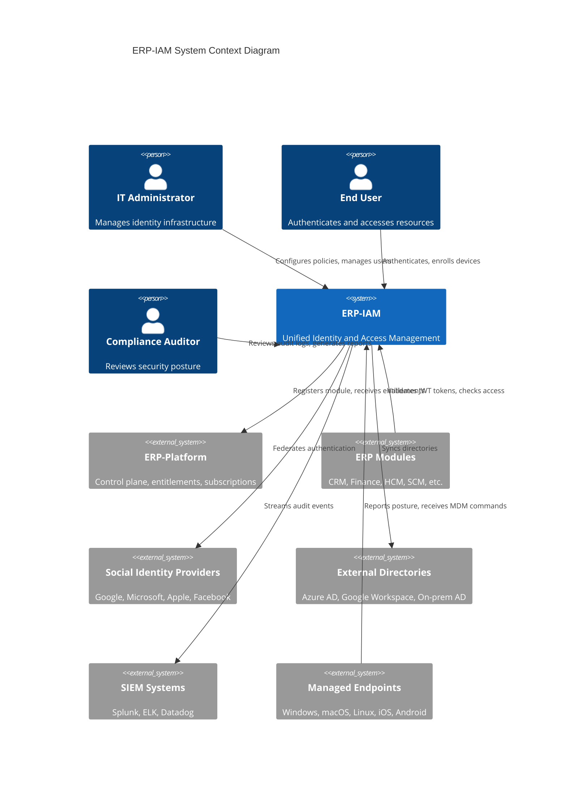
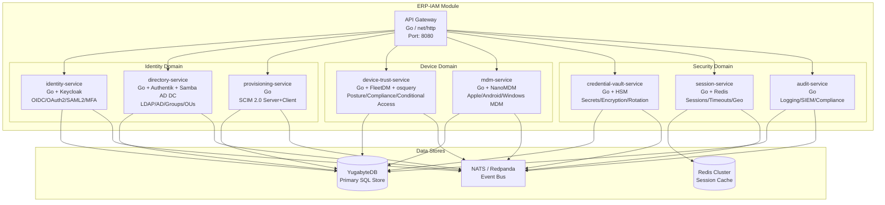
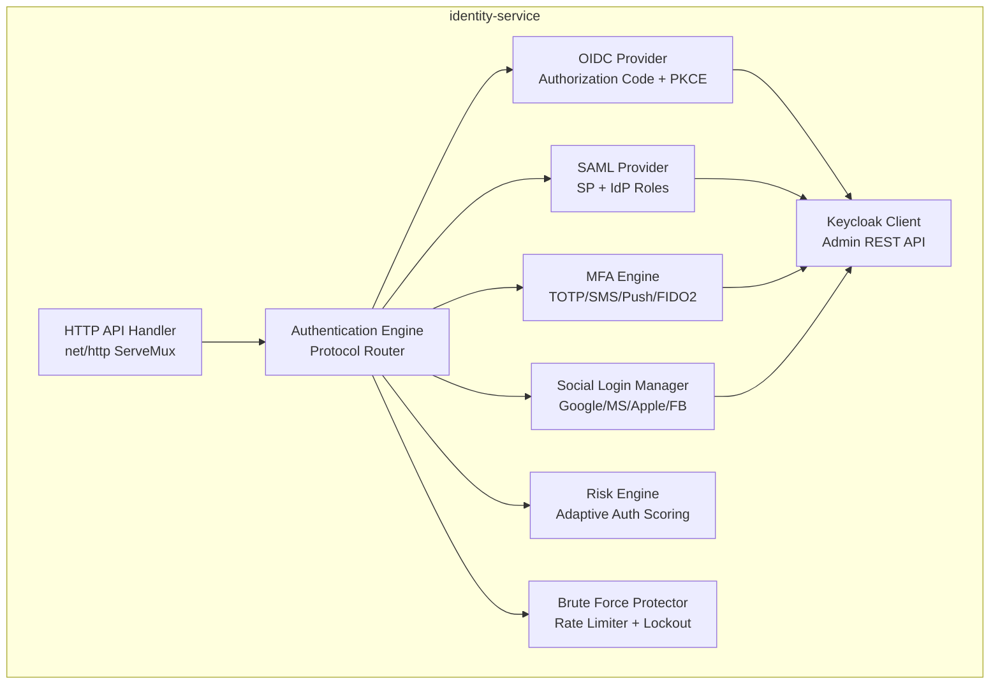
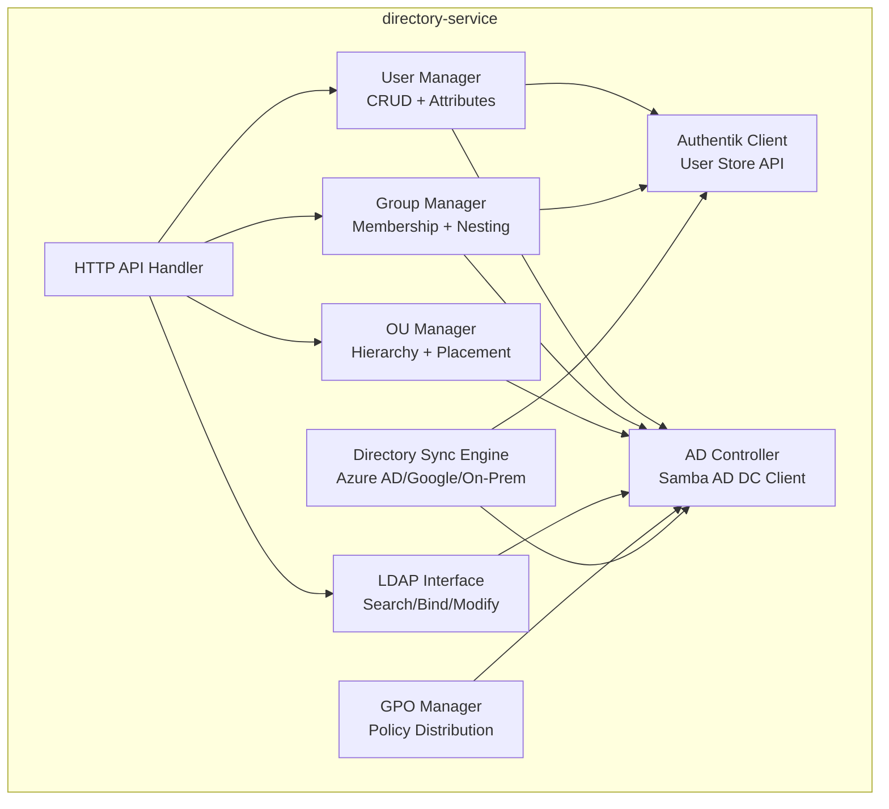
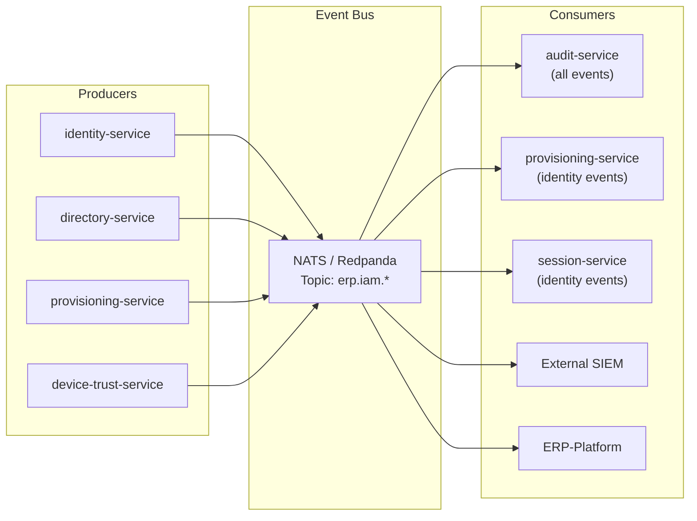
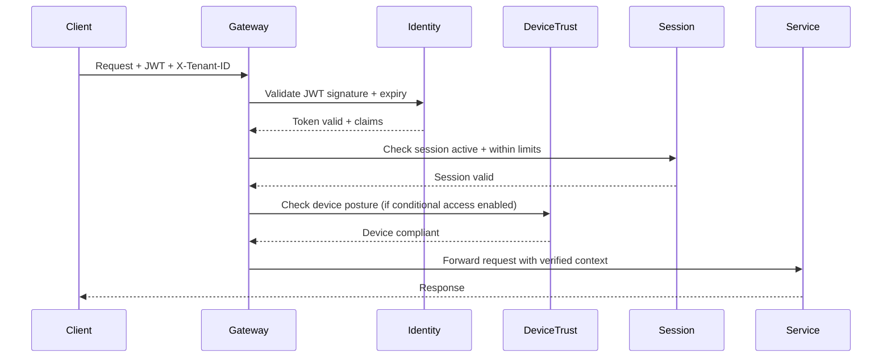
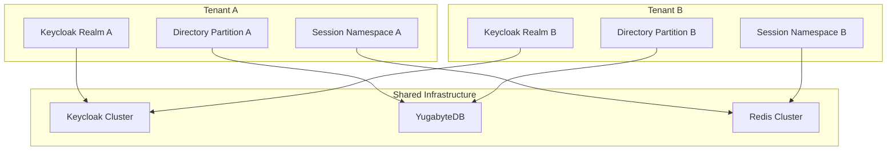
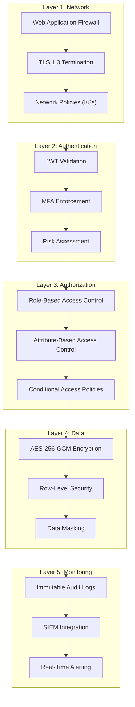
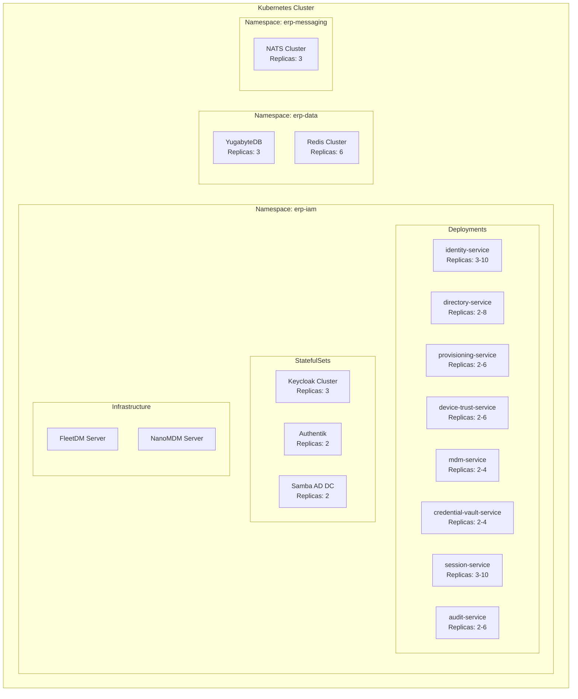

# ERP-IAM Software Architecture Document

> **Document ID:** ERP-IAM-SA-001
> **Version:** 1.0.0
> **Last Updated:** 2026-02-23
> **Status:** Approved
> **Related Documents:** [03-Technical-Writeup.md](./03-Technical-Writeup.md), [12-High-Level-Design.md](./12-High-Level-Design.md), [14-Technical-Specifications.md](./14-Technical-Specifications.md)

---

## 1. Introduction

### 1.1 Purpose

This document defines the software architecture for ERP-IAM, the Identity and Access Management module of the ERP suite. It describes the system's structural decomposition, communication patterns, data flows, and design decisions using the C4 model (Context, Container, Component, Code).

### 1.2 Scope

ERP-IAM encompasses identity provider services, directory management, user provisioning, device trust assessment, mobile device management, credential vaulting, session governance, and audit logging. The architecture supports both standalone deployment and suite-integrated mode.

### 1.3 Architectural Drivers

| Driver | Description |
|---|---|
| **Multi-Tenancy** | Complete tenant isolation at the data, compute, and network layers |
| **Zero Trust** | Every request is authenticated, authorized, and device-trust verified |
| **Protocol Breadth** | Support for OIDC, OAuth 2.0, SAML 2.0, LDAP, SCIM, WebAuthn simultaneously |
| **Horizontal Scale** | Each service scales independently based on its specific load characteristics |
| **Compliance** | SOC 2 Type II and ISO 27001 controls baked into the architecture |

---

## 2. C4 Model

### 2.1 Level 1: System Context

### 2.2 Level 2: Container Diagram

### 2.3 Level 3: Component Diagram (Identity Service)

### 2.4 Level 3: Component Diagram (Directory Service)

---

## 3. Architectural Patterns

### 3.1 Microservices with Domain Boundaries

The eight services are organized into three bounded contexts:

1. **Identity Domain**: `identity-service`, `directory-service`, `provisioning-service` -- owns user identity, authentication, and lifecycle
2. **Device Domain**: `device-trust-service`, `mdm-service` -- owns endpoint management and compliance
3. **Security Domain**: `credential-vault-service`, `session-service`, `audit-service` -- owns runtime security infrastructure

### 3.2 Event-Driven Architecture

All inter-service communication for non-synchronous operations uses the event bus. This ensures:
- **Loose coupling**: Services only know about event topics, not each other
- **Audit completeness**: The audit service subscribes to all events for immutable logging
- **Replay capability**: Event replay from NATS JetStream / Redpanda for recovery scenarios

### 3.3 Zero Trust Request Flow

Every API request passes through the following zero-trust verification chain:

### 3.4 Multi-Tenancy Model

Tenant isolation is enforced at multiple levels:
- **Keycloak**: Realm-per-tenant with isolated user stores, client registrations, and identity providers
- **Database**: Row-level security with `tenant_id` column on all tables; YugabyteDB tablespace-per-tenant option for large tenants
- **Redis**: Namespace prefixing (`tenant:{id}:session:{session_id}`) for session isolation
- **Events**: Tenant ID included in all CloudEvents metadata for event routing and filtering
- **API**: `X-Tenant-ID` header validation on every request with JWT claim cross-verification

---

## 4. Communication Patterns

### 4.1 Synchronous (Request-Response)

| Pattern | Use Case | Protocol |
|---|---|---|
| REST API | Client-to-service, service-to-service queries | HTTP/2 + JSON |
| LDAP | Directory queries, LDAP bind authentication | LDAP v3 + StartTLS |
| gRPC | High-throughput internal service communication | Protocol Buffers over HTTP/2 |

### 4.2 Asynchronous (Event-Driven)

| Pattern | Use Case | Protocol |
|---|---|---|
| Pub/Sub | Authentication events, provisioning triggers, audit logging | NATS JetStream |
| Queue | MDM command delivery, credential rotation jobs | NATS Queue Groups |
| Stream | SIEM integration, compliance report generation | Redpanda (Kafka protocol) |

### 4.3 Federation

| Pattern | Use Case | Protocol |
|---|---|---|
| OIDC Federation | Cross-realm SSO, social login | OpenID Connect |
| SAML Federation | Enterprise SSO with legacy IdPs | SAML 2.0 |
| SCIM Provisioning | User lifecycle sync with external systems | SCIM 2.0 over HTTPS |
| AD Replication | Multi-site directory sync | DRS (Directory Replication Service) |

---

## 5. Security Architecture

### 5.1 Defense in Depth

### 5.2 Encryption Strategy

| Layer | Algorithm | Key Management |
|---|---|---|
| Transport | TLS 1.3 (ECDHE + AES-256-GCM) | Let's Encrypt / cert-manager |
| Credential at rest | AES-256-GCM | HSM-backed master key, envelope encryption |
| Database at rest | AES-256 (YugabyteDB TDE) | YugabyteDB key management |
| Session tokens | HMAC-SHA256 | Rotating signing keys (72-hour lifecycle) |
| Audit log chain | SHA-256 | Hash chain with previous entry linkage |

---

## 6. Deployment Architecture

### 6.1 Kubernetes Deployment Model

### 6.2 High Availability

- **Active-Active**: All services run in active-active configuration across availability zones
- **Pod Anti-Affinity**: Service replicas spread across different nodes/zones
- **Health Checks**: Liveness (`/healthz`) and readiness probes on all pods
- **Circuit Breakers**: Resilience patterns (retry, circuit breaker, bulkhead) via service mesh
- **Auto-Scaling**: HPA with custom metrics (auth rate, LDAP query rate, SCIM sync backlog)

---

## 7. Technology Decision Records

### 7.1 ADR-001: Language Choice

**Decision**: Polyglot -- Go for API services, Python/Flask for web admin, Dart/Flutter for mobile MFA app.

**Rationale**: Go provides the performance and concurrency characteristics needed for high-throughput identity operations. Python/Flask is retained from the IDaaS2 webapp for admin UI. Flutter enables a single MFA authenticator codebase targeting both iOS and Android.

### 7.2 ADR-002: Database Selection

**Decision**: YugabyteDB primary, Redis cache.

**Rationale**: YugabyteDB provides PostgreSQL wire compatibility (critical for Keycloak/Authentik) with distributed SQL for global replication and horizontal scaling. Redis provides sub-millisecond session lookups with built-in TTL for automatic session expiry.
