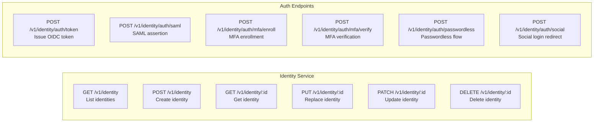

# ERP-IAM Backend API Reference

> **Document ID:** ERP-IAM-API-001
> **Version:** 1.0.0
> **Last Updated:** 2026-02-23
> **Status:** Approved
> **Related Documents:** [04-Software-Architecture.md](./04-Software-Architecture.md), [14-Technical-Specifications.md](./14-Technical-Specifications.md)

---

## 1. Overview

ERP-IAM exposes RESTful APIs across eight microservices, all following consistent conventions for authentication, multi-tenancy, error handling, and event emission. This document provides the comprehensive API reference for all endpoints.

### 1.1 Base URL

```
https://{deployment-host}/v1/{service-entity}
```

### 1.2 Authentication

All business endpoints require:
- **Authorization**: `Bearer {JWT}` -- JWT issued by the ERP-IAM identity-service (Keycloak)
- **X-Tenant-ID**: Required header for tenant-scoped operations

The `/healthz` endpoint on every service is unauthenticated for infrastructure health checks.

### 1.3 Common Headers

| Header | Required | Description |
|---|---|---|
| `Authorization` | Yes (except `/healthz`) | `Bearer {JWT}` token from ERP-IAM |
| `X-Tenant-ID` | Yes (except `/healthz`) | UUID of the target tenant |
| `Content-Type` | Yes (POST/PUT/PATCH) | `application/json` |
| `Accept` | Optional | `application/json` (default) |
| `X-Request-ID` | Optional | Client-generated correlation ID for tracing |
| `X-Idempotency-Key` | Optional | Idempotency key for POST operations |

### 1.4 Standard Error Response

```json
{
  "error": "string describing the error",
  "code": "ERROR_CODE",
  "details": {},
  "request_id": "correlation-id"
}
```

### 1.5 Standard Event Emission

All mutating operations emit a CloudEvents envelope to the event bus:

```json
{
  "specversion": "1.0",
  "type": "erp.iam.{entity}.{action}",
  "source": "/v1/{entity}",
  "id": "uuid",
  "time": "2026-02-23T00:00:00Z",
  "datacontenttype": "application/json",
  "data": { ... }
}
```

---

## 2. Identity Service API

**Base Path**: `/v1/identity`

### 2.1 Endpoints



### 2.2 List Identities

```
GET /v1/identity
```

**Query Parameters:**

| Parameter | Type | Description |
|---|---|---|
| `page` | integer | Page number (default: 1) |
| `page_size` | integer | Items per page (default: 20, max: 100) |
| `filter` | string | SCIM-style filter expression |
| `sort` | string | Sort field (e.g., `created_at`, `username`) |
| `order` | string | `asc` or `desc` |

**Response 200:**

```json
{
  "items": [
    {
      "id": "550e8400-e29b-41d4-a716-446655440000",
      "username": "john.doe",
      "email": "john.doe@example.com",
      "display_name": "John Doe",
      "active": true,
      "mfa_enrolled": true,
      "created_at": "2026-01-15T10:30:00Z",
      "last_login": "2026-02-23T08:15:00Z"
    }
  ],
  "total": 1542,
  "page": 1,
  "page_size": 20,
  "event_topic": "erp.iam.identity.listed"
}
```

### 2.3 Create Identity

```
POST /v1/identity
```

**Request Body:**

```json
{
  "username": "jane.smith",
  "email": "jane.smith@example.com",
  "display_name": "Jane Smith",
  "password": "initial-password",
  "attributes": {
    "department": "Engineering",
    "employee_id": "EMP-1234",
    "location": "San Francisco"
  },
  "groups": ["engineering", "sso-users"],
  "mfa_required": true,
  "force_password_change": true
}
```

**Response 201:**

```json
{
  "item": {
    "id": "660e8400-e29b-41d4-a716-446655440001",
    "username": "jane.smith",
    "email": "jane.smith@example.com",
    "active": true,
    "created_at": "2026-02-23T10:00:00Z"
  },
  "event_topic": "erp.iam.identity.created"
}
```

### 2.4 OIDC Token Issuance

```
POST /v1/identity/auth/token
```

**Request Body (Authorization Code):**

```json
{
  "grant_type": "authorization_code",
  "code": "auth-code-from-redirect",
  "redirect_uri": "https://app.example.com/callback",
  "client_id": "erp-web-client",
  "code_verifier": "pkce-code-verifier"
}
```

**Response 200:**

```json
{
  "access_token": "eyJ...",
  "token_type": "Bearer",
  "expires_in": 3600,
  "refresh_token": "eyJ...",
  "id_token": "eyJ...",
  "scope": "openid profile email"
}
```

---

## 3. Directory Service API

**Base Path**: `/v1/directory`

### 3.1 User Operations

| Method | Path | Description |
|---|---|---|
| GET | `/v1/directory/users` | List directory users |
| POST | `/v1/directory/users` | Create directory user |
| GET | `/v1/directory/users/:id` | Get user details |
| PUT | `/v1/directory/users/:id` | Update user |
| DELETE | `/v1/directory/users/:id` | Delete user |

### 3.2 Group Operations

| Method | Path | Description |
|---|---|---|
| GET | `/v1/directory/groups` | List groups |
| POST | `/v1/directory/groups` | Create group |
| GET | `/v1/directory/groups/:id` | Get group details |
| PUT | `/v1/directory/groups/:id` | Update group |
| DELETE | `/v1/directory/groups/:id` | Delete group |
| POST | `/v1/directory/groups/:id/members` | Add member |
| DELETE | `/v1/directory/groups/:id/members/:uid` | Remove member |

### 3.3 OU Operations

| Method | Path | Description |
|---|---|---|
| GET | `/v1/directory/ous` | List organizational units |
| POST | `/v1/directory/ous` | Create OU |
| GET | `/v1/directory/ous/:id` | Get OU details |
| PUT | `/v1/directory/ous/:id` | Update OU |
| DELETE | `/v1/directory/ous/:id` | Delete OU |

### 3.4 LDAP Query Interface

```
POST /v1/directory/ldap/search
```

**Request Body:**

```json
{
  "base_dn": "ou=Engineering,dc=example,dc=com",
  "scope": "subtree",
  "filter": "(&(objectClass=user)(department=Engineering))",
  "attributes": ["cn", "mail", "memberOf", "department"],
  "page_size": 100,
  "page_cookie": ""
}
```

### 3.5 Directory Sync

```
POST /v1/directory/sync
```

**Request Body:**

```json
{
  "source": "azure_ad",
  "connection": {
    "tenant_id": "azure-tenant-id",
    "client_id": "app-client-id",
    "client_secret_ref": "credential-vault://azure-ad-secret"
  },
  "sync_type": "delta",
  "scope": {
    "users": true,
    "groups": true,
    "filter": "department eq 'Engineering'"
  }
}
```

---

## 4. Provisioning Service API

**Base Path**: `/v1/provisioning`

### 4.1 SCIM 2.0 Server Endpoints

These endpoints conform to RFC 7643 (SCIM Core Schema) and RFC 7644 (SCIM Protocol):

| Method | Path | Description |
|---|---|---|
| GET | `/v1/provisioning/scim/v2/Users` | List SCIM users |
| POST | `/v1/provisioning/scim/v2/Users` | Create SCIM user |
| GET | `/v1/provisioning/scim/v2/Users/:id` | Get SCIM user |
| PUT | `/v1/provisioning/scim/v2/Users/:id` | Replace SCIM user |
| PATCH | `/v1/provisioning/scim/v2/Users/:id` | Modify SCIM user |
| DELETE | `/v1/provisioning/scim/v2/Users/:id` | Delete SCIM user |
| GET | `/v1/provisioning/scim/v2/Groups` | List SCIM groups |
| POST | `/v1/provisioning/scim/v2/Groups` | Create SCIM group |
| POST | `/v1/provisioning/scim/v2/Bulk` | Bulk operations |
| GET | `/v1/provisioning/scim/v2/ServiceProviderConfig` | SCIM capabilities |
| GET | `/v1/provisioning/scim/v2/Schemas` | SCIM schemas |
| GET | `/v1/provisioning/scim/v2/ResourceTypes` | SCIM resource types |

### 4.2 Lifecycle Automation

```
POST /v1/provisioning/lifecycle
```

**Request Body:**

```json
{
  "event_type": "joiner",
  "user": {
    "id": "user-uuid",
    "department": "Engineering",
    "title": "Software Engineer",
    "manager_id": "manager-uuid",
    "start_date": "2026-03-01"
  },
  "rules": {
    "auto_provision_apps": ["slack", "github", "jira"],
    "assign_groups": ["engineering", "all-employees"],
    "assign_ou": "ou=Engineering,dc=example,dc=com",
    "notify_manager": true
  }
}
```

---

## 5. Device Trust Service API

**Base Path**: `/v1/device-trust`

### 5.1 Device Registration

```
POST /v1/device-trust/devices
```

**Request Body:**

```json
{
  "user_id": "user-uuid",
  "platform": "macos",
  "serial_number": "C02XK1XXJG5H",
  "hostname": "johns-macbook-pro",
  "os_version": "14.3.1",
  "agent_version": "5.11.0"
}
```

### 5.2 Posture Check

```
POST /v1/device-trust/devices/:id/posture-check
```

**Response 200:**

```json
{
  "device_id": "device-uuid",
  "compliant": true,
  "trust_score": 92,
  "checks": {
    "os_version": { "status": "pass", "current": "14.3.1", "minimum": "14.0" },
    "disk_encryption": { "status": "pass", "type": "FileVault", "enabled": true },
    "firewall": { "status": "pass", "enabled": true },
    "antivirus": { "status": "pass", "provider": "CrowdStrike", "up_to_date": true },
    "patch_level": { "status": "pass", "days_since_update": 3 },
    "jailbreak": { "status": "pass", "detected": false }
  },
  "evaluated_at": "2026-02-23T10:00:00Z"
}
```

### 5.3 Conditional Access Evaluation

```
POST /v1/device-trust/evaluate
```

**Request Body:**

```json
{
  "user_id": "user-uuid",
  "device_id": "device-uuid",
  "resource": "erp-finance",
  "action": "read"
}
```

**Response 200:**

```json
{
  "decision": "allow",
  "reason": "Device compliant, user authorized, no risk signals",
  "policy_applied": "default-conditional-access",
  "conditions_evaluated": [
    { "condition": "device_compliant", "result": true },
    { "condition": "mfa_completed", "result": true },
    { "condition": "location_allowed", "result": true },
    { "condition": "risk_score_acceptable", "result": true, "score": 12 }
  ]
}
```

---

## 6. MDM Service API

**Base Path**: `/v1/mdm`

### 6.1 Key Endpoints

| Method | Path | Description |
|---|---|---|
| GET | `/v1/mdm/devices` | List managed devices |
| POST | `/v1/mdm/devices/enroll` | Enroll device |
| GET | `/v1/mdm/devices/:id` | Get device details |
| POST | `/v1/mdm/devices/:id/commands` | Send MDM command |
| GET | `/v1/mdm/devices/:id/commands` | List command history |
| POST | `/v1/mdm/devices/:id/wipe` | Remote wipe |
| POST | `/v1/mdm/devices/:id/lock` | Remote lock |
| GET | `/v1/mdm/apps` | List managed apps |
| POST | `/v1/mdm/apps/deploy` | Deploy app to devices |
| GET | `/v1/mdm/profiles` | List configuration profiles |
| POST | `/v1/mdm/profiles` | Create configuration profile |

---

## 7. Credential Vault Service API

**Base Path**: `/v1/credential-vault`

### 7.1 Key Endpoints

| Method | Path | Description |
|---|---|---|
| GET | `/v1/credential-vault/secrets` | List secrets (metadata only) |
| POST | `/v1/credential-vault/secrets` | Store new secret |
| GET | `/v1/credential-vault/secrets/:id` | Retrieve secret value |
| PUT | `/v1/credential-vault/secrets/:id` | Update secret |
| DELETE | `/v1/credential-vault/secrets/:id` | Delete secret |
| POST | `/v1/credential-vault/secrets/:id/rotate` | Trigger rotation |
| GET | `/v1/credential-vault/secrets/:id/versions` | List secret versions |
| GET | `/v1/credential-vault/rotation-schedules` | List rotation schedules |

---

## 8. Session Service API

**Base Path**: `/v1/session`

### 8.1 Key Endpoints

| Method | Path | Description |
|---|---|---|
| GET | `/v1/session` | List active sessions |
| POST | `/v1/session` | Create session |
| GET | `/v1/session/:id` | Get session details |
| DELETE | `/v1/session/:id` | Terminate session |
| DELETE | `/v1/session/user/:uid` | Terminate all user sessions |
| GET | `/v1/session/user/:uid` | List user sessions |
| POST | `/v1/session/validate` | Validate session token |
| PUT | `/v1/session/:id/refresh` | Refresh session |

---

## 9. Audit Service API

**Base Path**: `/v1/audit`

### 9.1 Key Endpoints

| Method | Path | Description |
|---|---|---|
| GET | `/v1/audit` | Query audit logs |
| POST | `/v1/audit` | Write audit event |
| GET | `/v1/audit/:id` | Get audit event |
| GET | `/v1/audit/reports/soc2` | Generate SOC 2 report |
| GET | `/v1/audit/reports/iso27001` | Generate ISO 27001 report |
| POST | `/v1/audit/alerts` | Create alert rule |
| GET | `/v1/audit/alerts` | List alert rules |
| GET | `/v1/audit/siem/status` | SIEM connector status |

### 9.2 Audit Query Parameters

| Parameter | Type | Description |
|---|---|---|
| `event_type` | string | Filter by event type (e.g., `auth.login.success`) |
| `actor_id` | string | Filter by actor (user ID) |
| `resource_type` | string | Filter by resource type |
| `from` | datetime | Start of time range |
| `to` | datetime | End of time range |
| `severity` | string | `info`, `warning`, `critical` |

---

## 10. Health Check (All Services)

```
GET /healthz
```

**Response 200:**

```json
{
  "status": "healthy",
  "module": "ERP-IAM",
  "service": "{service-name}"
}
```

No authentication required. Used by Kubernetes liveness probes and ERP-Platform module registry.
