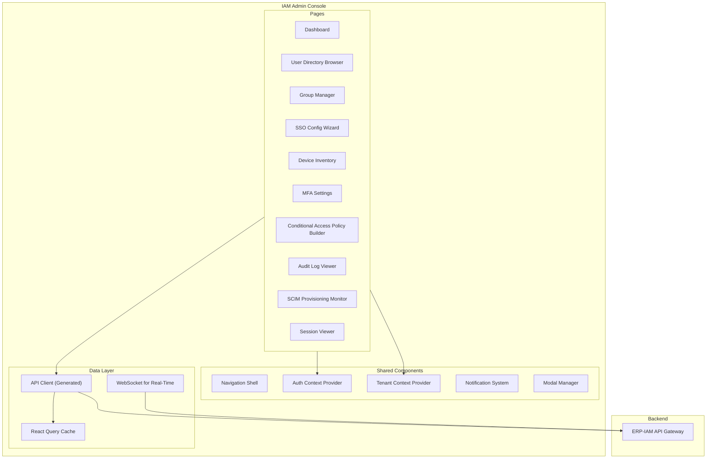
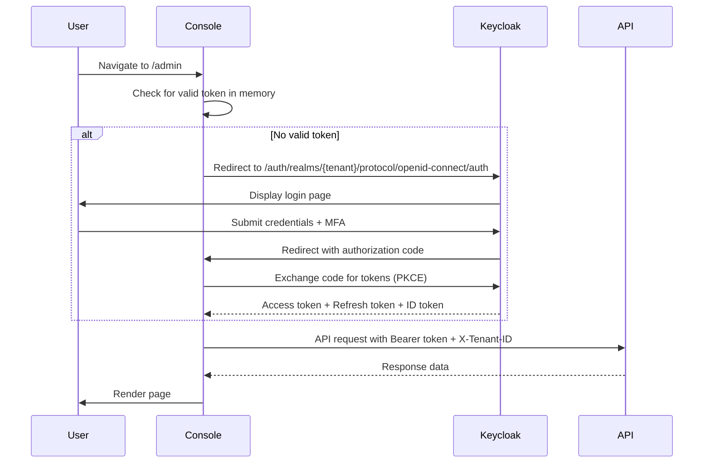
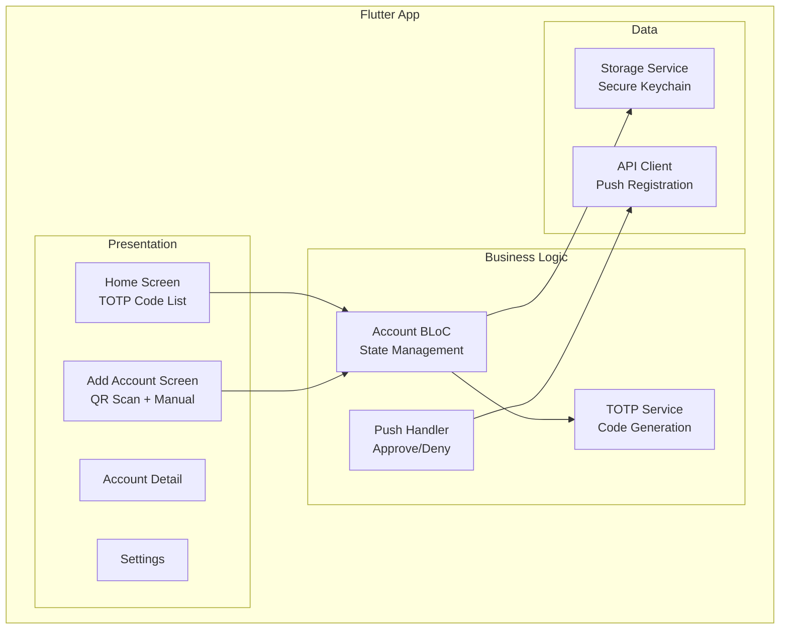
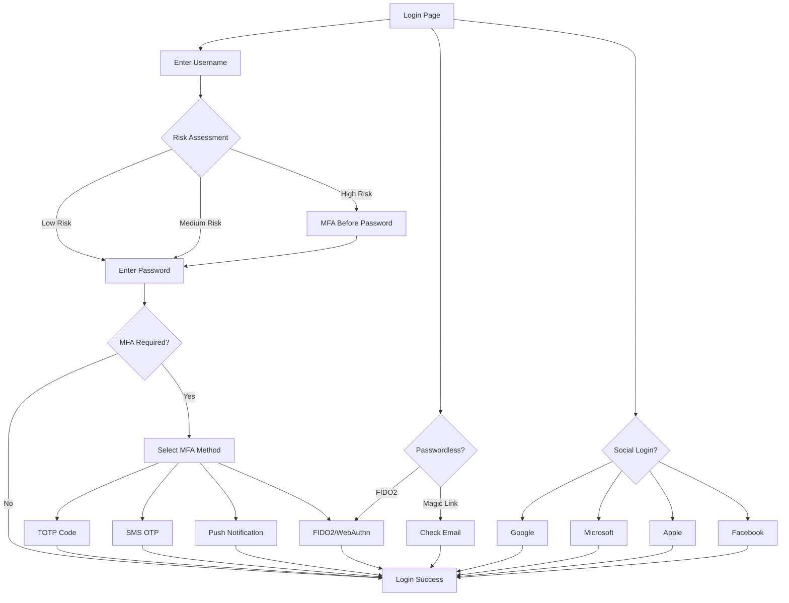

# ERP-IAM Frontend Documentation

> **Document ID:** ERP-IAM-FE-001
> **Version:** 1.0.0
> **Last Updated:** 2026-02-23
> **Status:** Approved
> **Related Documents:** [05-Backend-API-Reference.md](./05-Backend-API-Reference.md), [07-Figma-Design-Prompts.md](./07-Figma-Design-Prompts.md)

---

## 1. Overview

ERP-IAM provides three frontend surfaces: (1) a web-based IAM Admin Console for IT administrators and security officers, (2) a mobile MFA Authenticator app for end users, and (3) end-user login/self-service pages rendered by Keycloak. This document covers the architecture, component hierarchy, and implementation details for each surface.

---

## 2. IAM Admin Console (Web)

### 2.1 Technology Stack

| Layer | Technology |
|---|---|
| Framework | React 18+ with TypeScript |
| State Management | Zustand with React Query for server state |
| Routing | React Router v6 |
| UI Kit | Shadcn/ui (Radix primitives + Tailwind CSS) |
| Charts | Recharts for dashboard visualizations |
| Tables | TanStack Table v8 for data grids |
| Forms | React Hook Form + Zod validation |
| API Client | OpenAPI-generated TypeScript SDK |
| Build | Vite 5 with tree shaking and code splitting |

### 2.2 Application Architecture



### 2.3 Page Component Hierarchy

#### Dashboard
```
DashboardPage
  +-- SecurityScoreCard (overall security posture)
  +-- AuthenticationMetrics (login success/failure rates)
  +-- ActiveSessionsWidget (real-time count)
  +-- DeviceComplianceWidget (compliant vs non-compliant)
  +-- RecentAuditEventsWidget (last 10 events)
  +-- MFAAdoptionChart (enrollment percentage)
  +-- ProvisioningActivityFeed (recent joiner/mover/leaver)
```

#### User Directory Browser
```
UserDirectoryPage
  +-- DirectoryTree (OU hierarchy sidebar)
  +-- UserDataTable
  |   +-- ColumnHeader (sortable)
  |   +-- UserRow
  |   +-- PaginationControls
  +-- UserDetailDrawer
  |   +-- ProfileTab (attributes, photo, status)
  |   +-- GroupsTab (group memberships)
  |   +-- DevicesTab (registered devices)
  |   +-- SessionsTab (active sessions)
  |   +-- AuditTab (user-specific audit trail)
  +-- UserCreateDialog
  +-- BulkImportDialog
```

#### Group Manager
```
GroupManagerPage
  +-- GroupList (searchable, filterable)
  +-- GroupDetailPanel
  |   +-- MemberList (with add/remove)
  |   +-- PolicyAssignments
  |   +-- NestedGroupTree
  +-- GroupCreateDialog
  +-- DynamicMembershipRuleBuilder
```

#### SSO Config Wizard
```
SSOConfigWizardPage
  +-- WizardStepper
  +-- Step1_ProtocolSelection (OIDC/SAML/LDAP)
  +-- Step2_ProviderConfig
  |   +-- OIDCConfigForm (client ID, secret, scopes)
  |   +-- SAMLConfigForm (metadata URL, signing cert)
  |   +-- LDAPConfigForm (host, bind DN, base DN)
  +-- Step3_AttributeMapping
  +-- Step4_TestConnection
  +-- Step5_ReviewAndActivate
```

#### Device Inventory Dashboard
```
DeviceInventoryPage
  +-- DeviceStatsBar (total, compliant, non-compliant, offline)
  +-- PlatformBreakdownChart (macOS/Windows/Linux/iOS/Android)
  +-- DeviceDataTable
  |   +-- ComplianceBadge
  |   +-- PlatformIcon
  |   +-- LastCheckinTime
  +-- DeviceDetailDrawer
  |   +-- PostureChecksPanel
  |   +-- MDMCommandHistory
  |   +-- InstalledAppsPanel
  +-- RemoteActionMenu (wipe, lock, restart)
```

### 2.4 Routing Structure

```typescript
const routes = [
  { path: '/', element: <DashboardPage /> },
  { path: '/users', element: <UserDirectoryPage /> },
  { path: '/users/:id', element: <UserDetailPage /> },
  { path: '/groups', element: <GroupManagerPage /> },
  { path: '/groups/:id', element: <GroupDetailPage /> },
  { path: '/sso', element: <SSOConfigWizardPage /> },
  { path: '/sso/:id', element: <SSOConnectionDetail /> },
  { path: '/devices', element: <DeviceInventoryPage /> },
  { path: '/devices/:id', element: <DeviceDetailPage /> },
  { path: '/mfa', element: <MFASettingsPage /> },
  { path: '/policies', element: <ConditionalAccessPage /> },
  { path: '/policies/:id', element: <PolicyDetailPage /> },
  { path: '/audit', element: <AuditLogViewerPage /> },
  { path: '/provisioning', element: <SCIMProvisioningPage /> },
  { path: '/sessions', element: <SessionViewerPage /> },
  { path: '/vault', element: <CredentialVaultPage /> },
  { path: '/settings', element: <SettingsPage /> },
];
```

### 2.5 Authentication Flow



---

## 3. MFA Authenticator Mobile App

### 3.1 Technology Stack

| Layer | Technology |
|---|---|
| Framework | Flutter 3.x / Dart |
| State Management | BLoC (Business Logic Component) pattern |
| Secure Storage | flutter_secure_storage (Keychain/Keystore) |
| TOTP | otp library (RFC 6238) |
| QR Scanning | mobile_scanner |
| Push Notifications | Firebase Cloud Messaging |

### 3.2 App Architecture



### 3.3 Core Screens

1. **Home Screen**: Displays all enrolled accounts with live TOTP codes and countdown timers. Codes auto-refresh every 30 seconds.
2. **Add Account Screen**: Camera-based QR code scanning or manual entry of TOTP secret, issuer, and account name.
3. **Push Approval Screen**: Full-screen prompt for push-based MFA with device info, location, and approve/deny buttons.
4. **Settings Screen**: Biometric unlock toggle, dark mode, export/backup encrypted vault.

---

## 4. Keycloak Login Pages

### 4.1 Custom Theme Structure

```
themes/erp-iam/
  +-- login/
  |   +-- login.ftl (username/password form)
  |   +-- login-otp.ftl (TOTP input)
  |   +-- login-webauthn.ftl (FIDO2 prompt)
  |   +-- login-social.ftl (social provider buttons)
  |   +-- login-magic-link.ftl (magic link sent confirmation)
  |   +-- login-reset-password.ftl (self-service password reset)
  +-- account/
  |   +-- account.ftl (user profile management)
  |   +-- sessions.ftl (active session list)
  |   +-- totp.ftl (MFA enrollment)
  +-- resources/
      +-- css/erp-iam-theme.css
      +-- img/logo.svg
      +-- js/webauthn-helper.js
```

### 4.2 Login Flow Variations



---

## 5. Accessibility and Internationalization

### 5.1 Accessibility (WCAG 2.1 AA)

- All form inputs have associated `<label>` elements
- Color contrast ratios meet 4.5:1 minimum
- Keyboard navigation for all interactive elements
- ARIA landmarks and live regions for screen readers
- Focus management in modal dialogs and wizards
- High-contrast mode support

### 5.2 Internationalization (i18n)

- ICU MessageFormat for pluralization and date/number formatting
- Initial language support: English, Spanish, French, German, Portuguese, Japanese, Chinese (Simplified)
- RTL layout support for Arabic and Hebrew
- Keycloak theme messages externalized for translation
