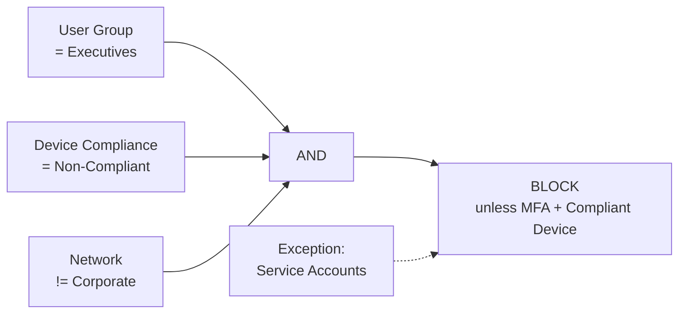
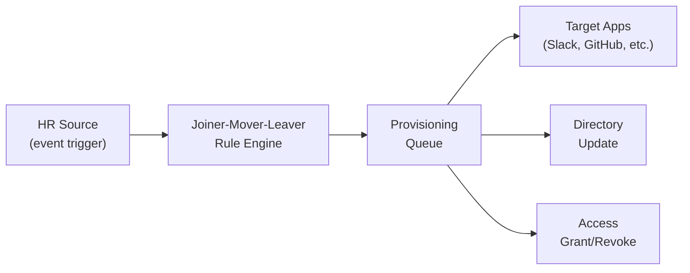

# ERP-IAM Figma Design Prompts

> **Document ID:** ERP-IAM-FIG-001
> **Version:** 1.0.0
> **Last Updated:** 2026-02-23
> **Status:** Approved
> **Related Documents:** [06-Frontend-Documentation.md](./06-Frontend-Documentation.md), [08-UX-Flows.md](./08-UX-Flows.md)

---

## 1. Overview

This document provides detailed Figma design prompts for the 10 primary screens of the ERP-IAM Admin Console. Each prompt specifies the layout, component inventory, data visualization requirements, interaction patterns, and responsive behavior. Designers should treat each prompt as a complete specification for creating high-fidelity mockups.

---

## 2. Design System Foundation

### 2.1 Color Palette

| Token | Value | Usage |
|---|---|---|
| `--iam-primary` | `#1E40AF` (Blue 800) | Primary actions, active nav, headers |
| `--iam-success` | `#059669` (Emerald 600) | Compliant status, successful auth |
| `--iam-warning` | `#D97706` (Amber 600) | Partially compliant, expiring items |
| `--iam-danger` | `#DC2626` (Red 600) | Non-compliant, blocked, critical alerts |
| `--iam-surface` | `#F8FAFC` (Slate 50) | Page background |
| `--iam-card` | `#FFFFFF` | Card surfaces |
| `--iam-text-primary` | `#0F172A` (Slate 900) | Primary text |
| `--iam-text-secondary` | `#64748B` (Slate 500) | Secondary text, labels |

### 2.2 Typography

- **Headings**: Inter, semibold, sizes 14/16/20/24/30px
- **Body**: Inter, regular, 14px, line-height 1.5
- **Monospace**: JetBrains Mono, 13px (for IDs, tokens, code)

### 2.3 Grid System

- 12-column grid, 24px gutters
- Sidebar: 256px fixed width (collapsible to 64px icon-only)
- Content area: fluid, max-width 1440px centered

---

## 3. Prompt 1: IAM Admin Console Dashboard

**Screen Name**: `IAM-Dashboard`

**Layout Description**: Full-width dashboard with a persistent left sidebar navigation. The main content area uses a 2x3 card grid at desktop breakpoints. A top bar shows the current tenant name, the logged-in admin avatar, and a global search input.

**Component Inventory**:
1. **Security Score Card** (top-left, spans 1 column): Large circular gauge (0-100) showing overall identity security posture. Color transitions from red (0-40) to amber (41-70) to green (71-100). Below the gauge: three metric pills showing "MFA Adoption: 87%", "Device Compliance: 92%", "Password Policy: 95%".
2. **Authentication Metrics Card** (top-center, spans 1 column): Stacked area chart showing login attempts over the last 7 days. Two series: successful (green fill) and failed (red fill). Below the chart: three stat boxes -- "Total Logins: 45,231", "Failed: 892 (2.0%)", "MFA Challenges: 12,456".
3. **Active Sessions Widget** (top-right, spans 1 column): Large number display "12,847 Active Sessions". Below: horizontal bar chart breaking down by platform (Windows 45%, macOS 30%, Linux 10%, iOS 10%, Android 5%). A "View All" link navigates to Session Viewer.
4. **Device Compliance Widget** (bottom-left, spans 1 column): Donut chart with three segments -- Compliant (green, 85%), Partially Compliant (amber, 10%), Non-Compliant (red, 5%). Center text: "3,421 Devices". Below: list of top 3 compliance failures (e.g., "OS outdated: 89 devices").
5. **Recent Audit Events** (bottom-center, spans 1 column): Scrollable list of the 10 most recent audit events. Each row: severity icon (colored dot), event description truncated to one line, relative timestamp ("2m ago"). Row click opens Audit Log Viewer filtered to that event.
6. **Provisioning Activity Feed** (bottom-right, spans 1 column): Timeline view of recent provisioning events. Each entry: avatar, user name, action ("Joined Engineering team"), timestamp. Icons differentiate joiner (green plus), mover (blue arrow), leaver (red minus).

**Navigation Sidebar Items**: Dashboard (active), Users, Groups, SSO, Devices, MFA, Policies, Audit, Provisioning, Sessions, Vault, Settings.

**Responsive Behavior**: Cards stack to single column below 768px. Sidebar collapses to bottom tab bar on mobile.

---

## 4. Prompt 2: User Directory Browser

**Screen Name**: `IAM-Users-Directory`

**Layout Description**: Three-panel layout. Left panel (220px): OU tree navigator with expand/collapse nodes. Center panel (fluid): data table of users. Right panel (380px, slide-in drawer): user detail view that appears on row selection.

**Component Inventory**:
1. **OU Tree** (left): Hierarchical tree with folder icons. Root node shows domain name. Nested nodes for each OU (Engineering, Sales, Marketing, etc.). Selected OU is highlighted in blue. Expand/collapse chevrons. Count badge on each node showing user count.
2. **User Table** (center): Columns -- Checkbox (for bulk select), Avatar + Full Name, Email, Department, Status (Active/Disabled badge), MFA (shield icon green/gray), Last Login (relative time), Actions (three-dot menu). Header row with sort arrows. Search bar above table with filter chips (Status, Department, MFA Status). Pagination footer: "Showing 1-20 of 1,542 users".
3. **User Detail Drawer** (right): Tabs -- Profile, Groups, Devices, Sessions, Audit. Profile tab: large avatar, full name, email, username, department, title, employee ID, created date, last login, status toggle. Groups tab: list of group memberships with "Add to Group" button. Devices tab: cards for each registered device showing platform icon, device name, compliance status. Sessions tab: list of active sessions with "Terminate" button per session. Audit tab: filtered audit log for this user.
4. **Action Bar** (above table): Buttons -- "Create User" (primary), "Import CSV" (secondary), "Export" (secondary). Bulk action dropdown appears when checkboxes selected: "Disable Selected", "Enable Selected", "Move to OU", "Delete Selected".

**Interaction**: Clicking a row opens the drawer. Clicking the OU tree filters the table to that OU. Search is debounced (300ms). Sorting is server-side.

---

## 5. Prompt 3: Group Manager

**Screen Name**: `IAM-Groups`

**Layout Description**: Two-panel layout. Left panel (300px): scrollable group list with search. Right panel (fluid): group detail view.

**Component Inventory**:
1. **Group List** (left): Search input at top. Each group entry: group name, member count badge, group type icon (static/dynamic). Active group has blue left border. "Create Group" button at bottom of list.
2. **Group Detail** (right): Header -- group name (editable inline), type badge, description. Three tabs: Members, Policies, Nested Groups. Members tab: data table with columns -- Avatar, Name, Email, Role in Group, Added Date. "Add Member" button opens user search popover. "Remove" action on each row. Policies tab: list of policy assignments (e.g., "Require MFA", "Block legacy auth") with toggle switches. Nested Groups tab: tree view of parent and child group relationships.
3. **Dynamic Membership Rule Builder**: When group type is "dynamic", the Members tab shows a visual rule builder instead of a static member list. Rule builder: condition rows with field dropdowns (Department, Title, Location), operator dropdowns (equals, contains, starts with), value inputs. "AND/OR" connectors between rows. Preview button shows matching users count.

---

## 6. Prompt 4: SSO Configuration Wizard

**Screen Name**: `IAM-SSO-Wizard`

**Layout Description**: Full-width wizard with a horizontal stepper at the top. Five steps: Protocol, Configuration, Attribute Mapping, Test, Activate. Left side (60%): form content for current step. Right side (40%): contextual help panel with protocol-specific documentation and diagrams.

**Component Inventory**:
1. **Stepper** (top): Five numbered circles connected by lines. Completed steps are green with checkmark. Current step is blue and enlarged. Future steps are gray. Step labels below each circle.
2. **Step 1 - Protocol Selection**: Three large selectable cards arranged horizontally. Each card: protocol icon (OIDC lock, SAML shield, LDAP directory), protocol name, brief description, "Recommended" badge on OIDC card. Selecting a card highlights it with blue border and enables "Next" button.
3. **Step 2 - Provider Configuration**: Form fields vary by protocol. OIDC: Client ID, Client Secret (masked with reveal toggle), Discovery URL, Redirect URIs (tag input), Scopes (multi-select chips). SAML: Metadata URL (with "Fetch" button) or manual entry -- Entity ID, SSO URL, SLO URL, Certificate upload. LDAP: Host, Port, Bind DN, Bind Password, Base DN, User Filter, Group Filter, "Test Connection" button.
4. **Step 3 - Attribute Mapping**: Two-column mapping table. Left column: "Source Attribute" dropdowns populated from discovered claims. Right column: "ERP-IAM Attribute" dropdowns (username, email, first_name, last_name, department, groups). Plus button to add mapping rows. Trash icon to remove.
5. **Step 4 - Test Connection**: Large "Run Test" button. Below: real-time test log output in a terminal-style panel. Green checkmarks for passed steps, red X for failures. Test steps: "Connecting...", "Fetching metadata...", "Authenticating test user...", "Verifying attribute mapping...", "Test complete".
6. **Step 5 - Review and Activate**: Summary card showing all configuration. Toggle for "Active" (defaults to off). "Activate" button. Warning message: "Activating this SSO connection will allow users to sign in via {provider name}."

**Contextual Help Panel** (right side): Shows protocol-specific diagram for the current step. For OIDC Step 2, show the authorization code flow. For SAML Step 2, show the SAML assertion flow. Help text with links to documentation.

---

## 7. Prompt 5: Device Inventory Dashboard

**Screen Name**: `IAM-Devices`

**Layout Description**: Top stats bar, followed by a filterable data table. Filter bar includes platform selector, compliance status, and last check-in range.

**Component Inventory**:
1. **Stats Bar** (top, horizontal): Four stat cards -- Total Devices (icon: laptop), Compliant (icon: shield-check, green), Non-Compliant (icon: shield-x, red), Offline > 7 days (icon: wifi-off, amber). Each card shows count and percentage change from last week.
2. **Platform Breakdown** (below stats): Horizontal segmented bar showing platform distribution. Each segment colored differently (macOS: gray, Windows: blue, Linux: orange, iOS: dark, Android: green). Segment labels with counts.
3. **Device Table**: Columns -- Device Name, Platform (icon), User (linked), Serial Number (monospace), OS Version, Compliance (colored badge: Compliant/Warning/Non-Compliant), Last Check-in (relative), Actions. Filter chips above: Platform (multi-select), Compliance Status, OS Version range, Last Check-in (Last 24h / Last 7d / Last 30d / Older).
4. **Device Detail Drawer** (slide-in): Device name and platform icon header. Tabs: Posture, MDM, Apps, History. Posture tab: checklist of posture checks with pass/fail icons -- OS Version, Disk Encryption, Firewall, Antivirus, Patch Level, Jailbreak. Each check shows current value vs required. MDM tab: enrollment status, last MDM check-in, configuration profiles applied. Apps tab: list of installed managed apps. History tab: timeline of posture check results.
5. **Remote Action Menu** (in drawer or row action): Dropdown with -- "Send MDM Command", "Remote Lock", "Remote Wipe" (with confirmation dialog), "Request Check-in", "Unenroll Device".

---

## 8. Prompt 6: MFA Settings

**Screen Name**: `IAM-MFA-Settings`

**Layout Description**: Single-page settings layout with sections for MFA policy configuration. Card-based sections stacked vertically.

**Component Inventory**:
1. **MFA Policy Card**: Toggle switch for "Require MFA for all users". Below: radio group for enforcement level -- "Required for all logins", "Required for sensitive operations only", "Optional (user choice)". Grace period input: "Allow users X days to enroll before enforcement" with number input.
2. **Allowed Methods Card**: Checkboxes for each MFA method with individual settings. TOTP: enable/disable, issuer name, algorithm (SHA-1/SHA-256), digit count (6/8). SMS: enable/disable, SMS provider selector (Twilio/Vonage/AWS SNS), rate limit (max OTPs per hour). Push Notification: enable/disable, expiry timeout (seconds). Hardware Keys: enable/disable, allowed key types (FIDO2 U2F, YubiKey OTP). Magic Links: enable/disable, link expiry (minutes), max uses (1).
3. **MFA Adoption Dashboard** (embedded): Horizontal stacked bar showing enrolled vs not enrolled. Below: table of users not yet enrolled with "Send Reminder" bulk action. Pie chart of method distribution (TOTP 60%, Push 25%, SMS 10%, Hardware Key 5%).
4. **Recovery Options Card**: Recovery codes toggle (enable/disable, number of codes: 10), admin bypass toggle, trusted device memory (checkbox "Remember this device for X days").

---

## 9. Prompt 7: Conditional Access Policy Builder

**Screen Name**: `IAM-Conditional-Access`

**Layout Description**: Two-panel. Left: list of existing policies with status toggles. Right: visual policy builder canvas.

**Component Inventory**:
1. **Policy List** (left, 300px): Each policy card: name, status (Active/Disabled toggle), priority number, brief description. "Create Policy" button at top. Drag handles for priority reordering.
2. **Policy Builder Canvas** (right): Visual flow builder with connected blocks. Block types:
   - **Condition Block** (blue): Dropdowns for condition type (User Group, Device Platform, IP Range, Location, Risk Score, Time of Day, Application). Operator dropdown. Value input/selector.
   - **AND/OR Connector**: Toggleable junction between condition blocks.
   - **Action Block** (green/red): "Allow" (green) or "Block" (red) with optional requirements: "Require MFA", "Require compliant device", "Require managed device", "Block legacy authentication", "Require password change".
   - **Exception Block** (yellow): Excluded users/groups.
3. **Policy Preview Panel** (bottom drawer): Natural language summary of the policy: "When a user in group 'Executives' accesses 'ERP-Finance' from a non-compliant device outside the corporate network, require MFA and a compliant device. Except: Service accounts."
4. **Policy Test Mode**: Toggle to enable "Report-only" mode that logs what the policy would do without enforcing it. Test results show in the Audit Log.

**Visual Flow Example:**

---

## 10. Prompt 8: Audit Log Viewer

**Screen Name**: `IAM-Audit-Logs`

**Layout Description**: Full-width log viewer with powerful filtering at the top and a scrollable log table below. Similar to Datadog or Splunk log explorer aesthetic.

**Component Inventory**:
1. **Time Range Selector** (top-right): Preset buttons (Last 15m, 1h, 4h, 24h, 7d, 30d) plus custom date range picker.
2. **Search Bar** (top, full width): Lucene-style query input with autocomplete. Examples: `event_type:auth.login.failed AND actor:john.doe`, `severity:critical`.
3. **Filter Chips** (below search): Quick filter chips for Event Type (dropdown with categories: Authentication, Directory, Provisioning, Device, Session, Admin), Severity (Info/Warning/Critical), Actor (user search), Resource (entity type).
4. **Log Table**: Columns -- Timestamp (absolute with relative tooltip), Severity (colored dot), Event Type (badge), Actor (user link), Resource, Description, IP Address. Rows are color-coded by severity (subtle background tint). Clicking a row expands an inline detail panel showing full JSON payload, chain hash, and related events.
5. **Event Detail Panel** (inline expansion or side drawer): Full event JSON with syntax highlighting. "Chain Hash" field with verification status (green check if chain valid). "Related Events" section linking to correlated events (e.g., MFA challenge that preceded a login). "Copy Event" and "Export" buttons.
6. **Aggregation Bar** (above table): Histogram showing event volume over selected time range. Bar segments colored by severity. Brush selection on histogram filters the table.
7. **Export Options**: "Export CSV", "Export JSON", "Send to SIEM" buttons.

---

## 11. Prompt 9: SCIM Provisioning Monitor

**Screen Name**: `IAM-SCIM-Monitor`

**Layout Description**: Operations dashboard focused on provisioning health. Top metrics row, sync job table, and real-time event stream.

**Component Inventory**:
1. **Metrics Row** (top): Four cards -- "Active Connections" (count), "Last 24h Operations" (count with breakdown: creates/updates/deletes), "Sync Error Rate" (percentage with trend arrow), "Pending Operations" (count).
2. **Connection Table**: Columns -- Connection Name, Type (Inbound SCIM/Outbound SCIM), Target Application (icon + name), Status (Active/Paused/Error badge), Last Sync (relative time), Objects Synced (count), Error Count. Row click opens connection detail.
3. **Connection Detail Panel**: Configuration summary, attribute mapping visualization, sync schedule, error log. "Force Sync" button. "Pause/Resume" toggle. Edit configuration link.
4. **Real-Time Event Stream** (bottom): Live-updating list of provisioning events as they occur. Each event: timestamp, operation icon (create: green plus, update: blue pencil, delete: red trash), user/group name, target application, status (success check or error X with message). Auto-scroll with "Pause" button.
5. **Lifecycle Pipeline Visualization**: Horizontal pipeline showing Joiner/Mover/Leaver flow with in-progress counts at each stage.

---

## 12. Prompt 10: Session Viewer

**Screen Name**: `IAM-Sessions`

**Layout Description**: Real-time session monitoring dashboard. World map at top showing session locations, session stats, and detailed session table.

**Component Inventory**:
1. **World Map** (top, 60% height): Interactive map with dots representing active session locations. Dot size proportional to session count at that location. Hover shows city name and session count. Color coding: green (normal), amber (flagged for review), red (blocked/suspicious). Click a region to filter the table.
2. **Session Stats Bar** (below map): Metrics -- "Active Sessions" (live count with pulse animation), "Unique Users" (count), "Avg Session Duration" (time), "Sessions Terminated (24h)" (count with breakdown: expired/forced/user-initiated).
3. **Session Table**: Columns -- User (avatar + name), Device (platform icon + name), IP Address, Location (city, country flag), Session Start (absolute), Idle Time, Status (Active/Idle/Expiring badge). Actions column: "Terminate" (red button), "View Details" (eye icon).
4. **Session Detail Drawer**: User info, device info, full session timeline (login, last activity, token refreshes), geolocation map pin, session policies applied (timeout settings, concurrent limits). "Terminate Session" button. "Terminate All Sessions for This User" button.
5. **Anomaly Alerts** (right sidebar or top banner): Flagged sessions with reasons -- "Impossible travel: New York to London in 2 hours", "New device type", "Unusual login time", "Concurrent session limit approaching". Each alert has "Investigate" and "Dismiss" actions.
