# ERP-IAM UX Flows

> **Document ID:** ERP-IAM-UX-001
> **Version:** 1.0.0
> **Last Updated:** 2026-02-23
> **Status:** Approved
> **Related Documents:** [06-Frontend-Documentation.md](./06-Frontend-Documentation.md), [07-Figma-Design-Prompts.md](./07-Figma-Design-Prompts.md)

---

## 1. Overview

This document defines the key user experience flows for ERP-IAM across all user personas. Each flow is described with a Mermaid diagram, happy path steps, error states, and accessibility considerations.

---

## 2. Authentication Flows

### 2.1 Standard Login Flow (Username + Password + MFA)

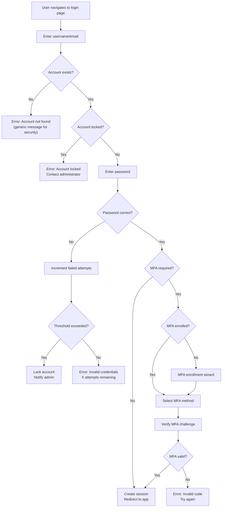

### 2.2 Passwordless Login (FIDO2/WebAuthn)

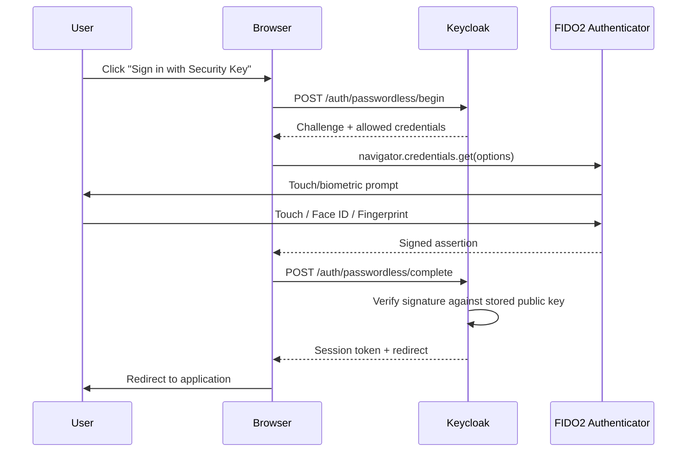

### 2.3 Magic Link Authentication

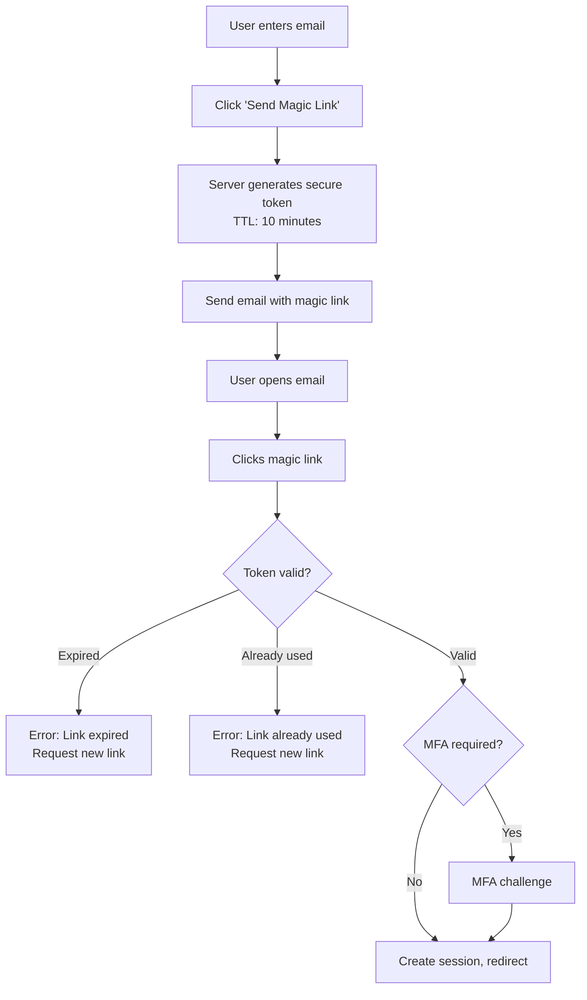

### 2.4 Social Login Flow

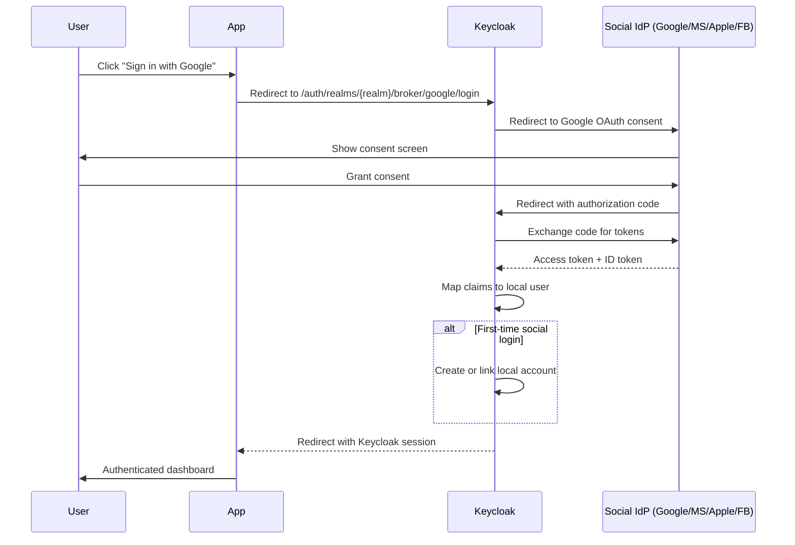

---

## 3. Self-Service Flows

### 3.1 Self-Service Password Reset

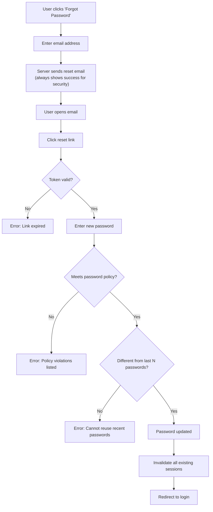

### 3.2 MFA Enrollment

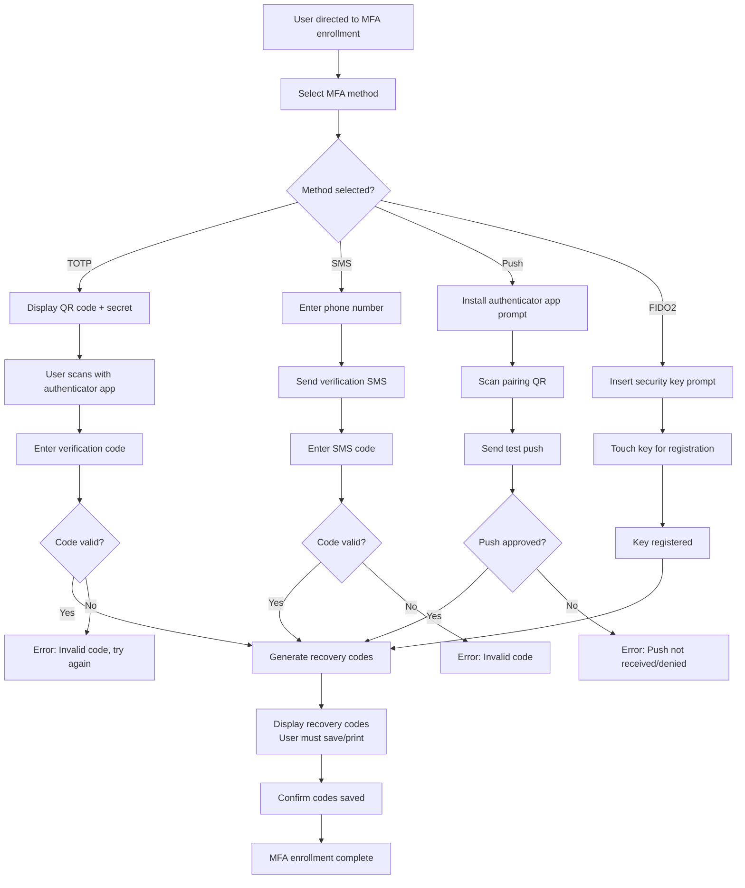

---

## 4. Administrative Flows

### 4.1 SSO Connection Setup (Admin)

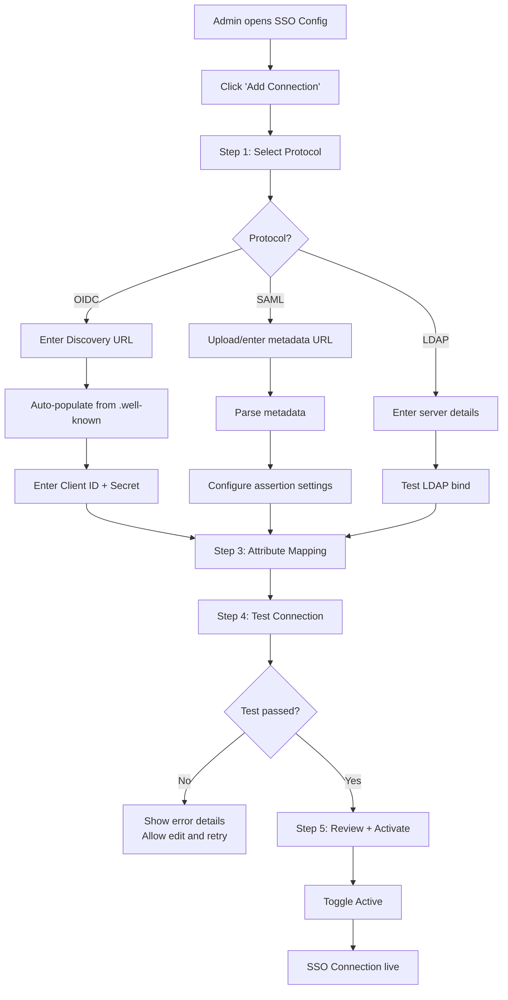

### 4.2 Device Enrollment (Admin-Initiated)

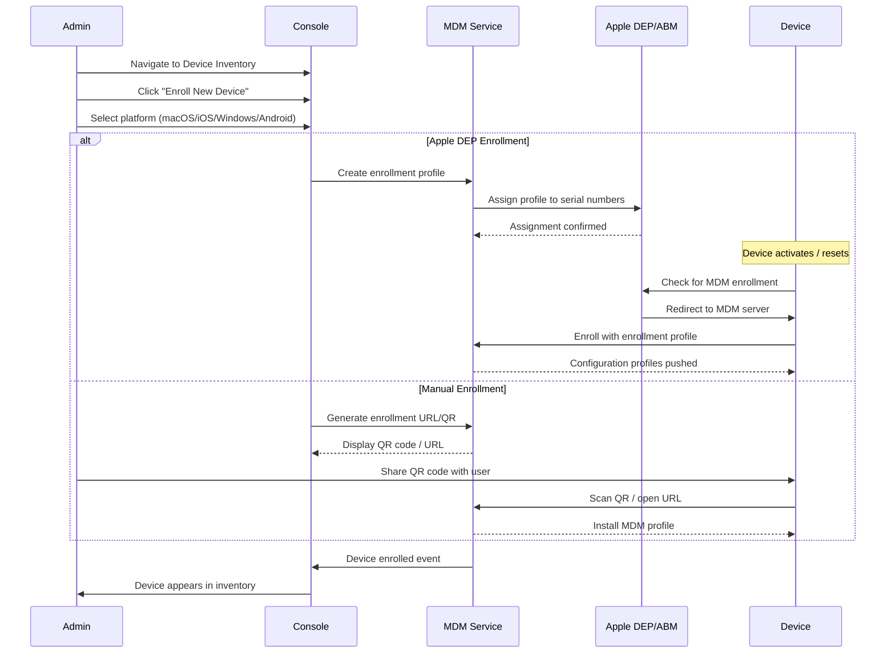

---

## 5. Provisioning Flows

### 5.1 Joiner-Mover-Leaver Lifecycle

```mermaid
flowchart LR
    subgraph "JOINER"
        J1["HR creates new hire"] --> J2["Provisioning event fired"]
        J2 --> J3["Create identity<br/>(username, email)"]
        J3 --> J4["Assign to OU<br/>based on department"]
        J4 --> J5["Add to groups<br/>based on role"]
        J5 --> J6["Provision apps<br/>(Slack, GitHub, etc.)"]
        J6 --> J7["Send welcome email<br/>with activation link"]
    end

    subgraph "MOVER"
        M1["HR updates role/<br/>department"] --> M2["Provisioning event fired"]
        M2 --> M3["Update OU placement"]
        M3 --> M4["Update group<br/>memberships"]
        M4 --> M5["Provision/deprovision<br/>apps per new role"]
        M5 --> M6["Notify user and<br/>new manager"]
    end

    subgraph "LEAVER"
        L1["HR terminates<br/>employee"] --> L2["Provisioning event fired"]
        L2 --> L3["Disable identity<br/>(grace period)"]
        L3 --> L4["Terminate all<br/>active sessions"]
        L4 --> L5["Revoke app access"]
        L5 --> L6["Transfer data to<br/>manager (if configured)"]
        L6 --> L7["Delete identity<br/>after retention period"]
    end
```

---

## 6. Device Trust Evaluation Flow

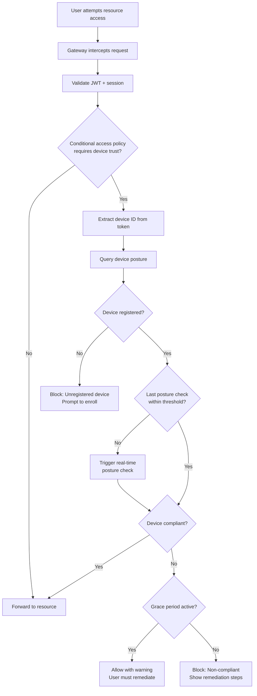

---

## 7. Credential Rotation Flow

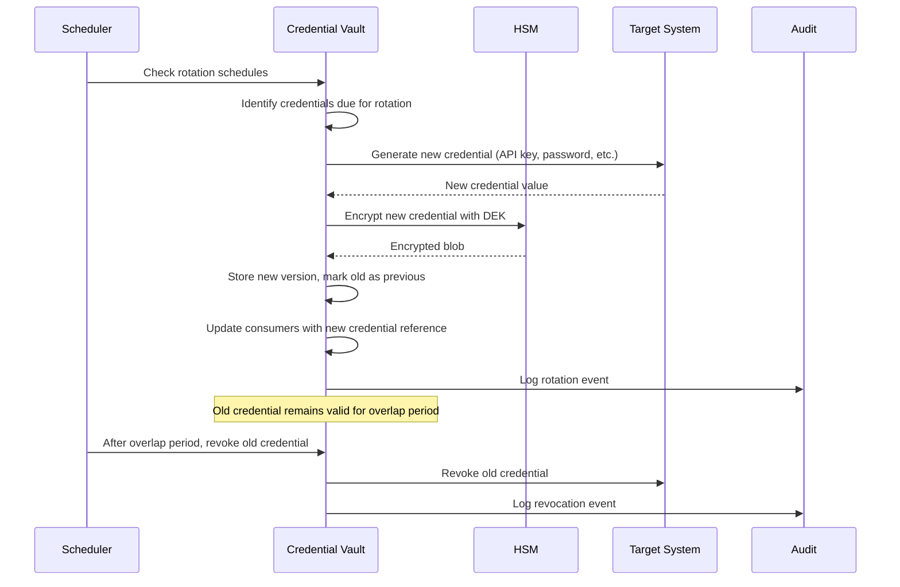

---

## 8. Error States and Recovery

### 8.1 Common Error Handling Patterns

| Scenario | User-Facing Message | Recovery Action |
|---|---|---|
| Invalid credentials | "The email or password you entered is incorrect" | Show attempt counter, link to password reset |
| Account locked | "Your account has been temporarily locked" | Display lockout duration, admin contact info |
| MFA code expired | "This code has expired. Request a new code." | Auto-resend option with cooldown timer |
| Device non-compliant | "Your device does not meet security requirements" | Checklist of failed posture checks with remediation links |
| Session expired | "Your session has expired. Please sign in again." | Redirect to login, preserve intended destination |
| Rate limited | "Too many requests. Please wait before trying again." | Display retry-after countdown |
| Network error | "Unable to connect. Check your internet connection." | Retry button with exponential backoff |
