# ERP-IAM Use Cases

> **Document ID:** ERP-IAM-UC-001
> **Version:** 1.0.0
> **Last Updated:** 2026-02-23
> **Status:** Approved
> **Related Documents:** [01-PRD.md](./01-PRD.md), [08-UX-Flows.md](./08-UX-Flows.md), [14-Technical-Specifications.md](./14-Technical-Specifications.md)

---

## 1. Overview

This document defines 25 detailed use cases for ERP-IAM, organized across three domains: Identity Lifecycle, Device Trust & Access Control, and Administrative Operations. Each use case includes actors, preconditions, main flow, alternative flows, postconditions, and relevant business rules.

---

## 2. Use Case Diagram

```mermaid
flowchart TB
    subgraph Actors
        EU["End User"]
        ADMIN["IT Administrator"]
        CISO["Security Officer"]
        HD["Help Desk"]
        HR["HR System"]
        DEV["DevOps Engineer"]
    end

    subgraph "Identity Lifecycle"
        UC1["UC-01: User Self-Registration"]
        UC2["UC-02: SSO Login via OIDC"]
        UC3["UC-03: SAML Federation Login"]
        UC4["UC-04: Social Login"]
        UC5["UC-05: Passwordless FIDO2 Login"]
        UC6["UC-06: Magic Link Login"]
        UC7["UC-07: MFA Enrollment"]
        UC8["UC-08: Self-Service Password Reset"]
        UC9["UC-09: Joiner Provisioning"]
        UC10["UC-10: Mover Reprovisioning"]
        UC11["UC-11: Leaver Deprovisioning"]
        UC12["UC-12: SCIM Inbound Provisioning"]
    end

    subgraph "Device Trust & Access"
        UC13["UC-13: Device Registration"]
        UC14["UC-14: Device Posture Evaluation"]
        UC15["UC-15: Conditional Access Enforcement"]
        UC16["UC-16: MDM Device Enrollment"]
        UC17["UC-17: Remote Device Wipe"]
        UC18["UC-18: App Deployment via MDM"]
        UC19["UC-19: Zero-Trust Resource Access"]
        UC20["UC-20: Adaptive Risk-Based Auth"]
    end

    subgraph "Admin Operations"
        UC21["UC-21: Configure SSO Connection"]
        UC22["UC-22: Manage Group Policies"]
        UC23["UC-23: Credential Vault Management"]
        UC24["UC-24: Session Force Logout"]
        UC25["UC-25: Audit Log Investigation"]
    end

    EU --> UC1 & UC2 & UC3 & UC4 & UC5 & UC6 & UC7 & UC8
    EU --> UC13 & UC14 & UC19
    HR --> UC9 & UC10 & UC11
    ADMIN --> UC16 & UC17 & UC18 & UC21 & UC22 & UC23 & UC24
    CISO --> UC15 & UC20 & UC25
    HD --> UC8 & UC24
    DEV --> UC12 & UC23
```

---

## 3. Identity Lifecycle Use Cases

### UC-01: User Self-Registration

| Field | Value |
|---|---|
| **ID** | UC-01 |
| **Name** | User Self-Registration |
| **Actor** | End User |
| **Priority** | P1 |
| **Preconditions** | Self-registration is enabled for the tenant; user does not have an existing account |
| **Trigger** | User navigates to the registration page |

**Main Flow:**
1. User accesses the registration page
2. User enters email address, display name, and password
3. System validates password against policy (minimum 12 characters, 1 uppercase, 1 number, 1 special)
4. System checks email uniqueness within tenant
5. System sends email verification link (TTL: 24 hours)
6. User clicks verification link
7. System activates account
8. If MFA is required by policy, system redirects to MFA enrollment (UC-07)
9. System creates directory entry and assigns default group
10. System emits `erp.iam.identity.created` event

**Alternative Flows:**
- **A1**: Email already exists -- show generic "Check your email" message (prevent enumeration)
- **A2**: Password fails policy -- display specific policy violations
- **A3**: Verification link expired -- allow resend

**Postconditions:** User account is created, email verified, directory entry established.

---

### UC-02: SSO Login via OIDC

| Field | Value |
|---|---|
| **ID** | UC-02 |
| **Name** | SSO Login via OIDC |
| **Actor** | End User |
| **Preconditions** | User has an active account; OIDC client is configured for the application |

**Main Flow:**
1. User accesses a protected application
2. Application redirects to Keycloak authorization endpoint with PKCE challenge
3. Keycloak displays login page
4. User enters credentials
5. Keycloak validates credentials against directory
6. If MFA is required, Keycloak presents MFA challenge
7. User completes MFA
8. Keycloak issues authorization code
9. Application exchanges code for tokens (access, refresh, ID token)
10. Application validates ID token claims
11. Session created; user accesses application
12. System emits `erp.iam.identity.read` and `erp.iam.session.created` events

**Business Rules:**
- PKCE is mandatory for public clients (SPAs, mobile apps)
- Token lifetimes: access (1 hour), refresh (24 hours), ID (1 hour)
- Refresh token rotation with reuse detection

---

### UC-03: SAML Federation Login

| Field | Value |
|---|---|
| **ID** | UC-03 |
| **Name** | SAML Federation Login |
| **Actor** | End User |
| **Preconditions** | SAML IdP trust is configured; metadata exchanged |

**Main Flow:**
1. User accesses SP-initiated SAML application
2. SP generates AuthnRequest and redirects to Keycloak (IdP)
3. Keycloak authenticates user (or uses existing session)
4. Keycloak generates SAML assertion with mapped attributes
5. Keycloak signs assertion and POSTs to SP ACS URL
6. SP validates signature and assertion conditions
7. SP creates local session from SAML attributes
8. User accesses application

---

### UC-04: Social Login

| Field | Value |
|---|---|
| **ID** | UC-04 |
| **Name** | Social Login (Google/Microsoft/Apple/Facebook) |
| **Actor** | End User |
| **Preconditions** | Social IdP is configured for the tenant |

**Main Flow:**
1. User clicks social login button (e.g., "Sign in with Google")
2. Keycloak redirects to social IdP authorization endpoint
3. User authenticates with social IdP and grants consent
4. Social IdP redirects back to Keycloak with authorization code
5. Keycloak exchanges code for tokens
6. Keycloak maps social claims to local user attributes
7. If first-time login: Keycloak creates or links local account
8. If account linking is configured: prompt user to link to existing account
9. Session created; user accesses application

---

### UC-05: Passwordless FIDO2 Login

| Field | Value |
|---|---|
| **ID** | UC-05 |
| **Name** | Passwordless FIDO2/WebAuthn Login |
| **Actor** | End User |
| **Preconditions** | User has registered a FIDO2 authenticator; browser supports WebAuthn |

**Main Flow:**
1. User navigates to login page
2. User clicks "Sign in with Security Key"
3. User enters username (for discoverable credentials, this step is skipped)
4. Keycloak generates WebAuthn challenge
5. Browser prompts user to activate authenticator (touch, biometric)
6. Authenticator signs challenge with private key
7. Keycloak verifies signature against stored public key
8. Authentication succeeds; session created
9. System emits login event with authentication method = "fido2"

**Business Rules:**
- Supported authenticators: YubiKey 5 series, SoloKey, Apple Touch ID/Face ID, Windows Hello
- Attestation type: configurable (none, indirect, direct)
- User verification: configurable (required, preferred, discouraged)

---

### UC-06: Magic Link Login

| Field | Value |
|---|---|
| **ID** | UC-06 |
| **Name** | Magic Link Email Login |
| **Actor** | End User |
| **Preconditions** | Magic link authentication is enabled for the tenant |

**Main Flow:**
1. User enters email address on login page
2. User clicks "Send Magic Link"
3. System generates cryptographic token (URL-safe base64, 256-bit)
4. System stores token hash with TTL (10 minutes) and single-use flag
5. System sends email containing login link
6. User opens email and clicks link
7. System validates token (not expired, not used, hash matches)
8. System marks token as consumed
9. If MFA required: present MFA challenge
10. Session created; user redirected to application

---

### UC-07: MFA Enrollment

| Field | Value |
|---|---|
| **ID** | UC-07 |
| **Name** | Multi-Factor Authentication Enrollment |
| **Actor** | End User |
| **Preconditions** | User is authenticated; MFA enrollment required or optional per policy |

**Main Flow:**
1. User is directed to MFA enrollment (forced or self-initiated)
2. System presents available MFA methods
3. User selects method (TOTP, SMS, Push, FIDO2)
4. System guides user through method-specific enrollment
5. User completes verification challenge
6. System generates 10 recovery codes
7. User acknowledges saving recovery codes
8. MFA enrollment stored; future logins will require MFA
9. System emits `erp.iam.identity.updated` event with MFA metadata

---

### UC-08: Self-Service Password Reset

| Field | Value |
|---|---|
| **ID** | UC-08 |
| **Name** | Self-Service Password Reset |
| **Actor** | End User, Help Desk |
| **Preconditions** | User account exists |

**Main Flow (Self-Service):**
1. User clicks "Forgot Password" on login page
2. User enters email address
3. System always displays "If an account exists, a reset link was sent" (prevents enumeration)
4. If account exists: system sends reset email with token (TTL: 1 hour)
5. User clicks reset link
6. System validates token
7. User enters new password
8. System validates against password policy and password history (last 12 passwords)
9. System updates password, invalidates all sessions
10. System emits password change event

**Main Flow (Help Desk):**
1. Help desk agent searches for user in admin console
2. Agent clicks "Reset Password"
3. Agent sets temporary password with "Force Change at Login" flag
4. User logs in with temporary password and is forced to set a new one

---

### UC-09: Joiner Provisioning (Automated)

| Field | Value |
|---|---|
| **ID** | UC-09 |
| **Name** | Joiner -- New Employee Provisioning |
| **Actor** | HR System (automated) |
| **Preconditions** | HR system is integrated via SCIM or event; joiner rules are configured |

**Main Flow:**
1. HR system creates new employee record
2. Provisioning service receives joiner event
3. System creates identity (username from naming convention: first.last)
4. System assigns to organizational unit based on department
5. System adds to groups based on role and department
6. System provisions accounts in downstream applications (Slack, GitHub, Jira, etc.)
7. System sends welcome email with account activation link
8. System notifies manager of new team member
9. System creates audit trail of all provisioning actions

**Business Rules:**
- Username collision: append incrementing number (john.doe, john.doe1, john.doe2)
- Application provisioning follows role-to-app mapping table
- All downstream provisioning uses SCIM 2.0 client

---

### UC-10: Mover Reprovisioning

| Field | Value |
|---|---|
| **ID** | UC-10 |
| **Name** | Mover -- Role/Department Change |
| **Actor** | HR System (automated) |
| **Preconditions** | Employee exists; HR updates role or department |

**Main Flow:**
1. HR system updates employee department/role
2. Provisioning service receives mover event
3. System computes group membership delta (groups to add, groups to remove)
4. System updates OU placement
5. System provisions new application access per new role
6. System deprovisions application access no longer needed
7. System notifies old manager (team member departed) and new manager (team member arrived)

---

### UC-11: Leaver Deprovisioning

| Field | Value |
|---|---|
| **ID** | UC-11 |
| **Name** | Leaver -- Employee Offboarding |
| **Actor** | HR System (automated) |
| **Preconditions** | Employee exists; HR terminates employment |

**Main Flow:**
1. HR system sets termination date
2. Provisioning service receives leaver event
3. System disables identity (cannot authenticate)
4. System terminates all active sessions immediately
5. System revokes all OAuth2 tokens and refresh tokens
6. System deprovisions all downstream application accounts
7. System transfers data ownership to manager (if configured)
8. System retains identity in disabled state for configurable retention period (default: 90 days)
9. After retention period: system permanently deletes identity and emits deletion event

**Business Rules:**
- Immediate termination: all steps execute within 15 minutes
- Scheduled termination: disable at end of termination date
- Manager data transfer includes: shared drives, calendar delegations, email forwarding

---

### UC-12: SCIM Inbound Provisioning

| Field | Value |
|---|---|
| **ID** | UC-12 |
| **Name** | SCIM 2.0 Inbound User Provisioning |
| **Actor** | External Identity Provider (DevOps configured) |
| **Preconditions** | SCIM 2.0 server endpoint configured; bearer token for authentication |

**Main Flow:**
1. External system sends `POST /scim/v2/Users` with SCIM User resource
2. Provisioning service validates bearer token
3. System maps SCIM attributes to internal schema via attribute mapping rules
4. System creates user identity in directory
5. System assigns groups based on SCIM group membership
6. System returns SCIM User resource with server-assigned ID
7. System emits `erp.iam.provisioning.created` event

---

## 4. Device Trust & Access Control Use Cases

### UC-13: Device Registration

| Field | Value |
|---|---|
| **ID** | UC-13 |
| **Name** | Device Registration for Trust Assessment |
| **Actor** | End User |
| **Preconditions** | User is authenticated; device agent (osquery) is installed |

**Main Flow:**
1. User installs osquery agent on their device
2. Agent contacts FleetDM server and enrolls
3. FleetDM registers device and associates with user identity
4. Device trust service records device metadata (platform, serial, OS version)
5. Initial posture check executes immediately
6. Device appears in user's device list

---

### UC-14: Device Posture Evaluation

| Field | Value |
|---|---|
| **ID** | UC-14 |
| **Name** | Device Posture Check |
| **Actor** | System (automated) |
| **Preconditions** | Device is registered with osquery agent |

**Main Flow:**
1. osquery agent runs scheduled queries on device
2. Queries check: OS version, disk encryption, firewall, antivirus, patch level, jailbreak indicators
3. Results reported to FleetDM
4. Device trust service evaluates results against compliance policies
5. Trust score calculated (weighted sum of checks)
6. If score falls below threshold: device marked non-compliant
7. Non-compliance event emitted; user and admin notified
8. If conditional access policy active: user's access may be restricted

---

### UC-15: Conditional Access Policy Enforcement

| Field | Value |
|---|---|
| **ID** | UC-15 |
| **Name** | Conditional Access Policy Evaluation |
| **Actor** | Security Officer (configures), System (enforces) |
| **Preconditions** | Conditional access policies defined and active |

**Main Flow:**
1. User requests access to protected resource
2. Gateway evaluates all active conditional access policies (in priority order)
3. For each policy: evaluate conditions (user group, device compliance, location, risk score, time)
4. If conditions match: apply policy action (allow, block, require additional auth)
5. If multiple policies match: most restrictive action wins
6. If no policies match: apply default action (configurable: allow or deny)
7. Decision logged in audit trail with policy reference

---

### UC-16: MDM Device Enrollment (Apple DEP)

| Field | Value |
|---|---|
| **ID** | UC-16 |
| **Name** | Apple MDM Enrollment via DEP/ADE |
| **Actor** | IT Administrator |
| **Preconditions** | Apple Business Manager configured; NanoMDM operational |

**Main Flow:**
1. Admin assigns enrollment profile to device serial numbers in Apple Business Manager
2. Device activates (new or reset)
3. Device contacts Apple DEP service during Setup Assistant
4. Apple redirects device to NanoMDM enrollment URL
5. Device installs MDM profile
6. NanoMDM pushes initial configuration profiles
7. Device begins reporting inventory to MDM service
8. Device trust service performs initial posture evaluation
9. Device appears in admin console as managed

---

### UC-17: Remote Device Wipe

| Field | Value |
|---|---|
| **ID** | UC-17 |
| **Name** | Remote Device Wipe |
| **Actor** | IT Administrator |
| **Preconditions** | Device is MDM-enrolled |

**Main Flow:**
1. Admin navigates to device in admin console
2. Admin clicks "Remote Wipe"
3. System displays confirmation dialog with device details
4. Admin confirms wipe action with MFA re-authentication
5. MDM service queues wipe command
6. On next device check-in: wipe command executed
7. Device performs factory reset
8. Device trust service marks device as wiped
9. Audit log records wipe event with admin identity and reason

---

### UC-18: App Deployment via MDM

| Field | Value |
|---|---|
| **ID** | UC-18 |
| **Name** | Managed App Deployment |
| **Actor** | IT Administrator |
| **Preconditions** | Devices enrolled in MDM; app catalog configured |

**Main Flow:**
1. Admin selects app from managed app catalog
2. Admin selects target devices/groups
3. MDM service creates deployment task
4. On next device check-in: install command sent
5. Device downloads and installs app
6. MDM service records installation status
7. If app requires managed configuration: configuration pushed after install

---

### UC-19: Zero-Trust Resource Access

| Field | Value |
|---|---|
| **ID** | UC-19 |
| **Name** | Zero-Trust Verified Resource Access |
| **Actor** | End User |
| **Preconditions** | User authenticated; device registered; conditional access policies active |

**Main Flow:**
1. User requests access to ERP-Finance (sensitive resource)
2. API Gateway validates JWT token (authentication)
3. Gateway checks session validity (not expired, not revoked)
4. Gateway queries device trust service for device posture
5. Gateway evaluates conditional access policies
6. All checks pass: request forwarded to ERP-Finance
7. ERP-Finance checks entitlement via ERP-Platform
8. Access granted

**Alternative Flow (Device Non-Compliant):**
1. Steps 1-3 pass
2. Step 4: device posture check returns non-compliant
3. Gateway returns 403 with remediation instructions
4. User must fix device compliance before retrying

---

### UC-20: Adaptive Risk-Based Authentication

| Field | Value |
|---|---|
| **ID** | UC-20 |
| **Name** | Adaptive Risk-Based Authentication |
| **Actor** | End User (automatic), Security Officer (configures) |
| **Preconditions** | Risk engine enabled; behavioral baselines established |

**Main Flow:**
1. User initiates login
2. Risk engine collects signals: IP address, geolocation, device fingerprint, time of day, browser/OS
3. Risk engine computes risk score (0-100)
4. Score < 30 (low risk): proceed with normal auth flow
5. Score 30-70 (medium risk): require additional MFA step
6. Score > 70 (high risk): block login, alert security team, require admin approval
7. All risk evaluations logged in audit trail

**Risk Signals:**
- IP reputation from threat intelligence feeds
- Impossible travel (login from two geographically distant locations in short time)
- New device or browser
- Anomalous login time (outside user's typical hours)
- TOR exit node detection
- Known botnet IP ranges

---

## 5. Administrative Operations Use Cases

### UC-21: Configure SSO Connection

| Field | Value |
|---|---|
| **ID** | UC-21 |
| **Name** | SSO Connection Configuration |
| **Actor** | IT Administrator |

**Main Flow:** See detailed flow in [08-UX-Flows.md](./08-UX-Flows.md) Section 4.1.

---

### UC-22: Manage Group Policies

| Field | Value |
|---|---|
| **ID** | UC-22 |
| **Name** | Group Policy Management |
| **Actor** | IT Administrator |
| **Preconditions** | Directory service operational; Samba AD DC running |

**Main Flow:**
1. Admin opens Group Manager in console
2. Admin selects or creates a group
3. Admin configures policy assignments (MFA required, password policy, session limits)
4. For AD-joined devices: admin configures GPO settings
5. System distributes GPO to SYSVOL share
6. Domain-joined devices pull GPO on next refresh cycle
7. Policy compliance reported through device trust service

---

### UC-23: Credential Vault Management

| Field | Value |
|---|---|
| **ID** | UC-23 |
| **Name** | Credential Vault -- Store and Rotate Secrets |
| **Actor** | DevOps Engineer, IT Administrator |
| **Preconditions** | Credential vault service operational; HSM configured |

**Main Flow:**
1. User accesses Credential Vault page
2. User clicks "Store New Secret"
3. User enters secret type (API key, OAuth token, database password, certificate)
4. User enters secret value (masked input)
5. System encrypts with AES-256-GCM using tenant-specific DEK
6. DEK is encrypted by KEK stored in HSM
7. System stores encrypted blob in YugabyteDB
8. User optionally configures rotation schedule (30/60/90 days)
9. System emits `erp.iam.credential-vault.created` event

---

### UC-24: Session Force Logout

| Field | Value |
|---|---|
| **ID** | UC-24 |
| **Name** | Administrative Session Termination |
| **Actor** | IT Administrator, Help Desk |
| **Preconditions** | User has active sessions |

**Main Flow:**
1. Admin opens Session Viewer
2. Admin searches for user or identifies suspicious session
3. Admin clicks "Terminate Session" (single) or "Terminate All Sessions" (user-wide)
4. System immediately invalidates session tokens in Redis
5. User's next request receives 401 Unauthorized
6. User must re-authenticate
7. Audit event logged with admin identity, reason, and affected sessions

---

### UC-25: Audit Log Investigation

| Field | Value |
|---|---|
| **ID** | UC-25 |
| **Name** | Security Incident Investigation via Audit Logs |
| **Actor** | Security Officer (CISO) |
| **Preconditions** | Audit logging operational; SIEM connectors configured |

**Main Flow:**
1. CISO receives alert: "10+ failed login attempts for user john.doe"
2. CISO opens Audit Log Viewer
3. CISO filters: `event_type:auth.login.failed AND actor:john.doe AND last:1h`
4. System displays matching events with timestamps, IP addresses, device info
5. CISO identifies pattern: attempts from multiple IPs across different countries
6. CISO clicks on related events to see full JSON payloads
7. CISO determines brute-force attack from botnet
8. CISO navigates to Session Viewer and terminates any active sessions
9. CISO creates conditional access policy to block the offending IP ranges
10. CISO exports investigation evidence for compliance record
