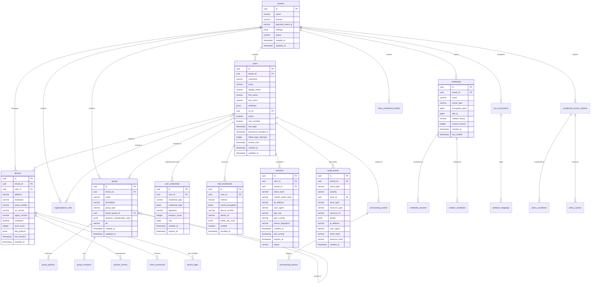

# ERP-IAM Data Model

> **Document ID:** ERP-IAM-DM-001
> **Version:** 1.0.0
> **Last Updated:** 2026-02-23
> **Status:** Approved
> **Related Documents:** [04-Software-Architecture.md](./04-Software-Architecture.md), [14-Technical-Specifications.md](./14-Technical-Specifications.md)

---

## 1. Overview

This document defines the complete data model for ERP-IAM, covering all eight service domains. The primary data store is YugabyteDB (PostgreSQL-compatible distributed SQL). Redis serves as the session and cache layer. All tables enforce multi-tenancy through the `tenant_id` column with row-level security.

---

## 2. Entity Relationship Diagram



---

## 3. Table Definitions

### 3.1 tenants

Primary tenant registry for multi-tenant isolation.

| Column | Type | Constraints | Description |
|---|---|---|---|
| id | UUID | PK, DEFAULT gen_random_uuid() | Unique tenant identifier |
| name | VARCHAR(255) | NOT NULL | Tenant display name |
| domain | VARCHAR(255) | NOT NULL, UNIQUE | Primary domain (e.g., acme.com) |
| keycloak_realm_id | VARCHAR(255) | NOT NULL, UNIQUE | Corresponding Keycloak realm |
| settings | JSONB | DEFAULT '{}' | Tenant-level configuration |
| status | VARCHAR(20) | NOT NULL, DEFAULT 'active' | active, suspended, deleted |
| created_at | TIMESTAMPTZ | NOT NULL, DEFAULT now() | Creation timestamp |
| updated_at | TIMESTAMPTZ | NOT NULL, DEFAULT now() | Last update timestamp |

**Indexes:**
- `idx_tenants_domain` on `domain` (unique)
- `idx_tenants_status` on `status`

### 3.2 users

Core identity records. One row per user per tenant.

| Column | Type | Constraints | Description |
|---|---|---|---|
| id | UUID | PK, DEFAULT gen_random_uuid() | Unique user identifier |
| tenant_id | UUID | FK tenants(id), NOT NULL | Owning tenant |
| username | VARCHAR(255) | NOT NULL | Unique within tenant |
| email | VARCHAR(255) | NOT NULL | Unique within tenant |
| display_name | VARCHAR(255) | | Full display name |
| first_name | VARCHAR(255) | | First/given name |
| last_name | VARCHAR(255) | | Last/family name |
| attributes | JSONB | DEFAULT '{}' | Custom attributes (department, title, employee_id, etc.) |
| ou_id | UUID | FK organizational_units(id) | Organizational unit placement |
| active | BOOLEAN | NOT NULL, DEFAULT true | Account active status |
| mfa_enrolled | BOOLEAN | NOT NULL, DEFAULT false | Whether MFA is set up |
| last_login | TIMESTAMPTZ | | Last successful login |
| password_changed_at | TIMESTAMPTZ | | Last password change |
| failed_login_attempts | INTEGER | NOT NULL, DEFAULT 0 | Brute force counter |
| locked_until | TIMESTAMPTZ | | Account lockout expiry |
| created_at | TIMESTAMPTZ | NOT NULL, DEFAULT now() | Creation timestamp |
| updated_at | TIMESTAMPTZ | NOT NULL, DEFAULT now() | Last update timestamp |

**Indexes:**
- `idx_users_tenant_username` on `(tenant_id, username)` (unique)
- `idx_users_tenant_email` on `(tenant_id, email)` (unique)
- `idx_users_tenant_active` on `(tenant_id, active)`
- `idx_users_ou` on `ou_id`
- GIN index on `attributes` for JSONB queries

### 3.3 sessions (Redis Schema)

Sessions are stored in Redis for sub-millisecond access. The key structure:

```
tenant:{tenant_id}:session:{session_id}  -> HASH
  user_id: uuid
  token_hash: sha256
  refresh_token_hash: sha256
  ip_address: string
  user_agent: string
  geo_city: string
  geo_country: string
  device_fingerprint: string
  created_at: iso8601
  last_activity: iso8601
  status: active|idle|expired

tenant:{tenant_id}:user_sessions:{user_id}  -> SET of session_ids
tenant:{tenant_id}:session_count:{user_id}  -> INTEGER (concurrent session count)
```

**TTL Policy:**
- Session keys: TTL = absolute timeout (default 8 hours)
- Idle sessions: background worker checks `last_activity` and expires idle sessions (default 30 minutes)

### 3.4 audit_events

Immutable, append-only audit log with cryptographic chaining.

| Column | Type | Constraints | Description |
|---|---|---|---|
| id | UUID | PK, DEFAULT gen_random_uuid() | Event identifier |
| tenant_id | UUID | FK tenants(id), NOT NULL | Tenant context |
| event_type | VARCHAR(100) | NOT NULL | Hierarchical event type (e.g., auth.login.success) |
| severity | VARCHAR(20) | NOT NULL | info, warning, critical |
| actor_id | UUID | | User or service that performed the action |
| actor_type | VARCHAR(50) | NOT NULL | user, service, system, admin |
| resource_type | VARCHAR(100) | | Type of resource affected |
| resource_id | VARCHAR(255) | | ID of resource affected |
| details | JSONB | NOT NULL | Full event payload |
| ip_address | INET | | Source IP address |
| user_agent | TEXT | | Source user agent |
| chain_hash | VARCHAR(64) | NOT NULL | SHA-256 hash of this event + previous hash |
| previous_hash | VARCHAR(64) | NOT NULL | Hash of previous event in chain |
| created_at | TIMESTAMPTZ | NOT NULL, DEFAULT now() | Event timestamp |

**Indexes:**
- `idx_audit_tenant_time` on `(tenant_id, created_at DESC)` (primary query pattern)
- `idx_audit_tenant_type` on `(tenant_id, event_type)`
- `idx_audit_tenant_actor` on `(tenant_id, actor_id)`
- `idx_audit_tenant_severity` on `(tenant_id, severity)` WHERE severity != 'info'

**Partitioning:** Range-partitioned by `created_at` (monthly partitions) for efficient retention management and query performance.

---

## 4. Data Flow Diagram

```mermaid
flowchart TB
    subgraph "Write Path"
        API["API Request"] --> VALIDATE["Validate + Authorize"]
        VALIDATE --> WRITE["Write to YugabyteDB"]
        WRITE --> EVENT["Emit CloudEvent"]
        EVENT --> AUDIT["Audit Service<br/>Append to Chain"]
        EVENT --> SIEM["SIEM Forwarder"]
    end

    subgraph "Read Path"
        QUERY["API Query"] --> CACHE_CHECK{"Cache Hit?"}
        CACHE_CHECK -->|Yes| REDIS["Return from Redis"]
        CACHE_CHECK -->|No| DB_READ["Read from YugabyteDB"]
        DB_READ --> CACHE_SET["Populate Cache"]
        CACHE_SET --> RESPONSE["Return Response"]
    end

    subgraph "Session Path"
        LOGIN["Login Success"] --> SESSION_CREATE["Create in Redis<br/>with TTL"]
        SESSION_CREATE --> COUNT_CHECK{"Concurrent Limit<br/>Exceeded?"}
        COUNT_CHECK -->|Yes| EVICT["Evict Oldest Session"]
        COUNT_CHECK -->|No| DONE["Session Active"]
    end
```



---

## 5. Data Retention Policies

| Data Category | Retention Period | Archive Strategy |
|---|---|---|
| Active user records | Indefinite while active | N/A |
| Disabled user records | 90 days post-deactivation | Archive to cold storage, then delete |
| Sessions (Redis) | 8 hours (configurable) | Auto-expire via TTL |
| Audit events | 7 years (compliance) | Monthly partition rotation to S3/GCS |
| Device posture history | 1 year | Aggregate to daily summaries after 90 days |
| Credential versions | 3 previous versions | Purge oldest on 4th rotation |
| Provisioning events | 2 years | Archive after 1 year |
| SIEM exports | Per SIEM retention | External system manages |

---

## 6. Row-Level Security

All tables enforce tenant isolation through PostgreSQL Row-Level Security (RLS):

```sql
-- Enable RLS on users table
ALTER TABLE users ENABLE ROW LEVEL SECURITY;

-- Policy: users can only see rows matching their tenant
CREATE POLICY tenant_isolation ON users
    USING (tenant_id = current_setting('app.current_tenant_id')::uuid);

-- Service role bypasses RLS for cross-tenant operations
CREATE POLICY service_bypass ON users
    TO iam_service_role
    USING (true);
```

The `app.current_tenant_id` session variable is set by the API layer from the validated `X-Tenant-ID` header before every query.
