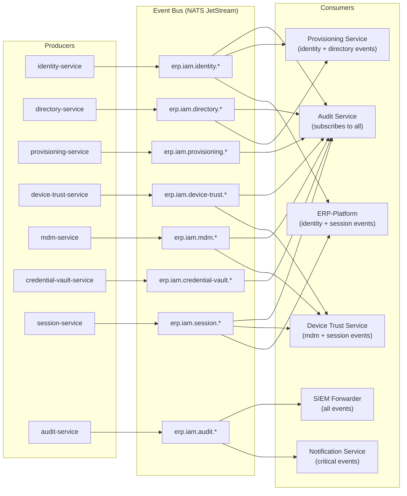

# ERP-IAM Event Schema

> **Document ID:** ERP-IAM-EVT-001
> **Version:** 1.0.0
> **Last Updated:** 2026-02-23
> **Status:** Approved
> **Related Documents:** [04-Software-Architecture.md](./04-Software-Architecture.md), [05-Backend-API-Reference.md](./05-Backend-API-Reference.md)

---

## 1. Overview

ERP-IAM uses an event-driven architecture where all state changes are published as CloudEvents to the NATS/Redpanda event bus. This document defines the complete event schema, topic conventions, payload structures, and consumption patterns.

---

## 2. Event Architecture



---

## 3. CloudEvents Envelope

All events conform to the [CloudEvents v1.0 specification](https://cloudevents.io/):

```json
{
  "specversion": "1.0",
  "type": "erp.iam.identity.created",
  "source": "/v1/identity",
  "id": "f47ac10b-58cc-4372-a567-0e02b2c3d479",
  "time": "2026-02-23T10:30:00.000Z",
  "datacontenttype": "application/json",
  "subject": "550e8400-e29b-41d4-a716-446655440000",
  "tenantid": "a1b2c3d4-e5f6-7890-abcd-ef1234567890",
  "correlationid": "req-abc123",
  "data": {
    // Event-specific payload
  }
}
```

### 3.1 Envelope Fields

| Field | Type | Required | Description |
|---|---|---|---|
| `specversion` | string | Yes | Always "1.0" |
| `type` | string | Yes | Event type in `erp.iam.<entity>.<action>` format |
| `source` | string | Yes | API path that generated the event |
| `id` | string | Yes | Unique event ID (UUID v4) |
| `time` | string | Yes | ISO 8601 timestamp with timezone |
| `datacontenttype` | string | Yes | Always "application/json" |
| `subject` | string | No | Primary resource ID affected |
| `tenantid` | string | Yes | Tenant UUID (custom extension) |
| `correlationid` | string | No | Request correlation ID for tracing |
| `data` | object | Yes | Event-specific payload |

---

## 4. Topic Catalog

### 4.1 Identity Events

| Topic | Trigger | Description |
|---|---|---|
| `erp.iam.identity.created` | POST /v1/identity | New user identity created |
| `erp.iam.identity.read` | GET /v1/identity/:id | Identity accessed (for audit) |
| `erp.iam.identity.updated` | PUT/PATCH /v1/identity/:id | Identity attributes modified |
| `erp.iam.identity.deleted` | DELETE /v1/identity/:id | Identity permanently deleted |
| `erp.iam.identity.listed` | GET /v1/identity | Identity list queried |
| `erp.iam.identity.auth.success` | Successful authentication | Login succeeded |
| `erp.iam.identity.auth.failure` | Failed authentication | Login failed |
| `erp.iam.identity.auth.mfa.challenge` | MFA prompt presented | MFA step initiated |
| `erp.iam.identity.auth.mfa.success` | MFA verified | MFA challenge passed |
| `erp.iam.identity.auth.mfa.failure` | MFA rejected | MFA challenge failed |
| `erp.iam.identity.auth.locked` | Account locked | Brute force threshold exceeded |
| `erp.iam.identity.password.changed` | Password update | Password successfully changed |
| `erp.iam.identity.password.reset` | Password reset | Password reset via admin or self-service |

### 4.2 Directory Events

| Topic | Trigger | Description |
|---|---|---|
| `erp.iam.directory.created` | Directory object created | User, group, or OU created in directory |
| `erp.iam.directory.updated` | Directory object modified | Attributes changed |
| `erp.iam.directory.deleted` | Directory object removed | Object deleted |
| `erp.iam.directory.listed` | Directory query | LDAP search or API list |
| `erp.iam.directory.sync.started` | Sync job begins | Directory sync initiated |
| `erp.iam.directory.sync.completed` | Sync job finishes | Sync completed with summary |
| `erp.iam.directory.sync.failed` | Sync job fails | Sync error with details |
| `erp.iam.directory.group.member.added` | Member added to group | Group membership change |
| `erp.iam.directory.group.member.removed` | Member removed from group | Group membership change |

### 4.3 Provisioning Events

| Topic | Trigger | Description |
|---|---|---|
| `erp.iam.provisioning.created` | SCIM create | User/group provisioned |
| `erp.iam.provisioning.updated` | SCIM update | Provisioned resource modified |
| `erp.iam.provisioning.deleted` | SCIM delete | Provisioned resource deprovisioned |
| `erp.iam.provisioning.lifecycle.joiner` | New hire event | Joiner workflow triggered |
| `erp.iam.provisioning.lifecycle.mover` | Role change event | Mover workflow triggered |
| `erp.iam.provisioning.lifecycle.leaver` | Termination event | Leaver workflow triggered |

### 4.4 Device Trust Events

| Topic | Trigger | Description |
|---|---|---|
| `erp.iam.device-trust.created` | Device registered | New device in inventory |
| `erp.iam.device-trust.updated` | Posture check result | Device compliance updated |
| `erp.iam.device-trust.deleted` | Device removed | Device deregistered |
| `erp.iam.device-trust.compliant` | Posture passes | Device meets all policies |
| `erp.iam.device-trust.non-compliant` | Posture fails | Device fails one or more checks |
| `erp.iam.device-trust.evaluation` | Conditional access checked | Access decision made |

### 4.5 MDM Events

| Topic | Trigger | Description |
|---|---|---|
| `erp.iam.mdm.created` | Device enrolled | MDM enrollment completed |
| `erp.iam.mdm.updated` | Device state change | Profile pushed, app installed |
| `erp.iam.mdm.deleted` | Device unenrolled | MDM profile removed |
| `erp.iam.mdm.command.sent` | MDM command queued | Command sent to device |
| `erp.iam.mdm.command.completed` | MDM command executed | Device confirmed command |
| `erp.iam.mdm.wipe.initiated` | Remote wipe ordered | Wipe command sent |

### 4.6 Session Events

| Topic | Trigger | Description |
|---|---|---|
| `erp.iam.session.created` | Login success | New session established |
| `erp.iam.session.updated` | Session activity | Token refresh, activity update |
| `erp.iam.session.deleted` | Session terminated | Logout, timeout, or admin forced |
| `erp.iam.session.expired` | TTL exceeded | Session auto-expired |
| `erp.iam.session.forced_logout` | Admin action | Forced logout by administrator |
| `erp.iam.session.limit_exceeded` | Concurrent limit hit | Oldest session evicted |

---

## 5. Event Payload Examples

### 5.1 Identity Created

```json
{
  "specversion": "1.0",
  "type": "erp.iam.identity.created",
  "source": "/v1/identity",
  "id": "evt-001",
  "time": "2026-02-23T10:00:00Z",
  "tenantid": "tenant-001",
  "data": {
    "user_id": "user-001",
    "username": "jane.smith",
    "email": "jane.smith@acme.com",
    "department": "Engineering",
    "groups": ["engineering", "all-employees"],
    "mfa_required": true,
    "provisioned_apps": ["slack", "github"]
  }
}
```

### 5.2 Authentication Failure

```json
{
  "specversion": "1.0",
  "type": "erp.iam.identity.auth.failure",
  "source": "/v1/identity/auth/token",
  "id": "evt-002",
  "time": "2026-02-23T10:05:00Z",
  "tenantid": "tenant-001",
  "data": {
    "username": "john.doe",
    "reason": "invalid_password",
    "failed_attempts": 3,
    "ip_address": "203.0.113.42",
    "user_agent": "Mozilla/5.0",
    "geo_location": {
      "city": "Lagos",
      "country": "NG",
      "latitude": 6.5244,
      "longitude": 3.3792
    },
    "risk_score": 45
  }
}
```

### 5.3 Device Non-Compliant

```json
{
  "specversion": "1.0",
  "type": "erp.iam.device-trust.non-compliant",
  "source": "/v1/device-trust",
  "id": "evt-003",
  "time": "2026-02-23T10:10:00Z",
  "tenantid": "tenant-001",
  "subject": "device-001",
  "data": {
    "device_id": "device-001",
    "user_id": "user-001",
    "platform": "macos",
    "trust_score": 35,
    "failed_checks": [
      { "check": "os_version", "current": "13.0", "required": "14.0" },
      { "check": "firewall", "enabled": false, "required": true }
    ],
    "previous_score": 92
  }
}
```

---

## 6. Consumer Configuration

### 6.1 NATS JetStream Streams

```yaml
streams:
  - name: ERP_IAM_EVENTS
    subjects:
      - "erp.iam.>"
    retention: limits
    max_bytes: 10737418240  # 10 GB
    max_age: 604800000000000  # 7 days in nanoseconds
    storage: file
    replicas: 3
    discard: old

consumers:
  - name: audit-service
    stream: ERP_IAM_EVENTS
    filter: "erp.iam.>"
    deliver_policy: all
    ack_policy: explicit
    max_deliver: 5
    ack_wait: 30000000000  # 30 seconds

  - name: siem-forwarder
    stream: ERP_IAM_EVENTS
    filter: "erp.iam.>"
    deliver_policy: all
    ack_policy: explicit

  - name: provisioning-listener
    stream: ERP_IAM_EVENTS
    filter: "erp.iam.identity.>"
    deliver_policy: new
    ack_policy: explicit
```

---

## 7. Event Ordering and Delivery Guarantees

| Guarantee | Implementation |
|---|---|
| **Ordering** | Events within a single entity are ordered by NATS sequence number |
| **At-least-once delivery** | NATS JetStream with explicit ack ensures no event loss |
| **Idempotency** | Consumers use event ID for deduplication |
| **Replay** | Full event replay from stream start for recovery/reprocessing |
| **Dead Letter** | Events that fail after 5 delivery attempts are moved to `erp.iam.dlq` |
