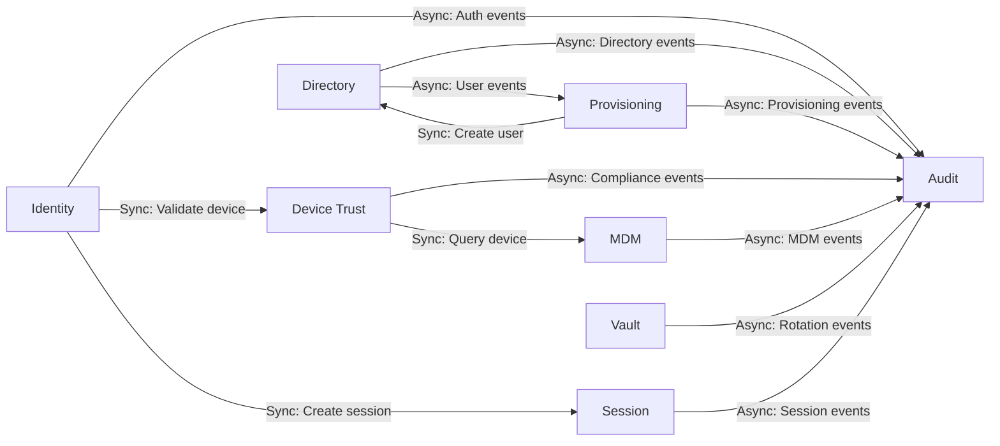
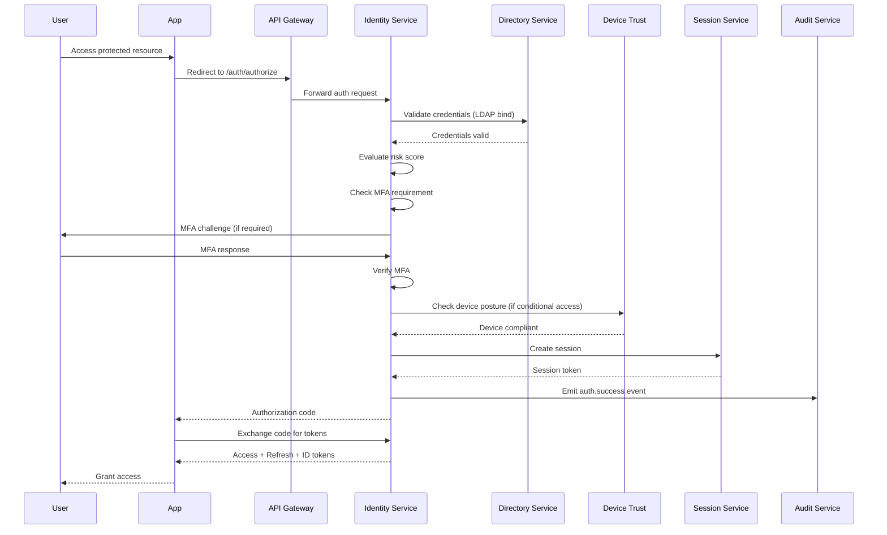
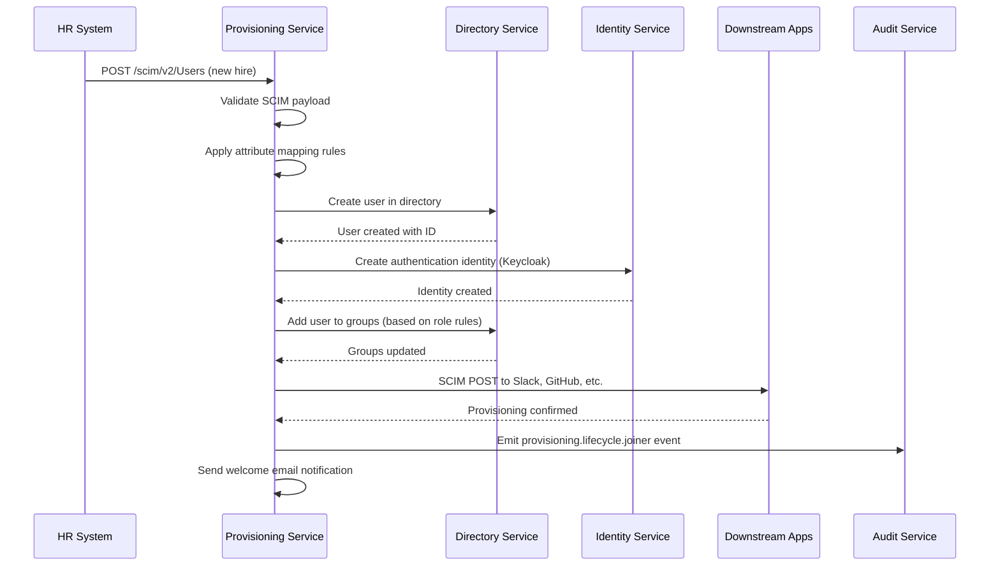
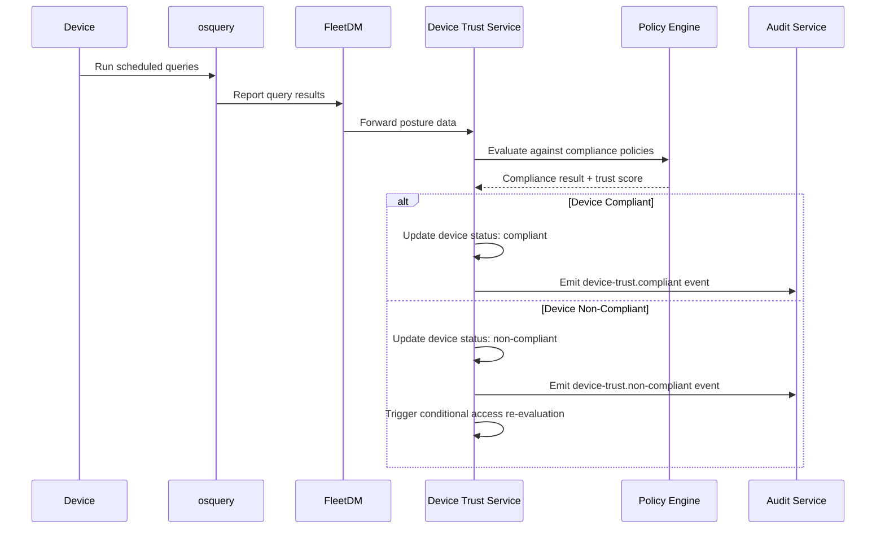
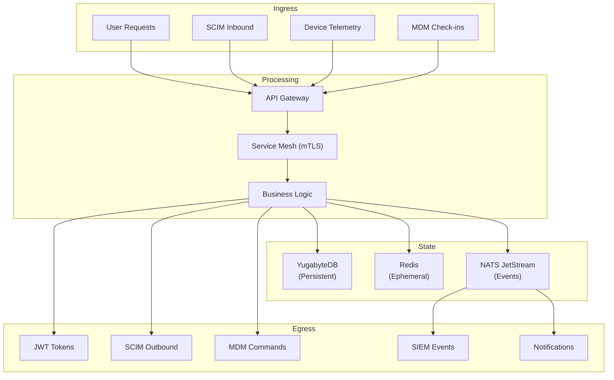

# ERP-IAM High-Level Design (HLD)

> **Document ID:** ERP-IAM-HLD-001
> **Version:** 1.0.0
> **Last Updated:** 2026-02-23
> **Status:** Approved
> **Related Documents:** [04-Software-Architecture.md](./04-Software-Architecture.md), [13-Low-Level-Design.md](./13-Low-Level-Design.md)

---

## 1. Introduction

This High-Level Design document describes the overall system structure of ERP-IAM at the module and service boundary level. It focuses on how the eight microservices interact with each other, with external systems, and with the broader ERP ecosystem, without diving into implementation details of individual components.

---

## 2. System Decomposition

### 2.1 Module Boundary

```mermaid
flowchart TB
    subgraph "ERP-IAM Module Boundary"
        direction TB
        GW["API Gateway<br/>Authentication + Rate Limiting + Routing"]

        subgraph "Identity Domain"
            direction LR
            IDS["Identity Service<br/>(Keycloak Orchestrator)"]
            DRS["Directory Service<br/>(Authentik + Samba AD DC)"]
            PRS["Provisioning Service<br/>(SCIM 2.0 Engine)"]
        end

        subgraph "Device Domain"
            direction LR
            DTS["Device Trust Service<br/>(FleetDM + osquery)"]
            MDS["MDM Service<br/>(NanoMDM)"]
        end

        subgraph "Security Infrastructure"
            direction LR
            CVS["Credential Vault<br/>(AES-256 + HSM)"]
            SSS["Session Service<br/>(Redis-backed)"]
            AUS["Audit Service<br/>(Immutable Chain)"]
        end
    end

    subgraph "External Systems"
        ERP_PLAT["ERP-Platform"]
        ERP_MODS["Other ERP Modules"]
        SOCIAL["Social IdPs"]
        EXT_DIR["External Directories"]
        SIEM_EXT["SIEM Systems"]
        ENDPOINTS["Managed Endpoints"]
    end

    ERP_PLAT <-->|"Entitlements<br/>Module Registry"| GW
    ERP_MODS -->|"JWT Validation"| GW
    SOCIAL <-->|"OIDC/OAuth2"| IDS
    EXT_DIR <-->|"LDAP/SCIM/Graph"| DRS
    SIEM_EXT <--|"Audit Events"| AUS
    ENDPOINTS <-->|"osquery/MDM"| DTS & MDS
```

### 2.2 Service Responsibilities

| Service | Single Responsibility | Owns |
|---|---|---|
| identity-service | Authentication and token lifecycle | Keycloak realm management, protocol handling (OIDC/SAML/LDAP), MFA, social login, passwordless, risk engine |
| directory-service | User/group/OU data management | Authentik user store, Samba AD DC, LDAP interface, directory sync, group policies |
| provisioning-service | Identity lifecycle automation | SCIM 2.0 server+client, joiner-mover-leaver rules, attribute mapping, sync scheduling |
| device-trust-service | Endpoint compliance assessment | FleetDM orchestration, osquery policy, posture evaluation, trust scoring, conditional access |
| mdm-service | Device management commands | NanoMDM, enrollment profiles, app deployment, remote wipe/lock, configuration profiles |
| credential-vault-service | Secrets management | Encryption/decryption, key hierarchy, rotation schedules, HSM integration |
| session-service | Session lifecycle | Session creation/validation/termination, concurrent limits, timeout policies, geolocation |
| audit-service | Immutable event logging | Event ingestion, chain verification, SIEM forwarding, compliance reports |

---

## 3. Inter-Service Communication

### 3.1 Communication Matrix



### 3.2 Communication Patterns

| From | To | Pattern | Protocol | Use Case |
|---|---|---|---|---|
| identity-service | session-service | Synchronous | gRPC | Create/validate session on auth |
| identity-service | device-trust-service | Synchronous | gRPC | Check device posture during auth |
| identity-service | audit-service | Asynchronous | NATS | Emit auth events |
| directory-service | provisioning-service | Asynchronous | NATS | Trigger provisioning on user changes |
| provisioning-service | directory-service | Synchronous | HTTP | Create/update users in directory |
| device-trust-service | mdm-service | Synchronous | gRPC | Query MDM enrollment status |
| All services | audit-service | Asynchronous | NATS | Emit all state change events |
| audit-service | SIEM | Asynchronous | HTTP/Kafka | Forward events to external SIEM |

---

## 4. Authentication Flow (End-to-End)



---

## 5. Provisioning Flow (End-to-End)



---

## 6. Device Trust Flow (End-to-End)



---

## 7. Data Flow Overview



---

## 8. Failure Modes and Recovery

| Failure Scenario | Impact | Detection | Recovery |
|---|---|---|---|
| Keycloak cluster failure | No new authentications | Health check + Kubernetes restart | Stateless pods restart, sessions preserved in Redis |
| YugabyteDB node failure | Degraded write performance | Raft consensus detects | Automatic re-replication to surviving nodes |
| Redis node failure | Session lookups degrade | Sentinel/Cluster detection | Failover to replica, sessions reconstructed from DB |
| NATS cluster failure | Event delivery paused | Health check | JetStream replay from disk on recovery |
| FleetDM failure | Device posture stale | Health check + stale data detection | Grace period for cached posture, alert admin |
| SIEM connector failure | Audit forwarding paused | Delivery failure counter | NATS retains events, replay on reconnection |
| HSM failure | Cannot encrypt new credentials | HSM health check | Failover to backup HSM, cached KEKs |

---

## 9. Capacity Planning

### 9.1 Sizing Guidelines

| Component | Small (1K users) | Medium (10K users) | Large (100K users) | Enterprise (1M users) |
|---|---|---|---|---|
| identity-service pods | 2 | 3 | 6 | 15 |
| directory-service pods | 2 | 2 | 4 | 10 |
| provisioning-service pods | 1 | 2 | 3 | 6 |
| device-trust-service pods | 1 | 2 | 4 | 8 |
| session-service pods | 2 | 3 | 6 | 15 |
| audit-service pods | 1 | 2 | 4 | 8 |
| YugabyteDB nodes | 3 | 3 | 5 | 9 |
| Redis nodes | 3 | 6 | 6 | 12 |
| NATS nodes | 3 | 3 | 5 | 7 |
| Keycloak nodes | 2 | 3 | 5 | 10 |
