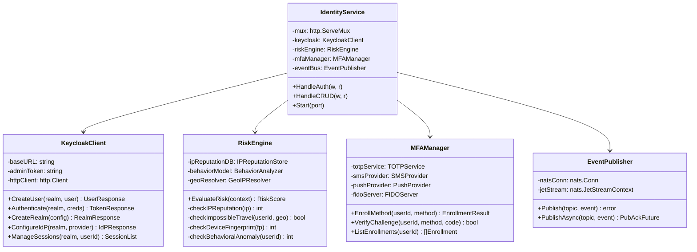
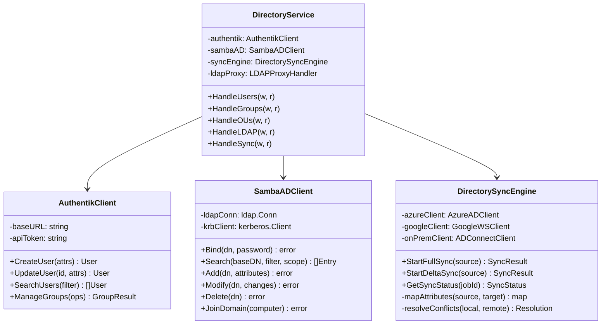
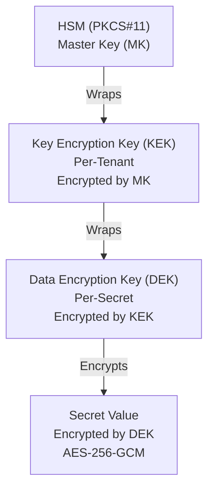
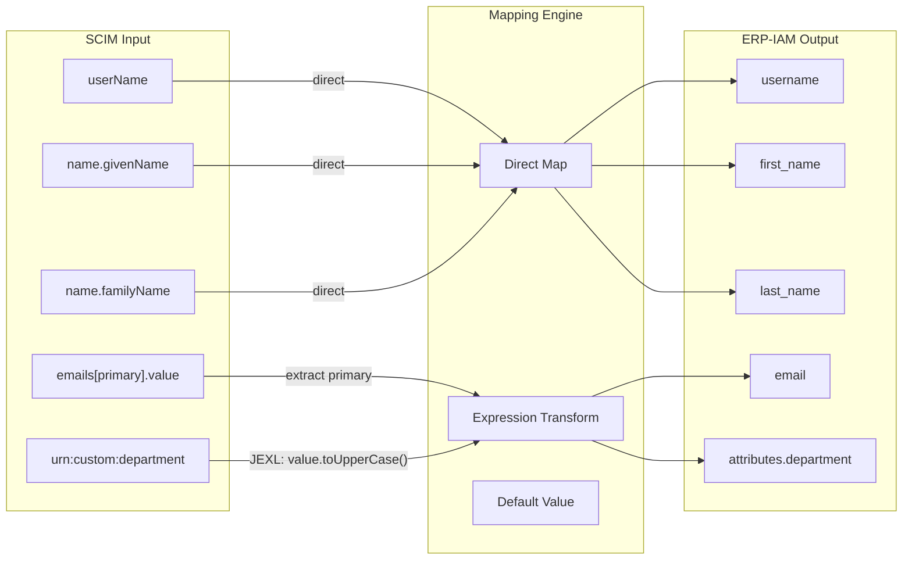

# ERP-IAM Low-Level Design (LLD)

> **Document ID:** ERP-IAM-LLD-001
> **Version:** 1.0.0
> **Last Updated:** 2026-02-23
> **Status:** Approved
> **Related Documents:** [12-High-Level-Design.md](./12-High-Level-Design.md), [14-Technical-Specifications.md](./14-Technical-Specifications.md)

---

## 1. Introduction

This Low-Level Design document describes the internal implementation details of each ERP-IAM microservice, including class/struct diagrams, algorithm descriptions, data flow within components, and detailed interface contracts.

---

## 2. Identity Service Internal Design

### 2.1 Component Structure



### 2.2 Authentication Algorithm

```
FUNCTION Authenticate(credentials, context):
    // Step 1: Rate limiting
    IF rateLimiter.isLimited(context.ip, credentials.username):
        RETURN Error(429, "Rate limited")

    // Step 2: Account lookup
    user = directory.findByUsername(credentials.username)
    IF user == null:
        RETURN Error(401, "Invalid credentials")  // Generic message

    // Step 3: Account lockout check
    IF user.lockedUntil > now():
        RETURN Error(423, "Account locked")

    // Step 4: Risk assessment
    riskScore = riskEngine.evaluate({
        ip: context.ip,
        geo: geoResolve(context.ip),
        deviceFP: context.deviceFingerprint,
        userId: user.id,
        time: now()
    })

    IF riskScore > 70:
        auditLog.emit("auth.blocked.high_risk", user, riskScore)
        RETURN Error(403, "Access blocked due to risk assessment")

    // Step 5: Password verification
    IF NOT verifyPassword(credentials.password, user.passwordHash):
        user.failedAttempts++
        IF user.failedAttempts >= config.lockoutThreshold:
            user.lockedUntil = now() + config.lockoutDuration
            auditLog.emit("auth.locked", user)
        RETURN Error(401, "Invalid credentials")

    // Step 6: MFA check
    IF user.mfaRequired OR riskScore > 30:
        IF NOT user.mfaEnrolled:
            RETURN Redirect("/mfa/enroll")
        mfaResult = awaitMFAChallenge(user)
        IF NOT mfaResult.verified:
            RETURN Error(401, "MFA verification failed")

    // Step 7: Device trust check (if conditional access enabled)
    IF conditionalAccess.requiresDeviceTrust(context.resource):
        posture = deviceTrust.evaluate(context.deviceId)
        IF NOT posture.compliant:
            RETURN Error(403, "Device non-compliant", posture.remediations)

    // Step 8: Session creation
    user.failedAttempts = 0
    session = sessionService.create(user, context)

    // Step 9: Token issuance
    tokens = keycloak.issueTokens(user, session)

    // Step 10: Audit
    auditLog.emit("auth.success", user, context, riskScore)
    RETURN tokens
```

---

## 3. Directory Service Internal Design

### 3.1 Component Structure



### 3.2 LDAP Search Algorithm

```
FUNCTION LDAPSearch(baseDN, filter, scope, attributes, pageSize):
    // Parse the LDAP filter into an AST
    filterAST = parseLDAPFilter(filter)

    // Determine search scope
    SWITCH scope:
        CASE "base":    searchFn = searchBase
        CASE "onelevel": searchFn = searchOneLevel
        CASE "subtree":  searchFn = searchSubtree

    // Execute against Samba AD DC
    results = sambaAD.search(baseDN, filterAST, scope, attributes)

    // Apply pagination (Simple Paged Results Control - RFC 2696)
    IF pageSize > 0:
        paginatedResults = paginate(results, pageSize, pageCookie)
        RETURN {
            entries: paginatedResults.page,
            cookie: paginatedResults.nextCookie,
            totalCount: results.length
        }

    RETURN results
```

---

## 4. Credential Vault Internal Design

### 4.1 Encryption Hierarchy



### 4.2 Encryption Algorithm

```
FUNCTION EncryptSecret(tenantId, secretValue):
    // Step 1: Get or create tenant KEK
    kek = keyStore.getTenantKEK(tenantId)
    IF kek == null:
        kek = hsm.generateKey(AES_256)
        wrappedKEK = hsm.wrapKey(kek, masterKey)
        keyStore.storeTenantKEK(tenantId, wrappedKEK)

    // Step 2: Generate per-secret DEK
    dek = crypto.generateRandomKey(AES_256)  // 256-bit random

    // Step 3: Encrypt secret with DEK
    nonce = crypto.generateNonce(12)  // 96-bit for GCM
    ciphertext = AES_256_GCM_Encrypt(dek, nonce, secretValue, aad=tenantId)

    // Step 4: Wrap DEK with KEK
    wrappedDEK = AES_256_GCM_Encrypt(kek, newNonce, dek, aad=secretId)

    // Step 5: Store
    RETURN {
        encrypted_value: nonce || ciphertext || tag,
        wrapped_dek: wrappedDEK,
        kek_id: kek.id,
        algorithm: "AES-256-GCM",
        version: nextVersion()
    }
```

### 4.3 Rotation Algorithm

```
FUNCTION RotateSecret(secretId):
    // Step 1: Read current secret
    currentVersion = vault.getCurrentVersion(secretId)
    plaintext = DecryptSecret(currentVersion)

    // Step 2: Generate new credential at target system
    newValue = targetSystem.generateNewCredential(secretId)

    // Step 3: Encrypt new value
    newEncrypted = EncryptSecret(tenantId, newValue)

    // Step 4: Store as new version
    vault.storeVersion(secretId, newEncrypted, version=current+1)
    vault.setCurrentVersion(secretId, current+1)

    // Step 5: Keep old version active for overlap period
    scheduler.scheduleRevocation(secretId, current, overlapDuration)

    // Step 6: Audit
    auditLog.emit("credential-vault.rotated", secretId)
```

---

## 5. Session Service Internal Design

### 5.1 Redis Data Structures

```
# Session storage (HASH)
HSET tenant:{tid}:session:{sid}
    user_id         "{uid}"
    token_hash      "{sha256}"
    ip_address      "203.0.113.42"
    user_agent      "Mozilla/5.0 ..."
    geo_city        "Lagos"
    geo_country     "NG"
    created_at      "2026-02-23T10:00:00Z"
    last_activity   "2026-02-23T10:15:00Z"
EXPIRE tenant:{tid}:session:{sid} 28800  # 8 hours

# User session index (SET)
SADD tenant:{tid}:user_sessions:{uid} "{sid}"

# Concurrent session counter (STRING)
INCR tenant:{tid}:session_count:{uid}
```

### 5.2 Session Creation with Concurrent Limit

```
FUNCTION CreateSession(user, context, config):
    sessionId = generateUUID()
    tokenHash = sha256(generateSecureToken())

    // Check concurrent session limit
    currentCount = redis.GET("tenant:{tid}:session_count:{uid}")
    IF currentCount >= config.maxConcurrentSessions:
        // Evict oldest session
        sessions = redis.SMEMBERS("tenant:{tid}:user_sessions:{uid}")
        oldest = findOldestByCreatedAt(sessions)
        TerminateSession(oldest.id, reason="concurrent_limit_exceeded")
        eventBus.publish("session.limit_exceeded", {userId, evicted: oldest.id})

    // Create session
    redis.HSET("tenant:{tid}:session:{sid}", sessionData)
    redis.EXPIRE("tenant:{tid}:session:{sid}", config.absoluteTimeout)
    redis.SADD("tenant:{tid}:user_sessions:{uid}", sid)
    redis.INCR("tenant:{tid}:session_count:{uid}")

    eventBus.publish("session.created", {userId, sessionId, ip, geo})
    RETURN {sessionId, tokenHash, expiresAt}
```

---

## 6. Audit Service Internal Design

### 6.1 Chain Hash Algorithm

```
FUNCTION AppendAuditEvent(event):
    // Get previous event hash
    previousHash = getLastChainHash(event.tenantId)
    IF previousHash == "":
        previousHash = "0000000000000000000000000000000000000000000000000000000000000000"

    // Compute chain hash
    hashInput = concatenate(
        event.id,
        event.tenantId,
        event.eventType,
        event.actorId,
        event.time,
        JSON.stringify(event.details),
        previousHash
    )
    chainHash = SHA256(hashInput)

    // Store event with chain hash
    event.chainHash = chainHash
    event.previousHash = previousHash
    db.insert("audit_events", event)

    // Forward to SIEM
    siemForwarder.send(event)

    RETURN event
```

### 6.2 Chain Verification

```
FUNCTION VerifyAuditChain(tenantId, fromTime, toTime):
    events = db.query(
        "SELECT * FROM audit_events WHERE tenant_id = ? AND created_at BETWEEN ? AND ? ORDER BY created_at ASC",
        tenantId, fromTime, toTime
    )

    previousHash = events[0].previousHash
    FOR EACH event IN events:
        expectedHash = SHA256(concat(event.id, event.tenantId, ...event fields, previousHash))
        IF expectedHash != event.chainHash:
            RETURN {valid: false, brokenAt: event.id, expected: expectedHash, actual: event.chainHash}
        previousHash = event.chainHash

    RETURN {valid: true, eventsVerified: events.length}
```

---

## 7. Device Trust Scoring Algorithm

```
FUNCTION ComputeTrustScore(device, policy):
    weights = policy.checkWeights  // configurable per policy
    totalWeight = sum(weights.values())
    score = 0

    checks = {
        "os_version":       checkOSVersion(device.osVersion, policy.minOSVersion),
        "disk_encryption":  checkEncryption(device.encryptionStatus),
        "firewall":         checkFirewall(device.firewallEnabled),
        "antivirus":        checkAntivirus(device.avStatus, device.avUpToDate),
        "patch_level":      checkPatchLevel(device.lastPatchDate, policy.maxPatchAge),
        "jailbreak":        checkJailbreak(device.jailbreakIndicators)
    }

    FOR EACH (checkName, result) IN checks:
        IF result.passed:
            score += weights[checkName]

    normalizedScore = (score / totalWeight) * 100
    compliant = normalizedScore >= policy.complianceThreshold

    RETURN {
        trustScore: normalizedScore,
        compliant: compliant,
        checks: checks,
        evaluatedAt: now()
    }
```

---

## 8. SCIM Attribute Mapping Engine



---

## 9. Error Handling Strategy

All services follow a consistent error handling pattern:

```go
type AppError struct {
    Code       string `json:"code"`
    Message    string `json:"message"`
    Details    any    `json:"details,omitempty"`
    StatusCode int    `json:"-"`
}

// Error codes
const (
    ErrTenantRequired    = "TENANT_REQUIRED"
    ErrUnauthorized      = "UNAUTHORIZED"
    ErrForbidden         = "FORBIDDEN"
    ErrNotFound          = "NOT_FOUND"
    ErrConflict          = "CONFLICT"
    ErrRateLimited       = "RATE_LIMITED"
    ErrAccountLocked     = "ACCOUNT_LOCKED"
    ErrMFARequired       = "MFA_REQUIRED"
    ErrDeviceNonCompliant = "DEVICE_NON_COMPLIANT"
    ErrInternalError     = "INTERNAL_ERROR"
)
```
