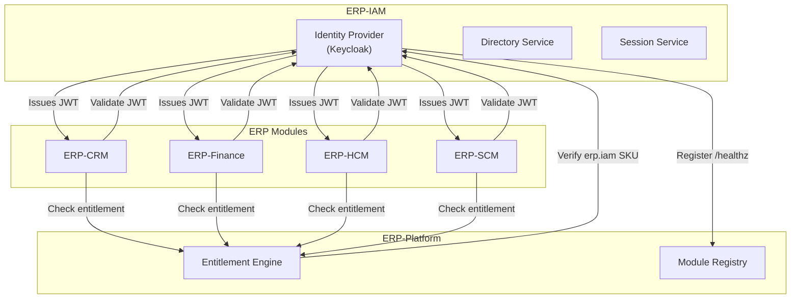
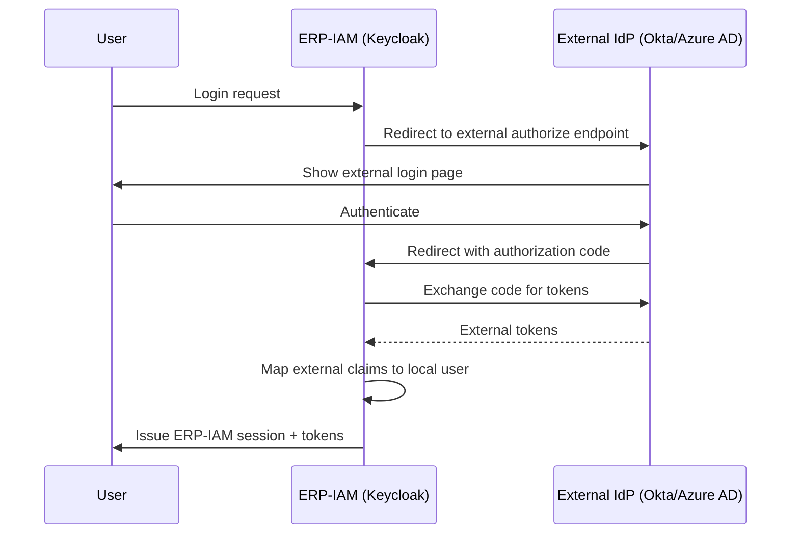
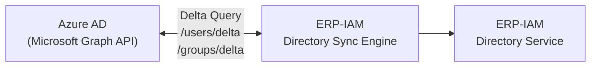
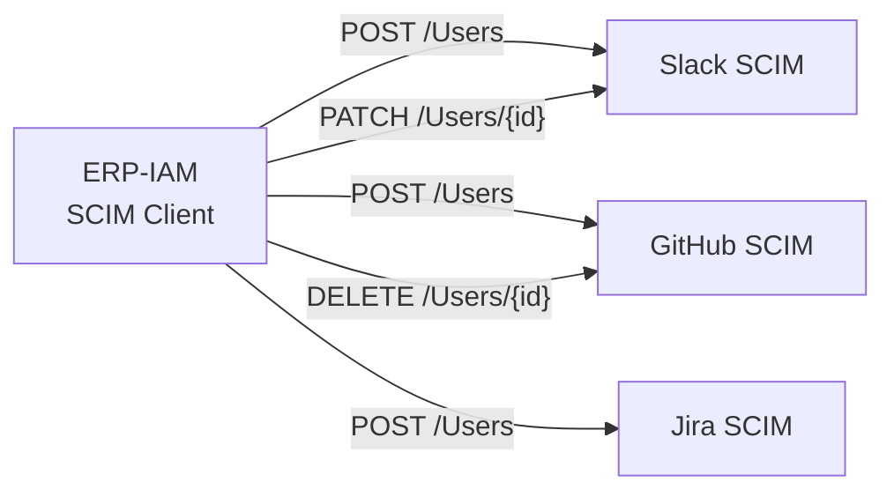

# ERP-IAM Integration Guide

> **Document ID:** ERP-IAM-IG-001
> **Version:** 1.0.0
> **Last Updated:** 2026-02-23
> **Status:** Approved
> **Related Documents:** [05-Backend-API-Reference.md](./05-Backend-API-Reference.md), [11-Event-Schema.md](./11-Event-Schema.md)

---

## 1. Overview

This guide describes how to integrate ERP-IAM with other ERP modules, external identity providers, directory services, SIEM systems, and third-party applications. ERP-IAM operates in `standalone_plus_suite` mode, meaning it can function independently or as part of the broader ERP ecosystem.

---

## 2. ERP Module Integration

### 2.1 Integration Architecture



### 2.2 JWT Token Integration

Every ERP module authenticates requests using JWT tokens issued by ERP-IAM. The integration pattern is:

**Step 1: Add OIDC Client in Keycloak**

Each module is registered as an OIDC client in the tenant's Keycloak realm:

```json
{
  "clientId": "erp-crm",
  "name": "ERP-CRM Module",
  "protocol": "openid-connect",
  "publicClient": false,
  "redirectUris": ["https://crm.erp.example.com/*"],
  "webOrigins": ["https://crm.erp.example.com"],
  "standardFlowEnabled": true,
  "directAccessGrantsEnabled": false,
  "serviceAccountsEnabled": true
}
```

**Step 2: Token Validation in Module**

Each module validates the JWT on every request:

```go
// Middleware for ERP module services
func JWTMiddleware(keycloakURL, realm string) func(http.Handler) http.Handler {
    jwksURL := fmt.Sprintf("%s/realms/%s/protocol/openid-connect/certs", keycloakURL, realm)
    keySet := jwk.NewAutoRefresh(context.Background())
    keySet.Configure(jwksURL, jwk.WithRefreshInterval(15*time.Minute))

    return func(next http.Handler) http.Handler {
        return http.HandlerFunc(func(w http.ResponseWriter, r *http.Request) {
            tokenString := extractBearerToken(r)
            token, err := jwt.Parse(tokenString, jwt.WithKeySet(keySet))
            if err != nil {
                http.Error(w, "unauthorized", 401)
                return
            }
            // Verify tenant claim matches X-Tenant-ID header
            tenantClaim := token.PrivateClaims()["tenant_id"]
            if tenantClaim != r.Header.Get("X-Tenant-ID") {
                http.Error(w, "tenant mismatch", 403)
                return
            }
            next.ServeHTTP(w, r)
        })
    }
}
```

### 2.3 Event Subscription

Other ERP modules can subscribe to IAM events for reactive behavior:

```go
// Subscribe to identity events in another ERP module
sub, _ := js.Subscribe("erp.iam.identity.created", func(msg *nats.Msg) {
    var event CloudEvent
    json.Unmarshal(msg.Data, &event)

    // React to new user creation
    createModuleUserProfile(event.Data)

    msg.Ack()
})
```

---

## 3. External Identity Provider Integration

### 3.1 OIDC Federation (e.g., with Okta, Azure AD)



**Configuration:**

```json
{
  "alias": "azure-ad",
  "providerId": "oidc",
  "enabled": true,
  "config": {
    "authorizationUrl": "https://login.microsoftonline.com/{tenant}/oauth2/v2.0/authorize",
    "tokenUrl": "https://login.microsoftonline.com/{tenant}/oauth2/v2.0/token",
    "clientId": "azure-client-id",
    "clientSecret": "credential-vault://azure-ad-client-secret",
    "defaultScope": "openid profile email",
    "syncMode": "IMPORT",
    "trustEmail": true
  }
}
```

### 3.2 SAML Federation

For SAML-based enterprise IdPs:

```xml
<!-- Keycloak as SP, External IdP metadata import -->
<md:EntityDescriptor entityID="https://iam.erp.example.com/auth/realms/{realm}">
  <md:SPSSODescriptor
    AuthnRequestsSigned="true"
    WantAssertionsSigned="true"
    protocolSupportEnumeration="urn:oasis:names:tc:SAML:2.0:protocol">
    <md:AssertionConsumerService
      Binding="urn:oasis:names:tc:SAML:2.0:bindings:HTTP-POST"
      Location="https://iam.erp.example.com/auth/realms/{realm}/broker/{alias}/endpoint"
      index="0"/>
  </md:SPSSODescriptor>
</md:EntityDescriptor>
```

---

## 4. Directory Sync Integration

### 4.1 Azure AD Sync



**Configuration:**

```yaml
sync_connections:
  - name: "azure-ad-sync"
    type: "azure_ad"
    config:
      tenant_id: "azure-tenant-uuid"
      client_id: "app-registration-client-id"
      client_secret_ref: "credential-vault://azure-ad-sync-secret"
    schedule:
      full_sync: "0 2 * * 0"   # Weekly full sync at 2 AM Sunday
      delta_sync: "*/15 * * * *"  # Delta sync every 15 minutes
    scope:
      users: true
      groups: true
      filter: "department ne null"
    attribute_mapping:
      userPrincipalName: username
      displayName: display_name
      givenName: first_name
      surname: last_name
      mail: email
      department: attributes.department
      jobTitle: attributes.title
```

### 4.2 Google Workspace Sync

```yaml
sync_connections:
  - name: "google-workspace-sync"
    type: "google_workspace"
    config:
      domain: "example.com"
      service_account_key_ref: "credential-vault://google-ws-service-key"
      admin_email: "admin@example.com"
    schedule:
      delta_sync: "*/30 * * * *"
    attribute_mapping:
      primaryEmail: email
      name.fullName: display_name
      name.givenName: first_name
      name.familyName: last_name
      orgUnitPath: attributes.department
```

---

## 5. SIEM Integration

### 5.1 Splunk (HEC)

```yaml
siem:
  splunk:
    enabled: true
    hec_url: "https://splunk.example.com:8088/services/collector/event"
    hec_token_ref: "credential-vault://splunk-hec-token"
    index: "erp_iam_audit"
    source: "erp-iam"
    sourcetype: "_json"
    batch_size: 100
    flush_interval: "5s"
    tls_verify: true
```

### 5.2 Elasticsearch

```yaml
siem:
  elasticsearch:
    enabled: true
    hosts:
      - "https://elastic.example.com:9200"
    index_pattern: "erp-iam-audit-{date}"
    api_key_ref: "credential-vault://elastic-api-key"
    batch_size: 200
    flush_interval: "10s"
```

### 5.3 Datadog

```yaml
siem:
  datadog:
    enabled: true
    api_key_ref: "credential-vault://datadog-api-key"
    site: "datadoghq.com"
    service: "erp-iam"
    tags:
      - "env:production"
      - "module:iam"
```

---

## 6. SCIM Outbound Integration

### 6.1 Connecting Downstream Applications



**Downstream connection configuration:**

```yaml
scim_clients:
  - name: "slack"
    base_url: "https://api.slack.com/scim/v2"
    bearer_token_ref: "credential-vault://slack-scim-token"
    enabled: true
    sync_groups: true
    attribute_mapping:
      userName: email
      name.givenName: first_name
      name.familyName: last_name
      active: active
```

---

## 7. Webhook Integration

ERP-IAM supports outbound webhooks for real-time notifications:

```yaml
webhooks:
  - name: "security-alerts"
    url: "https://hooks.example.com/iam-alerts"
    secret: "credential-vault://webhook-secret"
    events:
      - "erp.iam.identity.auth.failure"
      - "erp.iam.identity.auth.locked"
      - "erp.iam.device-trust.non-compliant"
    retry:
      max_attempts: 3
      backoff: "exponential"
```

Webhooks use HMAC-SHA256 signature verification:

```
X-Webhook-Signature: sha256=<HMAC-SHA256(secret, body)>
X-Webhook-Timestamp: 1708704000
```
