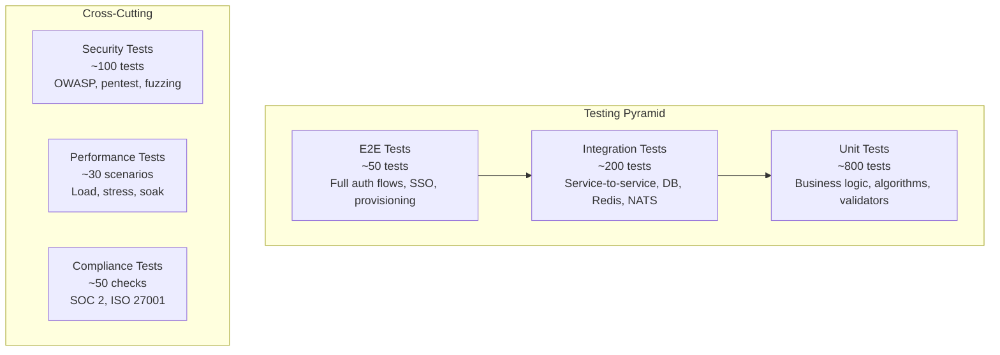

# ERP-IAM Testing Strategy

> **Document ID:** ERP-IAM-TS-001
> **Version:** 1.0.0
> **Last Updated:** 2026-02-23
> **Status:** Approved
> **Related Documents:** [14-Technical-Specifications.md](./14-Technical-Specifications.md), [25-Deployment-Pipeline.md](./25-Deployment-Pipeline.md)

---

## 1. Overview

ERP-IAM employs a comprehensive multi-layer testing strategy covering unit, integration, end-to-end, security, performance, and compliance testing. As the security backbone of the ERP suite, IAM requires an especially rigorous testing regime with zero tolerance for security regressions.

---

## 2. Testing Pyramid



---

## 3. Unit Testing

### 3.1 Scope

Unit tests cover individual functions and methods in isolation:

- **Risk engine scoring**: Verify score computation for various signal combinations
- **Password policy validation**: Test all policy rules (length, complexity, history)
- **Attribute mapping engine**: Verify JEXL expression evaluation and direct mapping
- **Trust score computation**: Test weighted scoring with various check results
- **Chain hash algorithm**: Verify hash computation and chain integrity
- **Session concurrent limit logic**: Test eviction behavior at various limits
- **SCIM filter parsing**: Verify filter expression parsing for all operators
- **Encryption/decryption**: Verify AES-256-GCM round-trip for all key sizes

### 3.2 Framework and Conventions

```go
// Go unit tests using standard testing package
func TestRiskEngine_EvaluateRisk_LowRisk(t *testing.T) {
    engine := NewRiskEngine(mockIPRepo, mockBehaviorModel)
    ctx := AuthContext{
        IP: "10.0.0.1",          // Internal IP
        DeviceFP: "known-device",
        UserID: "user-123",
        Time: workingHours,
    }
    score := engine.EvaluateRisk(ctx)
    assert.Less(t, score, 30, "Internal IP during working hours should be low risk")
}

func TestRiskEngine_EvaluateRisk_HighRisk(t *testing.T) {
    engine := NewRiskEngine(mockIPRepo, mockBehaviorModel)
    ctx := AuthContext{
        IP: "198.51.100.1",      // Known TOR exit node
        DeviceFP: "unknown",
        UserID: "user-123",
        Time: outsideHours,
    }
    score := engine.EvaluateRisk(ctx)
    assert.Greater(t, score, 70, "TOR exit node with unknown device should be high risk")
}
```

### 3.3 Coverage Targets

| Service | Minimum Coverage | Target Coverage |
|---|---|---|
| identity-service | 80% | 90% |
| directory-service | 80% | 85% |
| provisioning-service | 80% | 85% |
| device-trust-service | 80% | 90% |
| credential-vault-service | 90% | 95% |
| session-service | 85% | 90% |
| audit-service | 85% | 90% |
| mdm-service | 75% | 85% |

---

## 4. Integration Testing

### 4.1 Service-to-Database

```go
func TestIdentityService_CreateUser_YugabyteDB(t *testing.T) {
    db := setupTestYugabyte(t)
    defer db.Close()
    svc := NewIdentityService(db)

    user, err := svc.CreateUser(context.Background(), CreateUserInput{
        TenantID: testTenantID,
        Username: "test.user",
        Email:    "test.user@example.com",
    })
    require.NoError(t, err)
    assert.NotEmpty(t, user.ID)

    // Verify persistence
    fetched, err := svc.GetUser(context.Background(), user.ID)
    require.NoError(t, err)
    assert.Equal(t, "test.user", fetched.Username)
}
```

### 4.2 Service-to-Redis

```go
func TestSessionService_ConcurrentLimit(t *testing.T) {
    redis := setupTestRedis(t)
    svc := NewSessionService(redis, SessionConfig{MaxConcurrent: 3})

    // Create 3 sessions
    for i := 0; i < 3; i++ {
        _, err := svc.CreateSession(testUser, testContext)
        require.NoError(t, err)
    }

    // 4th session should evict oldest
    session4, err := svc.CreateSession(testUser, testContext)
    require.NoError(t, err)

    count := svc.GetSessionCount(testUser.ID)
    assert.Equal(t, 3, count, "Should still have 3 sessions after eviction")
}
```

### 4.3 Service-to-Event-Bus

```go
func TestAuditService_EventChaining(t *testing.T) {
    nats := setupTestNATS(t)
    db := setupTestDB(t)
    svc := NewAuditService(db, nats)

    // Write two events
    event1, _ := svc.WriteEvent(testEvent("auth.login.success"))
    event2, _ := svc.WriteEvent(testEvent("auth.mfa.verified"))

    // Verify chain integrity
    assert.Equal(t, event1.ChainHash, event2.PreviousHash)
    result := svc.VerifyChain(testTenantID, event1.CreatedAt, event2.CreatedAt)
    assert.True(t, result.Valid)
}
```

---

## 5. End-to-End Testing

### 5.1 Critical Auth Flows

| Test ID | Flow | Steps |
|---|---|---|
| E2E-AUTH-001 | OIDC login with PKCE | Initiate auth, enter credentials, exchange code, verify tokens |
| E2E-AUTH-002 | SAML SSO login | SP-initiated login, IdP authentication, assertion validation |
| E2E-AUTH-003 | Social login (Google) | Redirect to Google, consent, callback, account linking |
| E2E-AUTH-004 | MFA enrollment + login | Enroll TOTP, login with password + TOTP |
| E2E-AUTH-005 | Passwordless FIDO2 | Register authenticator, authenticate with WebAuthn |
| E2E-AUTH-006 | Magic link login | Request link, validate link, session creation |
| E2E-AUTH-007 | Brute force lockout | 5 failed attempts, verify lockout, verify unlock after duration |
| E2E-AUTH-008 | Password reset | Request reset, click link, set new password, old sessions invalidated |

### 5.2 Provisioning Flows

| Test ID | Flow | Steps |
|---|---|---|
| E2E-PROV-001 | SCIM user create | POST SCIM user, verify directory entry, verify group membership |
| E2E-PROV-002 | Joiner lifecycle | HR event, identity creation, app provisioning, welcome email |
| E2E-PROV-003 | Leaver lifecycle | Termination event, disable, revoke sessions, deprovision apps |
| E2E-PROV-004 | Directory sync (Azure AD) | Trigger sync, verify user/group creation, verify attribute mapping |

---

## 6. Security Testing

### 6.1 OWASP Coverage

| OWASP Top 10 | IAM-Specific Tests |
|---|---|
| A01 Broken Access Control | Cross-tenant access attempts, privilege escalation, IDOR |
| A02 Cryptographic Failures | Weak algorithm detection, key exposure, certificate validation |
| A03 Injection | LDAP injection, SCIM filter injection, JSON injection |
| A04 Insecure Design | MFA bypass attempts, session fixation, token replay |
| A05 Security Misconfiguration | Default credentials, open LDAP bind, permissive CORS |
| A07 Auth Failures | Credential stuffing, brute force, session hijacking |
| A08 Software Integrity | JWT algorithm confusion (alg:none), SAML assertion manipulation |
| A09 Logging Failures | Audit log completeness, chain integrity verification |

### 6.2 Penetration Test Scenarios

```mermaid
flowchart TD
    A["Token Manipulation"] --> A1["JWT alg:none attack"]
    A --> A2["Token signature bypass"]
    A --> A3["Expired token replay"]
    A --> A4["Refresh token theft"]

    B["Cross-Tenant Attacks"] --> B1["Tenant ID header manipulation"]
    B --> B2["IDOR on user endpoints"]
    B --> B3["Cross-realm SAML assertion"]

    C["Authentication Bypass"] --> C1["MFA bypass via race condition"]
    C --> C2["Magic link token prediction"]
    C --> C3["Social login account takeover"]
    C --> C4["LDAP injection authentication bypass"]

    D["Privilege Escalation"] --> D1["Self-assign admin role"]
    D --> D2["Group policy manipulation"]
    D --> D3["SCIM create admin user"]
```



---

## 7. Performance Testing

### 7.1 Load Test Scenarios

| Scenario | Target | Tool |
|---|---|---|
| Authentication throughput | 5,000 req/s per node | k6 |
| LDAP search under load | 10,000 req/s per node | ldap-perf |
| SCIM bulk provisioning | 1,000 users/minute | k6 |
| Session creation burst | 20,000 req/s per node | k6 |
| Concurrent session query | 100,000 active sessions | k6 |

### 7.2 Soak Test

- **Duration**: 72 hours continuous
- **Load**: 50% of peak capacity
- **Monitors**: Memory leak detection, connection pool exhaustion, GC pauses, disk growth
- **Pass criteria**: No degradation > 5% from baseline, no OOM kills, no error rate increase

---

## 8. Compliance Testing

### 8.1 SOC 2 Type II Controls

| Control | Test |
|---|---|
| CC6.1 Logical access | Verify only authenticated users access resources |
| CC6.2 System credentials | Verify credential rotation and vault security |
| CC6.3 Encryption | Verify TLS 1.3 and AES-256 at rest |
| CC6.6 MFA | Verify MFA enforcement for admin access |
| CC7.2 Monitoring | Verify audit log completeness |

### 8.2 ISO 27001 Annex A Controls

| Control | Test |
|---|---|
| A.9.2.1 User registration | Verify provisioning workflow |
| A.9.2.2 User access provisioning | Verify SCIM-based provisioning |
| A.9.2.6 Removal of access rights | Verify leaver deprovisioning |
| A.9.4.1 Information access | Verify conditional access policies |
| A.9.4.2 Secure log-on | Verify MFA and password policies |

---

## 9. Test Execution

### 9.1 Makefile Targets

```makefile
test:
    @echo "run module unit tests"
    go test ./services/... -v -cover -count=1

test-integration:
    @echo "run module integration tests"
    docker-compose -f docker-compose.test.yml up -d
    go test ./services/... -tags=integration -v -timeout 5m
    docker-compose -f docker-compose.test.yml down

test-e2e:
    @echo "run module e2e tests"
    go test ./tests/e2e/... -tags=e2e -v -timeout 30m
```
