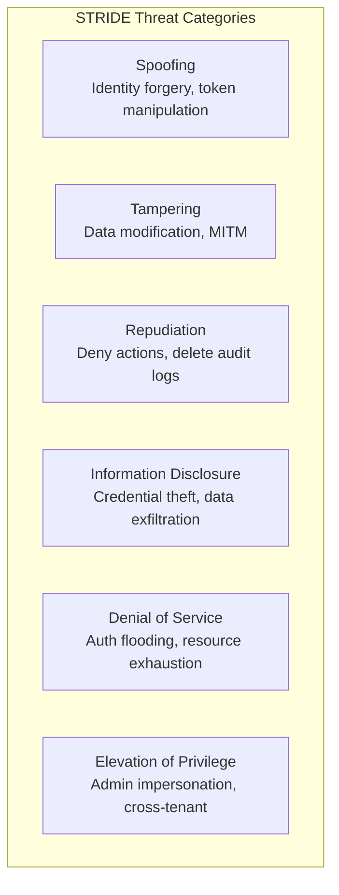
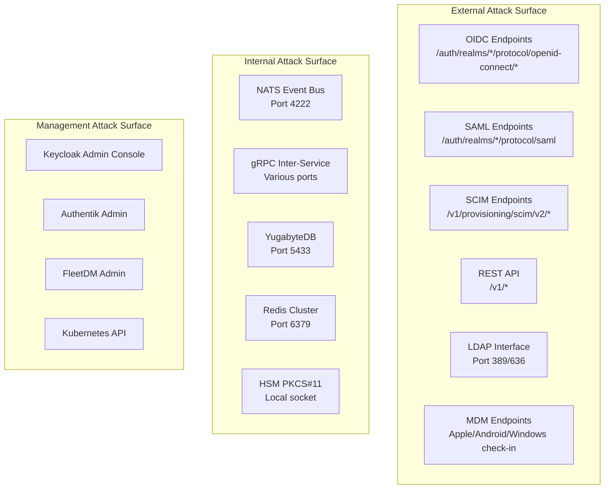
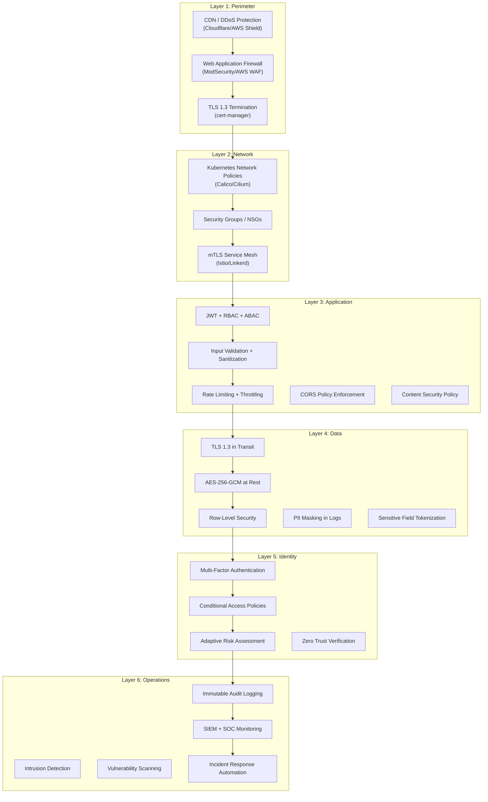
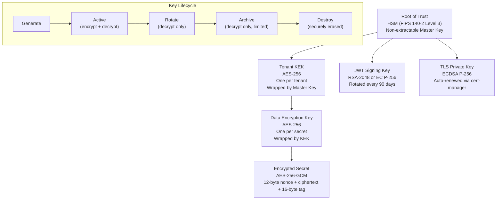
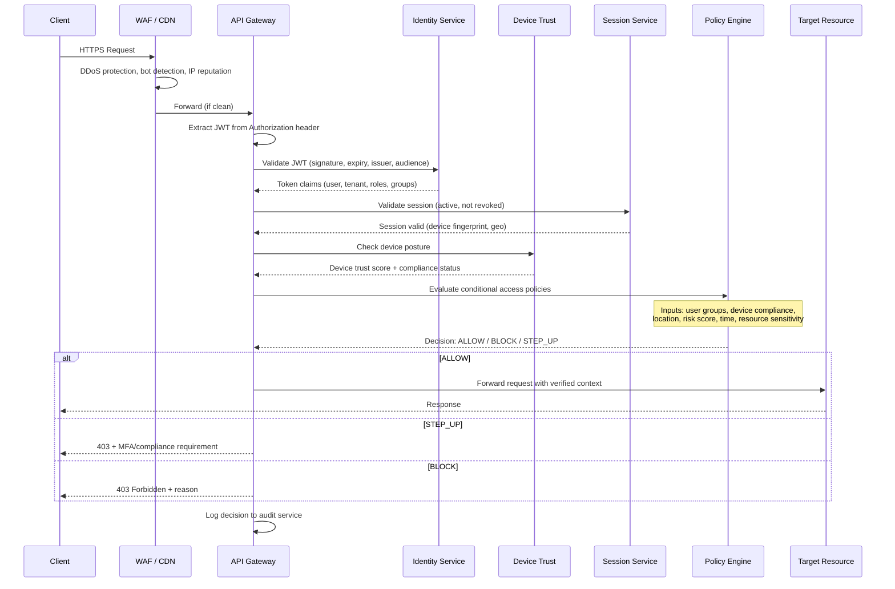
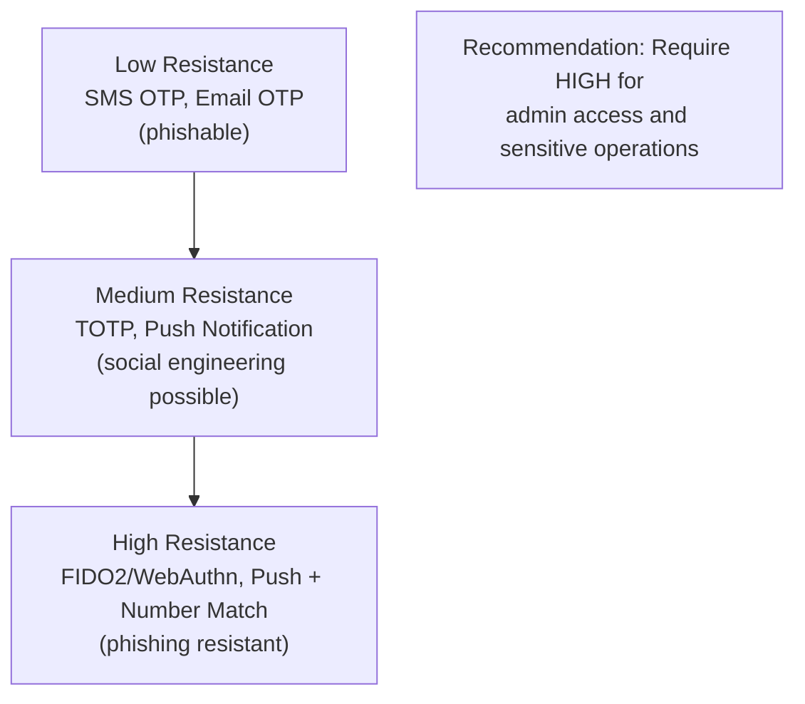
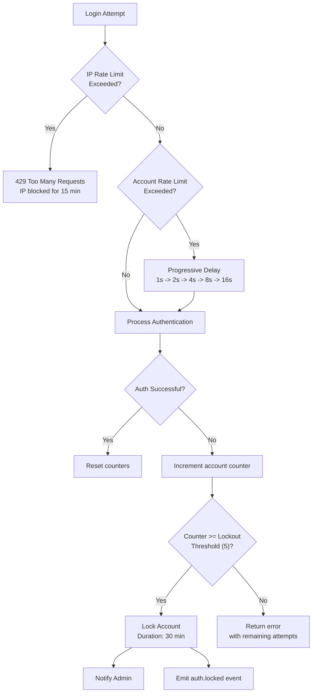
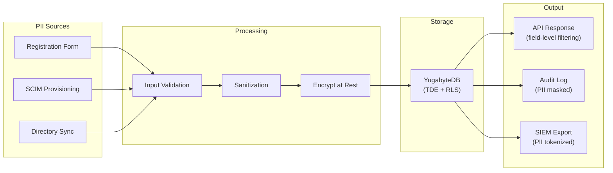
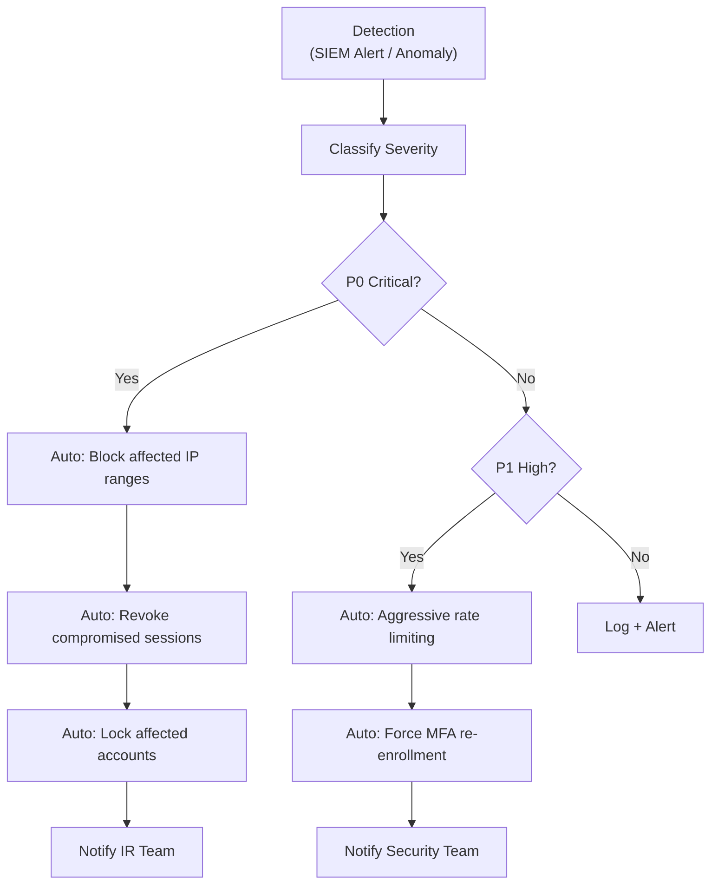

# ERP-IAM Security Architecture

> **Document ID:** ERP-IAM-SEC-001
> **Version:** 1.0.0
> **Last Updated:** 2026-02-23
> **Status:** Approved
> **Classification:** CONFIDENTIAL
> **Related Documents:** [04-Software-Architecture.md](./04-Software-Architecture.md), [14-Technical-Specifications.md](./14-Technical-Specifications.md), [17-Testing-Strategy.md](./17-Testing-Strategy.md)

---

## 1. Executive Summary

As the security backbone of the ERP suite, ERP-IAM itself must be secured with the highest rigor. This document defines the comprehensive security architecture encompassing threat modeling, defense-in-depth controls, cryptographic design, zero-trust implementation, compliance mapping, incident response, and security operations. This is the most critical security document in the ERP suite -- ERP-IAM's compromise would cascade to all 20 modules.

---

## 2. Threat Model

### 2.1 STRIDE Analysis



### 2.2 Threat Catalog

| ID | Threat | STRIDE | Likelihood | Impact | Risk | Mitigation |
|---|---|---|---|---|---|---|
| T-001 | JWT token forgery (alg:none attack) | S | Medium | Critical | High | Reject alg:none, enforce RS256/ES256, validate issuer |
| T-002 | Credential stuffing attack | S | High | High | Critical | Rate limiting, account lockout, CAPTCHA, leaked password detection |
| T-003 | SAML assertion manipulation | S,T | Medium | Critical | High | Validate XML signature, reject unsigned assertions, restrict allowed issuers |
| T-004 | Cross-tenant data access | E,I | Medium | Critical | Critical | Row-level security, tenant ID validation in JWT claims, API header cross-check |
| T-005 | LDAP injection | T,E | Medium | High | High | Parameterized LDAP queries, input validation, escape special characters |
| T-006 | Session hijacking | S,I | Medium | High | High | Token binding to device fingerprint, short-lived tokens, TLS only |
| T-007 | Brute force authentication | S | High | Medium | High | Progressive delays, account lockout, IP-based rate limiting |
| T-008 | Audit log tampering | R,T | Low | Critical | Medium | Cryptographic hash chain, append-only storage, WORM backup |
| T-009 | HSM key extraction | I | Very Low | Critical | Medium | FIPS 140-2 Level 3 HSM, physical access controls, dual control |
| T-010 | Supply chain attack on Keycloak | T,E | Low | Critical | High | Pin versions, verify checksums, monitor CVEs, WAF protection |
| T-011 | DDoS on authentication endpoint | D | High | High | Critical | CDN/WAF rate limiting, auto-scaling, circuit breakers |
| T-012 | Insider threat -- admin abuse | E,I,R | Medium | Critical | High | Privileged access workstations, MFA for admin ops, audit all admin actions |
| T-013 | MFA bypass via social engineering | S | Medium | High | High | Push notification context (IP, location), number matching, phishing-resistant FIDO2 |
| T-014 | OAuth2 token theft from credential vault | I | Low | Critical | High | HSM-backed encryption, access audit trail, principle of least privilege |
| T-015 | Directory sync data exfiltration | I | Low | High | Medium | Encrypted sync channels, minimal attribute sync, anomaly detection |
| T-016 | Device trust bypass (agent spoofing) | S,T | Medium | High | High | Attestation-based enrollment, agent integrity checks, TPM binding |
| T-017 | Magic link interception | S,I | Medium | Medium | Medium | Short TTL (10 min), single use, HTTPS only, email security (DKIM/SPF) |
| T-018 | Refresh token theft and replay | S | Medium | High | High | Refresh token rotation, reuse detection, device binding |
| T-019 | SCIM provisioning abuse | E,T | Low | High | Medium | Bearer token auth, rate limiting, schema validation, approval workflows |
| T-020 | Remote wipe command injection | T,D | Low | Critical | High | MFA re-authentication for wipe commands, dual approval, audit logging |

### 2.3 Attack Surface Map



---

## 3. Defense-in-Depth Architecture

### 3.1 Security Layers



---

## 4. Cryptographic Architecture

### 4.1 Key Hierarchy



### 4.2 Cryptographic Standards Compliance

| Use Case | Algorithm | Standard | Key Size | Notes |
|---|---|---|---|---|
| Data at rest | AES-256-GCM | NIST SP 800-38D | 256-bit | 96-bit nonce, 128-bit tag |
| Token signing | RS256 / ES256 | RFC 7518 | 2048-bit / P-256 | ES256 preferred for performance |
| Password hash | Argon2id | RFC 9106 | N/A | m=65536, t=3, p=4 |
| TOTP | HMAC-SHA1 / HMAC-SHA256 | RFC 6238 | 160/256-bit | 30-second time step, 6 digits |
| TLS | TLS 1.3 | RFC 8446 | N/A | Only TLS 1.3 (1.2 deprecated) |
| Session token | HMAC-SHA256 | RFC 2104 | 256-bit | Signing key rotated every 72h |
| Audit chain | SHA-256 | FIPS 180-4 | 256-bit | Hash of event + previous hash |
| Key wrapping | AES-256-KWP | RFC 5649 | 256-bit | For DEK wrapping by KEK |
| SAML signing | RSA-SHA256 | XML DSIG | 2048-bit | RSA-SHA1 rejected |
| FIDO2 attestation | ES256 | FIDO2 CTAP | P-256 | WebAuthn Level 2 |

### 4.3 Password Hashing Implementation

```
FUNCTION HashPassword(password):
    salt = crypto.randomBytes(16)
    hash = argon2id(
        password,
        salt,
        memory = 65536,      // 64 MB
        iterations = 3,
        parallelism = 4,
        hashLength = 32       // 256-bit output
    )
    RETURN encode(salt, hash, parameters)

FUNCTION VerifyPassword(password, storedHash):
    (salt, expectedHash, params) = decode(storedHash)
    computedHash = argon2id(password, salt, params)
    RETURN constantTimeEqual(computedHash, expectedHash)
```

---

## 5. Zero Trust Architecture

### 5.1 Principles

1. **Never trust, always verify**: Every request authenticated and authorized regardless of network location
2. **Least privilege**: Minimum permissions granted, revocable at any time
3. **Assume breach**: Design as if the network is compromised; encrypt everything, detect anomalies
4. **Verify explicitly**: Authenticate using all available data points (identity, location, device, behavior)

### 5.2 Zero Trust Request Pipeline



### 5.3 Continuous Verification

Unlike perimeter-based security, ERP-IAM continuously re-evaluates trust:

| Trigger | Re-evaluation |
|---|---|
| Every API request | JWT signature + expiry + session validity |
| Every 5 minutes | Session idle timeout check |
| On device check-in | Device posture re-evaluation |
| On IP change | Risk score recalculation |
| On privilege escalation | MFA step-up prompt |
| On sensitive operation | Real-time conditional access evaluation |

---

## 6. Authentication Security

### 6.1 Multi-Factor Authentication Hardening

| Method | Security Considerations | Mitigations |
|---|---|---|
| TOTP | Clock skew, secret theft | Allow +/- 1 window, encrypted secret storage, QR code single-display |
| SMS OTP | SIM swap, SS7 interception | SMS as fallback only, number verification, anomaly detection |
| Push | Push fatigue, social engineering | Number matching, context display (IP, location), timeout (60s) |
| FIDO2 | Lost key, platform dependency | Require backup method, support multiple key registration |
| Magic Link | Email interception | Short TTL (10 min), single use, HTTPS only, rate limit requests |

### 6.2 Phishing Resistance



### 6.3 Brute Force Protection



---

## 7. Data Protection

### 7.1 Data Classification

| Classification | Examples | Encryption | Access Control | Retention |
|---|---|---|---|---|
| **Critical** | Passwords, MFA secrets, HSM keys, encryption keys | AES-256-GCM + HSM | Service accounts only, no human access | Key rotation schedule |
| **Confidential** | OAuth tokens, API keys, database credentials | AES-256-GCM | Vault-mediated access, audit every read | Per rotation schedule |
| **Sensitive** | User PII (email, name, phone), session data | AES-256 (TDE) | RBAC + tenant isolation | Per data retention policy |
| **Internal** | Audit logs, provisioning events, device telemetry | AES-256 (TDE) | Role-based access | 7 years (compliance) |
| **Public** | OIDC discovery, JWKS, SAML metadata | TLS in transit | Public read, admin write | Indefinite |

### 7.2 PII Handling



### 7.3 PII in Logs

All logging follows strict PII masking rules:

```json
{
  "event": "auth.login.success",
  "user": "john.d***",
  "email": "j***.d***@example.com",
  "ip": "203.0.113.42",
  "session_id": "***masked***"
}
```

---

## 8. Network Security

### 8.1 Kubernetes Network Policies

```yaml
# Only allow API Gateway to reach identity-service
apiVersion: networking.k8s.io/v1
kind: NetworkPolicy
metadata:
  name: identity-service-ingress
  namespace: erp-iam
spec:
  podSelector:
    matchLabels:
      app: identity-service
  policyTypes:
    - Ingress
  ingress:
    - from:
        - podSelector:
            matchLabels:
              app: api-gateway
      ports:
        - port: 8080
          protocol: TCP
```

### 8.2 Service Mesh mTLS

All inter-service communication encrypted via mTLS with automatic certificate rotation:

```yaml
apiVersion: security.istio.io/v1
kind: PeerAuthentication
metadata:
  name: strict-mtls
  namespace: erp-iam
spec:
  mtls:
    mode: STRICT
```

---

## 9. Compliance Mapping

### 9.1 SOC 2 Type II Controls

| Control ID | Description | ERP-IAM Implementation |
|---|---|---|
| CC1.1 | COSO principle: integrity and ethics | AIDD guardrails, prohibited actions list |
| CC5.2 | Risk assessment | Threat model, risk scoring, adaptive auth |
| CC6.1 | Logical access security | JWT validation, RBAC, conditional access |
| CC6.2 | System credential management | Credential vault, HSM, auto-rotation |
| CC6.3 | Encryption | AES-256-GCM, TLS 1.3, Argon2id |
| CC6.6 | Secure authentication | MFA enforcement, FIDO2, brute force protection |
| CC6.7 | Access removal | Leaver deprovisioning, session termination |
| CC6.8 | Unauthorized software prevention | MDM app management, device trust |
| CC7.1 | Intrusion detection | Risk engine, anomaly detection, SIEM integration |
| CC7.2 | Security monitoring | Immutable audit logs, real-time alerting |
| CC7.3 | Vulnerability management | Dependency scanning, CVE monitoring |
| CC7.4 | Incident response | IR runbook, automated containment |

### 9.2 ISO 27001:2022 Annex A Mapping

| Control | Description | ERP-IAM Implementation |
|---|---|---|
| A.5.15 | Access control | RBAC + ABAC + conditional access policies |
| A.5.16 | Identity management | Full identity lifecycle (SCIM + JML) |
| A.5.17 | Authentication information | Argon2id hashing, credential vault |
| A.5.18 | Access rights | Group-based provisioning, least privilege |
| A.8.2 | Privileged access rights | Admin MFA, privileged session monitoring |
| A.8.3 | Information access restriction | Row-level security, tenant isolation |
| A.8.5 | Secure authentication | MFA, passwordless, risk-based auth |
| A.8.15 | Logging | Immutable audit chain, 7-year retention |
| A.8.16 | Monitoring activities | SIEM integration, real-time alerting |
| A.8.24 | Use of cryptography | AES-256, TLS 1.3, HSM, key management |

### 9.3 GDPR Considerations

| Requirement | Implementation |
|---|---|
| Right to access (Art. 15) | User self-service profile view, data export API |
| Right to erasure (Art. 17) | User deletion API with cascading cleanup |
| Data minimization (Art. 5) | Collect only necessary identity attributes |
| Encryption (Art. 32) | AES-256 at rest, TLS 1.3 in transit |
| Breach notification (Art. 33) | Automated breach detection, SIEM alerting, IR runbook |
| Data processing records (Art. 30) | Audit log captures all data processing operations |

---

## 10. Incident Response

### 10.1 Security Incident Classification

| Severity | Examples | Response Time | Escalation |
|---|---|---|---|
| **P0 - Critical** | Credential breach, mass account takeover, HSM compromise | 15 minutes | CISO + CTO + on-call |
| **P1 - High** | Active brute force attack, single account compromise, SAML assertion forgery | 1 hour | Security team + on-call |
| **P2 - Medium** | Suspicious login patterns, non-compliant device accessing sensitive data | 4 hours | Security team |
| **P3 - Low** | Failed penetration test, minor policy violation | 24 hours | Security analyst |

### 10.2 Automated Response Actions



### 10.3 Forensic Capabilities

- **Audit chain verification**: Cryptographic proof of log integrity
- **Event replay**: NATS JetStream replay for timeline reconstruction
- **Session forensics**: Complete session history with IP, device, geo, and activity timeline
- **Credential access audit**: Every vault read/write traced to actor and timestamp
- **Directory change log**: Full history of user/group/OU modifications
