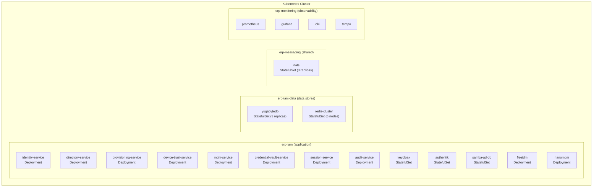
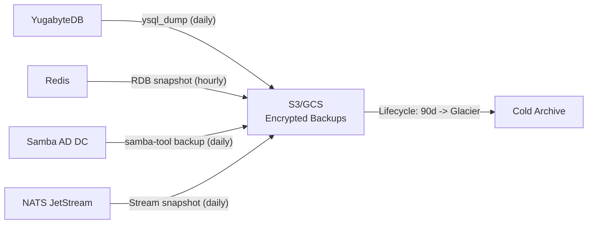
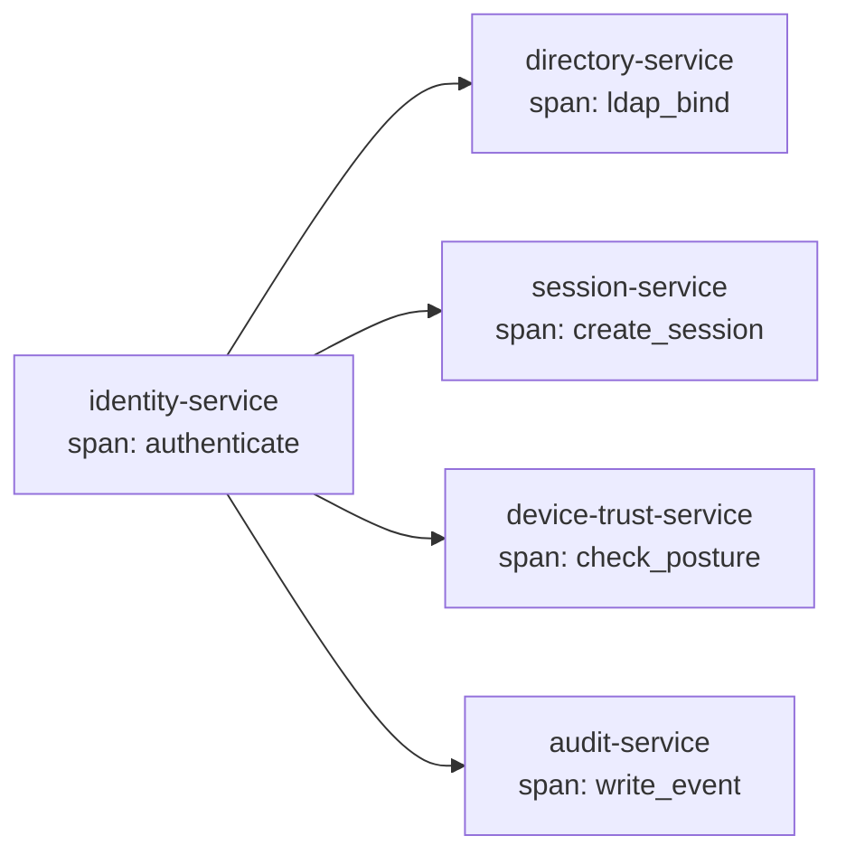
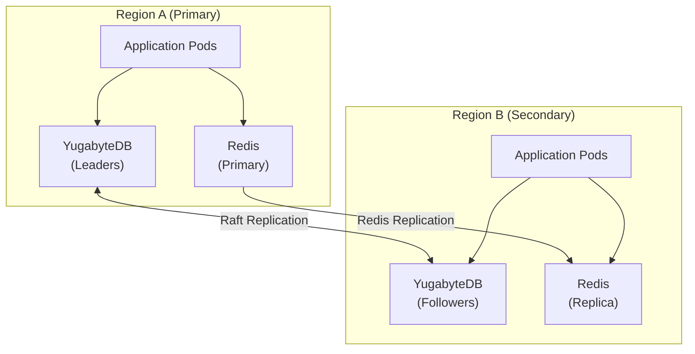

# ERP-IAM Infrastructure

> **Document ID:** ERP-IAM-INF-001
> **Version:** 1.0.0
> **Last Updated:** 2026-02-23
> **Status:** Approved
> **Related Documents:** [04-Software-Architecture.md](./04-Software-Architecture.md), [25-Deployment-Pipeline.md](./25-Deployment-Pipeline.md)

---

## 1. Overview

This document describes the infrastructure architecture for ERP-IAM, covering Kubernetes deployment, container specifications, networking, storage, monitoring, and infrastructure-as-code configurations.

---

## 2. Kubernetes Architecture

### 2.1 Namespace Layout



### 2.2 Resource Allocations

| Component | CPU Request | CPU Limit | Memory Request | Memory Limit | Replicas |
|---|---|---|---|---|---|
| identity-service | 250m | 1000m | 256Mi | 512Mi | 3-10 (HPA) |
| directory-service | 250m | 1000m | 256Mi | 512Mi | 2-8 (HPA) |
| provisioning-service | 200m | 500m | 128Mi | 256Mi | 2-6 (HPA) |
| device-trust-service | 200m | 500m | 128Mi | 256Mi | 2-6 (HPA) |
| mdm-service | 200m | 500m | 128Mi | 256Mi | 2-4 (HPA) |
| credential-vault-service | 200m | 500m | 128Mi | 256Mi | 2-4 (HPA) |
| session-service | 250m | 1000m | 256Mi | 512Mi | 3-10 (HPA) |
| audit-service | 200m | 500m | 128Mi | 256Mi | 2-6 (HPA) |
| keycloak | 500m | 2000m | 1Gi | 2Gi | 3 (StatefulSet) |
| authentik | 500m | 1000m | 512Mi | 1Gi | 2 (StatefulSet) |
| samba-ad-dc | 500m | 1000m | 512Mi | 1Gi | 2 (StatefulSet) |
| fleetdm | 250m | 500m | 256Mi | 512Mi | 1-2 |
| nanomdm | 200m | 500m | 128Mi | 256Mi | 1-2 |

### 2.3 Horizontal Pod Autoscaler

```yaml
apiVersion: autoscaling/v2
kind: HorizontalPodAutoscaler
metadata:
  name: identity-service-hpa
  namespace: erp-iam
spec:
  scaleTargetRef:
    apiVersion: apps/v1
    kind: Deployment
    name: identity-service
  minReplicas: 3
  maxReplicas: 10
  metrics:
    - type: Resource
      resource:
        name: cpu
        target:
          type: Utilization
          averageUtilization: 70
    - type: Pods
      pods:
        metric:
          name: http_requests_per_second
        target:
          type: AverageValue
          averageValue: "1000"
  behavior:
    scaleUp:
      stabilizationWindowSeconds: 60
      policies:
        - type: Pods
          value: 2
          periodSeconds: 60
    scaleDown:
      stabilizationWindowSeconds: 300
      policies:
        - type: Pods
          value: 1
          periodSeconds: 120
```

---

## 3. Container Specifications

### 3.1 Docker Build Strategy

All Go services use identical multi-stage Dockerfiles:

```dockerfile
# Stage 1: Build
FROM golang:1.22-alpine AS builder
RUN apk add --no-cache git ca-certificates
WORKDIR /app
COPY go.mod go.sum ./
RUN go mod download
COPY . .
RUN CGO_ENABLED=0 GOOS=linux go build -ldflags="-s -w" -o /service ./main.go

# Stage 2: Runtime
FROM alpine:3.19
RUN apk add --no-cache ca-certificates tzdata && \
    addgroup -g 1000 app && \
    adduser -u 1000 -G app -D app
COPY --from=builder /service /service
USER app
EXPOSE 8080
HEALTHCHECK --interval=30s --timeout=3s --start-period=10s \
  CMD wget -q -O- http://localhost:8080/healthz || exit 1
ENTRYPOINT ["/service"]
```

### 3.2 Image Security

- **Base image**: Alpine 3.19 (minimal attack surface, ~5MB)
- **Non-root**: Run as UID 1000
- **No shell**: Consider distroless for production
- **Vulnerability scanning**: Trivy scan in CI, block deployment on HIGH/CRITICAL CVEs
- **Signing**: Cosign image signatures with keyless (Fulcio/Rekor)
- **SBOM**: syft-generated SBOM attached to image

---

## 4. Storage Architecture

### 4.1 Persistent Volume Claims

| Component | Storage Class | Size | Access Mode |
|---|---|---|---|
| YugabyteDB master | ssd-fast | 100Gi | ReadWriteOnce |
| YugabyteDB tserver | ssd-fast | 500Gi | ReadWriteOnce |
| Redis (AOF) | ssd-standard | 50Gi | ReadWriteOnce |
| Samba AD DC (SYSVOL) | ssd-standard | 20Gi | ReadWriteOnce |
| NATS JetStream | ssd-fast | 100Gi | ReadWriteOnce |

### 4.2 Backup Strategy



---

## 5. Networking

### 5.1 Service Mesh Configuration

```yaml
# Istio VirtualService for identity-service
apiVersion: networking.istio.io/v1
kind: VirtualService
metadata:
  name: identity-service
  namespace: erp-iam
spec:
  hosts:
    - identity-service
  http:
    - match:
        - uri:
            prefix: /v1/identity
      route:
        - destination:
            host: identity-service
            port:
              number: 8080
      timeout: 5s
      retries:
        attempts: 3
        retryOn: 5xx,reset,connect-failure
```

### 5.2 Ingress Configuration

```yaml
apiVersion: networking.k8s.io/v1
kind: Ingress
metadata:
  name: erp-iam-ingress
  namespace: erp-iam
  annotations:
    cert-manager.io/cluster-issuer: letsencrypt-prod
    nginx.ingress.kubernetes.io/rate-limit: "100"
    nginx.ingress.kubernetes.io/rate-limit-window: "1m"
spec:
  tls:
    - hosts:
        - iam.erp.example.com
      secretName: erp-iam-tls
  rules:
    - host: iam.erp.example.com
      http:
        paths:
          - path: /v1/
            pathType: Prefix
            backend:
              service:
                name: api-gateway
                port:
                  number: 8080
          - path: /auth/
            pathType: Prefix
            backend:
              service:
                name: keycloak
                port:
                  number: 8080
```

---

## 6. Monitoring and Observability

### 6.1 Metrics (Prometheus)

Key metrics exposed by each service:

| Metric | Type | Description |
|---|---|---|
| `iam_auth_attempts_total` | Counter | Total authentication attempts (labels: method, result) |
| `iam_auth_duration_seconds` | Histogram | Authentication latency |
| `iam_sessions_active` | Gauge | Currently active sessions |
| `iam_device_compliance_ratio` | Gauge | Ratio of compliant devices |
| `iam_provisioning_operations_total` | Counter | SCIM operations (labels: type, status) |
| `iam_credential_rotations_total` | Counter | Credential rotations performed |
| `iam_audit_events_total` | Counter | Audit events written |
| `iam_ldap_queries_total` | Counter | LDAP query count |
| `iam_ldap_query_duration_seconds` | Histogram | LDAP query latency |

### 6.2 Logging (Loki)

All services emit structured JSON logs:

```json
{
  "level": "info",
  "ts": "2026-02-23T10:00:00.000Z",
  "service": "identity-service",
  "module": "ERP-IAM",
  "tenant_id": "tenant-001",
  "request_id": "req-abc123",
  "method": "POST",
  "path": "/v1/identity/auth/token",
  "status": 200,
  "duration_ms": 45,
  "msg": "authentication successful"
}
```

### 6.3 Tracing (Tempo)

Distributed tracing with OpenTelemetry:



---

## 7. Disaster Recovery

### 7.1 RPO/RTO Targets

| Component | RPO | RTO | Strategy |
|---|---|---|---|
| YugabyteDB | 0 (synchronous replication) | < 30s (automatic failover) | 3-node cluster, Raft consensus |
| Redis | < 1 minute | < 30s | Cluster with replicas, AOF persistence |
| NATS | 0 (replicated streams) | < 30s | 3-node cluster |
| Keycloak | N/A (stateless) | < 60s | Pod restart, session state in Redis |
| Samba AD DC | < 1 hour | < 15 minutes | DRS replication, daily backup |

### 7.2 Multi-Region Architecture (Future)


