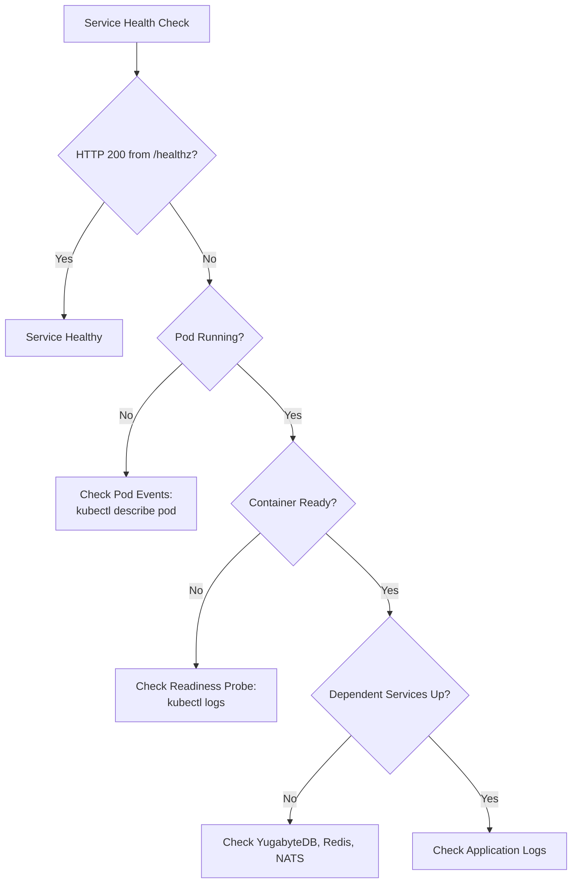
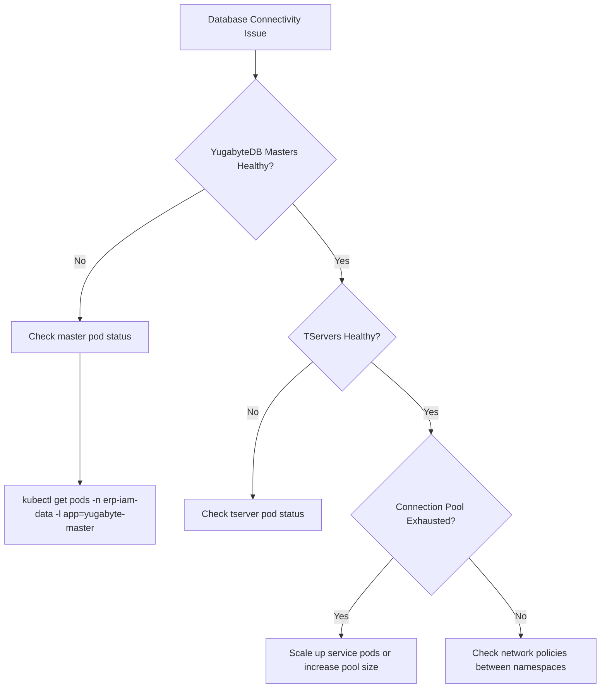

# ERP-IAM DevOps Runbook

> **Document ID:** ERP-IAM-RUN-001
> **Version:** 1.0.0
> **Last Updated:** 2026-02-23
> **Status:** Approved
> **Related Documents:** [19-Infrastructure.md](./19-Infrastructure.md), [25-Deployment-Pipeline.md](./25-Deployment-Pipeline.md)

---

## 1. Overview

This runbook provides operational procedures for managing ERP-IAM in production, including routine operations, troubleshooting guides, emergency procedures, and escalation paths.

---

## 2. Service Health Checks

### 2.1 Health Verification

```bash
# Check all service health endpoints
for svc in identity directory provisioning device-trust mdm credential-vault session audit; do
  echo "=== ${svc}-service ==="
  curl -s http://${svc}-service.erp-iam:8080/healthz | jq .
done
```

### 2.2 Health Check Decision Tree



---

## 3. Common Operations

### 3.1 Tenant Realm Creation

```bash
# Create new Keycloak realm for tenant
curl -X POST "http://keycloak.erp-iam:8080/auth/admin/realms" \
  -H "Authorization: Bearer ${ADMIN_TOKEN}" \
  -H "Content-Type: application/json" \
  -d '{
    "realm": "tenant-{id}",
    "enabled": true,
    "sslRequired": "external",
    "registrationAllowed": false,
    "loginWithEmailAllowed": true,
    "duplicateEmailsAllowed": false,
    "bruteForceProtected": true,
    "failureFactor": 5,
    "waitIncrementSeconds": 60,
    "maxFailureWaitSeconds": 900,
    "maxDeltaTimeSeconds": 43200
  }'
```

### 3.2 User Account Unlock

```bash
# Unlock a locked user account
curl -X PUT "http://identity-service.erp-iam:8080/v1/identity/{user_id}" \
  -H "Authorization: Bearer ${ADMIN_TOKEN}" \
  -H "X-Tenant-ID: {tenant_id}" \
  -H "Content-Type: application/json" \
  -d '{"locked_until": null, "failed_login_attempts": 0}'
```

### 3.3 Force Session Termination

```bash
# Terminate all sessions for a user
curl -X DELETE "http://session-service.erp-iam:8080/v1/session/user/{user_id}" \
  -H "Authorization: Bearer ${ADMIN_TOKEN}" \
  -H "X-Tenant-ID: {tenant_id}"
```

### 3.4 Credential Rotation (Manual)

```bash
# Trigger manual rotation for a credential
curl -X POST "http://credential-vault-service.erp-iam:8080/v1/credential-vault/secrets/{secret_id}/rotate" \
  -H "Authorization: Bearer ${ADMIN_TOKEN}" \
  -H "X-Tenant-ID: {tenant_id}"
```

---

## 4. Troubleshooting

### 4.1 Authentication Failures

| Symptom | Likely Cause | Investigation | Resolution |
|---|---|---|---|
| All users cannot login | Keycloak down | Check Keycloak pods and logs | Restart Keycloak StatefulSet |
| Single user cannot login | Account locked | Check user's failed_login_attempts | Unlock account via API |
| SAML logins failing | Certificate expired | Check SAML signing certificate expiry | Rotate SAML certificate |
| Social login failing | IdP client secret expired | Check social IdP configuration | Update client secret in credential vault |
| MFA verification failing | Clock skew | Check server time sync | Ensure NTP is configured |

### 4.2 Directory Service Issues

| Symptom | Likely Cause | Investigation | Resolution |
|---|---|---|---|
| LDAP queries slow | Missing indexes | Check slow query log | Add appropriate LDAP indexes |
| Directory sync failing | Azure AD token expired | Check sync job logs | Refresh Azure AD client credentials |
| Domain join failing | DNS resolution | Check Samba DNS service | Verify SRV records published |
| Group policy not applying | SYSVOL replication lag | Check SYSVOL contents | Force SYSVOL sync |

### 4.3 Database Issues



---

## 5. Emergency Procedures

### 5.1 Security Incident: Credential Breach

```
SEVERITY: P0 CRITICAL
RESPONSE TIME: 15 minutes

1. CONTAIN
   - Rotate all affected credentials immediately
   - Force terminate all sessions for affected users
   - Block suspicious IP ranges at WAF level

2. INVESTIGATE
   - Query audit logs for credential access events
   - Identify scope of compromise (which secrets, which tenants)
   - Determine attack vector (API vulnerability, insider, etc.)

3. REMEDIATE
   - Patch vulnerability if applicable
   - Force password reset for affected users
   - Rotate all tenant KEKs if vault compromise suspected
   - Re-generate and distribute new HSM master key if HSM compromise

4. COMMUNICATE
   - Notify CISO within 15 minutes
   - Notify affected tenants within 1 hour
   - Prepare incident report within 24 hours
```

### 5.2 Mass Authentication Failure

```
SEVERITY: P0 CRITICAL
RESPONSE TIME: 15 minutes

1. VERIFY
   - Check Keycloak health: kubectl get pods -l app=keycloak -n erp-iam
   - Check YugabyteDB health: kubectl get pods -l app=yugabyte -n erp-iam-data
   - Check Redis health: kubectl get pods -l app=redis -n erp-iam-data

2. MITIGATE
   - If Keycloak down: restart StatefulSet
   - If database down: failover to replica
   - If Redis down: restart cluster (sessions will be recreated on login)

3. VERIFY RECOVERY
   - Monitor /healthz endpoints
   - Test authentication flow manually
   - Check error rate in monitoring dashboard
```

---

## 6. Scaling Operations

### 6.1 Horizontal Scaling

```bash
# Scale identity-service for high load
kubectl scale deployment identity-service -n erp-iam --replicas=8

# Or update HPA limits
kubectl patch hpa identity-service-hpa -n erp-iam \
  -p '{"spec":{"maxReplicas":15}}'
```

### 6.2 Database Scaling

```bash
# Add YugabyteDB tserver node
kubectl scale statefulset yugabyte-tserver -n erp-iam-data --replicas=5

# Add Redis cluster node
# (requires Redis cluster rebalancing after node addition)
redis-cli --cluster add-node new-node:6379 existing-node:6379
redis-cli --cluster rebalance existing-node:6379
```

---

## 7. Monitoring Alerts

| Alert | Severity | Condition | Action |
|---|---|---|---|
| `IAMAuthErrorRateHigh` | Critical | Auth failure rate > 10% for 5 min | Investigate brute force, check Keycloak health |
| `IAMSessionServiceDown` | Critical | No healthy session-service pods | Restart deployment, check Redis |
| `IAMDatabaseConnectionPoolExhausted` | Warning | Pool usage > 90% | Scale service pods, increase pool size |
| `IAMCertificateExpiringSoon` | Warning | TLS cert expires < 7 days | Verify cert-manager renewal |
| `IAMAuditChainBroken` | Critical | Chain hash verification failed | Investigate potential tampering |
| `IAMKeycloakHighMemory` | Warning | Memory > 80% | Check for memory leak, increase limits |
| `IAMDeviceTrustStaleData` | Warning | Last posture check > 24h for 10+ devices | Check FleetDM health |
| `IAMSIEMForwarderBacklog` | Warning | SIEM delivery backlog > 10,000 events | Check SIEM connectivity |

---

## 8. Maintenance Windows

### 8.1 Scheduled Maintenance Checklist

1. Announce maintenance window (48h advance notice)
2. Enable maintenance mode in API Gateway (return 503 with Retry-After)
3. Perform database maintenance (VACUUM, reindex, partition management)
4. Apply Keycloak version upgrades
5. Rotate TLS certificates if near expiry
6. Verify backup integrity with test restore
7. Run full audit chain verification
8. Disable maintenance mode
9. Verify all services healthy
10. Send maintenance completion notification
