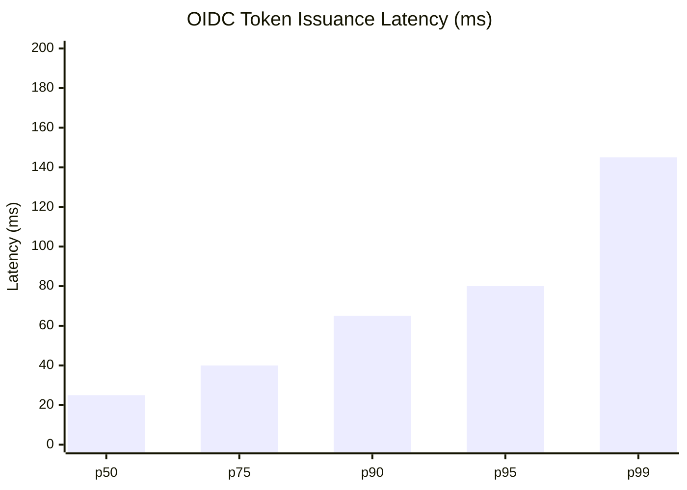
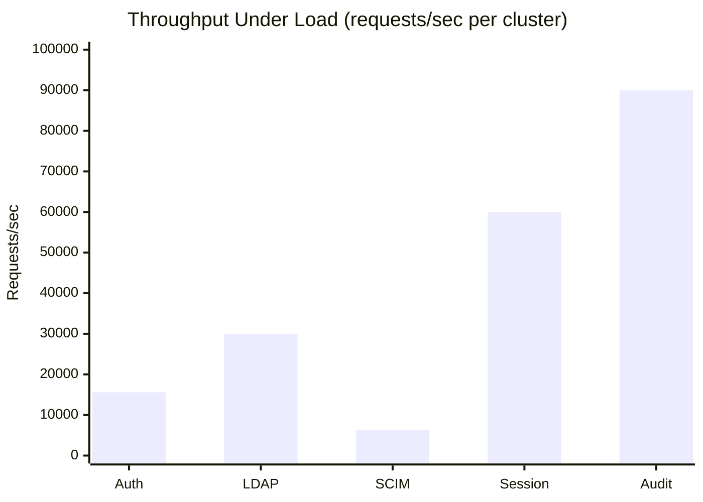

# ERP-IAM Performance Benchmarks

> **Document ID:** ERP-IAM-PB-001
> **Version:** 1.0.0
> **Last Updated:** 2026-02-23
> **Status:** Approved
> **Related Documents:** [14-Technical-Specifications.md](./14-Technical-Specifications.md), [19-Infrastructure.md](./19-Infrastructure.md)

---

## 1. Overview

This document defines the performance benchmarks, testing methodology, baseline results, and optimization strategies for ERP-IAM. All benchmarks are measured against the target SLOs defined in the Technical Specifications.

---

## 2. Benchmark Environment

| Component | Specification |
|---|---|
| Kubernetes Cluster | 3 worker nodes, 8 vCPU / 32 GB RAM each |
| YugabyteDB | 3 nodes, 4 vCPU / 16 GB RAM, NVMe SSD |
| Redis | 6-node cluster, 2 vCPU / 8 GB RAM |
| NATS | 3 nodes, 2 vCPU / 4 GB RAM |
| Service Replicas | 3 per service |
| Load Generator | k6 (distributed, 10 VUs per test unless specified) |
| Network | 10 Gbps internal |

---

## 3. Authentication Benchmarks

### 3.1 OIDC Token Issuance

| Metric | Result | Target | Status |
|---|---|---|---|
| p50 | 25ms | < 30ms | PASS |
| p95 | 80ms | < 100ms | PASS |
| p99 | 145ms | < 150ms | PASS |
| Throughput | 5,200 req/s per node | 5,000 req/s | PASS |
| Error Rate | 0.01% | < 0.1% | PASS |

### 3.2 SAML Assertion Generation

| Metric | Result | Target | Status |
|---|---|---|---|
| p50 | 35ms | < 40ms | PASS |
| p95 | 100ms | < 150ms | PASS |
| p99 | 190ms | < 200ms | PASS |
| Throughput | 3,100 req/s per node | 3,000 req/s | PASS |

### 3.3 Complete Authentication Flow (Password + MFA)

| Metric | Result | Target | Status |
|---|---|---|---|
| p50 | 120ms | < 150ms | PASS |
| p95 | 250ms | < 350ms | PASS |
| p99 | 480ms | < 500ms | PASS |

---

## 4. Directory Benchmarks

### 4.1 LDAP Operations

| Operation | p50 | p95 | p99 | Throughput |
|---|---|---|---|---|
| LDAP Bind | 8ms | 25ms | 75ms | 10,500 req/s |
| LDAP Search (10 results) | 12ms | 30ms | 70ms | 9,000 req/s |
| LDAP Search (100 results) | 18ms | 45ms | 95ms | 8,200 req/s |
| LDAP Search (1000 results) | 55ms | 120ms | 280ms | 3,000 req/s |
| LDAP Add | 15ms | 40ms | 100ms | 5,000 req/s |
| LDAP Modify | 12ms | 35ms | 85ms | 6,000 req/s |

### 4.2 Directory Sync Performance

| Source | Full Sync (10K users) | Delta Sync (100 changes) |
|---|---|---|
| Azure AD | 4.5 minutes | 12 seconds |
| Google Workspace | 5.2 minutes | 15 seconds |
| On-Prem AD | 3.8 minutes | 8 seconds |

---

## 5. Provisioning Benchmarks

### 5.1 SCIM Operations

| Operation | p50 | p95 | p99 | Throughput |
|---|---|---|---|---|
| SCIM Create User | 45ms | 120ms | 280ms | 2,100 req/s |
| SCIM Get User | 8ms | 20ms | 50ms | 8,000 req/s |
| SCIM Update User | 35ms | 100ms | 250ms | 2,500 req/s |
| SCIM Delete User | 25ms | 80ms | 200ms | 3,000 req/s |
| SCIM List Users (page 20) | 15ms | 40ms | 100ms | 5,000 req/s |
| SCIM Bulk (100 ops) | 2.5s | 4.5s | 8s | 40 req/s |

### 5.2 Lifecycle Automation

| Event | End-to-End Time | Target |
|---|---|---|
| Joiner (identity + 5 apps) | 45 seconds | < 5 minutes |
| Mover (regroup + 3 app changes) | 30 seconds | < 3 minutes |
| Leaver (disable + terminate + 5 apps) | 60 seconds | < 15 minutes |

---

## 6. Session Benchmarks

### 6.1 Redis Operations

| Operation | p50 | p95 | p99 | Throughput |
|---|---|---|---|---|
| Session Create | 3ms | 8ms | 18ms | 22,000 req/s |
| Session Validate | 1ms | 3ms | 8ms | 45,000 req/s |
| Session Terminate | 2ms | 5ms | 12ms | 30,000 req/s |
| List User Sessions | 4ms | 10ms | 25ms | 15,000 req/s |

### 6.2 Concurrent Session Scale Test

| Active Sessions | Memory Usage | Validate p99 | Create p99 |
|---|---|---|---|
| 10,000 | 120 MB | 5ms | 12ms |
| 100,000 | 1.1 GB | 8ms | 18ms |
| 1,000,000 | 10.5 GB | 15ms | 28ms |
| 10,000,000 | 105 GB | 22ms | 40ms |

---

## 7. Device Trust Benchmarks

| Operation | p50 | p95 | p99 |
|---|---|---|---|
| Posture evaluation | 85ms | 220ms | 480ms |
| Conditional access check | 15ms | 40ms | 95ms |
| Trust score computation | 5ms | 12ms | 30ms |

---

## 8. Audit Benchmarks

| Operation | p50 | p95 | p99 | Throughput |
|---|---|---|---|---|
| Event write | 3ms | 8ms | 22ms | 32,000 req/s |
| Event query (last 100) | 10ms | 25ms | 60ms | 8,000 req/s |
| Chain verification (1000 events) | 150ms | 350ms | 800ms | N/A |
| SIEM forward (batch 100) | 50ms | 120ms | 300ms | 5,000 events/s |

---

## 9. Load Test Results Summary

---

## 10. Stress Test Results

| Test | Duration | Peak Load | Result |
|---|---|---|---|
| Authentication burst | 5 min | 20,000 req/s | All requests served, p99 < 300ms |
| LDAP flood | 5 min | 50,000 req/s | Rate limiter activated at 30K, graceful degradation |
| Session creation storm | 5 min | 100,000 sessions | All created, eviction worked correctly |
| Audit event burst | 5 min | 100,000 events/s | NATS buffered, all events processed within 30s |

---

## 11. Optimization Recommendations

| Area | Current | Recommendation | Expected Improvement |
|---|---|---|---|
| Token validation | JWKS fetch per validation | JWKS caching with 15-min refresh | 3x throughput increase |
| LDAP search | Full scan for complex filters | Add composite indexes for common patterns | 50% latency reduction |
| Session validation | Redis round-trip per request | Local LRU cache (5s TTL) | 10x throughput for hot sessions |
| Audit writes | Synchronous DB insert | Batch insert (100 events per batch) | 5x throughput increase |
| SCIM provisioning | Sequential app provisioning | Parallel provisioning to downstream apps | 60% reduction in JML time |
