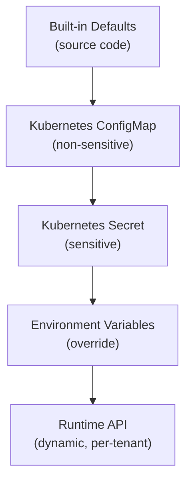

# ERP-IAM Configuration Guide

> **Document ID:** ERP-IAM-CG-001
> **Version:** 1.0.0
> **Last Updated:** 2026-02-23
> **Status:** Approved
> **Related Documents:** [14-Technical-Specifications.md](./14-Technical-Specifications.md), [19-Infrastructure.md](./19-Infrastructure.md)

---

## 1. Overview

This guide covers all configurable parameters for ERP-IAM, organized by service and infrastructure component. Configuration is managed through environment variables, ConfigMaps, and Kubernetes Secrets.

---

## 2. Configuration Hierarchy



Priority: Runtime API > Environment Variables > Secrets > ConfigMaps > Defaults.

---

## 3. Global Configuration

### 3.1 Core Settings

| Parameter | Env Var | Default | Description |
|---|---|---|---|
| Service port | `PORT` | `8080` | HTTP listen port |
| Module name | `MODULE_NAME` | `ERP-IAM` | Module identifier |
| Log level | `LOG_LEVEL` | `info` | debug, info, warn, error |
| Log format | `LOG_FORMAT` | `json` | json, text |
| CORS origins | `CORS_ALLOWED_ORIGINS` | `*` | Comma-separated allowed origins |
| Request timeout | `REQUEST_TIMEOUT` | `30s` | Maximum request duration |
| Graceful shutdown | `SHUTDOWN_TIMEOUT` | `15s` | Graceful shutdown wait |

### 3.2 Database Configuration

| Parameter | Env Var | Default | Description |
|---|---|---|---|
| DSN | `YUGABYTE_DSN` | `postgres://localhost:5433/iam` | PostgreSQL connection string |
| Max connections | `DB_MAX_CONNS` | `50` | Connection pool maximum |
| Min connections | `DB_MIN_CONNS` | `5` | Connection pool minimum |
| Conn max lifetime | `DB_CONN_MAX_LIFETIME` | `30m` | Maximum connection age |
| Statement timeout | `DB_STATEMENT_TIMEOUT` | `10s` | Query timeout |

### 3.3 Redis Configuration

| Parameter | Env Var | Default | Description |
|---|---|---|---|
| URL | `REDIS_URL` | `redis://localhost:6379` | Redis connection URL |
| Cluster mode | `REDIS_CLUSTER` | `false` | Enable cluster mode |
| Max retries | `REDIS_MAX_RETRIES` | `3` | Operation retry count |
| Pool size | `REDIS_POOL_SIZE` | `100` | Connection pool size |

### 3.4 Event Bus Configuration

| Parameter | Env Var | Default | Description |
|---|---|---|---|
| NATS URL | `NATS_URL` | `nats://localhost:4222` | NATS server URL |
| Stream name | `NATS_STREAM` | `ERP_IAM_EVENTS` | JetStream stream name |
| Max pending | `NATS_MAX_PENDING` | `1000` | Maximum pending publishes |

---

## 4. Identity Service Configuration

### 4.1 Keycloak Settings

| Parameter | Env Var | Default | Description |
|---|---|---|---|
| Base URL | `KEYCLOAK_URL` | `http://localhost:8080/auth` | Keycloak server URL |
| Admin user | `KEYCLOAK_ADMIN_USER` | `admin` | Admin username |
| Admin password | `KEYCLOAK_ADMIN_PASS` | (required) | Admin password |
| Token lifetime | `OIDC_ACCESS_TOKEN_LIFETIME` | `3600` | Access token TTL (seconds) |
| Refresh lifetime | `OIDC_REFRESH_TOKEN_LIFETIME` | `86400` | Refresh token TTL (seconds) |
| PKCE required | `OIDC_PKCE_REQUIRED` | `true` | Require PKCE for public clients |
| Signing algorithm | `OIDC_SIGNING_ALG` | `RS256` | RS256 or ES256 |

### 4.2 MFA Configuration

| Parameter | Env Var | Default | Description |
|---|---|---|---|
| MFA required | `MFA_REQUIRED` | `false` | Global MFA enforcement |
| TOTP algorithm | `MFA_TOTP_ALGORITHM` | `SHA1` | SHA1 or SHA256 |
| TOTP digits | `MFA_TOTP_DIGITS` | `6` | 6 or 8 |
| TOTP period | `MFA_TOTP_PERIOD` | `30` | Time step in seconds |
| SMS provider | `MFA_SMS_PROVIDER` | `twilio` | twilio, vonage, aws_sns |
| Push timeout | `MFA_PUSH_TIMEOUT` | `60` | Push notification expiry (seconds) |
| Recovery codes | `MFA_RECOVERY_CODES_COUNT` | `10` | Number of recovery codes |

### 4.3 Social Login Configuration

| Parameter | Env Var | Default | Description |
|---|---|---|---|
| Google client ID | `SOCIAL_GOOGLE_CLIENT_ID` | (optional) | Google OAuth client ID |
| Google client secret | `SOCIAL_GOOGLE_CLIENT_SECRET` | (optional) | Google OAuth client secret |
| Microsoft client ID | `SOCIAL_MICROSOFT_CLIENT_ID` | (optional) | Microsoft OAuth client ID |
| Apple service ID | `SOCIAL_APPLE_SERVICE_ID` | (optional) | Apple Sign In service ID |
| Facebook app ID | `SOCIAL_FACEBOOK_APP_ID` | (optional) | Facebook OAuth app ID |

### 4.4 Brute Force Protection

| Parameter | Env Var | Default | Description |
|---|---|---|---|
| Lockout threshold | `BF_LOCKOUT_THRESHOLD` | `5` | Failed attempts before lockout |
| Lockout duration | `BF_LOCKOUT_DURATION` | `30m` | Lockout duration |
| Progressive delays | `BF_PROGRESSIVE_DELAYS` | `1,2,4,8,16` | Delay steps in seconds |
| IP rate limit | `BF_IP_RATE_LIMIT` | `100/min` | Requests per IP per minute |

---

## 5. Session Service Configuration

| Parameter | Env Var | Default | Description |
|---|---|---|---|
| Max concurrent | `SESSION_MAX_CONCURRENT` | `5` | Maximum sessions per user |
| Idle timeout | `SESSION_IDLE_TIMEOUT` | `30m` | Idle session expiry |
| Absolute timeout | `SESSION_ABSOLUTE_TIMEOUT` | `8h` | Maximum session duration |
| Geo restriction enabled | `SESSION_GEO_ENABLED` | `false` | Enable geolocation restrictions |
| Geo allowed countries | `SESSION_GEO_ALLOWED` | (empty = all) | Comma-separated country codes |

---

## 6. Credential Vault Configuration

| Parameter | Env Var | Default | Description |
|---|---|---|---|
| HSM library | `HSM_PKCS11_LIB` | `/usr/lib/softhsm/libsofthsm2.so` | PKCS#11 library path |
| HSM slot | `HSM_SLOT` | `0` | HSM slot number |
| HSM PIN | `HSM_PIN` | (required) | HSM user PIN |
| Default rotation | `VAULT_DEFAULT_ROTATION` | `90d` | Default rotation interval |
| Overlap period | `VAULT_OVERLAP_PERIOD` | `24h` | Old credential validity after rotation |

---

## 7. Audit Service Configuration

| Parameter | Env Var | Default | Description |
|---|---|---|---|
| SIEM type | `AUDIT_SIEM_TYPE` | `none` | splunk, elasticsearch, datadog, none |
| SIEM endpoint | `AUDIT_SIEM_ENDPOINT` | (required if SIEM) | SIEM ingest URL |
| SIEM batch size | `AUDIT_SIEM_BATCH_SIZE` | `100` | Events per SIEM batch |
| SIEM flush interval | `AUDIT_SIEM_FLUSH_INTERVAL` | `5s` | Maximum wait before flush |
| Chain verification | `AUDIT_CHAIN_VERIFY` | `true` | Verify chain on each write |
| Retention days | `AUDIT_RETENTION_DAYS` | `2555` | 7 years default |

---

## 8. Per-Tenant Configuration (Runtime API)

Tenant-specific configuration is managed via the API and stored in the `tenants.settings` JSONB column:

```json
{
  "authentication": {
    "mfa_required": true,
    "mfa_methods_allowed": ["totp", "fido2", "push"],
    "password_policy": {
      "min_length": 14,
      "require_uppercase": true,
      "require_number": true,
      "require_special": true,
      "history_count": 12,
      "max_age_days": 60
    },
    "brute_force": {
      "lockout_threshold": 3,
      "lockout_duration_minutes": 60
    }
  },
  "session": {
    "max_concurrent": 3,
    "idle_timeout_minutes": 15,
    "absolute_timeout_hours": 4,
    "geo_allowed_countries": ["US", "GB", "DE"]
  },
  "device_trust": {
    "required": true,
    "min_os_version": {
      "macos": "14.0",
      "windows": "10.0.22621",
      "ios": "17.0",
      "android": "14"
    },
    "require_encryption": true,
    "require_firewall": true,
    "require_antivirus": true,
    "compliance_threshold": 80
  }
}
```
