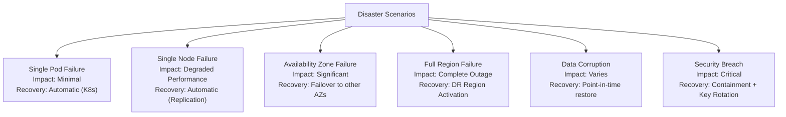
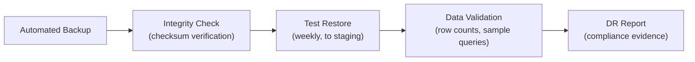

# ERP-IAM Disaster Recovery Plan

> **Document ID:** ERP-IAM-DR-001
> **Version:** 1.0.0
> **Last Updated:** 2026-02-23
> **Status:** Approved
> **Related Documents:** [19-Infrastructure.md](./19-Infrastructure.md), [20-DevOps-Runbook.md](./20-DevOps-Runbook.md)

---

## 1. Overview

This document defines the disaster recovery (DR) strategy for ERP-IAM, including backup procedures, recovery procedures, RPO/RTO targets, and DR testing schedules. As the authentication backbone for the entire ERP suite, ERP-IAM has the most aggressive recovery targets.

---

## 2. Recovery Objectives

| Component | RPO (Recovery Point Objective) | RTO (Recovery Time Objective) |
|---|---|---|
| YugabyteDB (identity data) | 0 (synchronous replication) | < 30 seconds |
| Redis (session data) | < 1 minute | < 30 seconds |
| NATS JetStream (events) | 0 (replicated) | < 30 seconds |
| Keycloak (realm config) | < 1 hour (realm export backup) | < 5 minutes |
| Samba AD DC (directory) | < 1 hour | < 15 minutes |
| Credential Vault (secrets) | 0 (synchronous) | < 30 seconds |
| HSM keys | 0 (HSM HA) | < 1 minute |

---

## 3. Disaster Scenarios

### 3.1 Scenario Classification



---

## 4. Backup Procedures

### 4.1 Automated Backup Schedule

| Component | Method | Frequency | Retention | Storage |
|---|---|---|---|---|
| YugabyteDB | ysql_dump + WAL archiving | Full: daily, WAL: continuous | 30 days (full), 7 days (WAL) | S3/GCS encrypted |
| Redis | RDB snapshot + AOF | RDB: hourly, AOF: continuous | 7 days | S3/GCS encrypted |
| Keycloak | Realm export JSON | Daily | 30 days | S3/GCS encrypted |
| Samba AD DC | samba-tool backup online | Daily | 30 days | S3/GCS encrypted |
| NATS JetStream | Stream snapshot | Daily | 7 days | S3/GCS encrypted |
| HSM keys | HSM backup to secondary | On key generation | Indefinite | Secondary HSM |
| Configuration | ConfigMap/Secret export | On change (GitOps) | Indefinite | Git repository |

### 4.2 Backup Verification



Backup verification runs weekly:
1. Restore latest backup to isolated staging environment
2. Verify row counts match production (within expected delta)
3. Run sample queries to confirm data integrity
4. Verify Keycloak realm configuration loads correctly
5. Verify Samba AD DC starts and responds to LDAP queries
6. Document results for SOC 2 evidence collection

---

## 5. Recovery Procedures

### 5.1 YugabyteDB Recovery

```bash
# Scenario: Full cluster restore from backup
# Step 1: Deploy fresh YugabyteDB cluster
helm install yugabyte yugabytedb/yugabyte -n erp-iam-data

# Step 2: Restore from latest full backup
ysqlsh -h yugabyte-master-0 -c "CREATE DATABASE iam;"
ysql_dump --restore --host=yugabyte-master-0 --dbname=iam < /backup/latest/iam_full.sql

# Step 3: Apply WAL archives for point-in-time recovery
# (if data corruption scenario, restore to point before corruption)

# Step 4: Verify data integrity
ysqlsh -h yugabyte-master-0 -d iam -c "SELECT COUNT(*) FROM users;"
ysqlsh -h yugabyte-master-0 -d iam -c "SELECT COUNT(*) FROM audit_events;"
```

### 5.2 Redis Recovery

```bash
# Scenario: Redis cluster failure
# Step 1: Deploy fresh Redis cluster
helm install redis bitnami/redis-cluster -n erp-iam-data

# Step 2: Sessions will be recreated on next user login
# (sessions are ephemeral; users simply re-authenticate)

# Step 3: Verify cluster health
redis-cli -h redis-cluster-0 cluster info
```

### 5.3 Keycloak Recovery

```bash
# Scenario: Keycloak configuration loss
# Step 1: Restore realm exports
for realm in /backup/keycloak/realms/*.json; do
  curl -X POST "http://keycloak:8080/auth/admin/realms" \
    -H "Authorization: Bearer ${ADMIN_TOKEN}" \
    -H "Content-Type: application/json" \
    -d @${realm}
done

# Step 2: Verify realm configurations
curl -s "http://keycloak:8080/auth/admin/realms" \
  -H "Authorization: Bearer ${ADMIN_TOKEN}" | jq '.[].realm'
```

---

## 6. DR Testing Schedule

| Test Type | Frequency | Duration | Scope |
|---|---|---|---|
| Backup integrity verification | Weekly | 30 minutes | All backups |
| Single service failover | Monthly | 15 minutes | Each service rotated |
| Database failover | Quarterly | 1 hour | YugabyteDB leader election |
| Full DR rehearsal | Semi-annually | 4 hours | Complete stack restore |
| Chaos engineering | Monthly | 2 hours | Random pod/node kills |

---

## 7. Communication Plan

| Audience | Channel | Timing |
|---|---|---|
| On-call engineer | PagerDuty | Immediate |
| Engineering team | Slack #erp-iam-incidents | Within 5 minutes |
| Management | Email + Slack | Within 15 minutes |
| Affected tenants | Status page + email | Within 30 minutes |
| All customers | Status page update | Within 1 hour |
