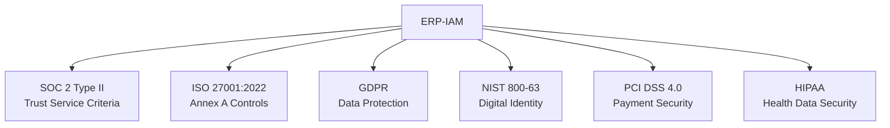
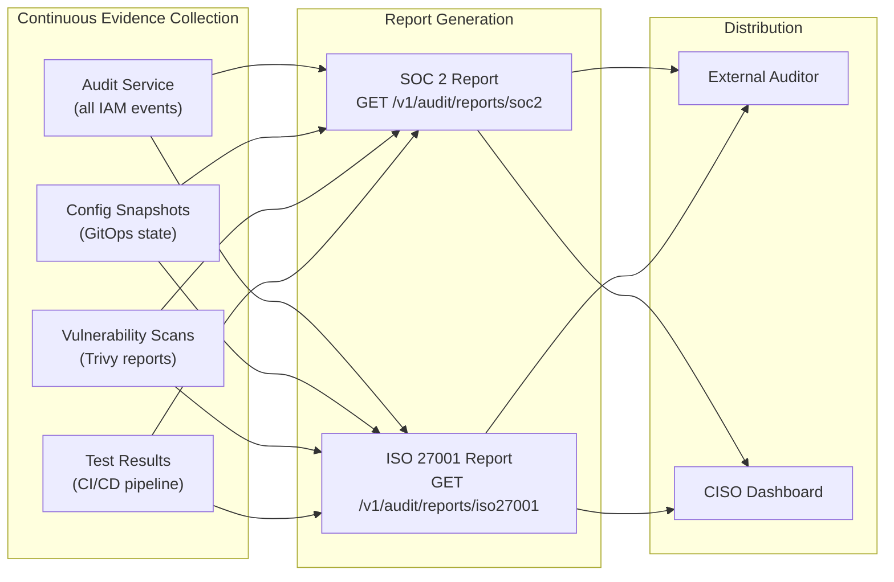

# ERP-IAM Compliance Matrix

> **Document ID:** ERP-IAM-CM-001
> **Version:** 1.0.0
> **Last Updated:** 2026-02-23
> **Status:** Approved
> **Related Documents:** [18-Security-Architecture.md](./18-Security-Architecture.md), [17-Testing-Strategy.md](./17-Testing-Strategy.md)

---

## 1. Overview

This document maps ERP-IAM capabilities to major compliance frameworks including SOC 2 Type II, ISO 27001:2022, GDPR, HIPAA, NIST 800-63, and PCI DSS. Each mapping identifies the specific ERP-IAM feature that satisfies the compliance control and the evidence collection mechanism.

---

## 2. Compliance Framework Coverage

---

## 3. SOC 2 Type II Mapping

| Control | Description | ERP-IAM Implementation | Evidence |
|---|---|---|---|
| CC1.1 | Integrity and ethical values | AIDD guardrails, prohibited action categories | Guardrails YAML, audit logs |
| CC1.4 | Board oversight | Compliance dashboards, automated reporting | SOC 2 report generation API |
| CC5.1 | Risk identification | Threat model, STRIDE analysis, risk scoring | Security architecture doc, risk engine logs |
| CC5.2 | Risk assessment | Adaptive risk-based authentication | Risk score computation logs |
| CC6.1 | Logical access security | JWT validation, RBAC, ABAC, conditional access | Auth logs, policy configurations |
| CC6.2 | Credential management | Credential vault, HSM, auto-rotation | Rotation logs, vault access audit |
| CC6.3 | Encryption | AES-256-GCM at rest, TLS 1.3 in transit | TLS certificate records, encryption config |
| CC6.6 | Multi-factor authentication | TOTP/SMS/Push/FIDO2 MFA enforcement | MFA enrollment records, auth logs |
| CC6.7 | Access removal | Leaver deprovisioning, session termination | Provisioning event logs, session logs |
| CC6.8 | Unauthorized software prevention | MDM app management, device trust | MDM policy records, posture check logs |
| CC7.1 | Intrusion detection | Risk engine, anomaly detection, SIEM | SIEM alert records, risk engine logs |
| CC7.2 | Security monitoring | Immutable audit chain, real-time alerting | Audit chain verification, alert history |
| CC7.3 | Vulnerability management | Container scanning, dependency updates | Trivy scan reports, CVE records |
| CC7.4 | Incident response | IR runbook, automated containment | IR procedure docs, incident logs |
| CC8.1 | Change management | GitOps, CI/CD pipeline, approval gates | Git history, deployment logs |

---

## 4. ISO 27001:2022 Annex A Mapping

| Control | Description | ERP-IAM Implementation | Evidence |
|---|---|---|---|
| A.5.1 | Policies for information security | Tenant security settings, password policies | Tenant configuration records |
| A.5.15 | Access control | RBAC + ABAC + conditional access | Policy definitions, access decision logs |
| A.5.16 | Identity management | Full identity lifecycle (create/update/disable/delete) | Identity CRUD audit trail |
| A.5.17 | Authentication information | Argon2id hashing, credential vault | Hashing config, vault access logs |
| A.5.18 | Access rights | Group-based provisioning, SCIM automation | Group membership records, SCIM logs |
| A.5.24 | Information security incident management | IR runbook, automated detection | Incident records, SIEM alerts |
| A.8.1 | User endpoint devices | MDM enrollment, device compliance | MDM enrollment records, posture logs |
| A.8.2 | Privileged access rights | Admin MFA, session monitoring, AIDD guardrails | Admin auth logs, guardrail enforcement |
| A.8.3 | Information access restriction | Row-level security, tenant isolation | RLS policies, cross-tenant test results |
| A.8.5 | Secure authentication | MFA, passwordless, risk-based auth | Auth method usage reports |
| A.8.15 | Logging | Immutable audit chain, 7-year retention | Audit log records, chain verification |
| A.8.16 | Monitoring activities | SIEM integration, real-time alerts | SIEM connector status, alert history |
| A.8.24 | Use of cryptography | AES-256, TLS 1.3, HSM | Crypto inventory, key management records |

---

## 5. NIST 800-63 Digital Identity Guidelines

### 5.1 Authentication Assurance Levels (AAL)

| AAL | NIST Requirement | ERP-IAM Support |
|---|---|---|
| **AAL1** | Single-factor authentication | Password authentication |
| **AAL2** | Two-factor authentication | Password + TOTP/SMS/Push MFA |
| **AAL3** | Hardware-based authenticator | Password + FIDO2 hardware key |

### 5.2 Identity Assurance Levels (IAL)

| IAL | NIST Requirement | ERP-IAM Support |
|---|---|---|
| **IAL1** | Self-asserted identity | Self-registration with email verification |
| **IAL2** | Remote identity proofing | HR-verified provisioning via SCIM/JML |
| **IAL3** | In-person identity proofing | Admin-verified identity creation |

---

## 6. GDPR Compliance

| Article | Requirement | ERP-IAM Implementation |
|---|---|---|
| Art. 5 | Data minimization | Configurable attribute collection, minimal default schema |
| Art. 6 | Lawful processing | Consent management, legitimate interest basis |
| Art. 15 | Right of access | Self-service profile view, data export API |
| Art. 17 | Right to erasure | User deletion with cascading data removal |
| Art. 25 | Data protection by design | Encryption by default, RLS, tenant isolation |
| Art. 32 | Security of processing | AES-256, TLS 1.3, MFA, access controls |
| Art. 33 | Breach notification | Automated breach detection, SIEM alerting |
| Art. 35 | DPIA | Threat model, privacy impact assessment |
| Art. 44 | International transfers | Regional data residency options, YugabyteDB geo-partitioning |

---

## 7. Evidence Collection Automation

The audit service provides automated report generation endpoints that aggregate evidence across all IAM operations, producing structured compliance reports suitable for external auditor review.
