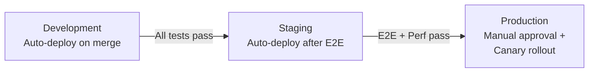
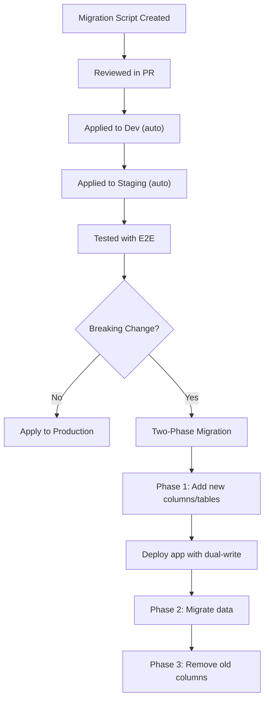

# ERP-IAM Deployment Pipeline

> **Document ID:** ERP-IAM-DP-001
> **Version:** 1.0.0
> **Last Updated:** 2026-02-23
> **Status:** Approved
> **Related Documents:** [19-Infrastructure.md](./19-Infrastructure.md), [17-Testing-Strategy.md](./17-Testing-Strategy.md)

---

## 1. Overview

This document describes the CI/CD pipeline for ERP-IAM, covering build, test, security scanning, artifact management, deployment strategies, and environment promotion.

---

## 2. Pipeline Architecture

```mermaid
flowchart LR
    subgraph "Source"
        GIT["Git Push /<br/>Pull Request"]
    end

    subgraph "CI Pipeline"
        LINT["Lint & Format"]
        UNIT["Unit Tests"]
        BUILD["Build Binaries"]
        DOCKER["Docker Build"]
        SCAN["Security Scan<br/>(Trivy + Semgrep)"]
        INT["Integration Tests"]
        SIGN["Image Sign<br/>(Cosign)"]
        SBOM["Generate SBOM<br/>(Syft)"]
    end

    subgraph "CD Pipeline"
        DEV["Deploy Dev"]
        SMOKE["Smoke Tests"]
        STG["Deploy Staging"]
        E2E["E2E Tests"]
        PERF["Performance Tests"]
        PROD["Deploy Production<br/>(Canary)"]
        MONITOR["Monitor 30 min"]
        PROMOTE["Full Rollout"]
    end

    GIT --> LINT --> UNIT --> BUILD --> DOCKER --> SCAN --> INT --> SIGN --> SBOM
    SBOM --> DEV --> SMOKE --> STG --> E2E --> PERF --> PROD --> MONITOR --> PROMOTE
```



---

## 3. CI Pipeline Stages

### 3.1 Lint and Format

```yaml
lint:
  stage: ci
  steps:
    - name: Go lint
      run: golangci-lint run ./services/...
    - name: Go format
      run: gofmt -l ./services/ | tee /dev/stderr | test -z "$(cat)"
    - name: Python lint (webapp)
      run: |
        cd imports/idaas_core/apps/webapp
        flake8 . --max-line-length=120
        bandit -r . -c .bandit
    - name: Dockerfile lint
      run: hadolint services/*/Dockerfile
```

### 3.2 Unit Tests

```yaml
unit-tests:
  stage: ci
  steps:
    - name: Go tests with coverage
      run: |
        go test ./services/... -v -cover -coverprofile=coverage.out -count=1
        go tool cover -func=coverage.out
    - name: Python tests
      run: |
        cd imports/idaas_core/apps/webapp
        pytest --cov=. --cov-report=xml -v
    - name: Coverage gate
      run: |
        COVERAGE=$(go tool cover -func=coverage.out | grep total | awk '{print $3}' | tr -d '%')
        if (( $(echo "$COVERAGE < 80" | bc -l) )); then
          echo "Coverage $COVERAGE% is below 80% threshold"
          exit 1
        fi
```

### 3.3 Docker Build

```yaml
docker-build:
  stage: ci
  parallel:
    matrix:
      - SERVICE: [identity, directory, provisioning, device-trust, mdm, credential-vault, session, audit]
  steps:
    - name: Build image
      run: |
        docker build -t erp-iam-${SERVICE}-service:${GIT_SHA} \
          -f services/${SERVICE}-service/Dockerfile \
          services/${SERVICE}-service/
    - name: Push to registry
      run: |
        docker tag erp-iam-${SERVICE}-service:${GIT_SHA} \
          registry.example.com/erp-iam/${SERVICE}-service:${GIT_SHA}
        docker push registry.example.com/erp-iam/${SERVICE}-service:${GIT_SHA}
```

### 3.4 Security Scanning

```yaml
security-scan:
  stage: ci
  steps:
    - name: Container vulnerability scan (Trivy)
      run: |
        for svc in identity directory provisioning device-trust mdm credential-vault session audit; do
          trivy image --severity HIGH,CRITICAL --exit-code 1 \
            registry.example.com/erp-iam/${svc}-service:${GIT_SHA}
        done
    - name: SAST scan (Semgrep)
      run: semgrep --config=auto --error ./services/
    - name: Dependency audit
      run: |
        go list -json -m all | nancy sleuth
    - name: Secret detection
      run: gitleaks detect --source . --verbose
```

---

## 4. CD Pipeline Stages

### 4.1 Environment Promotion



### 4.2 Production Deployment (Canary)

```yaml
production-deploy:
  stage: cd
  strategy: canary
  steps:
    - name: Deploy canary (10% traffic)
      run: |
        kubectl set image deployment/${SERVICE}-service \
          ${SERVICE}=registry.example.com/erp-iam/${SERVICE}-service:${GIT_SHA} \
          -n erp-iam
        kubectl rollout status deployment/${SERVICE}-service -n erp-iam --timeout=300s

    - name: Monitor canary (30 min)
      run: |
        # Check error rate stays below threshold
        # Check latency p99 stays within SLO
        # Check no new Sentry errors
        ./scripts/canary-monitor.sh --duration=30m --max-error-rate=0.5

    - name: Full rollout (if canary healthy)
      run: |
        kubectl scale deployment/${SERVICE}-service -n erp-iam --replicas=${TARGET_REPLICAS}

    - name: Rollback (if canary unhealthy)
      run: |
        kubectl rollout undo deployment/${SERVICE}-service -n erp-iam
```

---

## 5. Rollback Procedures

### 5.1 Automated Rollback Triggers

| Trigger | Threshold | Action |
|---|---|---|
| Error rate spike | > 5% for 5 minutes | Auto-rollback to previous version |
| Latency degradation | p99 > 2x baseline for 5 minutes | Auto-rollback |
| Health check failures | > 50% pods unhealthy | Auto-rollback |
| Memory spike | > 90% of limit for 10 minutes | Alert + manual decision |

### 5.2 Manual Rollback

```bash
# Rollback specific service
kubectl rollout undo deployment/identity-service -n erp-iam

# Rollback to specific revision
kubectl rollout undo deployment/identity-service -n erp-iam --to-revision=3

# Verify rollback
kubectl rollout status deployment/identity-service -n erp-iam
```

---

## 6. GitOps Configuration

All Kubernetes manifests are managed via GitOps (ArgoCD/Flux):

```
k8s/
  base/
    identity-service/
      deployment.yaml
      service.yaml
      hpa.yaml
    directory-service/
      ...
  overlays/
    dev/
      kustomization.yaml
    staging/
      kustomization.yaml
    production/
      kustomization.yaml
```

Changes to production manifests require:
1. Pull request with at least 2 approvals
2. All CI checks passing
3. Staging E2E tests passing
4. Security scan clean

---

## 7. Database Migrations



All migrations are:
- Forward-only (no rollback migrations)
- Additive-first (add new columns before removing old ones)
- Zero-downtime (no table locks, no full table rewrites)
- Tested against production-sized dataset in staging
