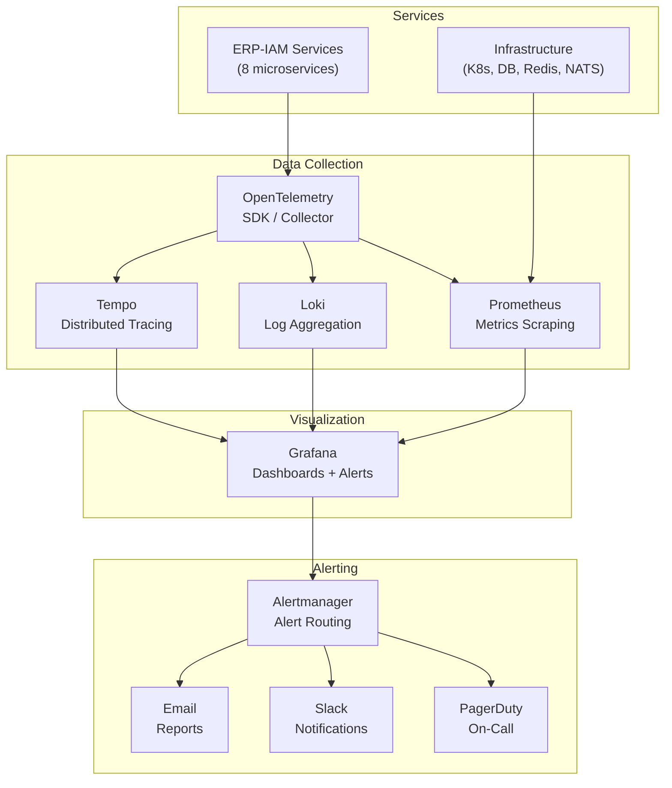
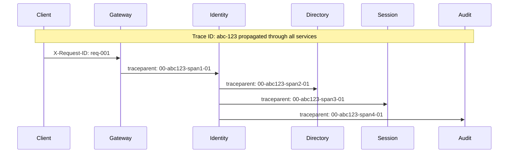

# ERP-IAM Monitoring and Alerting

> **Document ID:** ERP-IAM-MA-001
> **Version:** 1.0.0
> **Last Updated:** 2026-02-23
> **Status:** Approved
> **Related Documents:** [19-Infrastructure.md](./19-Infrastructure.md), [20-DevOps-Runbook.md](./20-DevOps-Runbook.md)

---

## 1. Overview

This document defines the monitoring, alerting, and observability strategy for ERP-IAM, covering metrics collection, dashboard design, alert rules, SLO tracking, and incident management integration.

---

## 2. Observability Stack



---

## 3. Key Metrics

### 3.1 RED Metrics (Rate, Errors, Duration)

| Service | Rate Metric | Error Metric | Duration Metric |
|---|---|---|---|
| identity-service | `iam_auth_requests_total` | `iam_auth_errors_total` | `iam_auth_duration_seconds` |
| directory-service | `iam_ldap_queries_total` | `iam_ldap_errors_total` | `iam_ldap_duration_seconds` |
| provisioning-service | `iam_scim_operations_total` | `iam_scim_errors_total` | `iam_scim_duration_seconds` |
| device-trust-service | `iam_posture_checks_total` | `iam_posture_errors_total` | `iam_posture_duration_seconds` |
| session-service | `iam_session_operations_total` | `iam_session_errors_total` | `iam_session_duration_seconds` |
| audit-service | `iam_audit_writes_total` | `iam_audit_errors_total` | `iam_audit_duration_seconds` |

### 3.2 Business Metrics

| Metric | Description | Alert Threshold |
|---|---|---|
| `iam_active_sessions` | Currently active sessions (gauge) | < 10 (service may be down) |
| `iam_mfa_adoption_ratio` | Users with MFA / total users | < 0.5 (adoption low) |
| `iam_device_compliance_ratio` | Compliant / total devices | < 0.7 (compliance drop) |
| `iam_auth_success_rate` | Success / total auth attempts | < 0.95 (check for issues) |
| `iam_provisioning_backlog` | Pending provisioning operations | > 100 (backlog growing) |
| `iam_credential_rotation_overdue` | Secrets past rotation date | > 0 (rotation failed) |

---

## 4. Grafana Dashboards

### 4.1 IAM Overview Dashboard

```
Row 1: Key Metrics
  [Active Sessions: 12,847] [Auth Rate: 450/s] [Error Rate: 0.3%] [MFA Adoption: 87%]

Row 2: Authentication Performance
  [Auth Latency p50/p95/p99 time series] [Auth Success/Failure stacked area]

Row 3: Directory Health
  [LDAP Queries/sec] [LDAP Latency] [Directory Sync Status table]

Row 4: Device & Session
  [Device Compliance Donut] [Session Distribution by Platform] [Active Sessions Timeline]

Row 5: Provisioning & Audit
  [SCIM Operations/sec] [Provisioning Error Rate] [Audit Event Volume] [SIEM Backlog]
```

### 4.2 Security Dashboard

```
Row 1: Security Posture
  [Security Score Gauge] [Failed Auth Attempts (24h)] [Locked Accounts] [Suspicious Sessions]

Row 2: Threat Indicators
  [Auth Failures by IP (GeoMap)] [Brute Force Attempts Timeline] [Risk Score Distribution]

Row 3: Compliance
  [MFA Coverage] [Password Policy Compliance] [Device Trust Compliance] [Audit Chain Status]
```

---

## 5. Alert Rules

### 5.1 Critical Alerts (P0)

```yaml
groups:
  - name: iam-critical
    rules:
      - alert: IAMAuthServiceDown
        expr: up{job="identity-service"} == 0
        for: 1m
        labels:
          severity: critical
          module: erp-iam
        annotations:
          summary: "Identity service is down"
          runbook: "/docs/runbook#auth-service-down"

      - alert: IAMAuthErrorRateHigh
        expr: |
          rate(iam_auth_errors_total[5m]) / rate(iam_auth_requests_total[5m]) > 0.1
        for: 5m
        labels:
          severity: critical
        annotations:
          summary: "Authentication error rate above 10%"

      - alert: IAMAuditChainBroken
        expr: iam_audit_chain_verification_failures_total > 0
        for: 0m
        labels:
          severity: critical
        annotations:
          summary: "Audit chain integrity verification failed - possible tampering"

      - alert: IAMDatabaseDown
        expr: yugabyte_master_up == 0
        for: 1m
        labels:
          severity: critical
        annotations:
          summary: "YugabyteDB master is unreachable"
```

### 5.2 Warning Alerts (P1)

```yaml
      - alert: IAMHighAuthLatency
        expr: histogram_quantile(0.99, iam_auth_duration_seconds_bucket) > 0.5
        for: 10m
        labels:
          severity: warning
        annotations:
          summary: "Authentication p99 latency above 500ms"

      - alert: IAMSessionServiceHighMemory
        expr: container_memory_usage_bytes{container="session-service"} / container_spec_memory_limit_bytes > 0.85
        for: 10m
        labels:
          severity: warning
        annotations:
          summary: "Session service memory usage above 85%"

      - alert: IAMProvisioningBacklog
        expr: iam_provisioning_pending_operations > 100
        for: 15m
        labels:
          severity: warning
        annotations:
          summary: "Provisioning backlog exceeding 100 operations"

      - alert: IAMCredentialRotationOverdue
        expr: iam_credential_rotation_overdue_total > 0
        for: 1h
        labels:
          severity: warning
        annotations:
          summary: "Credential rotation overdue for one or more secrets"
```

---

## 6. SLO Tracking

### 6.1 SLO Definitions

| SLO | Target | Window | Error Budget |
|---|---|---|---|
| Authentication availability | 99.99% | 30 days | 4.32 minutes |
| Authentication latency (p99 < 200ms) | 99.9% | 30 days | 43.2 minutes |
| Session service availability | 99.99% | 30 days | 4.32 minutes |
| Audit log completeness | 100% | 30 days | 0 minutes |
| Provisioning success rate | 99.5% | 30 days | 216 minutes |

### 6.2 Error Budget Policy

```mermaid
flowchart TD
    A["Error Budget Status"] --> B{"Budget Remaining?"}
    B -->|"> 50%"| C["Normal operations<br/>Feature development continues"]
    B -->|"25-50%"| D["Caution<br/>Reduce deployment frequency"]
    B -->|"< 25%"| E["Freeze<br/>Only reliability improvements"]
    B -->|"Exhausted"| F["Emergency<br/>All hands on reliability<br/>No new features"]
```



---

## 7. Log Management

### 7.1 Structured Log Format

All services emit structured JSON logs:

```json
{
  "level": "info",
  "ts": "2026-02-23T10:00:00.000Z",
  "caller": "identity-service/main.go:77",
  "msg": "authentication completed",
  "module": "ERP-IAM",
  "service": "identity-service",
  "tenant_id": "tenant-001",
  "request_id": "req-abc123",
  "trace_id": "trace-xyz789",
  "user_id": "user-001",
  "method": "oidc",
  "result": "success",
  "duration_ms": 45,
  "risk_score": 12
}
```

### 7.2 Log Levels

| Level | Usage | Sampling in Production |
|---|---|---|
| `error` | Failures requiring attention | 100% (all errors logged) |
| `warn` | Degraded conditions | 100% |
| `info` | Normal operations (auth success, session created) | 100% |
| `debug` | Detailed diagnostic info | 1% (head sampling) |
| `trace` | Very detailed, request-level | 0.1% (tail sampling on errors) |

---

## 8. Distributed Tracing

### 8.1 Trace Context Propagation



All inter-service calls propagate W3C Trace Context headers for end-to-end request tracing across the eight microservices.
