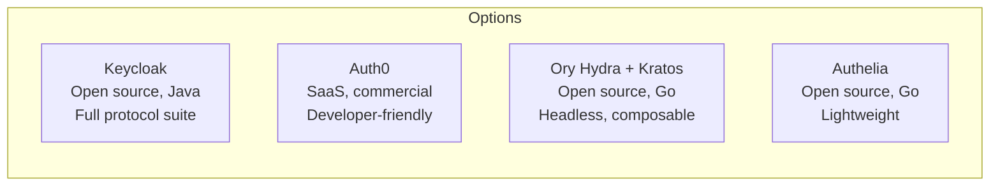
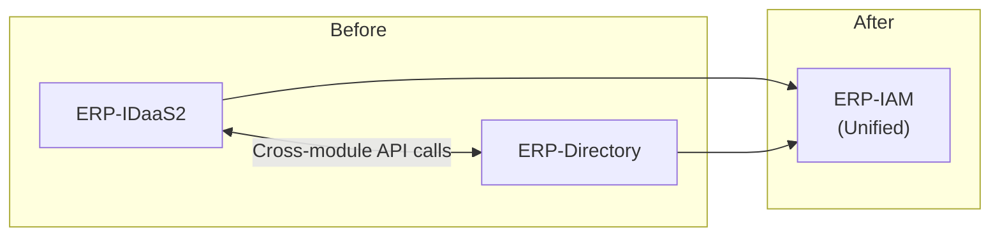

# ERP-IAM Architecture Decision Records (ADR) Index

> **Document ID:** ERP-IAM-ADR-001
> **Version:** 1.0.0
> **Last Updated:** 2026-02-23
> **Status:** Approved
> **Related Documents:** [04-Software-Architecture.md](./04-Software-Architecture.md)

---

## 1. Overview

This document catalogs all Architecture Decision Records (ADRs) for ERP-IAM. ADRs capture the context, decision, and consequences of architecturally significant choices made during the design and implementation of the module.

---

## 2. ADR Registry

| ADR | Title | Status | Date | Decision |
|---|---|---|---|---|
| ADR-001 | Language Choice | Accepted | 2026-02-23 | Polyglot: Go (services), Python (webapp), Dart (mobile) |
| ADR-002 | Database Selection | Accepted | 2026-02-23 | YugabyteDB primary, Redis cache |
| ADR-003 | Identity Provider Selection | Accepted | 2026-02-23 | Keycloak for IdP |
| ADR-004 | Directory Service Selection | Accepted | 2026-02-23 | Authentik + Samba AD DC |
| ADR-005 | Device Trust Platform | Accepted | 2026-02-23 | FleetDM + osquery |
| ADR-006 | MDM Platform | Accepted | 2026-02-23 | NanoMDM |
| ADR-007 | Event Bus Selection | Accepted | 2026-02-23 | NATS JetStream (primary), Redpanda (SIEM bridge) |
| ADR-008 | Encryption Strategy | Accepted | 2026-02-23 | AES-256-GCM envelope encryption with HSM |
| ADR-009 | Multi-Tenancy Model | Accepted | 2026-02-23 | Realm-per-tenant (Keycloak), RLS (database) |
| ADR-010 | Module Consolidation | Accepted | 2026-02-23 | Merge ERP-IDaaS2 + ERP-Directory into ERP-IAM |

---

## 3. ADR-003: Identity Provider Selection

### Context
ERP-IAM needs a standards-compliant identity provider supporting OIDC, OAuth 2.0, SAML 2.0, social login, MFA, and passwordless authentication with multi-tenant support.

### Options Considered

| Criteria | Keycloak | Auth0 | Ory | Authelia |
|---|---|---|---|---|
| Protocol coverage | OIDC/OAuth2/SAML2/LDAP | OIDC/OAuth2/SAML2 | OIDC/OAuth2 | OIDC/OAuth2 |
| Multi-tenant | Native (realms) | Native | Manual | None |
| Social login | 20+ providers | 30+ providers | Manual config | Limited |
| MFA methods | TOTP/SMS/WebAuthn | TOTP/SMS/Push/WebAuthn | TOTP/WebAuthn | TOTP/WebAuthn/Push |
| Customization | SPI extensions, themes | Actions, templates | Code-level | Configuration |
| Self-hosted | Yes | No (SaaS only) | Yes | Yes |
| Community | Largest (CNCF) | N/A (commercial) | Growing | Smaller |
| Cost | Free (open source) | $23+/user/mo | Free | Free |

### Decision
**Keycloak** -- provides the broadest protocol coverage (including native SAML 2.0 and LDAP federation), mature multi-tenant support via realms, extensive SPI extension points, and the largest open-source community. Self-hosted deployment eliminates per-user SaaS costs and provides full data sovereignty.

### Consequences
- **Positive**: Full protocol support, no per-user licensing, extensive documentation, active community
- **Negative**: Java/JVM resource consumption (~1-2GB RAM per instance), custom SPI development requires Java expertise, upgrade path requires careful testing of extensions

---

## 4. ADR-004: Directory Service Selection

### Context
ERP-IAM requires Active Directory-compatible directory services for enterprise domain join, group policies, and LDAP queries, alongside a modern cloud-native user store.

### Decision
**Authentik** for cloud-native user management + **Samba AD DC** for Active Directory compatibility.

### Rationale
- Authentik provides a modern, API-first user store with built-in flows, stages, and policies
- Samba AD DC provides full Active Directory compatibility (DNS, Kerberos, LDAP, GPO, SYSVOL) that is required for Windows domain join and Group Policy distribution
- The combination allows modern cloud-native operations while maintaining enterprise AD compatibility

### Consequences
- **Positive**: Full AD compatibility for enterprises migrating from Microsoft AD, modern API for cloud-native operations
- **Negative**: Operational complexity of running two directory systems, data synchronization required between Authentik and Samba AD DC

---

## 5. ADR-008: Encryption Strategy

### Context
ERP-IAM stores highly sensitive data (credentials, tokens, secrets) requiring defense-in-depth encryption with key management.

### Decision
**Three-tier envelope encryption**: HSM (Master Key) > KEK (per-tenant) > DEK (per-secret), using AES-256-GCM.

### Rationale
- Envelope encryption limits the blast radius of a key compromise (only the compromised DEK's secrets are exposed)
- HSM-backed master key ensures the root of trust is in hardware (FIPS 140-2 Level 3)
- Per-tenant KEKs enable tenant-isolated key rotation without system-wide impact
- Per-secret DEKs enable granular rotation and access auditing
- AES-256-GCM provides authenticated encryption (integrity + confidentiality) with hardware acceleration

### Consequences
- **Positive**: Defense-in-depth, tenant isolation, granular key management, compliance (FIPS 140-2)
- **Negative**: Additional latency for HSM operations (~5-10ms), operational complexity of HSM management, cost of HSM hardware/service

---

## 6. ADR-010: Module Consolidation

### Context
ERP-IDaaS2 (identity provider) and ERP-Directory (Active Directory services, device trust, MDM) were separate modules with overlapping concerns and cross-module dependencies.

### Decision
**Consolidate** both modules into a single ERP-IAM module.

### Rationale
- Identity (authentication) and directory (authorization, group membership) are tightly coupled -- every auth flow requires a directory lookup
- Separate modules created unnecessary network hops for every authentication
- Device trust evaluation requires both identity context and directory context
- Unified module simplifies operational management (single deployment unit, shared database, unified event stream)
- Aligns with the consolidation architecture pattern used across the ERP suite

### Consequences
- **Positive**: Eliminated cross-module latency, unified data model, simplified operations, cohesive security boundary
- **Negative**: Larger module scope, imported legacy codebases require incremental migration, initial complexity of merging three source trees
