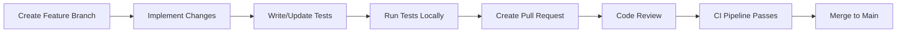

# ERP-IAM Developer Onboarding Guide

> **Document ID:** ERP-IAM-OB-001
> **Version:** 1.0.0
> **Last Updated:** 2026-02-23
> **Status:** Approved
> **Related Documents:** [03-Technical-Writeup.md](./03-Technical-Writeup.md), [22-Configuration-Guide.md](./22-Configuration-Guide.md)

---

## 1. Welcome

Welcome to ERP-IAM, the Identity and Access Management module of the ERP suite. This guide will help you set up your local development environment, understand the codebase structure, and start contributing within your first week.

---

## 2. Prerequisites

### 2.1 Required Tools

| Tool | Version | Purpose |
|---|---|---|
| Go | 1.22+ | Primary service language |
| Python | 3.11+ | Flask webapp |
| Docker | 24+ | Container builds and local infra |
| Docker Compose | 2.x | Local development stack |
| kubectl | 1.28+ | Kubernetes interaction |
| make | Any | Build automation |
| git | 2.x | Version control |

### 2.2 Optional but Recommended

| Tool | Purpose |
|---|---|
| k9s | Kubernetes TUI for debugging |
| jq | JSON processing on command line |
| httpie / curl | API testing |
| pgcli | PostgreSQL CLI with autocompletion |
| redis-cli | Redis interaction |

---

## 3. Repository Structure

```
ERP-IAM/
  cmd/
    server/             # Main server entry point
  configs/
    capabilities.json   # Module capability declaration
  docs/
    ADR/               # Architecture Decision Records
    ARCHITECTURE.md    # Architecture overview
    API.md            # API endpoint reference
    EVENTS.md         # Event topic catalog
    ...
  erp/
    module.manifest.yaml   # Module manifest for ERP-Platform
    aidd.guardrails.yaml   # AIDD guardrails configuration
  imports/
    idaas_core/        # Imported ERP-IDaaS2 source
    idaas_legacy/      # Imported legacy IDaaS source
    directory_core/    # Imported ERP-Directory source
  merge/
    MERGE_MANIFEST.yaml  # Consolidation merge manifest
  services/
    identity-service/       # Authentication, SSO, MFA
      main.go
      Dockerfile
      README.md
    directory-service/      # User/group/OU management, LDAP
    provisioning-service/   # SCIM 2.0, lifecycle automation
    device-trust-service/   # Endpoint compliance, conditional access
    mdm-service/           # Mobile device management
    credential-vault-service/ # Secrets management
    session-service/        # Session lifecycle
    audit-service/         # Event logging, SIEM, compliance
  go.mod                   # Go module definition
  Makefile                 # Build targets
  server                   # Pre-built server binary
```

---

## 4. Local Development Setup

### 4.1 Clone and Setup

```bash
# Clone the repository
cd ~/ERP
git clone <repo-url> ERP-IAM
cd ERP-IAM

# Verify Go module
go mod tidy
```

### 4.2 Start Local Infrastructure

```bash
# Start dependencies (YugabyteDB, Redis, NATS, Keycloak, Authentik)
docker-compose up -d

# Verify infrastructure is running
docker-compose ps
```

### 4.3 Run a Service Locally

```bash
# Run identity-service
cd services/identity-service
PORT=8081 go run main.go

# Test health endpoint
curl http://localhost:8081/healthz
# {"module":"ERP-IAM","service":"identity-service","status":"healthy"}
```

### 4.4 Run All Services

```bash
# From repository root
make test  # Run unit tests first
```

---

## 5. Development Workflow

### 5.1 Creating a New Feature



### 5.2 Service Development Pattern

All services follow the same Go pattern. To add a new endpoint:

```go
// 1. Add handler function
func handleNewFeature(w http.ResponseWriter, r *http.Request) {
    if r.Header.Get("X-Tenant-ID") == "" {
        writeJSON(w, http.StatusBadRequest, map[string]string{"error": "missing X-Tenant-ID"})
        return
    }
    // Business logic here
    writeJSON(w, http.StatusOK, result)
}

// 2. Register route in main()
mux.HandleFunc(base+"/new-feature", handleNewFeature)
```

### 5.3 Event Publishing Pattern

```go
// Publish event after state change
event := CloudEvent{
    Type:   "erp.iam.identity.created",
    Source: "/v1/identity",
    Data:   createdUser,
}
eventBus.Publish("erp.iam.identity.created", event)
```

---

## 6. Testing

```bash
# Unit tests
make test

# Integration tests (requires Docker infrastructure)
make test-integration

# End-to-end tests
make test-e2e

# Test a specific service
go test ./services/identity-service/... -v
```

---

## 7. Key Concepts to Understand

### 7.1 Multi-Tenancy

Every API request must include `X-Tenant-ID`. This header is cross-verified against the JWT token's tenant claim. Database queries use row-level security to enforce tenant isolation.

### 7.2 Event-Driven Architecture

All state changes emit CloudEvents to NATS. The audit service subscribes to all events. Other services subscribe to events they need to react to.

### 7.3 AIDD Guardrails

The `erp/aidd.guardrails.yaml` file defines what AI-driven operations can do:
- **Autonomous**: Read-only queries, notifications (auto-execute)
- **Supervised**: Data mutations, bulk operations (require human approval)
- **Prohibited**: Cross-tenant access, irreversible deletes, privilege escalation (blocked)

---

## 8. Getting Help

| Resource | Location |
|---|---|
| Architecture docs | `docs/ARCHITECTURE.md` |
| API reference | `docs/API.md` |
| Event catalog | `docs/EVENTS.md` |
| Slack channel | #erp-iam-dev |
| On-call rotation | PagerDuty schedule |
| Full documentation | `/Documentation/ERP-IAM/` |

---

## 9. First Week Checklist

- [ ] Set up local development environment
- [ ] Run all services and verify health endpoints
- [ ] Read Architecture document (docs/ARCHITECTURE.md)
- [ ] Read AIDD guardrails configuration
- [ ] Successfully run unit tests
- [ ] Make a small change and submit a PR
- [ ] Understand the event publishing pattern
- [ ] Review one existing PR from a team member
