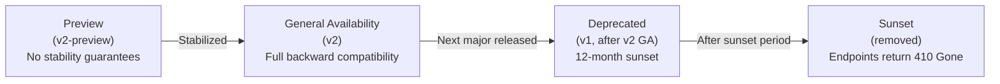
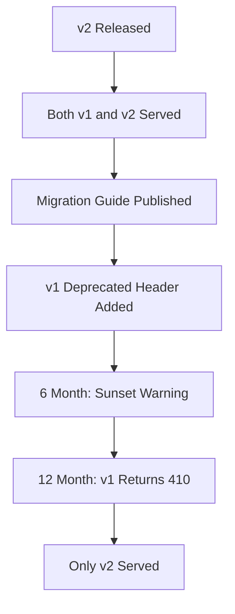

# ERP-IAM API Versioning Strategy

> **Document ID:** ERP-IAM-AV-001
> **Version:** 1.0.0
> **Last Updated:** 2026-02-23
> **Status:** Approved
> **Related Documents:** [05-Backend-API-Reference.md](./05-Backend-API-Reference.md), [14-Technical-Specifications.md](./14-Technical-Specifications.md)

---

## 1. Overview

This document defines the API versioning strategy for ERP-IAM, covering version numbering, backward compatibility guarantees, deprecation policy, and migration guidance.

---

## 2. Versioning Scheme

### 2.1 URL-Based Versioning

ERP-IAM uses URL path-based versioning:

```
https://iam.erp.example.com/v1/identity
https://iam.erp.example.com/v2/identity  (future)
```

### 2.2 Version Lifecycle



---

## 3. Compatibility Rules

### 3.1 Backward-Compatible Changes (No Version Bump)

| Change Type | Example |
|---|---|
| Adding a new endpoint | `POST /v1/identity/auth/webauthn/register` |
| Adding optional request fields | New optional `metadata` field in request body |
| Adding response fields | New `mfa_status` field in user response |
| Adding new event types | `erp.iam.identity.mfa.enrolled` |
| Relaxing validation | Accepting longer usernames |
| Adding new enum values | New `mfa_method: "passkey"` value |

### 3.2 Breaking Changes (Require Version Bump)

| Change Type | Example |
|---|---|
| Removing an endpoint | Removing `DELETE /v1/identity/:id` |
| Removing a response field | Removing `legacy_id` from response |
| Changing field types | Changing `id` from integer to UUID |
| Making optional fields required | Requiring `mfa_method` on creation |
| Changing error response structure | New error envelope format |
| Changing authentication mechanism | Switching from Bearer to mTLS |

---

## 4. Deprecation Policy

### 4.1 Timeline

| Phase | Duration | Actions |
|---|---|---|
| **Announcement** | T+0 | Deprecation notice in changelog, API response header |
| **Warning Period** | 6 months | `Deprecation` header on all responses, migration guide published |
| **Sunset Warning** | 3 months before sunset | Error-level deprecation warnings, admin console notifications |
| **Sunset** | T+12 months | Endpoint returns `410 Gone` with migration URL |

### 4.2 Deprecation Headers

```http
HTTP/1.1 200 OK
Deprecation: true
Sunset: Sat, 23 Feb 2027 00:00:00 GMT
Link: </v2/identity>; rel="successor-version"
```

---

## 5. Current API Versions

| Version | Status | Release Date | Sunset Date |
|---|---|---|---|
| v1 | General Availability | 2026-02-23 | N/A (current) |

---

## 6. Migration Guide Template

When a new major version is released, a migration guide will be provided with:

1. **Breaking changes list**: Every change that requires client modification
2. **Field mapping table**: Old field names to new field names
3. **Code examples**: Before/after request examples
4. **Automated migration tools**: Scripts to update client code
5. **Dual-version support period**: Both versions served simultaneously for 12 months



---

## 7. Client SDK Versioning

API client SDKs (TypeScript, Go, Python) follow semantic versioning aligned with the API version:

- SDK `1.x.x` targets API `v1`
- SDK `2.x.x` will target API `v2`
- Patch versions for bug fixes
- Minor versions for new (backward-compatible) features
