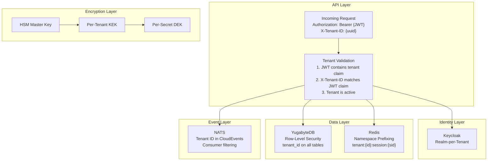
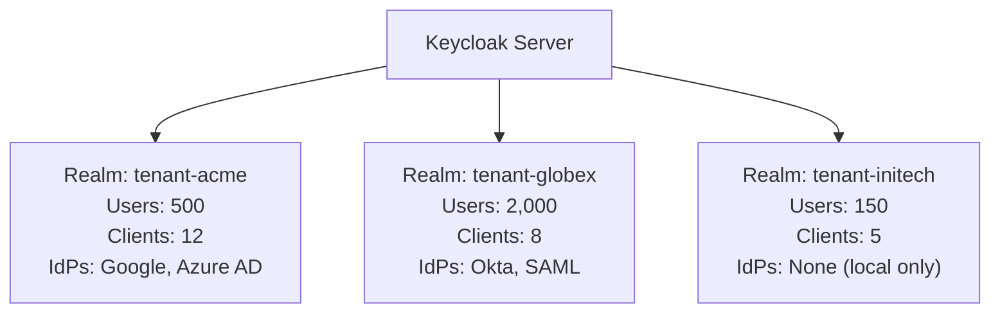
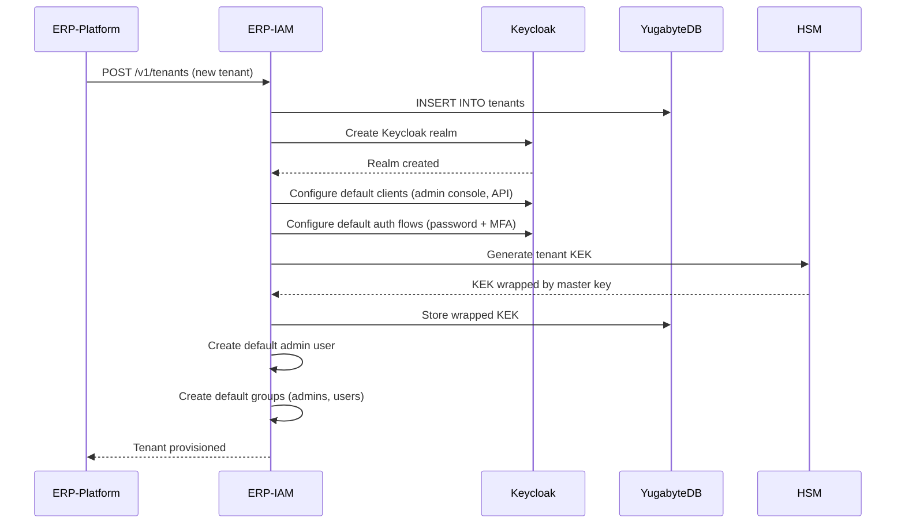
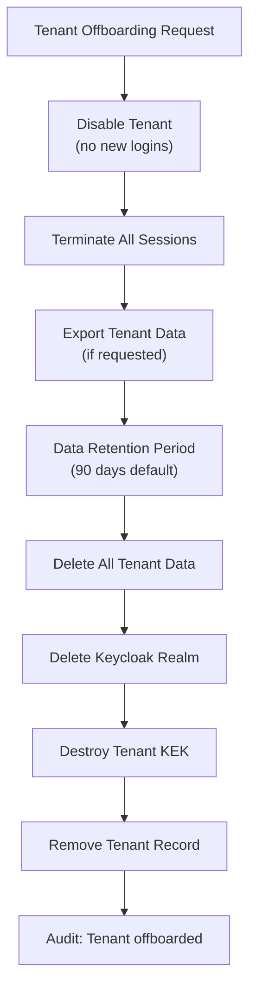

# ERP-IAM Multi-Tenancy Guide

> **Document ID:** ERP-IAM-MT-001
> **Version:** 1.0.0
> **Last Updated:** 2026-02-23
> **Status:** Approved
> **Related Documents:** [04-Software-Architecture.md](./04-Software-Architecture.md), [18-Security-Architecture.md](./18-Security-Architecture.md)

---

## 1. Overview

Multi-tenancy is a foundational architectural concern for ERP-IAM. This document describes how tenant isolation is implemented across all layers of the stack -- from Keycloak realms through database row-level security to event bus topic filtering.

---

## 2. Tenant Isolation Architecture



---

## 3. Layer-by-Layer Isolation

### 3.1 API Layer

Every request is validated for tenant context:

```go
func tenantMiddleware(next http.Handler) http.Handler {
    return http.HandlerFunc(func(w http.ResponseWriter, r *http.Request) {
        tenantID := r.Header.Get("X-Tenant-ID")
        if tenantID == "" {
            writeJSON(w, 400, map[string]string{"error": "missing X-Tenant-ID"})
            return
        }

        // Cross-verify with JWT token claims
        claims := getJWTClaims(r)
        if claims.TenantID != tenantID {
            writeJSON(w, 403, map[string]string{"error": "tenant mismatch"})
            return
        }

        // Set tenant context for downstream database queries
        ctx := context.WithValue(r.Context(), "tenant_id", tenantID)
        next.ServeHTTP(w, r.WithContext(ctx))
    })
}
```

### 3.2 Keycloak Realm Isolation

Each tenant gets a dedicated Keycloak realm:



Realm isolation guarantees:
- User stores are completely separate (no cross-realm user visibility)
- Client registrations are scoped to the realm
- Identity provider configurations are per-realm
- Authentication flows can be customized per-realm
- Session tokens are only valid within their issuing realm

### 3.3 Database Row-Level Security

```sql
-- All tables have tenant_id column
CREATE TABLE users (
    id UUID PRIMARY KEY DEFAULT gen_random_uuid(),
    tenant_id UUID NOT NULL REFERENCES tenants(id),
    username VARCHAR(255) NOT NULL,
    -- ...
    UNIQUE (tenant_id, username)
);

-- RLS enabled on all tables
ALTER TABLE users ENABLE ROW LEVEL SECURITY;

-- Application role sees only its tenant's data
CREATE POLICY tenant_isolation_policy ON users
    FOR ALL
    TO iam_app_role
    USING (tenant_id = current_setting('app.current_tenant_id')::uuid)
    WITH CHECK (tenant_id = current_setting('app.current_tenant_id')::uuid);

-- Service role (for cross-tenant admin operations) bypasses RLS
CREATE POLICY service_bypass_policy ON users
    FOR ALL
    TO iam_service_role
    USING (true);
```

Before every query, the API layer sets the tenant context:

```go
func setTenantContext(db *sql.DB, tenantID string) error {
    _, err := db.Exec("SET app.current_tenant_id = $1", tenantID)
    return err
}
```

### 3.4 Redis Namespace Isolation

```
# Session data is namespaced by tenant
tenant:acme-uuid:session:sess-001 -> {session data}
tenant:acme-uuid:session:sess-002 -> {session data}
tenant:globex-uuid:session:sess-001 -> {session data}

# User session index is namespaced by tenant
tenant:acme-uuid:user_sessions:user-001 -> SET{sess-001, sess-002}
tenant:globex-uuid:user_sessions:user-001 -> SET{sess-001}

# Session count per tenant per user
tenant:acme-uuid:session_count:user-001 -> 2
```

### 3.5 Event Bus Isolation

All events include `tenantid` in the CloudEvents metadata:

```json
{
  "specversion": "1.0",
  "type": "erp.iam.identity.created",
  "tenantid": "acme-uuid",
  "data": { ... }
}
```

Consumers can filter by tenant:

```go
// Subscribe only to events for a specific tenant
sub, _ := js.Subscribe("erp.iam.identity.>", func(msg *nats.Msg) {
    var event CloudEvent
    json.Unmarshal(msg.Data, &event)
    if event.TenantID == targetTenantID {
        processEvent(event)
    }
    msg.Ack()
})
```

### 3.6 Encryption Isolation

Each tenant has its own Key Encryption Key (KEK), ensuring that:
- Compromise of one tenant's KEK does not expose other tenants' secrets
- KEK rotation can be performed per-tenant without affecting others
- Audit trail tracks key usage per tenant

---

## 4. Tenant Provisioning Flow



---

## 5. Cross-Tenant Operations

Cross-tenant operations are strictly controlled:

| Operation | Allowed | Mechanism |
|---|---|---|
| Regular API operations | Tenant-scoped only | RLS + X-Tenant-ID |
| Platform admin queries | All tenants | Service role (bypasses RLS) |
| Module registry health check | No tenant context | /healthz (unauthenticated) |
| SIEM export | All tenant events | Service role subscription |
| Compliance report | Per-tenant | Tenant-scoped audit query |

AIDD guardrails explicitly prohibit cross-tenant data access from AI-driven operations.

---

## 6. Tenant Offboarding



Data deletion is cascading and irreversible after the retention period:
1. All user records
2. All sessions (Redis keys)
3. All audit events (or archived per compliance)
4. All credentials (vault entries)
5. All device records
6. Keycloak realm and all its configuration
7. Tenant KEK (secrets become unrecoverable)
