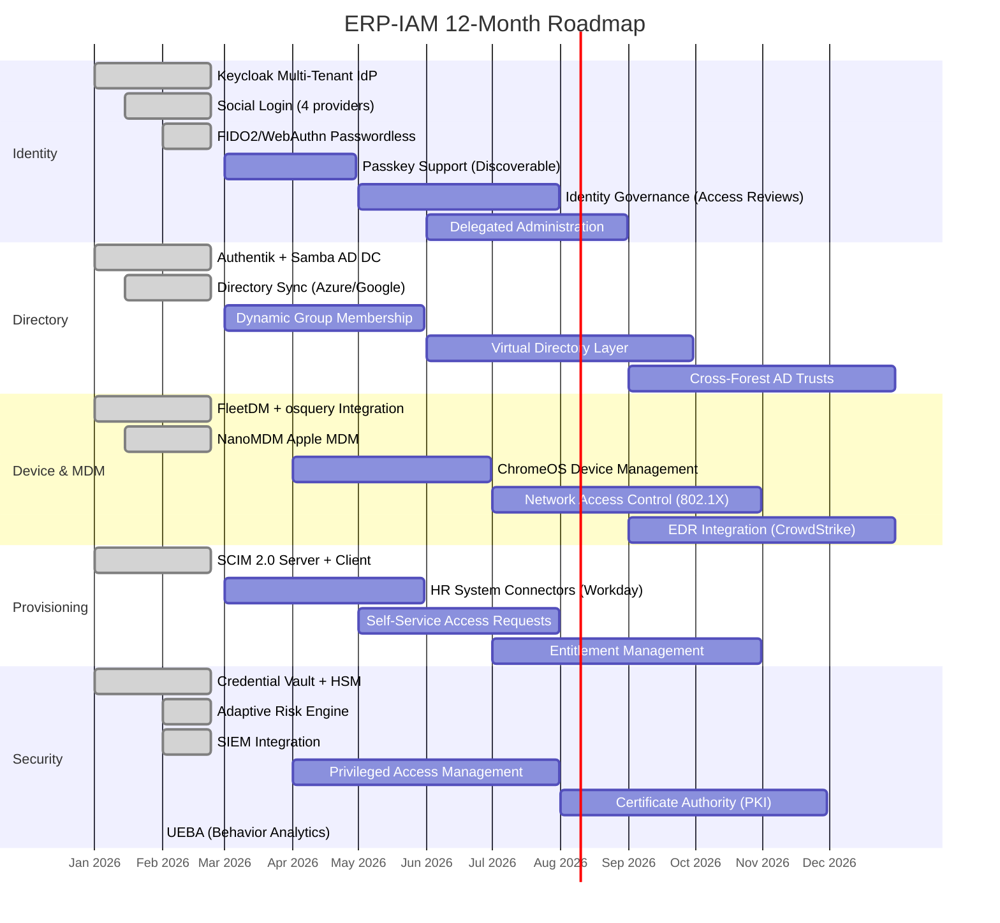

# ERP-IAM Product Roadmap

> **Document ID:** ERP-IAM-RM-001
> **Version:** 1.0.0
> **Last Updated:** 2026-02-23
> **Status:** Approved
> **Related Documents:** [01-PRD.md](./01-PRD.md), [02-Release-Notes.md](./02-Release-Notes.md)

---

## 1. Overview

This document outlines the product roadmap for ERP-IAM across the next 12 months, organized into quarterly releases. The roadmap is aligned with the competitive benchmarking against Okta, Microsoft Entra ID, JumpCloud, and Auth0, with the goal of achieving feature parity or superiority in all core IAM capabilities.

---

## 2. Roadmap Timeline

---

## 3. Q1 2026 (January - March) -- Foundation

### Delivered (v1.0.0)
- Keycloak multi-tenant identity provider
- OIDC/OAuth 2.0/SAML 2.0 protocol support
- Social login (Google, Microsoft, Apple, Facebook)
- Passwordless (FIDO2/WebAuthn, magic links, OTP)
- MFA (TOTP, SMS, push, hardware keys)
- Adaptive risk-based authentication
- Authentik + Samba AD DC directory service
- SCIM 2.0 provisioning (server + client)
- Joiner-Mover-Leaver lifecycle automation
- FleetDM + osquery device trust
- NanoMDM Apple/Android/Windows MDM
- Credential vault with AES-256 + HSM
- Session management with concurrent limits
- Audit logging with SIEM integration
- Module consolidation (ERP-IDaaS2 + ERP-Directory)

### Upcoming (v1.1.0)
- Passkey support (discoverable FIDO2 credentials)
- Dynamic group membership based on user attributes
- HR system connector: Workday
- Expanded SCIM attribute mapping library

---

## 4. Q2 2026 (April - June) -- Governance & Management

### Planned (v1.2.0)

| Feature | Description | Competitive Gap Addressed |
|---|---|---|
| **Identity Governance** | Access reviews, certification campaigns, periodic entitlement review | Match Okta Governance |
| **Delegated Administration** | OU-scoped admin roles, self-service group management | Match Entra ID delegated admin |
| **ChromeOS Management** | ChromeOS device enrollment and policy management via Google Admin SDK | Match JumpCloud ChromeOS |
| **HR Connectors** | Workday, BambooHR, SAP SuccessFactors connectors for JML automation | Match Okta HR connectors |
| **Self-Service Access Requests** | End users request access to apps/groups with approval workflows | Match Okta Access Requests |

---

## 5. Q3 2026 (July - September) -- Advanced Security

### Planned (v1.3.0)

| Feature | Description | Competitive Gap Addressed |
|---|---|---|
| **Privileged Access Management** | Just-in-time admin access, session recording, privilege escalation controls | New differentiator (no competitor has built-in PAM) |
| **Virtual Directory** | Unified LDAP view across multiple directory sources (AD, Google, Authentik) | Match JumpCloud virtual LDAP |
| **Network Access Control** | 802.1X RADIUS integration for network-level conditional access | Match Entra ID + NPS |
| **Entitlement Management** | Fine-grained entitlement catalog, access packages, time-limited assignments | Match Entra ID Entitlement Management |

---

## 6. Q4 2026 (October - December) -- Intelligence & Scale

### Planned (v1.4.0)

| Feature | Description | Competitive Gap Addressed |
|---|---|---|
| **UEBA** | User and Entity Behavior Analytics with ML-based anomaly detection | Match Okta ThreatInsight / Entra ID Identity Protection |
| **Certificate Authority** | Built-in PKI for device certificates, code signing, S/MIME | New differentiator |
| **Cross-Forest AD Trusts** | Multi-forest Active Directory trust relationships | Match Entra ID forest trusts |
| **EDR Integration** | CrowdStrike Falcon, SentinelOne, Microsoft Defender integration for device trust signals | Match Okta Device Trust + EDR |
| **Global Data Residency** | Per-tenant data residency controls with YugabyteDB geo-partitioning | Match Entra ID data residency |

---

## 7. Feature Parity Tracker

### vs. Okta

| Capability | Status | Target Quarter |
|---|---|---|
| SSO (OIDC/SAML) | Achieved | Q1 2026 |
| MFA (all methods) | Achieved | Q1 2026 |
| Lifecycle Management | Achieved | Q1 2026 |
| Access Governance | Planned | Q2 2026 |
| ThreatInsight (UEBA) | Planned | Q4 2026 |
| Workflows (automation) | Planned | Q3 2026 |

### vs. Microsoft Entra ID

| Capability | Status | Target Quarter |
|---|---|---|
| Active Directory | Achieved (Samba) | Q1 2026 |
| Conditional Access | Achieved | Q1 2026 |
| Identity Protection | Partial (risk engine) | Q4 2026 |
| Entitlement Management | Planned | Q3 2026 |
| Privileged Identity Management | Planned | Q3 2026 |
| Certificate Authority | Planned | Q4 2026 |

### vs. JumpCloud

| Capability | Status | Target Quarter |
|---|---|---|
| Cloud Directory | Achieved | Q1 2026 |
| MDM (all platforms) | Achieved | Q1 2026 |
| Device Trust | Achieved | Q1 2026 |
| ChromeOS Management | Planned | Q2 2026 |
| RADIUS/802.1X | Planned | Q3 2026 |
| Patch Management | Planned | Q3 2026 |

### vs. Auth0

| Capability | Status | Target Quarter |
|---|---|---|
| Universal Login | Achieved | Q1 2026 |
| Social Connections | Achieved (4 vs 30+) | Expand in Q2 |
| Actions (custom auth) | Achieved (Keycloak SPI) | Q1 2026 |
| Attack Protection | Achieved | Q1 2026 |
| Organizations (B2B) | Partial | Q2 2026 |

---

## 8. Success Metrics by Quarter

| Quarter | Key Metric | Target |
|---|---|---|
| Q1 2026 | Module GA release | Delivered |
| Q2 2026 | 10 production tenants | 10 tenants with 1,000+ users each |
| Q3 2026 | Feature parity with Okta Workforce | 95% feature coverage |
| Q4 2026 | Enterprise certification | SOC 2 Type II report completed |
| Q1 2027 | 100 production tenants | 100 tenants, 100K+ total users |

---

## 9. Technical Debt Items

| Item | Priority | Target Quarter |
|---|---|---|
| Migrate legacy IDaaS webapp from Flask to React | Medium | Q2 2026 |
| Replace per-service Go binaries with shared library | Low | Q3 2026 |
| Implement gRPC for internal service communication | Medium | Q2 2026 |
| Add OpenTelemetry instrumentation to all services | High | Q2 2026 |
| Implement database migration framework (golang-migrate) | High | Q1 2026 |
| Add comprehensive integration test suite | High | Q2 2026 |

---

## 10. Research and Investigation

| Topic | Status | Notes |
|---|---|---|
| Decentralized Identity (DID/VC) | Research | W3C Verifiable Credentials integration |
| Post-Quantum Cryptography | Research | NIST PQC algorithm evaluation for token signing |
| Continuous Identity Verification | Prototype | Behavioral biometrics during session |
| AI-Powered Security Operations | Design | GPT-based security analyst for audit log investigation |
