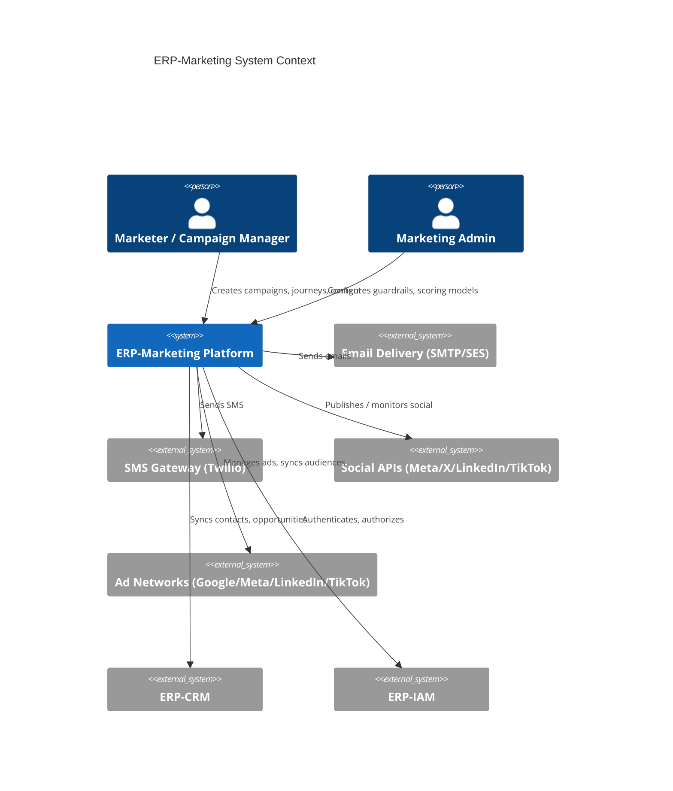
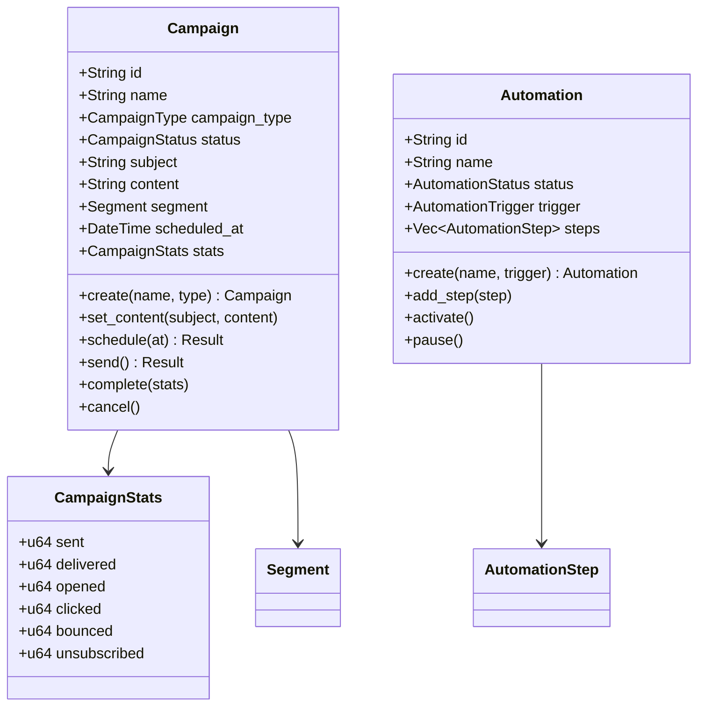
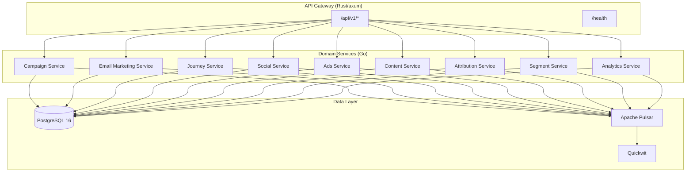

# ERP-Marketing -- Technical Writeup

## 1. Executive Summary

ERP-Marketing is a self-hosted, marketing-first growth platform designed as a full-spectrum replacement for HubSpot Marketing Hub, Marketo Engage, Mailchimp, and Zoho Marketing Automation. It delivers campaign management, email marketing, journey orchestration, social media management, ads management, content management (CMS), multi-touch attribution, dynamic segmentation, and full-funnel analytics within a single, tenant-aware deployment. The system enforces AI-Driven Development (AIDD) guardrails on all high-impact marketing actions -- campaign launches, journey activations, ad spend commits, and bulk data operations -- to ensure that automation assists rather than replaces human judgment on consequential decisions.

The platform is built on a Rust core (axum, sqlx, tokio) for the API gateway and domain logic, augmented by nine Go-based microservices for domain-specific processing (campaign, email-marketing, journey, social, ads, content, attribution, segment, analytics). The command center is a React + Ant Design + Refine single-page application with GraphQL code generation. PostgreSQL 16 serves as the primary data store, Apache Pulsar provides the asynchronous event backbone, and Quickwit handles structured log indexing and full-text observability search. Infrastructure targets Harvester HCI clusters with Mayastor/Vitastor-compatible storage classes.

## 2. Architecture Overview

## 3. Technology Stack

| Layer | Technology | Rationale |
|---|---|---|
| API Gateway / Domain Core | Rust 1.75 (axum, sqlx, tokio, serde, chrono, uuid) | Memory safety, zero-cost abstractions, sub-millisecond p99 latency |
| Domain Microservices | Go 1.22 (net/http, encoding/json) | Lightweight, fast compilation, idiomatic for HTTP microservices |
| Frontend | React 18 + Ant Design 5 + Refine 4 + TanStack Query 5 | Enterprise-grade component library, data-provider abstraction |
| Mobile | Flutter (Ferry + Riverpod), Android (Compose + Apollo + Hilt), iOS (SwiftUI + Apollo + TCA) | Native experiences with GraphQL code generation |
| Database | PostgreSQL 16 | JSONB support, advanced indexing, ACID guarantees |
| Event Backbone | Apache Pulsar | Multi-tenant topics, persistent messaging, exactly-once semantics |
| Observability | Quickwit | Sub-second full-text search on structured logs |
| Infrastructure | Kubernetes on Harvester HCI | Bare-metal performance with cloud-native orchestration |
| Storage | Mayastor / Vitastor | Low-latency, replicated block storage |
| CI/CD | GitHub Actions | Automated test, build, Docker push pipeline |

## 4. Domain Model

The domain is structured using Domain-Driven Design (DDD) with clearly separated aggregates, value objects, and domain events.

### 4.1 Core Aggregates

### 4.2 Value Objects

- **CampaignType**: Email, SMS, Push, InApp, Social
- **Segment**: Dynamic filter-based audience definition with conditions and logic operators (AND/OR)
- **FilterCondition**: Field + operator + value tuples for segment rules

### 4.3 Domain Events

- **CampaignEvent**: Created, Sent (with recipient count), Opened (per contact)
- **AutomationEvent**: Activated, ContactEnrolled, StepCompleted

## 5. Service Architecture

The platform operates as a hybrid architecture: a Rust monolith handles the primary API surface and database access, while nine Go microservices handle domain-specific processing with tenant-aware routing.

## 6. AIDD Guardrails

All high-impact actions pass through the AIDD guardrail framework before execution:

| Action Category | Risk Level | Guardrail Behavior |
|---|---|---|
| Read-only queries | Autonomous | No approval needed |
| Low-risk notifications | Autonomous | Logged but auto-approved |
| Data mutations | Supervised | Requires confidence threshold |
| Workflow automation | Supervised | Requires named approver above threshold |
| Bulk operations | Supervised | Blast radius check + approver |
| Cross-tenant data access | Prohibited | Always blocked |
| Irreversible delete without backup | Prohibited | Always blocked |
| Privilege escalation | Prohibited | Always blocked |

Guardrail events are persisted in the `marketing_aidd_guardrail_events` table with full audit trail including confidence scores, blast radius estimates, monetary values, risk levels, decisions, and approver identities.

## 7. Data Layer

PostgreSQL 16 serves as the single source of truth with 25+ tables covering contacts, segments, campaigns, journeys, journey steps, touchpoints, forms, form submissions, experiments, scoring models, accounts, opportunities, tasks, ads, social posts, content assets, sequences, sequence enrollments, meetings, tickets, conversations, knowledge articles, playbooks, data sync jobs, and AIDD guardrail events. All tables use UUID primary keys and TIMESTAMPTZ timestamps. JSONB columns store flexible schema data for filters, traits, tags, engagement metrics, and step configurations.

## 8. Event Architecture

Events follow the CloudEvents specification with topic naming convention `erp.<module>.<entity>.<action>`. The platform publishes to four Pulsar topics: command, event, audit, and global observability -- each with 6 partitions for parallel processing.

## 9. Performance Characteristics

- Heuristic risk score: 25 (low)
- Build/validate: `cargo check --all-targets`
- Benchmark: `cargo bench` (Criterion harness)
- Availability target: 99.9%
- Error budget: Monthly review cycle
- p95 latency: Service-specific SLO tracked via Quickwit-indexed traces

## 10. Conclusion

ERP-Marketing delivers a comprehensive, self-hosted marketing automation platform that rivals the capabilities of HubSpot, Marketo, Mailchimp, and Zoho Marketing while providing full data sovereignty, tenant isolation, AIDD-governed safety, and enterprise-grade observability. The Rust + Go + React technology stack balances performance, safety, and developer productivity across the full stack.
