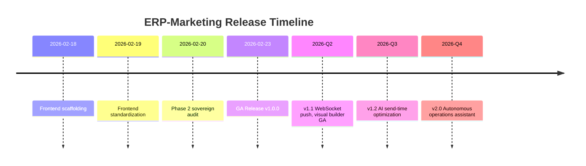

# ERP-Marketing -- Release Notes

## Version 1.0.0 -- Initial GA Release (2026-02-23)

### Highlights

ERP-Marketing reaches General Availability with a comprehensive marketing automation platform benchmarked against HubSpot Marketing Hub, Marketo Engage, Mailchimp, and Zoho Marketing Automation. This release includes all core modules, AIDD guardrails, and full-stack frontend scaffolding.

### New Features

#### Campaign Management
- Multi-channel campaign creation (email, SMS, push, in-app, social)
- Campaign lifecycle management: draft, scheduled, sending, sent, paused, cancelled
- Budget tracking with objective classification (pipeline acceleration, retention, conversion)
- Expected reach estimation and audience targeting
- A/B/n experiment framework with hypothesis tracking and variant comparison
- AIDD-governed campaign launch with confidence scoring and blast radius checks

#### Email Marketing
- Email template management with HTML and plain-text content
- Template CRUD operations via REST API
- Integration-ready architecture for drag-and-drop builder, DKIM/SPF/DMARC, and send-time optimization

#### Journey Builder
- Visual journey orchestration with multi-step workflows
- Journey steps: send_message, wait, branch (if/then), escalation
- Entry segment binding for automatic enrollment
- Channel-aware step configuration (email, in-app, SMS, task)
- Goal tracking with configurable stop conditions
- AIDD-governed journey activation with blast radius estimation

#### Social Media Management
- Social post creation, scheduling, and publishing
- Multi-platform support: LinkedIn, X (Twitter), Facebook, Instagram, TikTok
- Engagement tracking (likes, comments, shares) stored as JSONB
- AIDD-governed post publishing with confidence and blast radius checks

#### Ads Management
- Ad campaign management across Google Ads, LinkedIn Ads, Meta Ads, TikTok Ads
- Budget and spend tracking with ROI metrics (impressions, clicks, conversions)
- Audience sync via segment integration
- AIDD-governed ad launch with projected spend and reach validation

#### Content Management (CMS)
- Content asset management for landing pages and blog posts
- SEO keyword tracking with JSONB arrays
- CTA configuration with label and URL
- Slug-based content addressing with uniqueness enforcement

#### Attribution
- Multi-touch attribution via touchpoints table
- Attribution weight tracking per channel interaction
- Channel-level attribution summary API
- Support for first-touch, last-touch, linear, time-decay, and position-based models

#### Segmentation
- Dynamic segment definitions with JSON rule-based filtering
- Estimated segment size tracking
- Segment lifecycle management (active/inactive)
- Contact-to-segment binding for journey entry

#### Analytics
- Dashboard summary API with KPI aggregation
- Metrics: active campaigns, active journeys, contacts, MQL count, average lead score, open pipeline value, weighted pipeline, running experiments, open tasks, attributed influence
- Attribution summary by channel with weighted distribution

#### Contact Management
- Full contact lifecycle: subscriber, lead, MQL, SQL, opportunity, customer
- Lead scoring with configurable scoring models
- Consent status tracking (opt-in, opt-out, unsubscribed)
- Tags and traits as flexible JSONB attributes
- AIDD-governed contact scoring with confidence and approver requirements

#### AIDD Guardrails
- Three-tier action classification: autonomous, supervised, prohibited
- Guardrail event persistence with full audit trail
- Configurable policy thresholds (min confidence, medium confidence, max blast radius, high value amount)
- AI recommendation engine with confidence scoring and risk assessment
- Named approver requirement for high-value and high-risk actions

#### Infrastructure
- Nine Go microservices: campaign, email-marketing, journey, social, ads, content, attribution, segment, analytics
- Apache Pulsar event backbone with 4 topic partitions (command, event, audit, observability)
- Quickwit structured log indexing
- Harvester HCI Kubernetes deployment target
- Docker Compose local development environment
- Multi-stage Dockerfile with non-root user execution

#### Frontend
- React 18 + Ant Design 5 + Refine 4 command center
- GraphQL code generation pipeline
- Flutter, Android (Kotlin/Compose), and iOS (SwiftUI) mobile scaffolds
- Vitest unit testing framework

### Previous Changelog

#### 2026-02-19 -- Frontend Stack Standardization
- Added/aligned web (Refine + AntD + React Query), Flutter (Ferry + Riverpod + GoRouter), Android (Compose + Apollo + Hilt + Orbit), and iOS (SwiftUI + Apollo + TCA) scaffolds and workflows

#### 2026-02-18 -- Frontend Stack Scaffolding
- Added unified frontend stack scaffolding for web, flutter, android, and ios
- Added GraphQL schema/codegen scripts and CI workflows for metadata/schema triggers
- Added docs for architecture and code generation workflow

### Migration Notes

This is the initial GA release. New deployments should run all migrations in order:
1. `migrations/001_initial.sql` -- Base tables (audiences, email_templates, campaigns)
2. `migrations/001_initial_schema.sql` -- Schema constraints and indexes
3. Legacy import migrations provide expanded schema (contacts, segments, journeys, touchpoints, forms, experiments, scoring models, accounts, opportunities, tasks, ads, social posts, content assets, sequences, meetings, tickets, conversations, knowledge articles, playbooks, data sync jobs, AIDD guardrail events)

### Known Limitations

- Email delivery requires external SMTP/SES provider integration (not bundled)
- Social media API OAuth flows require per-platform developer credentials
- Ad network integrations require platform-specific API keys
- Real-time WebSocket push notifications are on the roadmap for v1.1
- Landing page visual builder is in beta

### Compatibility

- Rust 1.75+
- Go 1.22+
- Node.js 20+
- PostgreSQL 16+
- Apache Pulsar 3.x
- Quickwit 0.8+
- Docker 24+
- Kubernetes 1.28+

