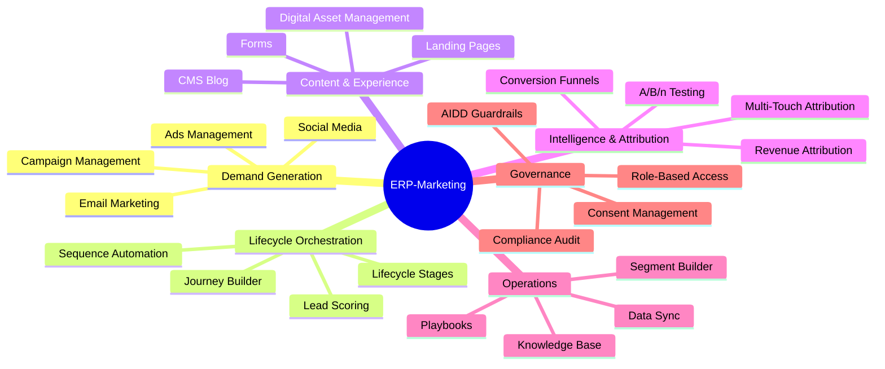
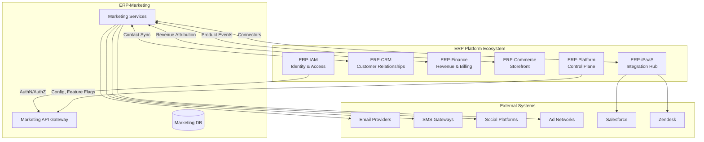
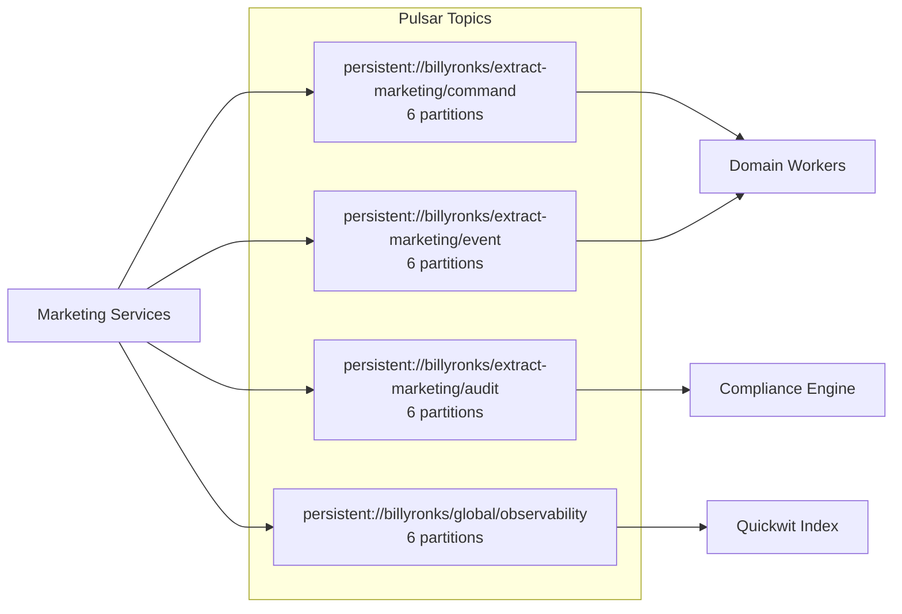
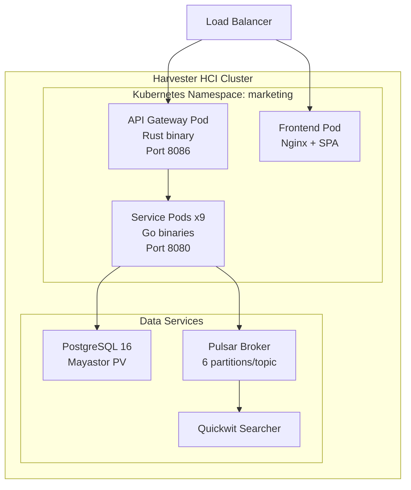

# ERP-Marketing -- Enterprise Architecture

## 1. Introduction

This document describes the enterprise architecture of ERP-Marketing within the broader ERP ecosystem. It covers the strategic alignment, capability mapping, integration topology, data governance model, and technology standards that govern how ERP-Marketing operates as a first-class module alongside ERP-CRM, ERP-IAM, ERP-Finance, ERP-Commerce, ERP-Platform, and other ERP modules.

## 2. Strategic Context

ERP-Marketing exists to provide marketing automation capabilities that historically required purchasing and integrating multiple SaaS tools -- HubSpot for inbound marketing, Marketo for enterprise demand generation, Mailchimp for email campaigns, and Zoho for mid-market automation. By consolidating these capabilities into a single sovereign module, the ERP platform achieves:

- **Data sovereignty**: All marketing data stays within the organization's infrastructure
- **Integration density**: Native event-driven integration with CRM, Finance, and Commerce modules
- **Cost efficiency**: Elimination of per-contact SaaS pricing that scales exponentially
- **Customization depth**: Full source access for domain-specific extensions

## 3. Business Capability Model

## 4. Integration Architecture

### 4.1 Integration Patterns

| Pattern | Usage | Protocol |
|---|---|---|
| Event-Driven Async | Campaign events, journey triggers, attribution signals | Apache Pulsar topics |
| Synchronous REST | CRUD operations, dashboard queries, health checks | HTTP/JSON over TLS |
| GraphQL | Frontend data fetching, mobile app queries | GraphQL over HTTP |
| Webhook Outbound | External system notifications, ad platform callbacks | HTTPS POST |
| Data Sync (Batch) | Salesforce/Zendesk periodic synchronization | Cron-scheduled jobs |

### 4.2 Event Topology

## 5. Data Governance

### 5.1 Data Classification

| Classification | Examples | Retention | Encryption |
|---|---|---|---|
| PII | Contact email, name, company | Configurable (default 7 years) | At rest + in transit |
| Marketing Behavioral | Opens, clicks, page views | 3 years rolling | At rest + in transit |
| Financial | Budget, spend, ARR, deal amount | Indefinite | At rest + in transit |
| Audit | AIDD guardrail events, system logs | 7 years minimum | At rest + in transit |
| Content | Blog posts, landing pages, templates | Indefinite | At rest + in transit |

### 5.2 Tenant Isolation

All API requests require the `X-Tenant-ID` header. Database queries are scoped by tenant at the application layer. Pulsar topics are namespaced per tenant. No cross-tenant data access is permitted -- this is a prohibited action in the AIDD guardrail framework.

## 6. Technology Standards

### 6.1 Approved Technologies

| Concern | Standard | Alternatives Considered |
|---|---|---|
| API Framework | axum (Rust) | actix-web, warp, rocket |
| Database ORM | sqlx (compile-time checked SQL) | diesel, sea-orm |
| Async Runtime | tokio | async-std |
| Frontend Framework | React + Refine + Ant Design | Vue + Vuetify, Angular + Material |
| Event Backbone | Apache Pulsar | Kafka, RabbitMQ, NATS |
| Log Search | Quickwit | Elasticsearch, Loki |
| Container Orchestration | Kubernetes (Harvester HCI) | Docker Swarm, Nomad |
| Block Storage | Mayastor / Vitastor | Longhorn, Rook-Ceph |

### 6.2 Quality Gates

1. All code passes `cargo fmt` and `cargo clippy -D warnings`
2. Unit and integration tests pass with PostgreSQL test database
3. Docker images built and pushed only from `main` branch
4. Security/dependency scans run in every CI pipeline
5. Documentation-as-code artifacts are synchronized with architecture changes

## 7. Deployment Architecture

## 8. Security Architecture

- **Authentication**: Delegated to ERP-IAM (OAuth 2.0 / OIDC)
- **Authorization**: Role-based access control with tenant scoping
- **Secrets Management**: Environment variables; never committed to source
- **Audit Logging**: All security-relevant events emitted to Pulsar audit topic and Quickwit
- **Network**: TLS everywhere; CORS configured per environment
- **Supply Chain**: Dependency scans in CI (cargo-audit, npm audit)

## 9. Compliance Mapping

| Framework | Control | Implementation |
|---|---|---|
| SOC2 CC6/CC7 | Logical access, system operations | Pulsar authn/authz, Quickwit logging, immutable audit topics |
| SOC2 CC8 | Change management | Git-tracked artifacts, PR-based deployment |
| HIPAA 164.312(b) | Audit controls | Quickwit-indexed trace/log records |
| HIPAA 164.312(c) | Integrity | Event immutability, signed payload patterns |
| PCI-DSS 10 | Logging | Centralized security event logging with trace correlation |
| CAN-SPAM | Email compliance | Consent status tracking, unsubscribe handling |
| GDPR | Data protection | Consent management, data portability, right to erasure |
| CCPA | Consumer privacy | Consent tracking, data sale opt-out |

## 10. Roadmap Alignment

The enterprise architecture supports the following evolution:

1. **Current (v1.0)**: Core marketing automation with AIDD guardrails
2. **Near-term (v1.x)**: AI send-time optimization, visual landing page builder, WhatsApp channel
3. **Mid-term (v2.0)**: Tenant-aware autonomous operations assistant with policy recommendations
4. **Long-term**: Cross-domain policy orchestration with event-sourced audit graph spanning CRM, Finance, and Commerce modules
