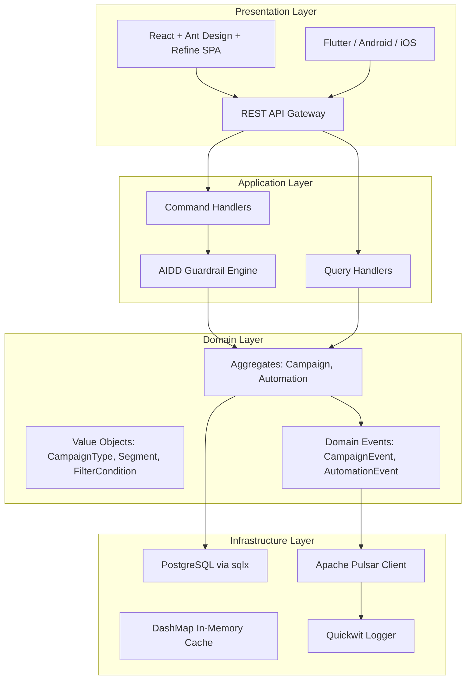
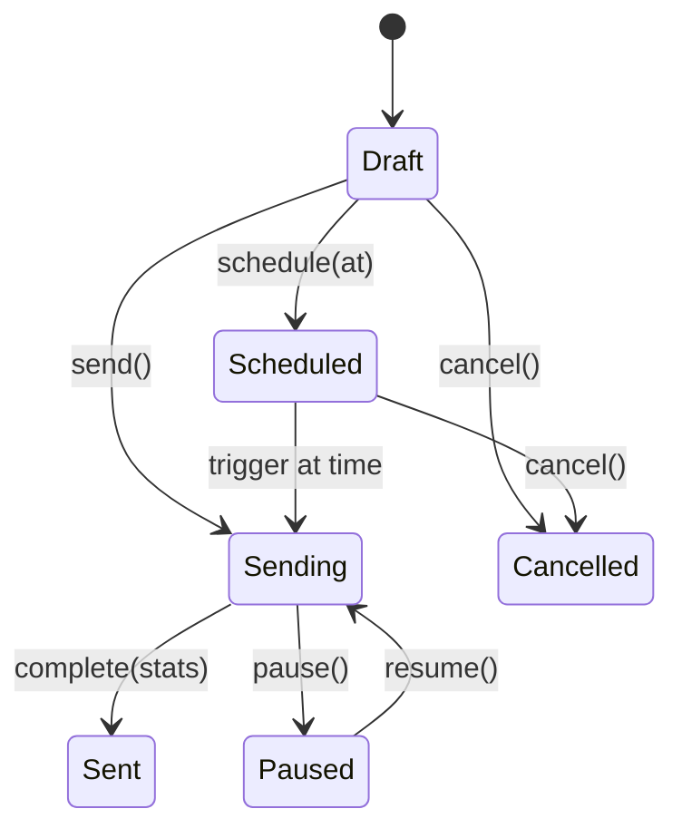
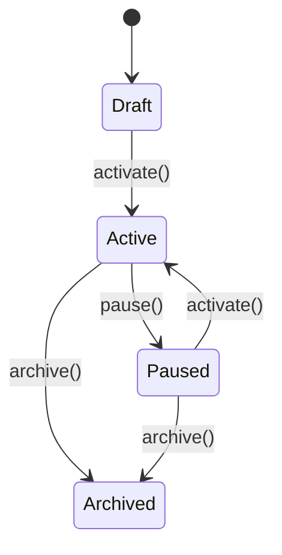
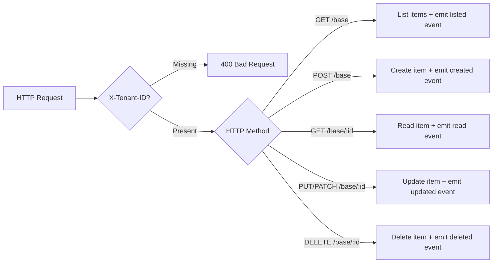
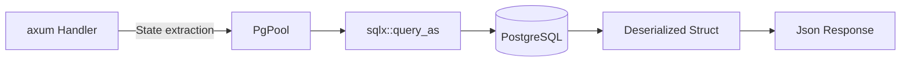
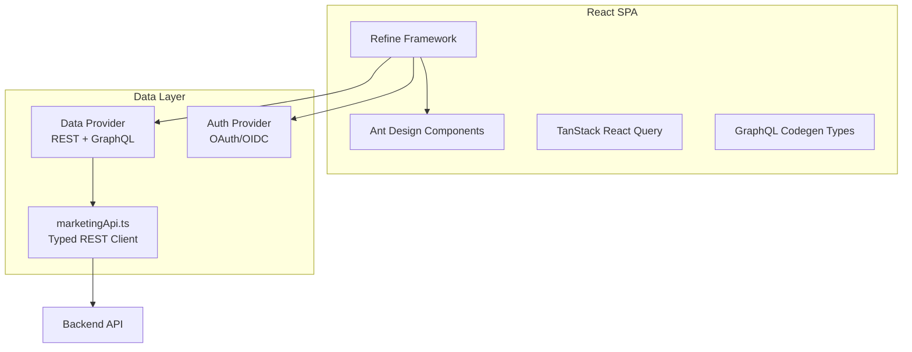

# ERP-Marketing -- Software Architecture

## 1. Overview

ERP-Marketing follows a hybrid architecture combining a Rust monolith API gateway with domain-driven Go microservices. The Rust core owns the database schema, API routing, and domain aggregates. The Go services handle domain-specific processing with tenant-aware HTTP handlers. Communication between components is both synchronous (REST/gRPC) and asynchronous (Apache Pulsar events).

## 2. Layered Architecture



## 3. Domain-Driven Design Structure

### 3.1 Module Organization

```
src/
  domain/
    aggregates/
      campaign.rs      -- Campaign aggregate root
      automation.rs     -- Automation/workflow aggregate root
      mod.rs            -- Public exports
    value_objects/
      mod.rs            -- CampaignType, Segment, SegmentFilter, FilterCondition, FilterLogic
    events/
      mod.rs            -- DomainEvent, CampaignEvent, AutomationEvent
    mod.rs              -- Domain module root
  lib.rs                -- Public API surface
  main.rs               -- axum HTTP server, route definitions, handler functions
```

### 3.2 Aggregate Invariants

**Campaign Aggregate:**
- A campaign cannot be sent or scheduled without content
- Sending transitions status from Draft/Scheduled to Sending
- Completion records final stats and emits a CampaignSent domain event
- Cancellation is terminal

**Automation Aggregate:**
- Steps are added sequentially
- Activation requires at least a trigger and name
- Pausing suspends enrollment but preserves state

### 3.3 State Machines





## 4. API Architecture

### 4.1 Rust API Gateway Routes

| Method | Path | Handler | Description |
|---|---|---|---|
| GET | `/health` | inline | Health check |
| GET | `/api/v1/campaigns` | `list_campaigns` | List all campaigns |
| POST | `/api/v1/campaigns` | `create_campaign` | Create campaign |
| GET | `/api/v1/campaigns/:id` | `get_campaign` | Get campaign by ID |
| POST | `/api/v1/campaigns/:id/send` | `send_campaign` | Trigger campaign send |
| POST | `/api/v1/campaigns/:id/launch` | AIDD-gated | Launch with guardrail |
| POST | `/api/v1/campaigns/:id/pause` | `pause_campaign` | Pause active campaign |
| GET | `/api/v1/audiences` | `list_audiences` | List audiences |
| POST | `/api/v1/audiences` | `create_audience` | Create audience |
| GET | `/api/v1/templates` | `list_templates` | List email templates |
| POST | `/api/v1/templates` | `create_template` | Create email template |
| GET | `/api/v1/contacts` | `fetchContacts` | List contacts |
| POST | `/api/v1/contacts` | `createContact` | Create contact |
| POST | `/api/v1/contacts/:id/score` | AIDD-gated | Score contact |
| GET | `/api/v1/segments` | `fetchSegments` | List segments |
| GET | `/api/v1/journeys` | `fetchJourneys` | List journeys |
| POST | `/api/v1/journeys/:id/activate` | AIDD-gated | Activate journey |
| GET | `/api/v1/dashboard/summary` | `fetchDashboardSummary` | Dashboard KPIs |
| GET | `/api/v1/dashboard/attribution` | `fetchAttributionSummary` | Attribution by channel |
| GET | `/api/v1/recommendations` | `fetchRecommendations` | AI recommendations |
| GET | `/api/v1/audit/guardrails` | `fetchGuardrailEvents` | Guardrail audit log |

### 4.2 Go Microservice Pattern

Each Go microservice follows an identical pattern:



## 5. Data Access Pattern

The Rust core uses sqlx with compile-time checked SQL queries against PostgreSQL. All database interactions use the connection pool managed by `PgPoolOptions` with a configurable `max_connections` (default 10).



Key patterns:
- UUID v7 for time-ordered primary keys (`Uuid::now_v7()`)
- JSONB columns for flexible schema data (filters, tags, traits, engagement, steps)
- `RETURNING *` for atomic insert-and-return
- Indexed columns for hot query paths (status, lifecycle stage, lead score, timestamps)

## 6. Frontend Architecture



The frontend uses a typed API client (`marketingApi.ts`) that handles snake_case-to-camelCase transformation, error handling, and type-safe request/response mapping for all 25+ API endpoints.

## 7. Concurrency Model

- **Rust async**: tokio multi-threaded runtime with work-stealing scheduler
- **Connection pooling**: sqlx PgPool with bounded connections
- **In-memory cache**: DashMap for concurrent read-heavy workloads
- **Event processing**: Pulsar consumers with configurable parallelism per partition

## 8. Error Handling

- Domain errors: `CampaignError` enum with `NoContent`, `NoSegment` variants
- API errors: HTTP status codes mapped from domain errors via `(StatusCode, String)` tuples
- Client errors: `ApiClientError` class with status code and message
- Infrastructure errors: anyhow for contextual error propagation

## 9. Testing Strategy

- **Unit tests**: Rust `#[cfg(test)]` modules per aggregate (e.g., `test_campaign`)
- **Frontend tests**: Vitest with React Testing Library
- **Integration tests**: CI pipeline with PostgreSQL service container
- **Quality gates**: `cargo fmt`, `cargo clippy -D warnings`, `cargo test --all-features`
