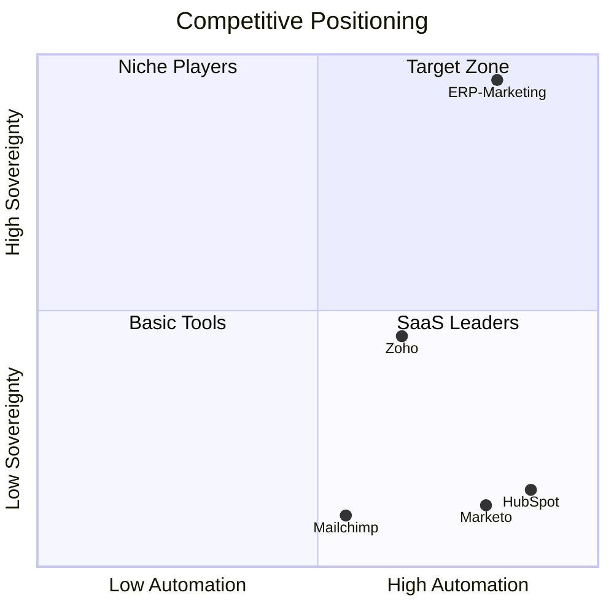

# ERP-Marketing -- Product Requirements Document

## 1. Product Vision

ERP-Marketing is a self-hosted marketing automation platform that consolidates the capabilities of HubSpot Marketing Hub, Marketo Engage, Mailchimp, and Zoho Marketing Automation into a single, sovereign module within the ERP ecosystem. It enables B2B and B2C organizations to manage the complete marketing lifecycle -- from demand generation through attribution -- without sacrificing data control to third-party SaaS vendors.

## 2. Competitive Landscape

### 2.1 Feature Comparison Matrix

| Capability | ERP-Marketing | HubSpot Marketing Hub | Marketo Engage | Mailchimp | Zoho Marketing |
|---|---|---|---|---|---|
| Multi-channel campaigns | Email, SMS, Push, InApp, Social | Email, SMS, Social, Ads | Email, SMS, Push | Email, SMS | Email, SMS, Social |
| Journey builder | Visual if/then branching | Visual workflows | Engagement programs | Customer journeys | Journey builder |
| Email builder | Drag-and-drop + HTML | Drag-and-drop | Drag-and-drop | Drag-and-drop | Drag-and-drop |
| A/B/n testing | Unlimited variants | 5 variants | Limited | 3 variants | A/B only |
| Social management | Publish, schedule, monitor, sentiment | Publish, schedule, monitor | Limited | Basic scheduling | Publish, schedule |
| Ads management | Google, Meta, LinkedIn, TikTok | Google, Meta, LinkedIn | None | Google, Meta | Google, Meta |
| CMS / Content | Blog, landing pages, SEO, DAM | Full CMS | Landing pages only | Landing pages | Landing pages |
| Attribution | Multi-touch: 6+ models + AI-custom | Multi-touch (Enterprise) | Revenue attribution | Basic | Linear/first/last |
| Lead scoring | AI-assisted, rule-based | Predictive + rule-based | Rule-based | Tags only | Rule-based |
| AIDD guardrails | Built-in | None | None | None | None |
| Self-hosted | Yes (full sovereignty) | No (SaaS only) | No (SaaS only) | No (SaaS only) | On-premise option |
| Pricing model | Per-module license | Per-contact ($800+/mo) | Per-contact ($895+/mo) | Per-contact ($20+/mo) | Per-user ($30+/mo) |
| Data sovereignty | Complete | Vendor-controlled | Vendor-controlled | Vendor-controlled | Partial |
| Open source | Apache 2.0 | Proprietary | Proprietary | Proprietary | Proprietary |

### 2.2 Competitive Differentiators

## 3. User Personas

### 3.1 Marketing Operations Manager
- **Goals**: Orchestrate multi-channel campaigns, track attribution, optimize spend
- **Pain points**: Siloed tools, poor attribution visibility, vendor lock-in
- **Key features**: Campaign studio, journey builder, attribution dashboard

### 3.2 Content Marketer
- **Goals**: Publish blog posts, build landing pages, optimize SEO
- **Pain points**: Disconnected CMS from marketing data, manual UTM tracking
- **Key features**: CMS, landing page builder, SEO tools, form builder

### 3.3 Demand Generation Manager
- **Goals**: Generate MQLs, manage ad spend, score leads
- **Pain points**: Fragmented ad platforms, poor lead quality visibility
- **Key features**: Ads manager, lead scoring, segment builder

### 3.4 Social Media Manager
- **Goals**: Schedule and publish content, monitor engagement, analyze sentiment
- **Pain points**: Platform switching, disconnected social from pipeline
- **Key features**: Social publisher, engagement analytics, sentiment analysis

### 3.5 Marketing Administrator
- **Goals**: Configure guardrails, manage integrations, enforce compliance
- **Pain points**: Audit complexity, cross-tool configuration drift
- **Key features**: AIDD guardrails, data sync, compliance dashboard

## 4. Functional Requirements

### 4.1 Campaign Management (FR-CAM)

| ID | Requirement | Priority | Status |
|---|---|---|---|
| FR-CAM-01 | Create campaigns with name, subject, channel, objective, budget, reach estimate | P0 | Implemented |
| FR-CAM-02 | Support channels: email, SMS, push, in-app, social | P0 | Implemented |
| FR-CAM-03 | Campaign lifecycle: draft, scheduled, sending, sent, paused, cancelled | P0 | Implemented |
| FR-CAM-04 | A/B/n experiment framework with hypothesis, variants, and winner detection | P0 | Implemented |
| FR-CAM-05 | Budget tracking with objective classification | P0 | Implemented |
| FR-CAM-06 | AIDD guardrail on campaign launch (confidence + blast radius) | P0 | Implemented |
| FR-CAM-07 | Campaign cloning for rapid iteration | P1 | Planned |
| FR-CAM-08 | Campaign template library with industry presets | P1 | Planned |

### 4.2 Email Marketing (FR-EMAIL)

| ID | Requirement | Priority | Status |
|---|---|---|---|
| FR-EMAIL-01 | HTML + plain-text template management | P0 | Implemented |
| FR-EMAIL-02 | Drag-and-drop email builder with responsive preview | P0 | In Progress |
| FR-EMAIL-03 | Dynamic content blocks based on contact properties | P1 | Planned |
| FR-EMAIL-04 | Send-time optimization via AI prediction | P1 | Planned |
| FR-EMAIL-05 | Deliverability monitoring (bounce, complaint, engagement) | P0 | Implemented (stats) |
| FR-EMAIL-06 | DKIM/SPF/DMARC authentication configuration | P0 | Planned |
| FR-EMAIL-07 | Unsubscribe handling with one-click compliance | P0 | Implemented (consent) |

### 4.3 Journey Builder (FR-JRN)

| ID | Requirement | Priority | Status |
|---|---|---|---|
| FR-JRN-01 | Visual journey canvas with step sequencing | P0 | Implemented |
| FR-JRN-02 | Step types: send_message, wait, branch, escalation | P0 | Implemented |
| FR-JRN-03 | Entry segment binding for automatic enrollment | P0 | Implemented |
| FR-JRN-04 | Multi-channel steps: email, in-app, SMS, task | P0 | Implemented |
| FR-JRN-05 | Goal tracking with configurable stop conditions | P0 | Implemented |
| FR-JRN-06 | AIDD guardrail on journey activation | P0 | Implemented |
| FR-JRN-07 | Journey analytics with step-level conversion rates | P1 | Planned |

### 4.4 Social Media Management (FR-SOC)

| ID | Requirement | Priority | Status |
|---|---|---|---|
| FR-SOC-01 | Social post creation with channel targeting | P0 | Implemented |
| FR-SOC-02 | Scheduling and auto-publishing | P0 | Implemented |
| FR-SOC-03 | Platform support: LinkedIn, X, Facebook, Instagram, TikTok | P0 | Implemented |
| FR-SOC-04 | Engagement tracking (likes, comments, shares) | P0 | Implemented |
| FR-SOC-05 | Sentiment analysis on inbound mentions | P1 | Planned |
| FR-SOC-06 | AIDD guardrail on social publishing | P0 | Implemented |

### 4.5 Ads Management (FR-ADS)

| ID | Requirement | Priority | Status |
|---|---|---|---|
| FR-ADS-01 | Ad campaign management with budget/spend tracking | P0 | Implemented |
| FR-ADS-02 | Network support: Google Ads, LinkedIn Ads, Meta Ads, TikTok Ads | P0 | Implemented |
| FR-ADS-03 | ROI metrics: impressions, clicks, conversions | P0 | Implemented |
| FR-ADS-04 | Audience sync from segments | P0 | Implemented |
| FR-ADS-05 | AIDD guardrail on ad launch with spend projection | P0 | Implemented |

### 4.6 Attribution (FR-ATT)

| ID | Requirement | Priority | Status |
|---|---|---|---|
| FR-ATT-01 | Multi-touch attribution with configurable weights | P0 | Implemented |
| FR-ATT-02 | Attribution models: first, last, linear, time-decay, position, AI-custom | P0 | Partial |
| FR-ATT-03 | Revenue attribution linking touchpoints to opportunities | P0 | Implemented |
| FR-ATT-04 | Channel-level attribution summary | P0 | Implemented |

## 5. Non-Functional Requirements

| ID | Requirement | Target |
|---|---|---|
| NFR-01 | API response time p95 | < 200ms |
| NFR-02 | System availability | 99.9% |
| NFR-03 | Campaign send throughput | 100,000 emails/hour |
| NFR-04 | Concurrent dashboard users | 500+ |
| NFR-05 | Data retention | Configurable (default 7 years) |
| NFR-06 | Recovery Time Objective (RTO) | < 1 hour |
| NFR-07 | Recovery Point Objective (RPO) | < 15 minutes |
| NFR-08 | Audit log immutability | Append-only with hash chain |

## 6. Success Metrics

| Metric | Target | Measurement |
|---|---|---|
| Feature parity with HubSpot Professional | 90%+ | Feature comparison matrix |
| Campaign creation time | < 5 minutes for standard campaigns | User session analytics |
| Journey activation time | < 3 minutes for standard journeys | User session analytics |
| Attribution accuracy | Within 5% of manual calculation | Automated validation tests |
| AIDD false positive rate | < 2% | Guardrail event analysis |
| Platform migration time | < 2 weeks from HubSpot/Marketo | Migration playbook validation |
