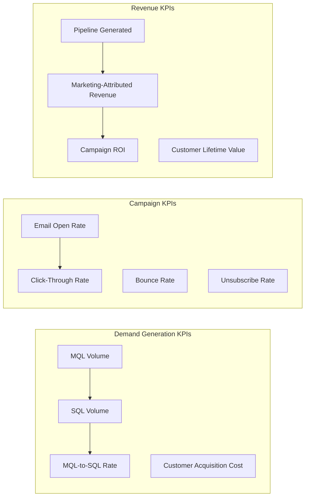
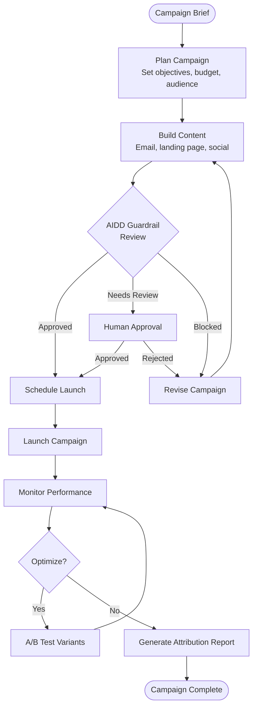
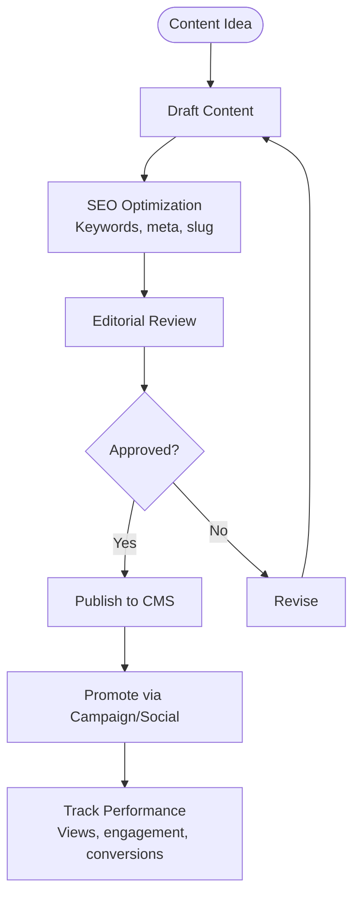
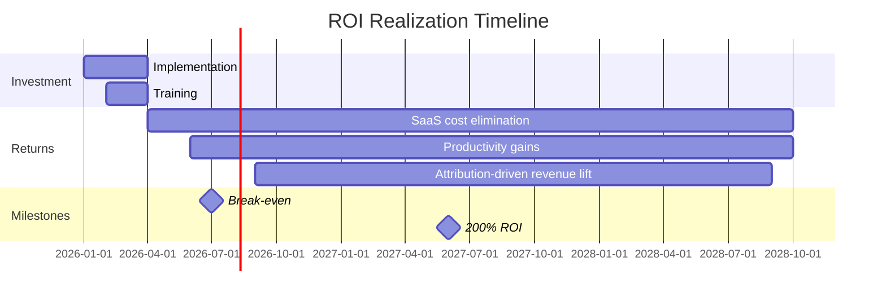

# ERP-Marketing -- Business Requirements Document

## 1. Business Context

Organizations across industries face a common challenge: marketing technology stacks have become fragmented, expensive, and opaque. The average enterprise manages 7-12 marketing tools, each with its own data silo, pricing model, and integration requirements. ERP-Marketing addresses this by consolidating marketing automation into a single sovereign module within the ERP ecosystem, eliminating vendor lock-in and providing complete data control.

## 2. Business Objectives

### 2.1 Primary Objectives

1. **Reduce marketing technology costs by 40-60%** by eliminating per-contact SaaS pricing and consolidating multiple tools into one module
2. **Achieve data sovereignty** by keeping all marketing data -- contact records, behavioral events, campaign performance, attribution data -- within the organization's own infrastructure
3. **Accelerate time-to-market** for campaigns, journeys, and content by reducing cross-tool context switching
4. **Improve attribution accuracy** by unifying touchpoint data across all channels in a single data store
5. **Enforce governance** on high-impact marketing actions through AIDD guardrails

### 2.2 Key Performance Indicators

| KPI | Baseline (Multi-tool) | Target (ERP-Marketing) |
|---|---|---|
| Marketing tech spend | $180K+/year (5 tools) | $50K/year (1 module) |
| Campaign setup time | 45 minutes | 15 minutes |
| Cross-tool data sync lag | 15-60 minutes | Real-time (< 1 second) |
| Attribution model count | 2 (first/last touch) | 6+ (multi-touch + AI) |
| Data export time | 24-48 hours (vendor request) | Instant (self-hosted) |
| Compliance audit time | 2 weeks (multi-vendor) | 2 days (single audit trail) |

## 3. Stakeholder Analysis

| Stakeholder | Role | Interest | Influence |
|---|---|---|---|
| CMO | Executive sponsor | ROI, brand consistency, data sovereignty | High |
| VP Marketing Ops | Primary user champion | Automation, attribution, efficiency | High |
| Head of Demand Gen | Key user | Lead quality, ad ROI, pipeline velocity | Medium |
| Content Director | Key user | CMS, SEO, publishing workflow | Medium |
| CISO | Security approval | Data protection, compliance, audit trail | High |
| CTO | Technical approval | Architecture fit, performance, maintainability | High |
| Legal/DPO | Compliance approval | GDPR, CAN-SPAM, CCPA adherence | Medium |

## 4. Business Process Requirements

### 4.1 Campaign Lifecycle

### 4.2 Lead Lifecycle

### 4.3 Content Publishing

## 5. Business Rules

### 5.1 Guardrail Rules

| Rule ID | Rule | Rationale |
|---|---|---|
| BR-GR-01 | Campaign launch to >10,000 recipients requires named approver | Prevent accidental mass sends |
| BR-GR-02 | Ad spend commit >$50,000 requires finance approval | Budget control |
| BR-GR-03 | Journey activation affecting >5,000 contacts requires AIDD review | Blast radius management |
| BR-GR-04 | Contact score change >20 points requires confidence >0.78 | Prevent score manipulation |
| BR-GR-05 | Cross-tenant data access is always prohibited | Data sovereignty |
| BR-GR-06 | Bulk delete without backup is always prohibited | Data protection |

### 5.2 Consent Rules

| Rule ID | Rule | Regulation |
|---|---|---|
| BR-CN-01 | No email to contacts with consent_status = 'opt_out' | CAN-SPAM, GDPR |
| BR-CN-02 | Unsubscribe must be honored within 10 business days | CAN-SPAM |
| BR-CN-03 | Contact data must be exportable on request | GDPR Art. 20 |
| BR-CN-04 | Contact data must be erasable on request | GDPR Art. 17 |
| BR-CN-05 | Marketing to minors requires parental consent | COPPA |

## 6. Financial Justification

### 6.1 Total Cost of Ownership Comparison (3-year)

| Cost Category | Multi-tool Stack | ERP-Marketing |
|---|---|---|
| HubSpot Marketing Enterprise (50K contacts) | $432,000 | -- |
| Marketo Engage (database size pricing) | $270,000 | -- |
| Additional tools (Mailchimp, social, ads) | $72,000 | -- |
| Integration/middleware costs | $90,000 | -- |
| ERP-Marketing module license | -- | $150,000 |
| Infrastructure (self-hosted) | -- | $54,000 |
| Implementation + training | $120,000 | $80,000 |
| **Total 3-year TCO** | **$984,000** | **$284,000** |
| **Savings** | -- | **$700,000 (71%)** |

### 6.2 ROI Timeline

## 7. Acceptance Criteria

| ID | Criterion | Validation Method |
|---|---|---|
| AC-01 | All campaign types (email, SMS, push, in-app, social) can be created and launched | End-to-end test |
| AC-02 | Journey builder supports 5+ step types with branching | Functional test |
| AC-03 | Attribution reports match manual calculations within 5% | Reconciliation test |
| AC-04 | AIDD guardrails prevent unauthorized high-impact actions | Security test |
| AC-05 | System handles 100K+ contacts with <200ms p95 latency | Performance test |
| AC-06 | Complete audit trail for all marketing actions | Compliance review |
| AC-07 | Data export and deletion per GDPR requirements | Compliance test |
| AC-08 | Social posts publish to 5 platforms successfully | Integration test |
| AC-09 | Ad campaigns sync audiences to 4 ad networks | Integration test |
| AC-10 | Dashboard renders in <2 seconds with full data | Performance test |

## 8. Constraints and Assumptions

### 8.1 Constraints
- Must operate within the ERP-Platform control plane and ERP-IAM identity provider
- Must use Apache Pulsar for inter-module event communication
- Must support multi-tenant isolation at the database and API level
- Infrastructure must target Harvester HCI with Mayastor/Vitastor storage

### 8.2 Assumptions
- Organizations will provide their own SMTP/SES credentials for email delivery
- Social media API credentials will be configured per tenant per platform
- Ad network API keys will be provisioned by the customer's ad operations team
- Existing marketing data can be migrated via CSV import or API sync
