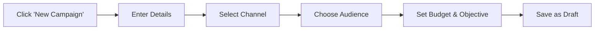
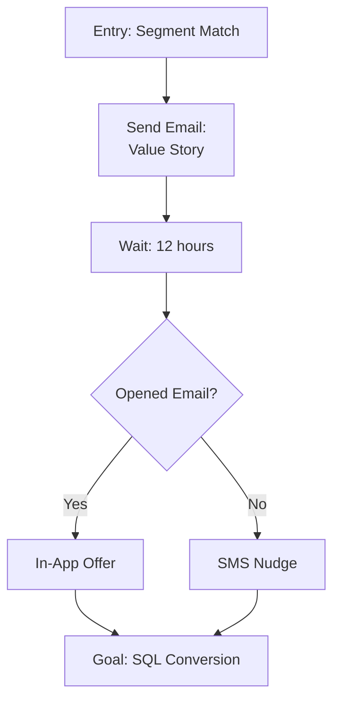

# ERP-Marketing -- User Manual

## 1. Getting Started

### 1.1 Logging In

Navigate to your ERP-Marketing instance URL (e.g., `https://marketing.yourcompany.com`). Authentication is handled by ERP-IAM. Enter your organizational credentials and complete any multi-factor authentication prompts. Upon successful login, you will land on the Marketing Command Center dashboard.

### 1.2 Understanding the Navigation

The left sidebar provides access to all major modules:

- **Dashboard** -- KPI overview, attribution summary, recommendations
- **Campaigns** -- Multi-channel campaign management
- **Journeys** -- Customer journey orchestration
- **Contacts** -- Contact database and lifecycle management
- **Segments** -- Dynamic audience segmentation
- **Email Templates** -- Template library and builder
- **Social** -- Social media management
- **Ads** -- Advertising campaign management
- **Content** -- CMS for blogs and landing pages
- **Sequences** -- Sales outreach sequences
- **Forms** -- Form builder and submissions
- **Experiments** -- A/B/n testing
- **Analytics** -- Performance reporting
- **Settings** -- Guardrails, scoring models, integrations

## 2. For Marketers: Campaign Management

### 2.1 Creating a Campaign

1. Navigate to **Campaigns** in the sidebar
2. Click **Create Campaign**
3. Fill in the campaign details:
   - **Name**: Descriptive campaign name (e.g., "Q2 Enterprise Expansion")
   - **Subject**: Email subject line (for email campaigns)
   - **Channel**: Select from Email, SMS, Push, In-App, or Social
   - **Objective**: Pipeline Acceleration, Retention, Conversion, or Awareness
   - **Budget**: Allocated budget in your currency
   - **Expected Reach**: Estimated number of recipients
   - **Owner**: Team or individual responsible
4. Click **Save** to create the campaign in Draft status

### 2.2 Launching a Campaign

When you click **Launch**, the AIDD guardrail system evaluates the action:

- **Confidence Score**: The system's confidence in the campaign's likelihood of success
- **Blast Radius**: Number of contacts that will be affected
- **Monetary Value**: Budget being committed

Based on configured thresholds:
- **Auto-approved**: Confidence above threshold, blast radius within limits
- **Needs Review**: Requires a named approver to confirm
- **Blocked**: Exceeds prohibited thresholds; must be reconfigured

### 2.3 Monitoring Campaign Performance

After launch, the campaign detail page shows real-time metrics:
- Sent / Delivered / Opened / Clicked / Bounced / Unsubscribed
- Open rate, click-through rate, bounce rate
- Revenue attributed to the campaign

### 2.4 A/B/n Testing

1. Navigate to **Experiments**
2. Click **New Experiment**
3. Enter your hypothesis (e.g., "Personalized subject lines improve open rates by 12%+")
4. Define variants (Control, Variant B, Variant C, etc.)
5. Link to a campaign
6. The system will split traffic and track results per variant
7. When statistical significance is reached, a winner is declared

## 3. For Content Creators: Content Management

### 3.1 Creating a Blog Post

1. Navigate to **Content**
2. Click **New Content Asset**
3. Select type: **Blog Post**
4. Fill in:
   - **Title**: Blog post title
   - **Slug**: URL-friendly identifier (auto-generated from title)
   - **Body**: Rich text content
   - **SEO Keywords**: Comma-separated keyword list
   - **CTA**: Call-to-action label and destination URL
5. Save as **Draft**
6. When ready, change status to **Published**

### 3.2 Creating a Landing Page

Follow the same process as blog posts but select **Landing Page** as the asset type. Landing pages support:
- Custom CTA buttons with configurable URLs
- SEO meta configuration
- Form embedding for lead capture

### 3.3 Managing Forms

1. Navigate to **Forms**
2. Click **New Form**
3. Configure:
   - **Name**: Form identifier
   - **Slug**: Embeddable URL slug
   - **Fields**: Add field definitions (email, company, use_case, etc.)
   - **Success Message**: Confirmation shown after submission
4. Embed the form on landing pages using the generated slug

## 4. For Campaign Managers: Journey Orchestration

### 4.1 Building a Journey

1. Navigate to **Journeys**
2. Click **New Journey**
3. Configure:
   - **Name**: Journey name (e.g., "Product-Led Acceleration")
   - **Goal**: What the journey aims to achieve (e.g., "Increase MQL to SQL conversion")
   - **Entry Segment**: Select the segment that triggers enrollment
   - **Channels**: Which channels the journey uses
   - **Settings**: Max touches per week, stop conditions
4. Add steps in sequence:
   - **Send Message**: Email, SMS, or in-app with template selection
   - **Wait**: Configurable delay (minutes, hours, days)
   - **Branch**: If/then conditions based on contact behavior
   - **Escalation**: Task creation for manual follow-up
5. Save and click **Activate** (subject to AIDD guardrail review)

### 4.2 Monitoring Journey Performance

- View enrolled contacts count
- Track step completion rates
- Monitor goal achievement rate
- Review branch distribution (what percentage took each path)

## 5. For Campaign Managers: Social Media

### 5.1 Creating and Scheduling Posts

1. Navigate to **Social**
2. Click **New Post**
3. Select the platform: LinkedIn, X, Facebook, Instagram, or TikTok
4. Write your content
5. Optionally link to a campaign for attribution tracking
6. Set a scheduled publication time or publish immediately
7. Social publishing is subject to AIDD guardrail review

### 5.2 Monitoring Engagement

Each post displays engagement metrics:
- Likes, comments, shares (platform-specific)
- Sentiment analysis on replies and mentions
- Attributed clicks and conversions

## 6. For Campaign Managers: Ads Management

### 6.1 Creating an Ad Campaign

1. Navigate to **Ads**
2. Click **New Ad**
3. Configure:
   - **Name**: Ad campaign name
   - **Network**: Google Ads, LinkedIn Ads, Meta Ads, or TikTok Ads
   - **Objective**: Pipeline acceleration, retention, lead generation, awareness
   - **Budget**: Total budget allocation
   - **Audience**: Link to a segment for audience sync
4. Save and launch (subject to AIDD guardrail with projected spend/reach checks)

### 6.2 Tracking Ad Performance

- Impressions, clicks, conversions
- Spend vs. budget utilization
- Cost per click (CPC), cost per conversion
- ROI calculation

## 7. For Admins: System Configuration

### 7.1 AIDD Guardrail Configuration

Navigate to **Settings > AIDD Guardrails** to configure:
- **Minimum Confidence**: Below this, actions are blocked (default: 0.64)
- **Medium Confidence**: Between min and medium, actions need review (default: 0.78)
- **Max Blast Radius**: Contact count threshold for human review (default: 15,000)
- **High Value Amount**: Monetary threshold for mandatory approval (default: $250,000)

### 7.2 Lead Scoring Models

Navigate to **Settings > Scoring Models** to define:
- Behavioral scoring rules (e.g., pricing page visit = +12 points)
- Engagement scoring (e.g., demo request = +30 points)
- Firmographic scoring (e.g., industry fit = +15 points)
- Risk penalties (e.g., support risk = -8 points)
- SQL qualification threshold (e.g., score >= 75)

### 7.3 Data Sync Jobs

Configure external system synchronization:
- **Source System**: Salesforce, Zendesk, HubSpot (migration), etc.
- **Target System**: ERP-Marketing
- **Schedule**: Cron expression for periodic sync
- **Monitor**: Records processed, error rate, last run time

### 7.4 Guardrail Audit Log

The **Audit > Guardrails** section shows all AIDD decisions:
- Entity type and ID
- Action attempted
- Confidence score, blast radius, monetary value
- Decision: approved, needs_review, blocked
- Approver (if applicable)
- Rationale and timestamp

## 8. Common Workflows

### 8.1 Import Contacts from CSV

1. Navigate to **Contacts**
2. Click **Import**
3. Upload CSV file with headers: email, first_name, last_name, company, job_title
4. Map columns to contact fields
5. Select default lifecycle_stage and consent_status
6. Review and confirm import

### 8.2 Create a Complete Campaign

1. Create an audience segment
2. Design an email template
3. Create a campaign targeting that segment with the template
4. Set up an A/B experiment on the subject line
5. Build a follow-up journey for engaged contacts
6. Create social posts to amplify the campaign
7. Configure an ad campaign for retargeting
8. Launch all components (subject to guardrail review)
9. Monitor the unified dashboard for cross-channel performance

### 8.3 Review Weekly Marketing Performance

1. Open the **Dashboard**
2. Review KPIs: active campaigns, MQL count, pipeline value, attributed influence
3. Check **Attribution** summary for channel effectiveness
4. Review **Recommendations** for AI-suggested actions
5. Check **Experiments** for any tests reaching statistical significance
6. Review open **Tasks** for pending follow-ups
