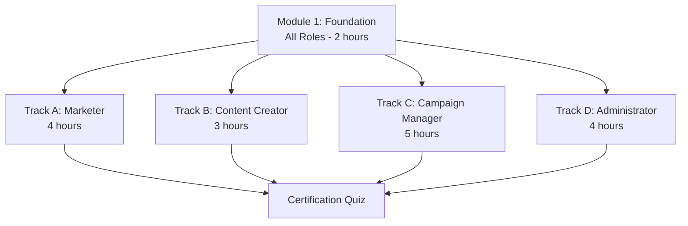
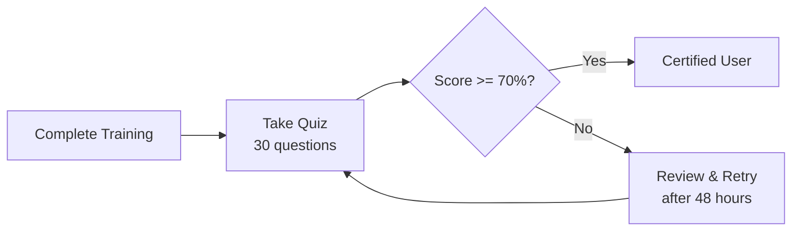

# ERP-Marketing -- Training Manual

## 1. Training Program Overview

This training manual provides a structured curriculum for onboarding marketing teams to the ERP-Marketing platform. The program is divided into four tracks based on role, with a shared foundation module.

## 2. Module 1: Foundation (All Roles)

### 2.1 Platform Overview (30 min)

**Learning Objectives:**
- Understand the purpose and scope of ERP-Marketing
- Navigate the command center interface
- Identify key modules and their relationships

**Topics:**
1. What is ERP-Marketing and how it replaces HubSpot/Marketo/Mailchimp
2. Navigating the dashboard and sidebar
3. Understanding the contact lifecycle (subscriber, lead, MQL, SQL, opportunity, customer)
4. Introduction to AIDD guardrails and why they exist

**Exercise:** Log in, explore each sidebar section, and identify 3 key metrics on the dashboard.

### 2.2 Contact Management Basics (30 min)

**Learning Objectives:**
- Create and edit contact records
- Understand lifecycle stages and lead scoring
- Manage consent status

**Topics:**
1. Creating a contact manually
2. Understanding contact fields (email, name, company, job title, tags, traits)
3. Lifecycle stages explained: subscriber through advocate
4. Lead scores: how they are calculated and what they mean
5. Consent management: opt-in, opt-out, unsubscribed

**Exercise:** Create 3 test contacts with different lifecycle stages and lead scores.

### 2.3 Segmentation Fundamentals (30 min)

**Learning Objectives:**
- Create dynamic segments using filter rules
- Understand segment estimation
- Link segments to campaigns and journeys

**Topics:**
1. What are segments and why they matter
2. Creating segment rules: field + operator + value
3. AND vs. OR logic for combining conditions
4. Estimating segment size
5. Using segments as campaign audiences and journey entry criteria

**Exercise:** Create a segment for "High-Intent Leads" with score >= 75 and intent = high.

### 2.4 AIDD Guardrails Understanding (30 min)

**Learning Objectives:**
- Understand the three-tier action classification
- Recognize when guardrails will intervene
- Know how to respond to guardrail prompts

**Topics:**
1. Autonomous actions: what happens automatically
2. Supervised actions: what requires review or approval
3. Prohibited actions: what is never allowed
4. Confidence scores and blast radius explained
5. How to request and provide approvals

**Exercise:** Attempt to launch a campaign to a large segment and observe the guardrail response.

## 3. Track A: Marketer (4 hours)

### 3.1 Campaign Creation Masterclass (1 hour)

**Learning Objectives:**
- Create multi-channel campaigns from scratch
- Set objectives, budgets, and audience targeting
- Understand campaign lifecycle management

**Lab:** Create an email campaign with:
- Name: "Training Campaign Q2"
- Channel: Email
- Objective: Pipeline Acceleration
- Budget: $10,000
- Audience: High-Intent Leads segment

### 3.2 Email Marketing Deep Dive (1 hour)

**Topics:**
- Template creation (HTML + plain text)
- Subject line best practices
- Preview and test send
- Deliverability basics (DKIM/SPF/DMARC)
- Unsubscribe compliance

**Lab:** Create an email template with personalized subject line and send a test.

### 3.3 A/B Testing Workshop (1 hour)

**Topics:**
- Hypothesis formulation
- Variant design
- Statistical significance
- Winner selection
- Applying learnings to future campaigns

**Lab:** Create an A/B experiment testing two subject line approaches.

### 3.4 Analytics and Reporting (1 hour)

**Topics:**
- Dashboard KPI interpretation
- Campaign performance metrics
- Attribution summary by channel
- Exporting reports
- Setting up recurring reports

**Lab:** Generate a campaign performance report and identify the top-performing channel.

## 4. Track B: Content Creator (3 hours)

### 4.1 CMS Blog Management (1 hour)

**Topics:** Blog post creation, SEO keyword optimization, slug management, publishing workflow.

**Lab:** Write and publish a blog post with SEO keywords and CTA.

### 4.2 Landing Page Builder (1 hour)

**Topics:** Landing page creation, form embedding, CTA configuration, A/B testing landing pages.

**Lab:** Build a landing page with an embedded demo request form.

### 4.3 Form Builder and Lead Capture (1 hour)

**Topics:** Form creation, field configuration, success messages, submission tracking, UTM parameter capture.

**Lab:** Create a form, embed it on a landing page, and submit a test entry.

## 5. Track C: Campaign Manager (5 hours)

### 5.1 Journey Builder Workshop (1.5 hours)

**Topics:**
- Journey canvas overview
- Step types: send, wait, branch, escalate
- Entry segment configuration
- Multi-channel orchestration
- Goal tracking and stop conditions

**Lab:** Build a 5-step journey with email, wait, branch, in-app, and SMS steps.

### 5.2 Social Media Management (1 hour)

**Topics:** Post creation, scheduling, multi-platform publishing, engagement monitoring.

**Lab:** Schedule posts on LinkedIn and X, then review engagement metrics.

### 5.3 Ads Management (1 hour)

**Topics:** Ad campaign setup, network selection, budget management, audience sync, ROI tracking.

**Lab:** Create a Google Ads campaign with audience sync from a segment.

### 5.4 Sequence Automation (1 hour)

**Topics:** Sales sequence creation, trigger types, step configuration, enrollment management.

**Lab:** Create an outbound sales sequence with email and call steps.

### 5.5 Attribution Analysis (30 min)

**Topics:** Multi-touch models, channel attribution, revenue attribution, pipeline influence.

**Lab:** Analyze attribution data and identify the highest-impact channels.

## 6. Track D: Administrator (4 hours)

### 6.1 AIDD Guardrail Configuration (1 hour)

**Topics:** Policy thresholds, action classification, approver management, audit log review.

**Lab:** Configure guardrail thresholds and test with a high-impact action.

### 6.2 Lead Scoring Configuration (1 hour)

**Topics:** Scoring model creation, behavioral rules, firmographic rules, threshold configuration.

**Lab:** Create a scoring model and validate it against test contacts.

### 6.3 Data Sync and Integrations (1 hour)

**Topics:** External system connectors, sync job scheduling, error monitoring, conflict resolution.

**Lab:** Configure a Salesforce sync job and run it manually.

### 6.4 Compliance and Security (1 hour)

**Topics:** Consent management, GDPR compliance, CAN-SPAM requirements, audit trail, security configuration.

**Lab:** Review the guardrail audit log and generate a compliance report.

## 7. Certification

After completing your track, take the certification quiz:
- 30 multiple-choice questions
- 70% passing score
- Covers both foundation and track-specific content
- Certification valid for 12 months

