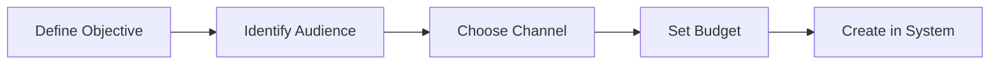

# ERP-Marketing -- Video Training Script

## Video Series Overview

This document contains scripts for 10 training videos covering the ERP-Marketing platform. Each video is designed to be 8-15 minutes in length with screen recordings, narration, and interactive demonstrations.

---

## Video 1: Platform Overview and First Login (10 min)

### Scene 1: Introduction (0:00 - 1:30)

**[Screen: Title card with ERP-Marketing logo]**

**Narrator:** "Welcome to ERP-Marketing, your organization's self-hosted marketing automation command center. In this video, we will walk through your first login, explore the interface, and understand the core concepts that power the platform."

**[Screen: Architecture diagram]**

**Narrator:** "ERP-Marketing consolidates the capabilities of tools like HubSpot, Marketo, Mailchimp, and Zoho into a single sovereign module. Everything -- your campaigns, journeys, contacts, content, and analytics -- lives within your own infrastructure."

### Scene 2: First Login (1:30 - 3:00)

**[Screen: Browser navigating to login URL]**

**Narrator:** "Open your browser and navigate to your marketing instance URL. You will be redirected to the ERP-IAM login page. Enter your organizational credentials. If your organization uses multi-factor authentication, complete that step now."

**[Screen: Dashboard loads]**

**Narrator:** "After authentication, you land on the Marketing Command Center dashboard. Let us explore what you see here."

### Scene 3: Dashboard Walkthrough (3:00 - 6:00)

**[Screen: Cursor highlighting each dashboard element]**

**Narrator:** "The dashboard shows your key performance indicators at a glance. At the top, you see active campaigns, active journeys, total contacts, and MQL contacts. Below that, the pipeline section shows open pipeline value and weighted pipeline -- these reflect the actual revenue your marketing efforts are driving."

**[Screen: Attribution section]**

**Narrator:** "The attribution summary breaks down which channels are contributing most to pipeline influence. In this example, email leads at 31.8%, followed by in-app at 28.1%, paid search at 17.4%, and webinars at 9.3%."

**[Screen: Recommendations section]**

**Narrator:** "The AI recommendations section surfaces actions the system suggests based on your data. Each recommendation includes a confidence score and risk level. Notice the AIDD guardrail indicators -- some recommendations are auto-approved, while high-risk ones need your review."

### Scene 4: Navigation Tour (6:00 - 8:30)

**[Screen: Clicking through sidebar items]**

**Narrator:** "The left sidebar is your navigation hub. Let me quickly walk through each section..."

**[Walk through: Campaigns, Journeys, Contacts, Segments, Email Templates, Social, Ads, Content, Sequences, Forms, Experiments, Analytics, Settings]**

### Scene 5: Wrap Up (8:30 - 10:00)

**Narrator:** "You now have a solid understanding of the ERP-Marketing interface. In the next video, we will create your first campaign from scratch."

---

## Video 2: Creating Your First Campaign (12 min)

### Scene 1: Campaign Planning (0:00 - 2:00)

**Narrator:** "Every great campaign starts with a plan. Before creating a campaign in the system, you should know your objective, your target audience, your channel, and your budget."

### Scene 2: Creating the Campaign (2:00 - 6:00)

**[Screen: Campaigns page, clicking Create Campaign]**

**Narrator:** "Navigate to Campaigns and click Create Campaign. Fill in the name -- I will use 'Q2 Enterprise Expansion.' For the subject, enter 'Unlock expansion outcomes in 30 days.' Select Email as the channel. Set the objective to Pipeline Acceleration. Enter a budget of $120,000 and expected reach of 12,000."

**[Screen: Filling in form fields]**

**Narrator:** "Click Save. Your campaign is now in Draft status."

### Scene 3: Adding Content (6:00 - 8:00)

**Narrator:** "Next, we need to assign an email template. Navigate to Email Templates and either select an existing template or create a new one. I will select 'Enterprise Value Narrative.'"

### Scene 4: Launching with AIDD Review (8:00 - 11:00)

**[Screen: Click Launch button, guardrail modal appears]**

**Narrator:** "When you click Launch, the AIDD guardrail system evaluates the action. You can see the confidence score is 0.82, the blast radius is 12,000 contacts, and the monetary commitment is $120,000. Because the blast radius is under 15,000 and the monetary value is under $250,000, this campaign is auto-approved."

**Narrator:** "If the reach had been 20,000 or the budget $300,000, the system would require a named approver before proceeding."

### Scene 5: Monitoring (11:00 - 12:00)

**Narrator:** "After launch, monitor your campaign on the detail page. Watch for open rates, click-through rates, and bounces in real-time. Congratulations -- you have launched your first campaign!"

---

## Video 3: Building Customer Journeys (15 min)

### Scene 1: Journey Concepts (0:00 - 3:00)

**Narrator:** "A journey is an automated sequence of marketing actions that guides contacts through their lifecycle. Think of it as an intelligent workflow that adapts to how each contact behaves."

### Scene 2: Creating a Journey (3:00 - 8:00)

**[Screen: Journey builder canvas]**

**Narrator:** "Navigate to Journeys and click New Journey. I will name this 'Product-Led Acceleration' with the goal 'Increase MQL to SQL conversion.' Select 'High-Intent Pipeline Leads' as the entry segment. For channels, select email, in-app, and SMS."

**Narrator:** "Now let us add steps. First, a Send Message step with our value story email. Then a Wait step -- 12 hours. Then a Branch step: if the contact opened the email, send them an in-app offer; if not, send an SMS nudge."

### Scene 3: Activation (8:00 - 11:00)

**Narrator:** "Click Activate. The AIDD guardrail evaluates the blast radius based on the segment size. With 1,260 contacts in our segment, this is within the auto-approval threshold."

### Scene 4: Monitoring Journey Performance (11:00 - 15:00)

**Narrator:** "On the journey detail page, you can see how many contacts are enrolled, the completion rate for each step, and which branches contacts are taking. This data helps you optimize the journey over time."

---

## Video 4: Social Media Management (10 min)

**Covers:** Creating posts, scheduling across LinkedIn/X/Facebook/Instagram/TikTok, engagement tracking, AIDD guardrail on publishing.

---

## Video 5: Ads Management and ROI Tracking (10 min)

**Covers:** Creating ad campaigns, selecting ad networks, budget management, audience sync from segments, performance metrics, AIDD guardrail on ad spend.

---

## Video 6: Content Management and SEO (10 min)

**Covers:** Blog post creation, landing page builder, SEO keyword optimization, form embedding, CTA configuration, publishing workflow.

---

## Video 7: Segmentation and Lead Scoring (12 min)

**Covers:** Dynamic segment creation, filter rule building, scoring model configuration, SQL qualification thresholds, segment-to-journey linking.

---

## Video 8: A/B Testing and Experimentation (10 min)

**Covers:** Hypothesis formulation, variant creation, traffic splitting, result analysis, winner selection, applying learnings.

---

## Video 9: Attribution and Analytics (12 min)

**Covers:** Multi-touch attribution models, channel-level reporting, revenue attribution, conversion funnel analysis, dashboard customization.

---

## Video 10: Administration and Compliance (12 min)

**Covers:** AIDD guardrail configuration, consent management, data sync jobs, audit log review, compliance reporting (CAN-SPAM, GDPR, CCPA), security settings.

---

## Production Notes

| Video | Duration | Screen Recording | Animation | Narration |
|---|---|---|---|---|
| V1: Platform Overview | 10 min | Dashboard walkthrough | Architecture diagram | Professional VO |
| V2: First Campaign | 12 min | Campaign creation flow | State machine diagram | Professional VO |
| V3: Journey Builder | 15 min | Journey canvas demo | Flow diagram | Professional VO |
| V4: Social Media | 10 min | Social post scheduling | Platform icons | Professional VO |
| V5: Ads Management | 10 min | Ad creation flow | ROI chart animation | Professional VO |
| V6: Content & SEO | 10 min | CMS content editing | SEO checklist | Professional VO |
| V7: Segmentation | 12 min | Segment builder demo | Venn diagram animation | Professional VO |
| V8: A/B Testing | 10 min | Experiment setup | Statistical chart | Professional VO |
| V9: Attribution | 12 min | Analytics dashboard | Attribution model diagrams | Professional VO |
| V10: Admin & Compliance | 12 min | Settings configuration | Compliance matrix | Professional VO |
